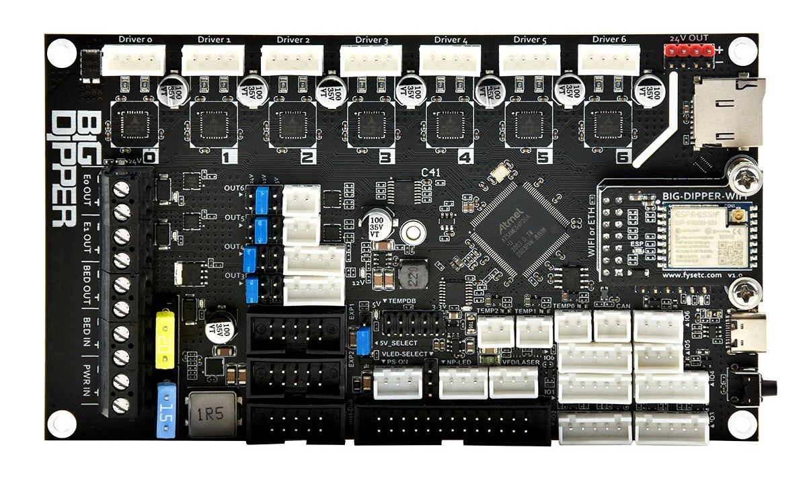
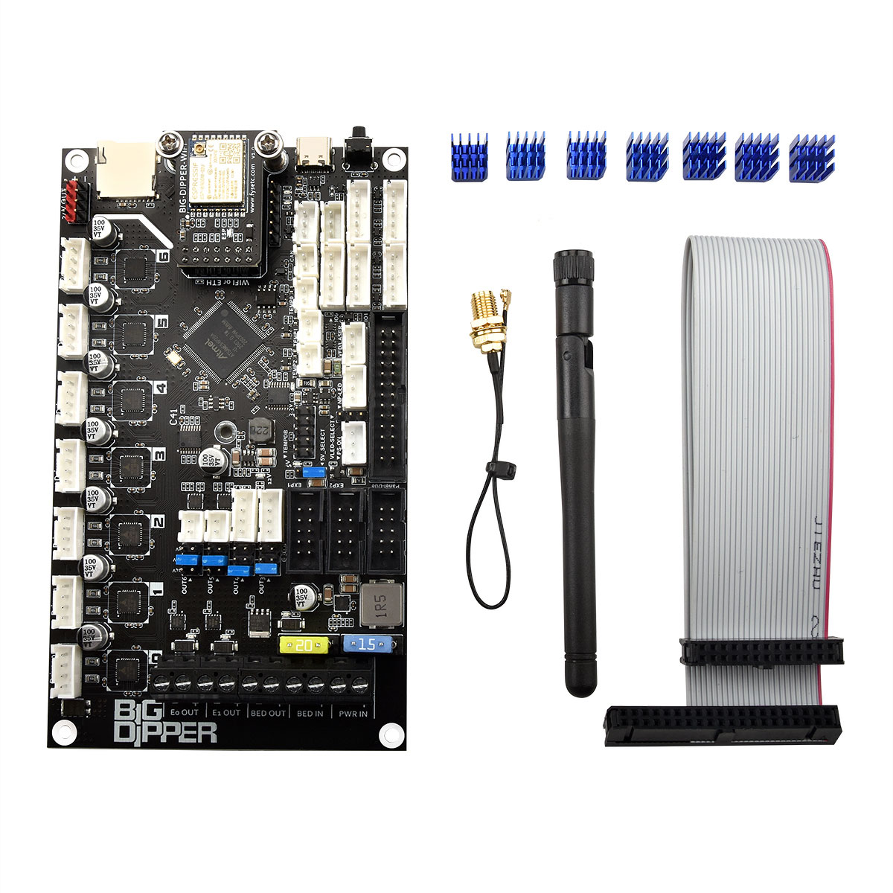
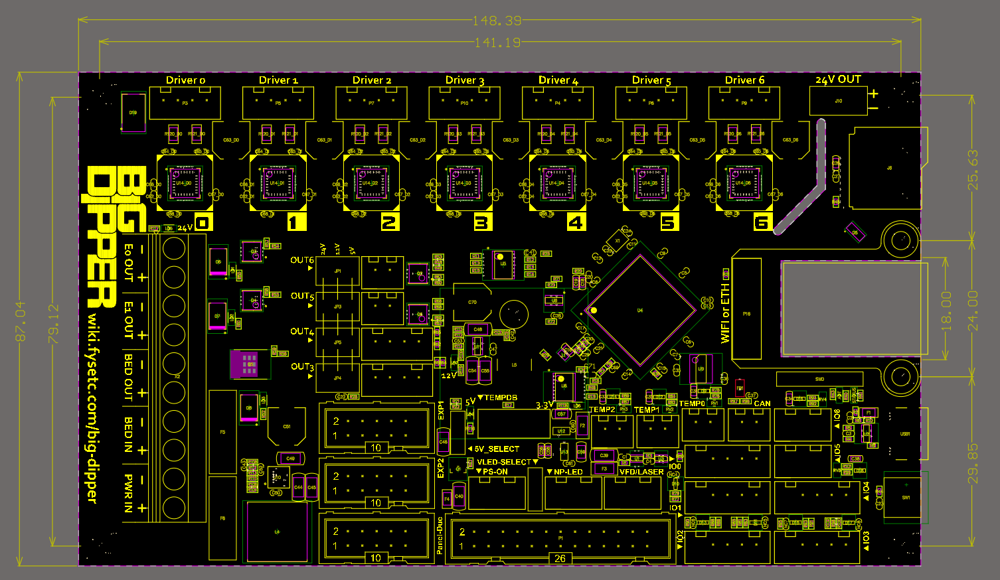
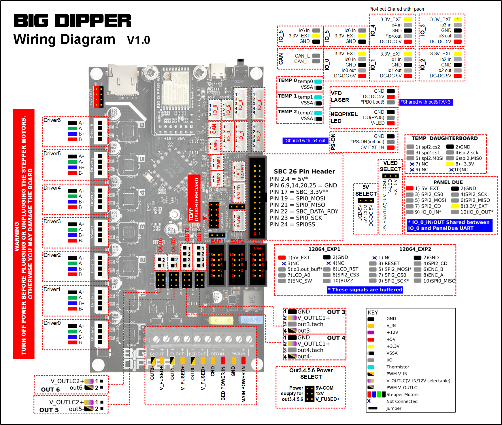
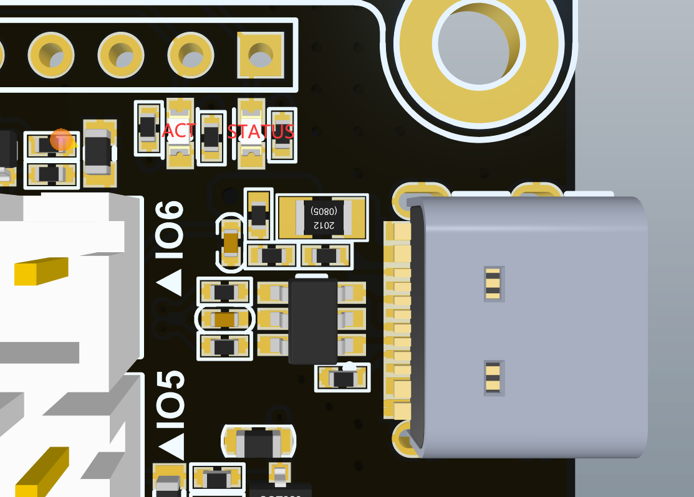

## Introduction



BIG-DIPPER is a combination of Duet3 mini5+ and Mini 2+. It's based on [ATSAME54P20A](https://www.microchip.com/wwwproducts/en/ATSAME54P20A) and pin assignments are exactly the same as those of mini5+, so the mini5+ firmware can be used directly. 

Compare to mini5+, the power supply and IO protection have been upgraded to a certain extent to make them safer. And you can switch between the WIFI version and the Ethernet version by replacing the module. WIFI version module supports external antennas.

Based on the good ecology of the RRF firmware and on-board 7-axis (7xTMC2209), the board can be easily configured in a variety of 3D printer models, such as VORON series, multi-Z-axis models, double-X models etc.

- Compatible RepRapFirmware versions: RRF 3.2 and later

For firmware update instructions, see [Installing and updating firmware](https://docs.duet3d.com/User_manual/RepRapFirmware/Updating_firmware).
If running from an SBC, see [SBC setup for Duet 3](https://docs.duet3d.com/User_manual/Machine_configuration/SBC_setup).

Warnings

- **Never connect or disconnect anything to your Duet when there is power applied to it!** Exception: you may connect or disconnect the USB cable with power applied, but see the important notes on using a USB connection.

- **Take great care to connect the + and - leads from the power supply the right way round to the VIN terminal block!**

- **Do not exceed 25V VIN input voltage!**

- **When the stepper motors are connected to the Duet, do not move any parts by hand that make the motors rotate rapidly!** For example, if you need to move the print head by hand, or the carriages of a delta printer by hand, do it s-l-o-w-l-y. Likewise, if you need to rotate the extruder gear by hand, do it slowly. Rapid rotation of the stepper drivers will generate enough voltage to power them up in an uncontrolled fashion, and could generate enough to exceed their rated voltage.

- **Do not insert an SD extender cable into the built-in SD card socket!** These cables frequently damage the contacts inside the SD card socket. Even when they don't, they do not work well at the high SD card transfer speeds used by the Duet.

- **When mounting the Duet, if you use metal screws then make sure that they don't touch any of the electronic components or solder pads on the Duet!** Use the Nylon washers supplied with your Duet under the screw heads.

- **Be very careful if you use a multimeter to measure voltages on the board, especially on the fan connectors!** The probes may slip and short against each other or to other components. If you short the two pins of a fan connector together, you **will** damage your Duet.

- **Do not rely solely on the Duet electronics and firmware to guard against excessive temperatures in your 3D printer!** Despite the advanced protection features in Duet firmware, electronics and firmware can fail in unexpected ways. 

- **If you use a USB connection to the Duet, take care to mitigate the effect of ground loops!** 
  
  ### Package contents



1 x Big Dipper (WiFi or Ethernet)

7 x Heat Sink

1 x Single Board Computer (SBC) ribbon cable

1 x External antenna with Extension cord (WiFi version only)

### Stand alone mode vs SBC mode

The Big-Dipper is basically the same as the Duet3 Mini 5+.It is either be directly connected to a network, or to connect to a Single Board Computer (SBC) like a Raspberry Pi.

All standard printer functions, different kinematics, the network UI ([DuetWebControl)]() etc work in stand alone mode.

SBC mode allows part of the functionality to be handled by the SBC. For example an HDMI or Pi touch screen can be used as the UI, The Pi can act as the network server and plugins for Duet Software Framework on the Pi allow for adding custom features for more advanced control and monitoring.

## Features

1. Compact size: 148.5 x 87mm

2. Base on SAME54P20(ARM Cortex M4 @120Mhz)， fully compatible with Duet3 Mini5+

3. Onboard 7 TMC2209 stepper motor drivers

4. Input and output IO full TVS protection

5. 28V maximum input, 12V@2A DC-DC (12V fan power supply), 5V@8A DC-DC (power supply for Raspberry Pi  and the system), two 3.3V@0.6A LDO (power supply for MCU and 3.3V peripherals respectively)

6. Two car fuses for hot bed input and main power input

7. Using XH2.54 connector, each interface function is exactly the same as mini5+

8. 7x PWM power MOSFET output（ 1 for heatbed, 2 for hot end, 4 for fans ）

9. RepRap Discount Smart Controller compatible sockets ，EXP1 and EXP2。Support monochrome displays such as 2004 ，12864。

10. UART1-Raspberry Pi pin header (including 5V@5A power supply)

11. Onboard TF card slot

12. Type-C USB socket

13. 3 Thermistor/PT1000 inputs and support for 2 PT100 or thermocouple inputs via the optional daughterboards.

14. Both Wifi and Ethernet versions

15. CAN bus that supports the next generation of Duet3D expansion boards, smart tools and 
      custom addons.

16. Set up your printer and update the firmware through the web interface.

17. All common 3D printer geometries are supported

18. Support for a wide range of Z probes including DC42’s IR Z probe and the Duet3D Smart Effector for delta printers.

### Hardware Specification

| HARDWARE SPECIFICATION       |                                                                                                                                                                                                                                             |                                                               |
|:---------------------------- | ------------------------------------------------------------------------------------------------------------------------------------------------------------------------------------------------------------------------------------------- | ------------------------------------------------------------- |
|                              | **Big Dipper WiFi**                                                                                                                                                                                                                         | **Big Dipper Ethernet**                                       |
| **Processor**                | [ATSAME54P20A](https://www.microchip.com/wwwproducts/en/ATSAME54P20A)                                                                                                                                                                       |                                                               |
| **Processor features**       | 120MHz ARM Cortex M4F, 1Mb flash, 256Kb RAM, hardware floating point (single precision), DMA, 4Kb cache                                                                                                                                     |                                                               |
| **Networking/Comms**         | 2.4GHz WiFi; USB port; serial port; CAN-FD bus                                                                                                                                                                                              | 10BaseT/100BaseTX Ethernet; USB port; serial port; CAN-FD bus |
| **On-board stepper drivers** | 5 x [TMC2209](https://www.trinamic.com/products/integrated-circuits/details/tmc2209-la/)                                                                                                                                                    |                                                               |
| **Stepper driver features**  | Up to 2.0A peak current, microstep interpolation from any setting to x256, stall detection, stealthChop2                                                                                                                                    |                                                               |
| **High current outputs**     | 1 x 15A, 2 x 5A each                                                                                                                                                                                                                        |                                                               |
| **Thermistor/PT1000 inputs** | 3 x inputs, optimised for 100K thermistors and PT1000 sensors                                                                                                                                                                               |                                                               |
| **Medium current outputs**   | 4 x PWM-controlled outputs, of which 2 support tacho input. Voltage selectable between VIN and 12V in 2 banks                                                                                                                               |                                                               |
| **Inputs/Outputs**           | 5 x on-board I/O connectors plus 2 x input-only connectors for endstop, filament monitor, Z probe, hobby servo or PanelDue connection. Inputs are 30V-tolerant. Also one output with 5V signal level for hobby servo, laser control or VFD. |                                                               |
| **Power monitoring**         | VIN voltage monitoring allows for state save on power failure.                                                                                                                                                                              |                                                               |
| **SD card interface**        | On-board high speed SD card socket.                                                                                                                                                                                                         |                                                               |

| EXPANSION                                                                  |                                                                                                             |
|:-------------------------------------------------------------------------- | ----------------------------------------------------------------------------------------------------------- |
| **Support for attached Raspberry Pi or other Single Board Computer (SBC)** | Yes                                                                                                         |
| **External stepper driver support**                                        | Multiple expansion via the CAN-FD bus.                                                                      |
| **Stepper driver expansion**                                               | Further expansion via CAN-FD bus                                                                            |
| **PT100 and thermocouple daughterboard support**                           | Supports 1 x daughterboard (2 channels) on board. More via CAN-FD-connected expansion boards.               |
| **LCD support**                                                            | PanelDue colour touch screen, mini 12864 mono graphics display using ST7567 controller (3.3V signal levels) |
| **LED strip support**                                                      | RGB Neopixel (max. 60 LEDs, external 5V power required)                                                     |
| **Other expansion**                                                        | Via I/O ports and CAN-FD bus                                                                                |

## Physical properties

### Dimensions



### Mounting

The form factor of the Big Dipper is the same as the Duet 2 WiFi/Ethernet and can be mounted in much the same way, though the driver connectors are flipped sides compared to the Duet 2 WiFi/Ethernet.

### Cooling

In many applications passive cooling will be sufficient, especially if the board is mounted vertically in a well ventilated position. If active cooling is needed then a fan blowing across the back of the board along the line of the stepper drivers is recommended.

The stepper drivers' heatsinks are connected to the PCB and the majority of the heat is dissipated via the PCB so heatsinks on the stepper driver chips are largely ineffective.

### MCU Temp

Unfortunately the SAME54P20A chip used in the Big Dipper does not have a functioning temperature sensor. In theory it does have an on-chip temperature sensor, but the errata document for the chip says it doesn't work. However, it has been enabled in RRF 3.3 as an experiment, and does appear to give useful readings on the samples tested.

### Stepper Driver Temp

Due to this you would be unable to monitor the MCU temp in order to control fans. The driver sensors do work for fan control, but only return flags of warning and overtemp,

### 3D Model

The STEP files for boards are available [on Github here](https://github.com/Duet3D/Duet3-Mini5plus/tree/main/v1.01).

## Physical connections

### Wiring diagram



### Description of Connections

| Big Dipper Connectors                  |                                                  |                                                                                                                                                                                                                                                                                                                                               |
|:-------------------------------------- | ------------------------------------------------ | --------------------------------------------------------------------------------------------------------------------------------------------------------------------------------------------------------------------------------------------------------------------------------------------------------------------------------------------- |
| **1 x 4-way barrier strip**            | POWER IN, GND, VIN                               | Two pins for main VIN and GND                                                                                                                                                                                                                                                                                                                 |
| **1 x 4-way barrier strip**            | OUT_0, V_OUT_0_OUT, OUT_0_NEG                    | Two pins for positive and negative OUT_0 terminals. OUT_0 is intended to drive a bed heater or other high current resistive load. If you connect an inductive load to this output, you must use a suitably rated external flyback diode. The ground side of OUT_0 is switched by the mosfet and the positive side is protected by a 15A fuse. |
| **2 x 2-pin JST VH connectors**        | OUT_1, OUT_2                                     | Intended for extruder heaters or similar medium/high current resistive loads. Flyback diodes are built-in to these outputs. Maximum recommended current 6A each.                                                                                                                                                                              |
| **2 x 4-pin KK connectors**            | OUT_3, OUT_4                                     | Intended for PWM-controllable fans or other medium/low current loads. Flyback diodes are built-in to these outputs. The connector fits a standard PC-type 4-pin PWM fan. Alternatively, a 2-pin fan may be connected between the V_OULC1+ pin (+ve) and the OUT_n_NEG pin (-ve).                                                              |
|                                        |                                                  | **Note:** OUT_3 and OUT_4 are protected by a flyback diode to V_FUSED. This does not provide protection if driving these outputs from a higher voltage than V_FUSED                                                                                                                                                                           |
| **1 x 3-pin Jumper**                   | OUT_3&4 Select V                                 | The positive supply to the above connectors is the centre pin of the 3-pin jumper block. A jumper in the "left" position will power them from the fused VIN supply (max 2A each ). A jumper in the "right" position will power them from the onboard 12V regulator (subject to overall 12V supply current *see note 1 below*).                |
| **2 x 2-pin KK connectors**            | OUT_5, OUT_6                                     | these are intended for PWM-controllable fans or other medium/low current loads. Flyback diodes are built-in to these outputs. **Note** out_6 PWM pin is shared with LASER/VFD                                                                                                                                                                 |
|                                        |                                                  | **Note:** OUT_5 and OUT_6 are protected by a flyback diode to V_FUSED. This does not provide protection if driving these outputs from a higher voltage than V_FUSED                                                                                                                                                                           |
| **1 x 3-pin Jumper**                   | OUT_5&6 Select V                                 | The positive supply to the above connectors is the centre pin of the 3-pin jumper block. A jumper in the "left" position will power them from the fused VIN supply (max 2A each ). A jumper in the "right" position will power them from the onboard 12V regulator (subject to overall 12V supply current *see note 1 below*).                |
| **5 x 4-pin KK connectors**            | DRIVER_0, DRIVER_1, DRIVER_2, DRIVER_3, DRIVER_4 | Stepper motor connections, See "Connecting Stepper Motors" section below.                                                                                                                                                                                                                                                                     |
| **1 x 16-pin socket strip**            | EXTERNAL DRIVERS                                 | Step, Direction, Enable, Diag and UART connections for DRIVER_5 and DRIVER_6, along with fused VIN, ground, 3.3V and 5V. Designed for a Mini 2+ expansion board to plug directly in. Step, direction and enable can also be used with other external drivers (3.3V signal level).                                                             |
| **1 x 2x5 IDC connector**              | PanelDue_SD                                      | Connects the [PanelDue](https://docs.duet3d.com/Duet3D_hardware/Accessories/PanelDue) UART and shared SPI bus for external SD card. Powered from 5V supply (*see note 2*). **Note** shared with io0.in and io0.out pins on the IO_0 header.                                                                                                   |
| **1 x 3-pin KK connectors**            | LASER/VFD                                        | 5V buffered output shared with out6, along with 5V and ground supply (*see note 2 below*). Provides a 5V PWM signal to drive hobby servos, and PWM->analog controls for VFDs or Lasers. **Note** out6 PWM pin is shared with OUT_6                                                                                                            |
| **1 x 2-pin KK connectors**            | 12V                                              | Always on 12V supply (*see note 1 below*)                                                                                                                                                                                                                                                                                                     |
| **Network**                            | **Ethernet**                                     | 1 x RJ45 100BaseT Port. *non MDIX* connect to an Ethernet switch, hub or MDIX enabled laptop port. If connecting to a non MDIX enabled port use a crossover cable. Orange LED on Ethernet port indicates Ethernet enabled, green LED indicates network activity                                                                               |
|                                        | **Wifi**                                         | U.FL/IPEX push on connector for external antenna. *Note this connector is delicate, take care when plugging and unplugging*. "LED ESP": green LED indicates Wifi connection status                                                                                                                                                            |
| **Reset**                              |                                                  | Single push to reset the board. Double push to put the board into UF2 bootloader upload mode. See [User manual: Updating firmware - Big Dipper via USB](https://docs.duet3d.com/User_manual/RepRapFirmware/Updating_firmware#duet-3-mini-5-wifiethernet)                                                                                      |
| **1 x JST ZH 6-pin connectors**        | SWD                                              | Connection for an SWD programming device such as an Atmel-ICE                                                                                                                                                                                                                                                                                 |
| **1 x 2-pin KK connectors**            | CAN                                              | CAN-FD Bus connection for Duet 3 CAN-FD expansion boards.                                                                                                                                                                                                                                                                                     |
| **5 x 5-pin KK connectors**            | IO_0, IO_1, IO_2, IO_3, IO_4                     | These are for endstop switches, Z probes, filament monitors and other low-voltage I/O functions. Each connector provides both 3.3V and 5V power. The inputs will tolerate up to 30V with 10K series resistors (but see below for bypass option). The outputs are 3.3V signals levels with 470R series resistors. IO_1,2,3 are PWM capable.    |
| **2 x 2-pin Jumpers 10K->470R bypass** | IO2.in, IO3.in                                   | v1.01 and later only. Jumpers to allow the 10K resistors on IO2.in and IO3.in to be bypassed with 470R resistors. This is required to use IO2 or IO3 for I2C.                                                                                                                                                                                 |
| **2 x 3-pin KK connectors**            | IO_5, IO_6                                       | Input only IO connections that will tolerate up to 30V with 10K series resistors. Perfect for simple endstop switches.                                                                                                                                                                                                                        |
| **3 x 2-pin KK connectors**            | TEMP_0, TEMP_1, TEMP_2                           | Connections for thermistor or PT1000 sensors.                                                                                                                                                                                                                                                                                                 |
| **1 x 2x13 IDC connector**             | SBC                                              | Connections to a Single Board Computer (SBC) such as a Raspberry Pi.                                                                                                                                                                                                                                                                          |
| **1 x 2x5 IDC connector**              | TEMPDB                                           | For connecting a [PT100](https://docs.duet3d.com/Duet3D_hardware/Accessories/PT100_Temperature_Daughterboard) or [thermocouple](https://docs.duet3d.com/Duet3D_hardware/Accessories/Thermocouple_Daughterboard) interface board. **Note** boards cannot be stacked so only 1 board at a time is supported.                                    |
| **1 x 3-pin Jumper**                   | 5V_SELECT                                        | Source of optional External 5V input, see note 2 below                                                                                                                                                                                                                                                                                        |
| **1 x 2-pin Jumper**                   | Int_5V_Disable                                   | Connect a jumper across this to disable the internal 5V regulator, see note 2 below                                                                                                                                                                                                                                                           |
| **2 x 2x5 IDCs**                       | 12864_EXP1, 12864_EXP2                           | Headers for connecting a 12864 display using a ST7567 controller, see "Connecting a 12864 display" below.                                                                                                                                                                                                                                     |
| **1 x 3-pin KK connector**             | NP_LED                                           | This is to connect and power NeoPixel LED strips (DotStar LED strips are not supported) . Connect the DO pin to Neopixel DI. External 5V must be supplied to the "EXT 5V" header to power the NeoPixel array, they cannot be powered from the onboard regulator.                                                                              |
| **1 x 3-pin KK connector**             | EXT 5V                                           | Input for External 5V supply, see Note 2 below. There is a buffered 5V "pson" pin which can be used to switch an external supply, note it is shared with io4.out                                                                                                                                                                              |

**Notes**

1. Total 12V load should not exceed 800mA
2. 5V can be powered from multiple inputs (USB, External 5V input, SBC) as well as the internal 5V regulator. Total 5V load should not exceed 800mA when powered from the internal 5V regulator. see the "Power distribution, 5V" section below for more information

### LED indications



LEDs are provided to indicate the following:

| Label       | Color | Function                                                     |
| :---------- | :---- | :----------------------------------------------------------- |
| **ACT**     | Red   | Indicates activity on the CAN-FD bus                         |
| **STATUS**  | Red   | See description below                                        |
| **V_FUSED** | Red   | Indicates fused VIN supply present                           |
| **12V+**    | Red   | Indicates indicates on-board 12V regulator operating         |
| **5V+**     | Red   | Indicates indicates 5V supply present                        |
| **3.3V+**   | Red   | Indicates on-board 3.3V regulator operating                  |
| **ESP**     | Red   | WiFi version only. Indicates WiFi activity; flashing for searching/connecting, on for connected. |
| **OUT_0**   | Red   | Next to the OUT 0 connector, indicates when on               |
| **OUT_1**   | Red   | Next to the OUT 1 connector, indicates when on               |
| **OUT_2**   | Red   | Next to the OUT 2 connector, indicates when on               |

The red LED next to the TYPE-C USB is "STATUS".  It indicates the state of the board, as follows.

| LED                                                             | Meaning                                     |
|:--------------------------------------------------------------- |:------------------------------------------- |
| Flashing steadily, about half a second off and half a second on | Normal operation, RepRapFirmware is running |
| Flashing three times, then off for a while                      | Firmware CRC check failed                   |
| Fading from bright to dim and then back again                   | USB bootloader activated                    |

### Pin names

For more information on pin names, see [Pin Names](https://docs.duet3d.com/User_manual/RepRapFirmware/Migration_RRF2_to_RRF3#pin-names).

RepRapFirmware 3 uses pin names for user-accessible pins, rather than pin numbers, to communicate with individual pins on the PCB. In RRF 3 no user-accessible pins are defined at startup by default. Pins can be defined for use by a number of gcode commands, eg M574, M558, M950.

The Duet 3 series uses the pin name format "expansion-board-address.pin-name" to identify pins on expansion board, where *expansion-board-address* is the numeric CAN address of the board. A pin name that does not start with a sequence of decimal digits followed by a period, or that starts with "0." refers to a pin on the Big Dipper.

| Pin location           | RRF3 Pin name    | Notes                                                                                                           |
|:---------------------- |:---------------- |:--------------------------------------------------------------------------------------------------------------- |
| **Heater outputs**     |                  |                                                                                                                 |
| OUT_0                  | out0             | High current output, bed heater                                                                                 |
| OUT_1                  | out1             | Medium current outputs, hot ends                                                                                |
| OUT_2                  | out2             | Medium current outputs, hot ends                                                                                |
| **Outputs (4-pin)**    |                  |                                                                                                                 |
| OUT_3                  | out3             | 4-wire fans with tacho                                                                                          |
| out3.tach              |                  |                                                                                                                 |
| OUT_4                  | out4             | 4-wire fans with tacho                                                                                          |
| out4.tach              |                  |                                                                                                                 |
| **Outputs (2-pin)**    |                  |                                                                                                                 |
| OUT_5                  | out5             |                                                                                                                 |
| OUT_6                  | out6, laser, vfd | Pin shared with OUT 6 and LASER/VFD connectors                                                                  |
| **Temperature inputs** |                  |                                                                                                                 |
| TEMP_0                 | temp0            |                                                                                                                 |
| TEMP_1                 | temp1            |                                                                                                                 |
| TEMP_2                 | temp2            |                                                                                                                 |
| **Inputs/Output**      |                  |                                                                                                                 |
| IO_0                   | io0.in           | PanelDue, endstops, Z probes, filament monitors etc. Shares io0.out and io0.in pins with PanelDue_SD connector. |
|                        | io0.out          | PanelDue, endstops, Z probes, filament monitors etc. Shares io0.out and io0.in pins with PanelDue_SD connector. |
| IO_1                   | io1.in           | endstops, Z probes, filament monitors etc                                                                       |
|                        | io1.out          | endstops, Z probes, filament monitors etc                                                                       |
| IO_2                   | io2.in           | endstops, Z probes, filament monitors etc                                                                       |
|                        | io2.out          | endstops, Z probes, filament monitors etc                                                                       |
| IO_3                   | io3.in           | endstops, Z probes, filament monitors etc                                                                       |
|                        | io3.out          | endstops, Z probes, filament monitors etc                                                                       |
| IO_4                   | io4.in           | endstops, Z probes, filament monitors etc                                                                       |
|                        | io4.out, pson    | endstops, Z probes, filament monitors etc                                                                       |
| IO_5                   | io5.in           | Input only                                                                                                      |
| IO_6                   | io6.in           | Input only                                                                                                      |
| **SPI CS**             |                  |                                                                                                                 |
| TEMPDB                 | spi.cs0          | Thermocouple or PT100 daughterboard                                                                             |
|                        | spi.cs1          |                                                                                                                 |
|                        | spi.cs2          |                                                                                                                 |
|                        | spi.cs3          |                                                                                                                 |
| **Miscellaneous**      |                  |                                                                                                                 |
| LASER/VFD              | laser, vfd, out6 | Pin shared with OUT 6 and LASER/VFD connectors                                                                  |
| EXT 5V                 | pson, io4.out    | For controlling an external PSU or SSR, shared with io4.out                                                     |

### Input/Output

#### OUT headers

OUT_0 to OUT_6 are all PWM-capable. OUT_6 is shared with LASER/VFD. See tables above for notes on voltage selection and current limits.

#### IO headers

There are 7 IO headers on board. IO_0 to IO_4 have pins for input, output, 3.3V, 5V and Gnd supplied. IO_5 and IO_6 have an input, 3.3V and Gnd supplied. This enables support for a wide range of endstops, probes, filament monitors and future low bandwidth devices. RepRapFirmware 3 can be configured to map these ports to the appropriate functions as required.


Except as noted in the table below, an IO_x_IN pin can always be used to provide a digital input (e.g. for endstop inputs or filament monitors), and an IO_x_OUT pin can always be used to provide a digital output.

IO output pins can be used as inputs, but are only 3.3V tolerant. IO input pins can be used as outputs, but have 10K protection resistors in series with them, so you would need to bypass these to use them as outputs. On board revision v1.01 and later only, jumpers allow the 10K resistors on IO2.in and IO3.in to be bypassed with 470R resistors. This is required to use IO2 or IO3 for I2C.

The individual IO_x connectors have the following capabilities:

| IO # | UART? | Analog in? | PWM out? | Notes                                                                                                                             |
|:---- |:----- |:---------- |:-------- |:--------------------------------------------------------------------------------------------------------------------------------- |
| 0    | yes   | no         | no       | AUX0 port, can be used to connect a PanelDue. Configure using M575 P1. Shares io0.out and io0.in pins with PanelDue_SD connector. |
| 1    | yes   | no         | yes      | AUX1 port. Configure using M575 P2.                                                                                               |
| 2    | yes   | no         | yes      | The standard firmware does not support this UART                                                                                  |
| 3    | no    | yes        | yes      | Shared with backlight control on 12864 displays having Neopixel backlights                                                        |
| 4    | no    | no         | no       | IO4_OUT is shared with PSON output                                                                                                |
| 5    | no    | no         | n/a      | 3-pin connector, input only                                                                                                       |
| 6    | no    | no         | n/a      | 3-pin connector, input only                                                                                                       |

### Power distribution

#### VIN (Input voltage from PSU)

Supply 12V-24V input power (11-25V absolute minimum/maximum) between the GND and VIN terminals.

VIN is split via two fuses:

V_FUSED: 10A : All on board power demands, other than OUT0 (Normally used for heated bed

OUT0_FUSE: 15A: Directly to the V_OUT0 terminal

VFUSED is distributed across the board as follows:

- 12V Regulator
- 5V regulator
- Stepper drivers (including external driver header)
- OUT 1 and OUT 2 headers
- V_OUTLC1 and V_OUTLC2 selection jumpers

#### 12V

**12V_EXT**: 1500mA limit, Supplied to:

- V_OUTLC1/2 for OUT_3 thru OUT_6.
- 12V header (useful for supplying 12V to a VFD controlled from the adjacent 5V PWM header)

#### 5V

**5V**: Split up to 5V_EXT, 5V_INT. Those points can also be supplied by VBUS (i.e. USB) and from the 5V_SELECT jumper that selects between 5V_EXT_INPUT and 5V_SBC. (see 5V power options below for more details).

- 5V_EXT feeds
  
  - IO headers
  - 12864 display and PanelDue
  - LASER/VFD header

- 5V_INT feeds

- Internal and External 3.3V regulators
  
  - External Driver header

- Internal 5V logic

5V input can come from one of these sources:

- **Onboard 5V regulator:** Once 3.3V and other onboard demands are met approximately 700mA remains for use on the 5V_EXT rail.
- **USB:** Can supply both 5V_INT and 5V_EXT. limits based on USB specification.
- **5V_EXT_INPUT**: With the 5V_SELECT jumper set to this position, 5V is passed through to both 5V_EXT and 5V_INT from the EXT_5V header. When using EXT_5V, add jumper to Int_5V_Disable, to disable the onboard 5V regulator. The EXT_5V header also has a pin for controlling an external power supply (note signal shared with io4.out). This allows for the board to be powered from 5V, with an external supply for VIN turned on and off as required.
- **5V_SBC:** In some, limited, cases it may be desirable to power the board from the 5V output of a SBC connected to the SBC header. Note that the total power of the Duet+ peripherals must be factored into the SBC power budget. Also note that powering the SBC from the duet is not supported.

#### 3.3V

**3.3V**: Internal 3.3V supply for onboard logic, Temperature Daughterboards and external drivers

- 3.3V_EXT
  - IO Headers
  - External SD cards

### Connecting Displays

#### Connecting a 12864 display

The signal levels are mostly 3.3V. This means that LCD modules using a ST7920 display powered from 5V (e.g. the RepRapDiscount display) will **not** work reliably. Use a display with a ST7567 controller instead. The display we test with is the Fysetc Mini 12864 display version 2.1. You can connect this directly to the EXP1 and EXP2 connectors using the straight-through ribbon cables normally supplied with this display. Enable the display using these commands in config.g:

```none
M918 P2                     ; enable ST7567-based 12864 display
M150 X2 R255 U255 B255 S3   ; set all 3 LEDs to white
```

Copy

You can adjust the M150 command to change the backlight colours. Please note, interrupts are disabled for a short time while the backlight colours are changed, and printing will be paused during this time; therefore you should not change the backlight colours during a print.

#### Connecting a PanelDue

A [PanelDue](https://docs.duet3d.com/Duet3D_hardware/Accessories/PanelDue) can be connected to IO_0 using a 4-wire cable. See [Connecting a PanelDue](https://docs.duet3d.com/User_manual/Connecting_hardware/Display_PanelDue#option-1-4-way-cable)

Alternatively, it can be connected using a ribbon cable plugged into the socket labelled PanelDue_SD, which enables access to the PanelDue SD card socket. However, there are some caveats:

- The PanelDue connector shares the io0.out and io0.in pins, so IO_0 cannot be used at the same time.
- Duet 3 boards support the card detect signal. Newer versions of the PanelDue 5i and 7i (v1.01 and later of the 5i and v2.01 and later of the 7i) provide this signal, but older versions will need to be modified. See [Connecting a PanelDue](https://docs.duet3d.com/User_manual/Connecting_hardware/Display_PanelDue#card-detect-signal)

### Connecting a Raspberry Pi

The Duet 3 Mini+ cannot power the Pi. You must power the Pi separately. The Raspberry Pi is sensitive to the input voltage, and many smartphone chargers or other USB power supplies cannot supply sufficient voltage. Therefore, we strongly recommend that you use the official Raspberry Pi PSU, or another PSU specifically designed to power a Raspberry Pi. If the red LED on the Pi is not continuously illuminated, the power supply is insufficient.

In other respects, SBC connection to the Duet and configuration is the same for the Duet 3 Mini as for the Duet 3 Mainboard 6HC. See [SBC Setup for Duet 3](https://docs.duet3d.com/User_manual/Machine_configuration/SBC_setup).

When using an attached Raspberry Pi or other SBC, the WiFi or Ethernet interface on the Duet 3 Mini+ is disabled.

### Connecting Stepper Motors

See [Connecting stepper motors](https://docs.duet3d.com/User_manual/Connecting_hardware/Motors_connecting).

### Connecting Fans

See [Connecting and configuring fans](https://docs.duet3d.com/User_manual/Connecting_hardware/Fans_connecting).
