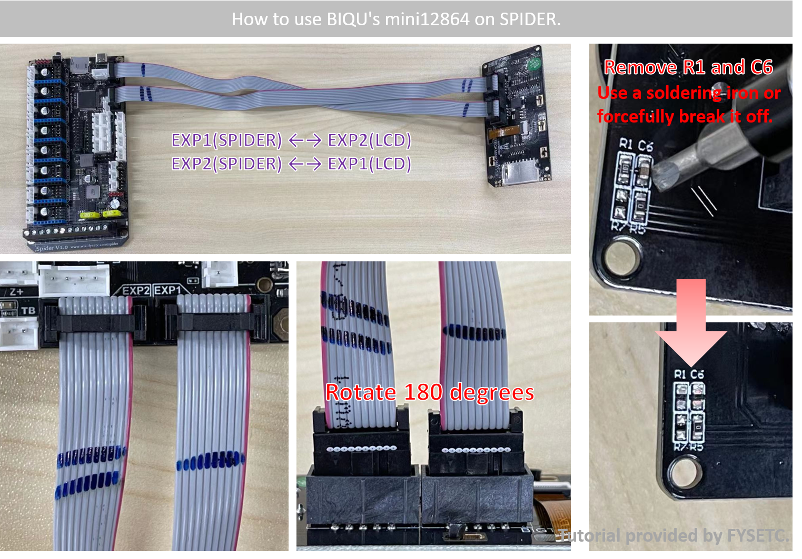

# How to use BIQU‘s mini12864 on Spider

- BIQU的12864在复位引脚上加了一个电容和一个10K的下拉电阻，会导致蜘蛛板子的RST引脚（有100K上拉，对地0.1uF电容）总是处于低电平，以至于没有办法启动。并且座子和我们的是反的，需要将其旋转180度。经过验证，旋转180度，去掉屏幕板上R1和C6，可以成功点亮。
- BIQU's 12864 adds a capacitor and a 10K pull-down resistor to the reset pin, which will cause the RST pin of the spider board (with a 100K pull-up and a 0.1uF capacitor to ground) to always be at a low level, so there is no way start up. And the seat is opposite to ours, it needs to be rotated 180 degrees. After rotate 180 degrees, remove R1 and C6 on the screen, it can be successfully lit.

