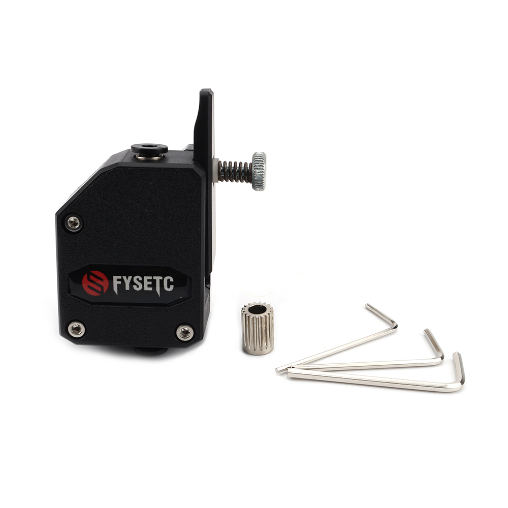

# Black BMG Extruder

## Product Introduction

Product name：Black BMG Extruder

Material：ABS

Weight:128.6g

## Applicable machine：
CR10 、Ender3 and other 3D printers .

## Features

- Provide greater torque for the extruder
- Improve the surface quality of printed matter
- Easy to install and easy to remove.

## Assembly steps

You can watch  [the assembly video](待上传).

## Attention

Refer to the assembly tutorial to avoid installation errors.

## FAQ

1. Q: How to install to my 3D printer? A: You can watch  [the assembly video](待上传).
2. Q：Does the installation require additional printed fixtures?  A：Yes, some models need to be used.

## Attachments

## Shop

------

- [Aliexpress](https://www.aliexpress.com/item/32968730009.html?spm=2114.12010615.8148356.15.63c875fdQXuHOl).
- [Amazon](https://www.amazon.com/Printer-Accessories-BCZAMD-Extruder-Creality/dp/B07RBL4CJC/ref=sr_1_4?dchild=1&keywords=bczamd&qid=1597805159&sr=8-4).

## Tech Support

facebook group：https://www.facebook.com/groups/197476557529090/

Tech Support Email： hunter@fysetc.com 

Forum：https://forum.fysetc.com/