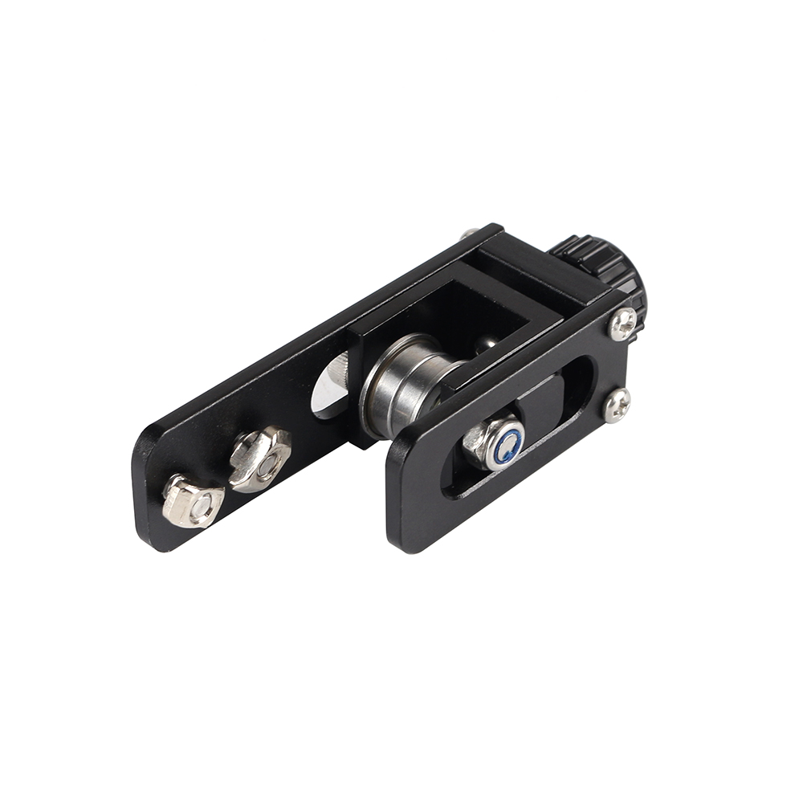
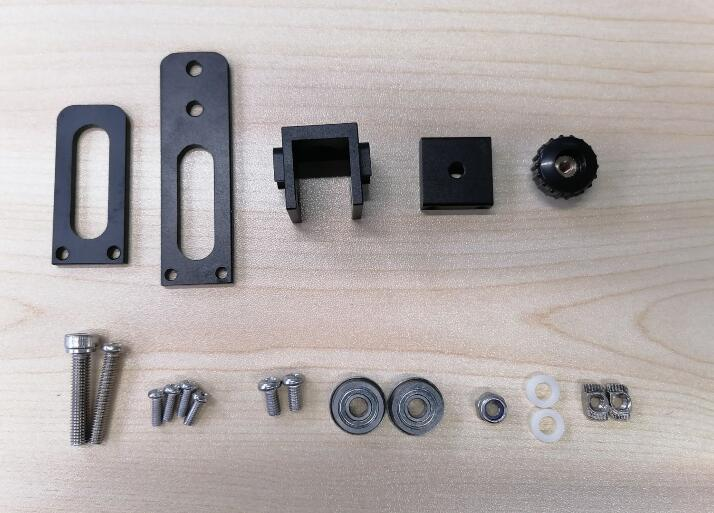
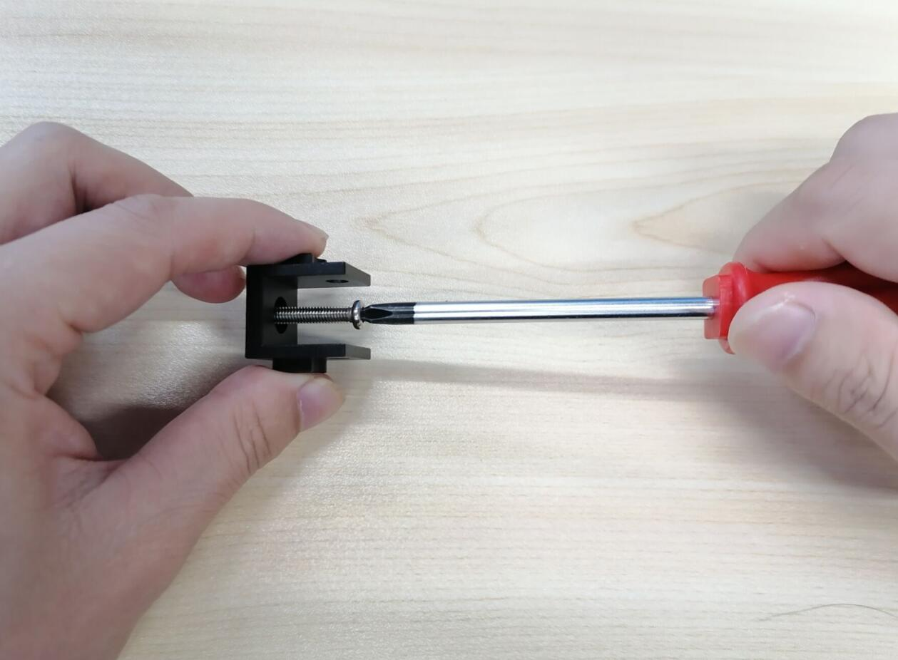
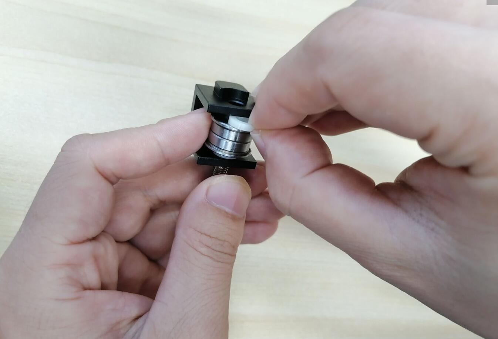
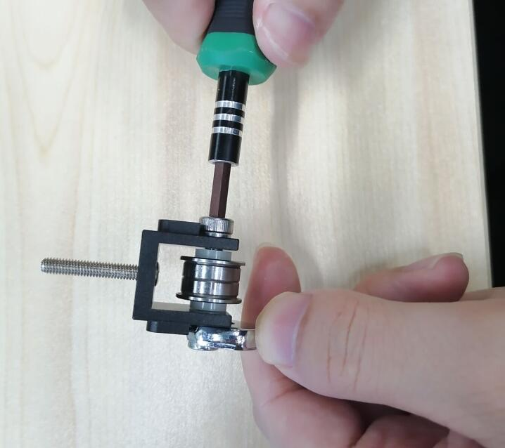
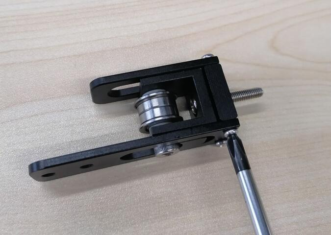
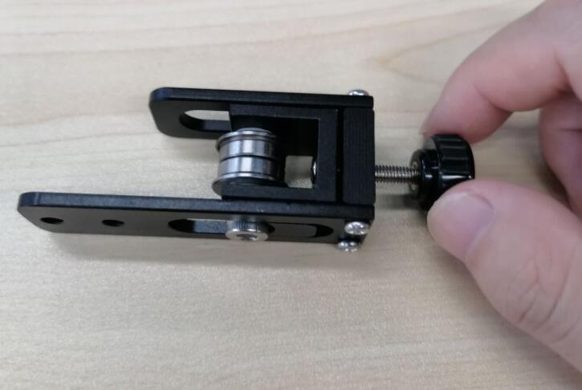
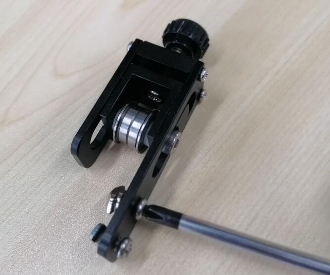

# CREALITY X-axis Belt Tensioner

## Product Introduction

Product name：CREALITY X-axis Belt Tensioner

Material：Aluminum alloy

Weight:56g

## Applicable machine：
Ender-3、 Ender-3 pro、CR-10、 CR-10S、CR10 pro、CR10 V2、Ender-5 3D Printer、Other 2020V profiles, etc .

## Features

- It can adjust the belt tightness, improve movement accuracy, and improve printing quality
- Metal material, strong and stable, long service life
- Easy to install.

## Assembly steps

You can watch  [the assembly video](https://www.youtube.com/watch?v=Ch7mA2F4kJE).Or follow the steps to install.

steps 1：Check if the material is correct according to the picture.

steps 2：Install M4X25 screws.

steps 3：Install pulley.

steps 4：Install the front and rear side panels.

steps 5：Install the thumb nut.

steps 6：Install the boat nut.

## Attention

Refer to the assembly tutorial to avoid installation errors.

## FAQ

1. Q: How to install to my 3D printer? A: You can watch  [the assembly video](https://www.youtube.com/watch?v=Ch7mA2F4kJE).

## Attachments

## Shop

------

-  [Aliexpress](https://www.aliexpress.com/item/32991702381.html?spm=2114.12010615.8148356.35.1a6b57e9NkmbjQ).
- [Amazon](https://www.amazon.com/FYSETC-Synchronous-Straighten-Tensioner-Accessories/dp/B07RXY6FBV/ref=sxin_7_ac_d_pm?ac_md=2-1-QmV0d2VlbiAkMTUgYW5kICQxMDA%3D-ac_d_pm&crid=2TTBK7ZBAO2QH&cv_ct_cx=fysetc&dchild=1&keywords=fysetc&pd_rd_i=B07RXY6FBV&pd_rd_r=e510cda6-bc71-4c42-a8bd-70a16d697eda&pd_rd_w=esRb8&pd_rd_wg=21eva&pf_rd_p=6fa2c4b2-cf77-4ff1-a22d-406e154f5c4b&pf_rd_r=5K8R06FZ2XPY09DMQKWG&psc=1&qid=1595231335&sprefix=FYS%2Caps%2C370&sr=1-2-22d05c05-1231-4126-b7c4-3e7a9c0027d0).

## Tech Support

facebook group：https://www.facebook.com/groups/197476557529090/

Tech Support Email： hunter@fysetc.com 

Forum：https://forum.fysetc.com/