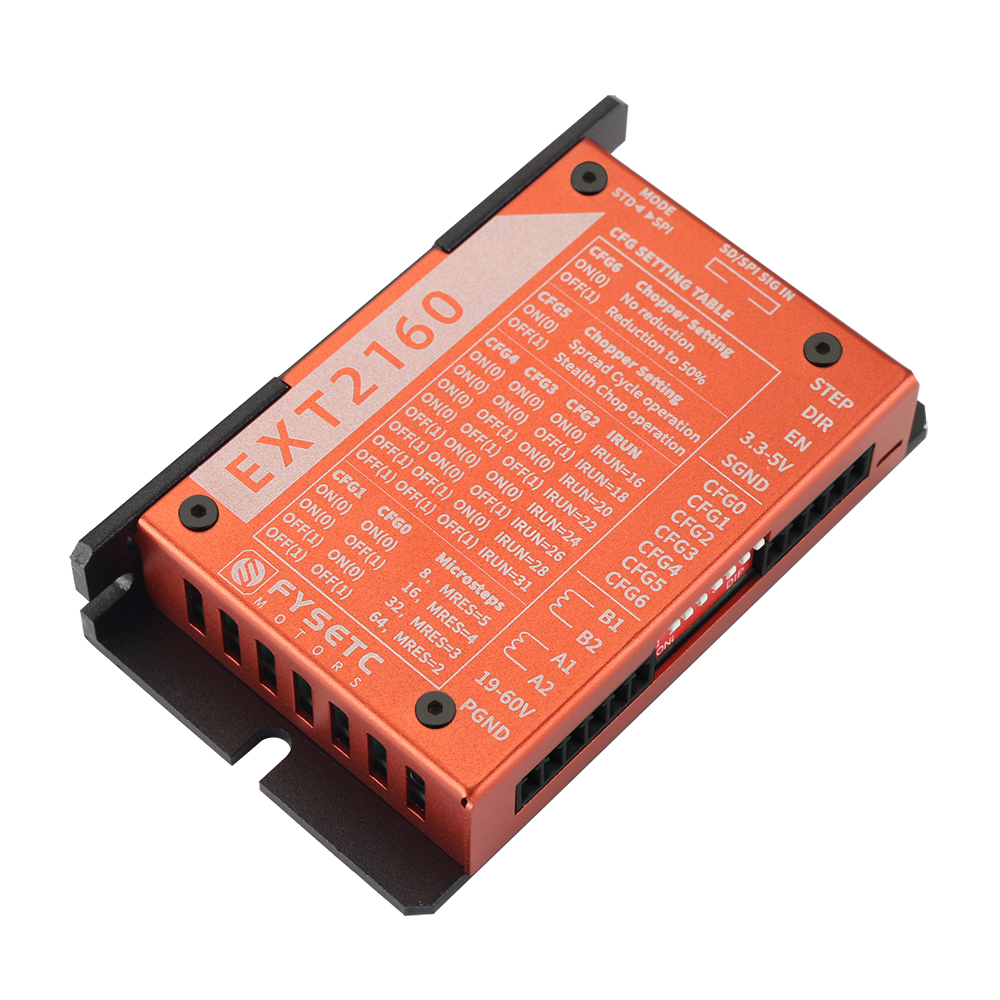
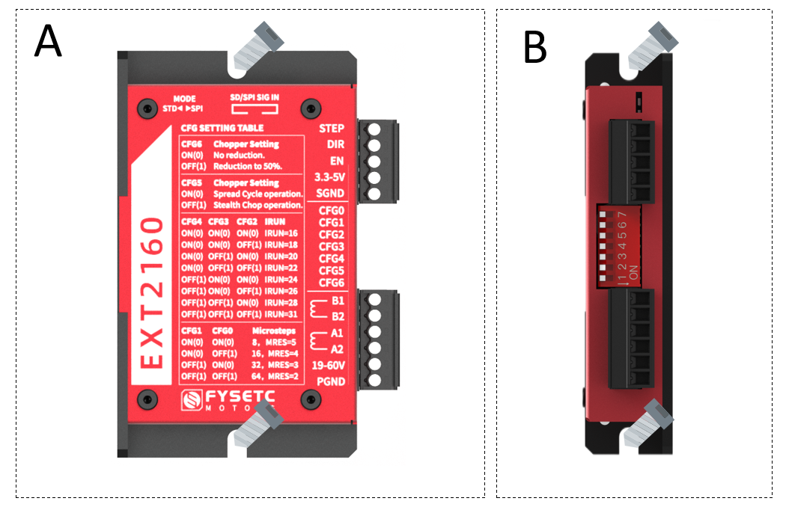
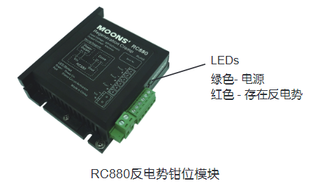
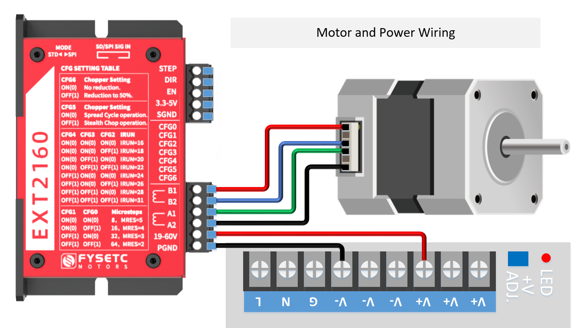
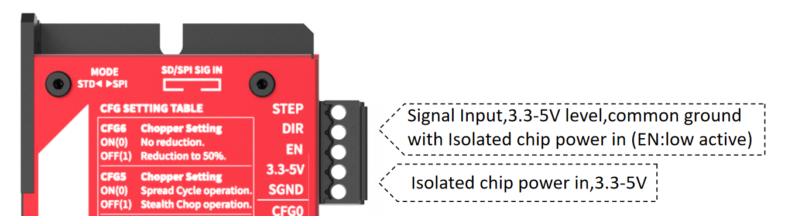
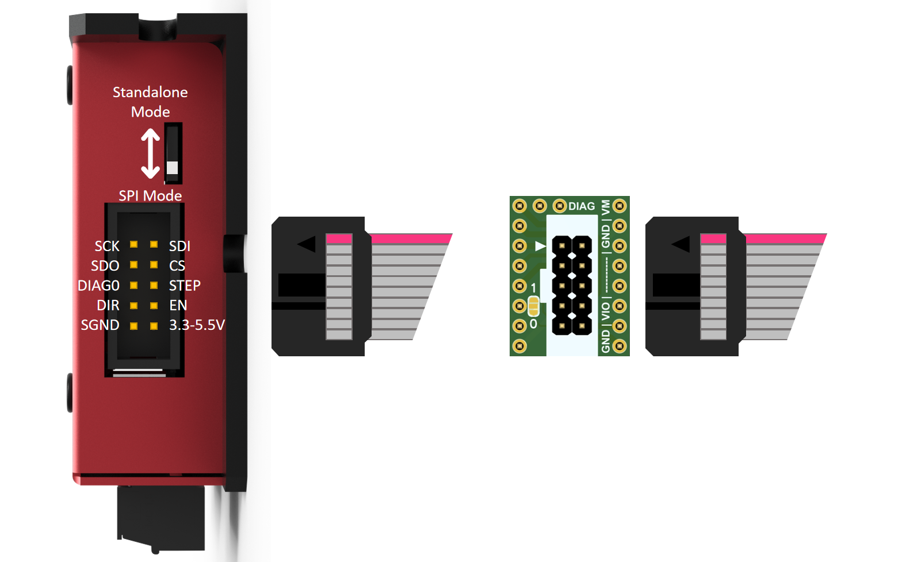
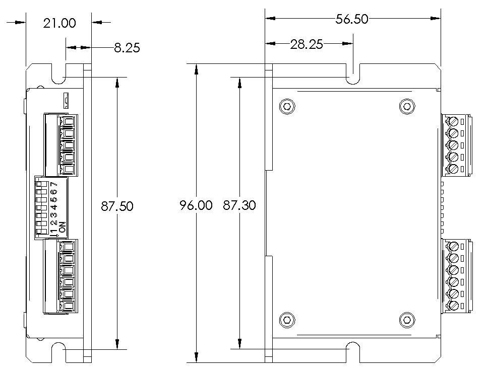

# EXT2160



## Introduction

The EXT2160 is a high-performance driver designed based on the Trinamic TMC2160 chip. It can provide smooth and low-noise drive capability, and can detect the motor running status in real time. It has a stall detection function to achieve sensor-less homing. With high-performance MOSFET, the maximum peak current can reach 6.6A in default, and by replacing the Rs, The current can further reach 15A peak value.

The driver can be controlled using simple pulse/direction/enable signals, work in stand-alone mode, or can be controlled with SPI for more intelligent applications. All signal interfaces are equipped with digital isolators up to 3750V to avoid irreversible damage to the controller due to high voltage and directional electromotive force.

The driver can be used in any occasion using a stepper motor, and comes with a StepStick adapter board, which is easy to install on 3D printers that require high voltage and high current drive.

## Characteristic

- Based on TMC2160

- Extra small size: 96x57x21

- 19-60V wide voltage support

- High-performance MOSFET, default maximum peak current 6.6A, replacement Rs can reach 15A peak (need to change the connection method)

- Standalone mode, Step/Dir interface, with MicroPlyer™ subdivision compensation for 256 microsteps

- Support SPI mode, work perfectly with firmware such as Marlin/Klipper

- high precision sensorless motor load detection / current control for energy savings up to 75% / quiet operation and smooth motion

- Onboard 3750V digital isolation

- StepStick adapter board optional, SPI direct drive

- Aluminum shell, taking into account both beauty and heat dissipation

- 2x5 DC3 connector, including SPI and S/D

- 1x7 DIP selector switch for Standalone mode， current regulation and function configuration

## Specification chart

| Specs                  | To drive two phase stepper motor                                                                                                                                                                                                                                                                                                       |
| ---------------------- | -------------------------------------------------------------------------------------------------------------------------------------------------------------------------------------------------------------------------------------------------------------------------------------------------------------------------------------- |
| Input voltage          | 19-60VDC（Peak）                                                                                                                                                                                                                                                                                                                         |
| Input current          | 8A Max                                                                                                                                                                                                                                                                                                                                 |
| Max current            | 6.6A Peak(default)，15A Peak(By changing connector and sensor resistor)                                                                                                                                                                                                                                                                 |
| Max STEP frequency     | 9MHz                                                                                                                                                                                                                                                                                                                                   |
| Standby current decays | 50%                                                                                                                                                                                                                                                                                                                                    |
| Connectors             | 3.81mm 5P socket + 3.81mm 6P socket + 2X5P DC3 socket                                                                                                                                                                                                                                                                                  |
| Interface              | STEP/DIR standalone mode/ SPI mode                                                                                                                                                                                                                                                                                                     |
| Ambient temperature    | 0-40°C (32-104°F)                                                                                                                                                                                                                                                                                                                      |
| Ambient humidity       | 90% MAX，Non condensing                                                                                                                                                                                                                                                                                                                 |
| Leds                   | 1 red DIAG led，1 green 5VDC led                                                                                                                                                                                                                                                                                                        |
| Isolation              | 3750V，MAX 150Mhz                                                                                                                                                                                                                                                                                                                       |
| Protections            | over-voltage protection, under-voltage protection,over-temperature protection, over-current protection                                                                                                                                                                                                                                 |
| Microsteps             | Hardware 8~64 microsteps adjustable, software 8~256 microsteps                                                                                                                                                                                                                                                                         |
| Trinamic Tech          | Highest Resolution 256 microsteps per full step<br/>StealthChop2™ for quiet operation and smooth motion<br/>SpreadCycle™ highly dynamic motor control chopper<br/>DcStep™ load dependent speed control<br/>StallGuard2™ high precision sensorless motor load detection<br/>CoolStep™ current control for energy savings up to 75%<br/> |

## Installation

Users can use the wide side or narrow side of the drive cooling base for installation, that is, method A or method B. In order to achieve a good heat dissipation effect, it is recommended to use narrow side installation. The power device of the driver will generate heat. If it works continuously under the conditions of high input voltage (>24V) and high power (>5A), the effective heat dissipation area should be enlarged or forced to cool.

Please do not use it in places where there is no air circulation or where the ambient temperature exceeds 40°C;

Do not install the drive in wet or metal shavings.



## Interface Connection

- For the drive to work properly, the following prerequisites are required:
  
  - It is recommended to use a 19-55V regulated power supply, which is determined according to the motor. (The limit voltage of the driver is 60V, which does not mean that the 60V power supply can be directly used for work, because the voltage may rise instantaneously when the power is turned on or the motor is working, which is very likely to damage the driver)
  - Appropriate control signal source, such as control board, PLC, etc.;
  - A matching stepper motor.

### Connect The Power Supply

- If your power supply output does not have a fuse or some other short-circuit current limiting device, place one between the power supply and the driver
  A fast-blow fuse of appropriate specification (no more than 8Amps) to protect the driver and power supply, please connect the fuse in series with the power supply
  between the positive pole of the driver and the "19-60V" position of the driver.
- Connect the positive side of the power supply to the "19-60V" position of the driver and the negative side of the power supply to the "PGND" position of the driver.
- If you want to ensure high efficiency and low noise at the same time, the drive supply voltage should be at least 5 times the rated phase voltage of the motor (that is, the rated phase voltage of the motor
  flow × phase resistance).
- If you need better high-speed performance of the motor, you need to increase the driver supply voltage.
- If a regulated power supply is used for power supply, the power supply voltage must not exceed 50V.
- If using an unregulated power supply, the required voltage should not exceed 34V. Because the rated current of the unstabilized power supply is the full load current; when the load is very light, such as when the motor does not rotate, the actual voltage is as high as 1.4 times the rated voltage of the power supply.
- When the motor slows down, it acts like a generator to convert the kinetic energy of the load into electricity. Some energy will be dissipated by the drive and motor
  Lose. If your application has large loads operating at high speeds, considerable kinetic energy is converted into electrical energy. Usually simple linear power
  There is a large capacitor to absorb this energy without causing damage to the system. Switching power supplies tend to shut down during overvoltage conditions, often
  The remaining energy will be transferred back to the driver, which may cause damage to the driver. In order to prevent this situation, we recommend using the
  The RC880 regenerative discharge clamp is shown. A regenerative discharge clamp is installed between the power supply and the driver.
- 

### Connect The Motor



**Direct connection:** connect B1/B2 to one phase of the motor, and A1/A2 to the other phase of the motor;

**Parallel connection method:** generally used in occasions where the rotational speed is required to be fast and the torque is not required to be high;

**Series connection method:** generally used in occasions where the torque is large and the rotation speed is not required. However, during the use of the series connection method, the current passing through is relatively large, so the heat generation will be larger than that of the general parallel connection motor. (Generally, it is normal for the heating temperature of the stepper motor to reach 90 degrees)

### Connect The I/O Signals

The driver is designed based on TMC2160 and can provide two working modes: independent mode and SPI mode. General applications, such as CNC or similar equipment can directly use the stand-alone mode, and the configuration is simple. If it is used on a 3D printer, it is recommended to use the SPI mode to obtain a more intelligent driving method, if the limit switch is reset. At present, both Klipper and Marlin can perfectly support TMC2160, please refer to the corresponding firmware instructions for specific configuration.

### Standalone Mode

When using the stand-alone mode, according to the lettering on the front of the drive or as shown in the picture above, turn the DIP switch up to stop at the "standalone Mode"/"STD" position, and then send the correct signal to the drive. The signal input can be at the 2x5P DC3 socket, or the 3.81-pitch 5P connector shown in the figure below. The difference from the general optocoupler isolation driver is that the "3.3-5V" and "SGND" must be connected here for digital The isolator supplies power, and the input signal should share ground with that supply.



#### STEP and DIR Signals

The EXT2160 driver has 2 high-speed input ports STEP and DIR, digital isolation, can accept 3.3-5VDC single-ended signal, the highest voltage can reach 5.5V, and the falling edge of the signal is valid.
The running direction of the motor depends on the DIR level signal. If the DIR signal is at low level, the motor will run clockwise; if DIR is floating or at high level, the motor will run counterclockwise.

#### EN Signals

The EN input enables or disables the power part of the driver. The signal input is digitally isolated and can accept 3.3-5VDC single-ended signals, and the signal can reach up to 5.5V. When the EN signal is at a low level, the driver is enabled and the motor runs normally; when the EN signal is suspended or at a high level, the power part of the driver is turned off, and the motor has no excitation.

#### Parameter Setting

When using standalone mode (i.e. when the SPI_MODE pin is connected to GND), in this mode the driver acts as a pure STEP and DIR driver. SPI and single wire off. Drive operates in SpreadCycle mode or StealthChop mode. All register parameter settings are realized by configuring CFG0-CFG6 (pull-up to VCC_IO by default) through 7-bit DIP switches. Pressing down to ON means connecting to GND, not moving means OFF, and connecting to VCC_IO by default. The specific configuration reference is as follows:

##### Microstep Setting

CFG0/CFG1：

| CFG1   | CFG0   | Microstep Setting     |
| ------ | ------ | --------------------- |
| GND    | GND    | 8 microsteps, MRES*=5 |
| GND    | VCC_IO | 16 microsteps, MRES=4 |
| VCC_IO | GND    | 32 microsteps, MRES=3 |
| VCC_IO | VCC_IO | 64 microsteps, MRES=2 |

MRES: Actual microstep resolution, actual subdivision. No matter how many subdivisions the external input pulse is, the internal will automatically calculate and interpolate to 256 subdivisions to run, so that the stepper motor runs smoothly and silently.

##### Current Setting

CFG4/CFG3/CFG2: CONFIGURATION OF RUN CURRENT 

| CFG4   | CFG3   | CFG2   | IRUN_Setting | I-rms | I-peak |
| ------ | ------ | ------ | ------------ | ----- | ------ |
| GND    | GND    | GND    | IRUN=16，     | 2.44  | 3.45   |
| GND    | GND    | VCC_IO | IRUN=18      | 2.73  | 3.86   |
| GND    | VCC_IO | GND    | IRUN=20      | 3.02  | 4.27   |
| GND    | VCC_IO | VCC_IO | IRUN=22      | 3.3   | 4.67   |
| VCC_IO | GND    | GND    | IRUN=24      | 3.59  | 5.08   |
| VCC_IO | GND    | VCC_IO | IRUN=26      | 3.88  | 5.48   |
| VCC_IO | VCC_IO | GND    | IRUN=28      | 4.17  | 5.89   |
| VCC_IO | VCC_IO | VCC_IO | IRUN=31      | 4.6   | 6.6    |

The EXT2160 driver has a default onboard 0.05Ω sampling resistor, that is, it can reach the maximum Irms=4.7A, Ipeak=6.6A. If the independent mode is used, the Irms current of the EXT2160 is adjustable between 2.35-4.7A, and the Ipeak is 3.3-6.6 Adjustable between A.

So if you are using a motor below 2.35A, you must use SPI mode, otherwise the current will be too large, causing the motor to burn out.

If you need a smaller current, you must configure it in SPI mode or change the size of the sampling resistor on the PCB in independent mode. (The 0.05Ω sampling resistor on the driver PCB is composed of two 0.1Ω resistors connected in parallel, one of which can be removed to make the sampling resistor 0.1Ω, so that in the independent mode, the Irms current of EXT2160 is between 1.15-2.3A adjustable, Ipeak is adjustable between 1.65-3.3A. If you need more current range configuration, you can refer to the table below to change the sampling resistor Rsense, and calculate the effective current Irms according to the following formula. For more information about the current, please refer to the TMC2160 specification Book Chapter 8)
$$
Irms=\frac{0.325}{0.05}×\frac{Irun+1}{32}×\frac{1}{\sqrt2}
$$
Relationship between Rsese and current：

| RSENSE [Ω] | RMS current [A] (CS=31) | Sine wave peakcurrent [A] (CS=31) |
| ---------- | ----------------------- | --------------------------------- |
| 0.22       | 1.1                     | 1.5                               |
| 0.15       | 1.6                     | 2.2                               |
| 0.12       | 2.0                     | 2.8                               |
| 0.10       | 2.3                     | 3.3                               |
| 0.075      | 3.1                     | 4.4                               |
| 0.066      | 3.5                     | 5.0                               |
| 0.050      | 4.7                     | 6.6                               |
| 0.033      | 7.1                     | 10.0                              |
| 0.022      | 10.6                    | 15.0                              |

##### Chopper Mode Select

CFG5: SELECTION OF CHOPPER MODE

| CFG5   | Chopper Setting                                                                                                                                                                                                                                                 |
| ------ | --------------------------------------------------------------------------------------------------------------------------------------------------------------------------------------------------------------------------------------------------------------- |
| GND    | SpreadCycle operation. (TOFF=3)                                                                                                                                                                                                                                 |
| VCC_IO | StealthChop operation. (GCONF.en_PWM_mode=1)<br/>*Be sure to allow the motor to rest for at least 100ms (assuming a minimum of 10MHz fCLK) before starting a motion using StealthChop. This will allow the current regulation to set the initial motorcurrent.* |

- StealthChop is the principle of a voltage chopper. In addition to the noise generated by the motor's mechanical roller bearings, it especially ensures that the motor is absolutely quiet when standing still and running at slow speeds. Unlike other voltage mode choppers, the StealthChop 2 requires no configuration. When powered on, it automatically learns the best settings during the first exercise and further optimizes the settings in subsequent exercises. The initial zeroing process is sufficient to allow the system to complete the StealthChop optimal configuration. You can also configure initial parameters to speed up the self-learning process. The StealthChop 2 allows for high motor dynamics by reacting immediately to changes in motor speed.
  
  For highly dynamic applications, the spreadCycle is an option in addition to the StealthChop 2. It can be configured via input pins (standalone mode) or SPI or UART interface. StealthChop 2 and spreadCycle can even be used in combination to achieve the best of both worlds: StealthChop2 for noiseless stillness, silently smooth performance, and spreadCycle for high dynamics, low vibration and highest peak speeds.
  
  spreadCycle is the cycle chopping mode. It provides smooth operation and good resonance damping over a wide range of speeds and loads. The SpreadCycle solution integrates a fast decay cycle and automatically adjusts to ensure smooth zero crossing.
  
  StealthChop 2Advantages:
  
  - Significantly improved performance for low-cost motors
  - Motor runs smoothly and quietly
  - Absolutely no standby noise
  - Reduced mechanical resonance yields improved torque

##### Configure hold current to automatically reduce

CFG6: CONFIGURATION OF HOLD CURRENT REDUCTION

| CFG6*  | Chopper Setting                                     |
| ------ | --------------------------------------------------- |
| GND    | No hold current reduction. IHOLD=IRUN / 不开启自动降低     |
| VCC_IO | Reduction to 50%. IHOLD=1/2 IRUN / 开启自动降低，等于运行电流的一半 |

CFG6 pin draws significant current (20mA) when driven to a different level than CFG5, because the output driver tries to make CFG6 level equal to CFG5. Therefore, a 0 Ohm resistor is required to pull up/down CFG6. Due to this, setting CFG6 different from CFG5 is only recommended with external VCC_IO supply at 3.3V level.

**Attention:**
DIAG outputs are not configured per default. They can be activated using the interfaces before
switching to standalone mode.

### SPI Mode

The SPI interface is a bit-serial interface synchronized to the bus clock. For every bit sent from the bus master to the bus slave, another bit is simultaneously sent from the slave to the master. Communication between the SPI master and the TMC2160 slave always consists of sending a 40-bit command word and receiving a 40-bit status word. The SPI command rate is typically a few commands per complete motor motion.

When using the SPI mode, according to the lettering on the front of the driver or as shown in the picture above, slide the DIP switch down to stop at the position of "SPI Mode"/"SPI", and then send the correct signal to the driver. The signal input can only be accessed from the 2x5P DC3 socket, and it can be directly connected to various 3D printer motherboards by using the gray flat cable and SEXT10 adapter board provided with the driver. If it is another control board, you need to wire it yourself according to the interface definition. The difference from the general optocoupler isolation driver is that the "3.3-5V" and "SGND" must be connected here to supply power to the digital isolator, and the input signal should be the same as The power supply is common ground.

Known issue: Due to the use of isolators, the SPI signal of some 3.3V controllers cannot be used at the same time. Two or more EXT2160, 5V controllers are not affected.
Solution: 

1. Remove the isolator on the board (SOP16 package marked 3741), which will lose the isolation function, and the others will not be affected;

2. Convert 3.3V signal to 5V level, which requires a level conversion module.

3. We will improve this problem in the next version to make it fully compatible with 3.3V signals.



#### Parameter Setting

According to the above formula, the current in SPI mode can be set as follows:
| I-peak | I-rms | Irun-setting |
| ------ | ----- | ---- | 
| 0.20 | 0.14 | 0    |
| 0.41|    0.29|    1|
| 0.61|    0.43|    2|
| 0.81|    0.57|    3|
| 1.02|    0.72|    4|
| 1.22|    0.86|    5|
| 1.42|    1.01|    6|
| 1.63|    1.15|    7|
| 1.83|    1.29|    8|
| 2.03|    1.44|    9|
| 2.23|    1.58|    10|
| 2.44|    1.72|    11|
| 2.64|    1.87|    12|
| 2.84|    2.01|    13|
| 3.05|    2.15|    14|
| 3.25|    2.30|    15|
| 3.45|    2.44|    16|
| 3.66|    2.59|    17|
| 3.86|    2.73|    18|
| 4.06|    2.87|    19|
| 4.27|    3.02|    20|
| 4.47|    3.16|    21|
| 4.67|    3.30|    22|
| 4.88|    3.45|    23|
| 5.08|    3.59|    24|
| 5.28|    3.73|    25|
| 5.48|    3.88|    26|
| 5.69|    4.02|    27|
| 5.89|    4.17|    28|
| 6.09|    4.31|    29|
| 6.30|    4.45|    30|
| 6.50|    4.60|    31|

## Firmware Configuration

##### Klipper

Refer to the configuration of TMC2130, if it is installed on the x-axis of the spider board, the configuration is as follows

```
[tmc2130 stepper_x]
# Soft SPI
spi_software_mosi_pin: PE14
spi_software_miso_pin: PE13
spi_software_sclk_pin: PE12
cs_pin: PE7
interpolate: True
# diag1_pin: PB14 
run_current: 0.800
hold_current: 0.500
sense_resistor: 0.05
#stealthchop_threshold: 99999
```

##### Marlin

Configuration.h file needs to be changed, For example to configure the x-axis

```
#define X_DRIVER_TYPE  TMC2160
```

Modify Configuration_adv.h RSENCE value

```
#define X_RSENSE          0.05
```

## Mechanical



DWG File：https://github.com/FYSETC/FYSETC-EXT2160/blob/main/EXT_2160%20V1.0.DWG

STEP File：https://github.com/FYSETC/FYSETC-EXT2160/blob/main/EXT_2160_V1.0.rar

## Where to Buy

[Taobao](https://item.taobao.com/item.htm?spm=a1z10.3-c.w4002-23828897339.12.1f9e1613fiQVOv&id=691917600419)

[Aliexpress](https://www.aliexpress.com/item/1005004883388302.html)

[Official website](https://www.fysetc.com/products/fysetc-ext2160-driver-high-performance-motor-drivers-with-stepstick-board-support-marlin-klipper-for-voron-ender-3d-printers?variant=42134640656559)

## Contact Us

QQ Group：1041794121

Facebook Group：https://www.facebook.com/groups/197476557529090

Discord：https://discord.gg/Fb6FdND4

Email：support@fysetc.com
