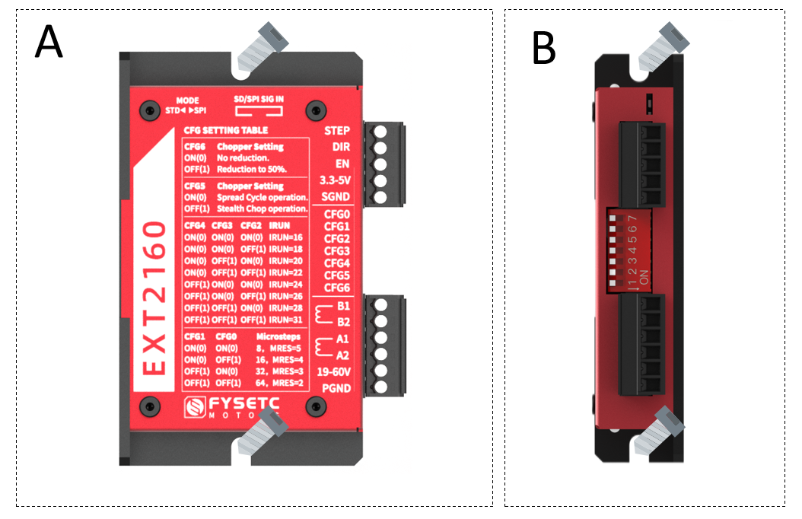
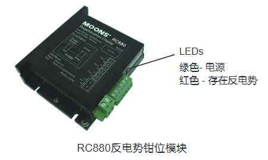
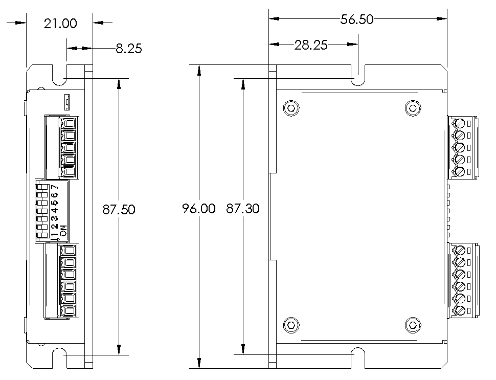

# EXT2160


## 产品介绍

EXT2160外置驱动器是基于Trinamic TMC2160芯片设计的高性能驱动器，可提供平滑低噪音的驱动能力，且可实时检测电机运行状态，拥有堵转检测功能，用以实现无限位开关复位。采用高性能MOS管，其最大峰值电流可以达到6.6A，通过更换采样电阻，其电流可以进一步达到15A峰值。

驱动器可以使用简单的脉冲/方向/使能信号来控制，工作在独立模式，也可以用SPI来控制以获得更多智能的应用。在所有的信号接口均配备了高达3750V的数字隔离器，以避免高压和方向电动势对控制器造成不可逆的损坏。

该驱动器可以用于任何使用步进电机的场合，并附赠StepStick转接板，便于安装在需要高压大电流驱动的3D打印机上。

## 特性

- 基于TMC2160
- 超小尺寸：96x57x21
- 19-60V宽电压支持
- 高性能MOSFET，默认最大峰值电流6.6A，更换Rs可达15A峰值（需更换连接方式）
- 独立模式，Step/Dir 接口，带MicroPlyer™细分补偿，实现256高细分
- 支持SPI模式，完美工作于Marlin/Klipper等固件
- 支持无限位开关复位/电流节能自动调节/静音平滑运动
- 板载3750V数字隔离
- 可选StepStick转接板，SPI直连驱动器
- 铝制外壳，兼顾美观和散热
- 2x5 DC3 简牛信号接口，含SPI和S/D
- 1x7 拨码选择开关，用于独立模式电流调节和功能配置

## 技术规格

| 适用范围        | 适用于驱动两相步进电机                                                                                                                                                                                                                                                                                                                               |
| ----------- | ----------------------------------------------------------------------------------------------------------------------------------------------------------------------------------------------------------------------------------------------------------------------------------------------------------------------------------------- |
| 输入电压        | 19-60VDC（Peak）                                                                                                                                                                                                                                                                                                                            |
| 输入电流        | 8A Max                                                                                                                                                                                                                                                                                                                                    |
| 驱动能力        | 6.6A Peak默认，更改连接器和采样电阻可达15A Peak                                                                                                                                                                                                                                                                                                          |
| 最大脉冲频率      | 9MHz                                                                                                                                                                                                                                                                                                                                      |
| 待机电流衰减      | 50%                                                                                                                                                                                                                                                                                                                                       |
| 接口          | 3.81mm 5P 插座 + 3.81mm 6P 插座 + 2X5P DC3 插座                                                                                                                                                                                                                                                                                                 |
| 运行模式        | STEP/DIR独立模式 / SPI模式                                                                                                                                                                                                                                                                                                                      |
| 环境温度        | 0-40°C (32-104°F)                                                                                                                                                                                                                                                                                                                         |
| 环境湿度        | 最大90%，无结露                                                                                                                                                                                                                                                                                                                                 |
| 指示灯         | 1个红灯指示DIAG，和1个绿灯指示5VDC                                                                                                                                                                                                                                                                                                                    |
| 隔离          | 3750V，最大150Mhz                                                                                                                                                                                                                                                                                                                            |
| 保护          | 过压保护，欠压保护，过温保护，过流保护                                                                                                                                                                                                                                                                                                                       |
| 细分          | 外部8-64细分输入可调，内部256细分插补                                                                                                                                                                                                                                                                                                                    |
| Trinamic 技术 | StealthChop 2™ 无噪声、高精度斩波算法，用于电机的静止和运动状态下的静音控制。StealthChop2在 StealthChop 的基础上，加快了电机运动加减速特性，降低了所需的电流最小值。<br/>spreadCycle™ 高精度斩波算法，用于高动态电机运动和产生绝对干净的电流波。低噪音、低共振和<br/>低振动斩波器。<br/>DcStep™ 与负载相关的速度控制。电机尽可能快地移动，不失步<br/>StallGuard2™ 无传感器的堵转检测和机械负载测量。<br/>CoolStep™ 根据负载自适应电流，可将能耗降低 75 %。<br/>MicroPlyer™ 细分内插器，用于从全步开始，以较低细分输入获得 256 微步的平滑度 |

## 驱动器安装

用户可以用驱动器散热底座的宽边或窄边进行安装，即A方式或者B方式。为达到良好散热效果，建议采用窄边安装。驱动器的功率器件会发热，如果连续工作在高输入电压（>24V）、大功率(>5A)条件下，应扩大有效散热面积或强制冷却。

请不要在空气不流通的地方或者环境温度超过40°C的地方使用；

不要将驱动器安装在潮湿或有金属屑的地方。



## 驱动器接口连接

要使驱动器能正常工作，需要提供以下必要条件：

- 推荐使用19-55V合适功率的稳压电源，具体根据所带电机确定。（驱动器的极限电压是60V，不代表可直接使用60V的电源进行工作，因为电源在开启或者电机工作时都会有导致电压瞬间升高的可能，极有可能损坏驱动器）

- 合适的控制信号源，如控制板，PLC等；

- 相匹配的步进电机。

### 连接电源

- 如果您的电源输出端没有保险丝或一些别的限制短路电流的装置，可在电源和驱动器之间放置一个
  适当规格的快速熔断保险丝(规格不得超过8Amps)以保护驱动器和电源，请将该保险丝串联于电源
  的正极和驱动器的”19-60V“位置之间。

- 将电源的正极连接到驱动器的“19-60V”位置，将电源的负极连接到驱动器的“PGND”位置。

- 如果要同时保证高效率和低噪音，则驱动器供电电压至少5倍于电机额定相电压（即电机额定相电
  流×相电阻）。

- 如果您需要电机获得更好的高速性能，则需要提高驱动器供电电压。

- 如果使用稳压电源供电，要求供电电压不得超过50V。

- 如果使用非稳压电源供电，要求电压不得超过34V。因为非稳压电源的额定电流是满载电流；在负载很轻，例如电机不转时，实际电压高达电源额定电压的1.4倍。

- 当电机减速的时候，它会像发电机一样将负载的动能转化为电能。一些能量会被驱动器和电机消耗
  掉。如果您的应用中有**大的负载以高速运行**，相当大的动能会被转换成电能。通常简单的线性电源
  有一个大的电容来吸收这些能量而不会对系统造成损坏。开关电源往往会在过压的状况下关闭，多
  余的能量会回传给驱动器，可能会造成驱动器的损坏。为了预防这种情况，我们推荐使用如下图所
  示的RC880再生放电钳。再生放电钳安装在电源和驱动器之间。

- 

### 连接电机


直接连接：将B1/B2连接于电机的一相，A1/A2连接于电机的另外一相即可；

并联接法：一般用于转动速度要求较快，力矩要求不算高的场合；

串联接法：一般用于力矩大，转动速度要求不高的场合。但由于串联接法的使用过程中，通过的电流较大，所以发热量也会比一般并联电机大。（一般步进电机发热的温度，达到90度都是正常的）

### 连接输入输出控制信号

驱动器是基于TMC2160设计的，可以提供独立模式和SPI模式两种工作方式。一般的应用，如CNC或者类似设备可以直接使用独立模式，配置简单。如果用在3D打印机上推荐使用SPI模式，以获得更智能的驱动方式，如果无限位开关复位。目前Klipper和Marlin均能完美支持TMC2160，具体配置参考相应固件说明。

### 独立模式

使用独立模式的时候，根据驱动器正面刻字或者上图所示，将拨码开关向上拨动，使其停在“standalone Mode”/“STD”的位置，然后发送正确的信号到驱动器即可。信号输入可以是2x5P DC3 插座处，也可以是下图所示的3.81间距 5P连接器，与一般光耦隔离驱动器不同的是此处的“3.3-5V”“SGND”必须连接，用于为数字隔离器供电，且输入信号应与该供电共地。


#### 脉冲和方向信号

EXT2160驱动器有2个高速输入口STEP和DIR，数字隔离，可以接受3.3-5VDC单端信号，最高电压可达5.5V，信号下降沿有效。
电机运转方向取决于DIR电平信号，若DIR信号为低电平时，电机顺时针运转; 则DIR悬空或高电平时，电机逆时针运转。

#### 使能信号

EN输入使能或关断驱动器的功率部分，信号输入为数字隔离，可接受3.3-5VDC单端信号，信号最高可达5.5V。EN信号低电平时，驱动器为使能状态，电机正常运转; EN信号悬空或为高电平时，驱动器功率部分关断，电机无励磁。

#### 参数设定

使用独立模式时（即SPI_MODE 引脚连接到 GND时），在这种模式下，驱动程序充当纯 STEP 和 DIR 驱动程序。 SPI 和单线关闭。 驱动器在 SpreadCycle 模式或 StealthChop 模式下工作。 所有寄存器参数设定是通过7位DIP拨码开关来配置CFG0-CFG6（默认上拉至VCC_IO）实现的，下压到ON即为连接到GND，不动即为OFF，默认连接到VCC_IO。具体配置参考如下：

##### 细分设置

CFG0/CFG1：

| CFG1   | CFG0   | Microstep Setting     |
| ------ | ------ | --------------------- |
| GND    | GND    | 8 microsteps, MRES*=5 |
| GND    | VCC_IO | 16 microsteps, MRES=4 |
| VCC_IO | GND    | 32 microsteps, MRES=3 |
| VCC_IO | VCC_IO | 64 microsteps, MRES=2 |

*MRES：实际细分。在软件设定了 INTERPOLATE 情况下，外部不论按照多少细分输入脉冲，内部都会自动计算并插补到256细分运行，以使得步进电机运行平滑，静音。

##### 电流设置

CFG4/CFG3/CFG2: CONFIGURATION OF RUN CURRENT 

| CFG4   | CFG3   | CFG2   | IRUN_Setting | I-rms | I-peak |
| ------ | ------ | ------ | ------------ | ----- | ------ |
| GND    | GND    | GND    | IRUN=16，     | 2.44  | 3.45   |
| GND    | GND    | VCC_IO | IRUN=18      | 2.73  | 3.86   |
| GND    | VCC_IO | GND    | IRUN=20      | 3.02  | 4.27   |
| GND    | VCC_IO | VCC_IO | IRUN=22      | 3.3   | 4.67   |
| VCC_IO | GND    | GND    | IRUN=24      | 3.59  | 5.08   |
| VCC_IO | GND    | VCC_IO | IRUN=26      | 3.88  | 5.48   |
| VCC_IO | VCC_IO | GND    | IRUN=28      | 4.17  | 5.89   |
| VCC_IO | VCC_IO | VCC_IO | IRUN=31      | 4.6   | 6.6    |

EXT2160驱动器默认板载0.05Ω采样电阻，即其能达到最大的Irms=4.7A，Ipeak=6.6A，如果使用独立模式，EXT2160的Irms电流在2.35-4.7A之间可调，Ipeak在3.3-6.6A之间可调。

所以如果使用的是2.35A以下的电机则必须使用SPI模式，否则会电流过大，导致电机烧毁。

若需要更小的电流则必须使用SPI模式进行配置或者在独立模式下改变PCB上采样电阻的大小。*（驱动器PCB上的0.05Ω的采样电阻是由两个0.1Ω电阻并联而成，可以拆除其一，使得采样电阻变为0.1Ω，这样在独立模式下，EXT2160的Irms电流在1.15-2.3A之间可调，Ipeak在1.65-3.3A之间可调。如需更多电流范围配置，可参考下表更改采样电阻Rsense，按照下列公式计算有效电流Irms，更多关于电流等内容请参考TMC2160规格书第8章节）*
$$
Irms=\frac{0.325}{0.05}×\frac{Irun+1}{32}×\frac{1}{\sqrt2}
$$
Rsese和电流的关系表：

| RSENSE [Ω] | RMS current [A] (CS=31) | Sine wave peakcurrent [A] (CS=31) |
| ---------- | ----------------------- | --------------------------------- |
| 0.22       | 1.1                     | 1.5                               |
| 0.15       | 1.6                     | 2.2                               |
| 0.12       | 2.0                     | 2.8                               |
| 0.10       | 2.3                     | 3.3                               |
| 0.075      | 3.1                     | 4.4                               |
| 0.066      | 3.5                     | 5.0                               |
| 0.050      | 4.7                     | 6.6                               |
| 0.033      | 7.1                     | 10.0                              |
| 0.022      | 10.6                    | 15.0                              |

##### Chopper 模式选择

CFG5: SELECTION OF CHOPPER MODE

| CFG5   | Chopper Setting                                                                                      |
| ------ | ---------------------------------------------------------------------------------------------------- |
| GND    | SpreadCycle 模式. (TOFF=3)                                                                             |
| VCC_IO | StealthChop 模式. (GCONF.en_PWM_mode=1)<br/>* 在使用 StealthChop 前，请确保电机休息最少 100ms (假设最小的 fCLK 为 10MHz) * |

StealthChop 是电压斩波器的原理。除了电机机械滚轮轴承产生的噪音，它特别保证了电机在静止和慢速运行时能绝对安静。不同于其他电压模式斩波器, StealthChop 2 不需要任何配置。通电后，它会在第一次运动中自动学习最佳设置，并进一步优化后续运动中的设置。初始的归零过程足以使系统完成StealthChop最佳配置。也可以配置初始参数加快自学习过程。StealthChop 2 通过对电机速度的变化立即做出反应，允许高的电机动态。

对于高动态的应用，spreadCycle是除StealthChop 2之外的选项。它可以通过输入引脚(独立模式)或SPI或UART接口配置。StealthChop 2和spreadCycle甚至可以结合使用，以达到两者的最佳效果:StealthChop2用于无噪音的静止状态，无声平滑的性能，spreadCycle用于高动态，低振动和最高的峰值速度。

spreadCycle是周期斩波模式。它在很宽的速度和负载范围内提供平稳的操作和良好的共振阻尼。SpreadCycle方案集成快衰减周期并自动调节，以保证平滑过零。

StealthChop 2优势:

- 显著改善了低成本电机的性能
- 电机运行平稳安静
- 绝对没有待机噪音
- 降低机械共振产生改善的扭矩

##### 配置保持电流自动降低

CFG6: CONFIGURATION OF HOLD CURRENT REDUCTION

| CFG6*  | Chopper Setting                  |
| ------ | -------------------------------- |
| GND    | 不开启自动降低. IHOLD=IRUN              |
| VCC_IO | 开启自动降低，等于运行电流的一半. IHOLD=1/2 IRUN |

当驱动到与 CFG5 不同的电平时，CFG6 引脚消耗大量电流 (20mA)，因为输出驱动器试图使 CFG6 电平等于 CFG5。 因此，需要一个 0 欧姆的电阻来上拉/下拉 CFG6。 因此，只有在外部 VCC_IO 电源为 3.3V 电平时，才建议将 CFG6 设置为与 CFG5 不同。

注意:
默认情况下DIAG输出未配置， 但是它们可以在切换到独立模式之前使用SPI接口激活并配置。

### SPI模式

SPI 接口是与总线时钟同步的位串行接口。对于从总线主机发送到总线从机的每一位，另一位同时从从机发送到主机。 SPI 主机和 TMC2160 从机之间的通信始终包括发送一个 40 位命令字和接收一个 40 位状态字。 SPI 命令速率通常是每个完整电机运动的几个命令。

使用SPI模式的时候，根据驱动器正面刻字或者上图所示，将拨码开关向下拨动，使其停在“SPI Mode”/“SPI”的位置，然后发送正确的信号到驱动器即可。信号输入只能从 2x5P DC3 插座处接入，使用随驱动器附赠的灰排线和SEXT10转接板即可直接连接到各类3D打印机主板。如果是其他控制板，则需要按照接口定义自行接线，与一般光耦隔离驱动器不同的是此处的“3.3-5V”“SGND”必须连接，用于为数字隔离器供电，且输入信号应与该供电共地。


#### 参数设定

根据上方的公式，可以得出，SPI模式下的可以设置的电流如下：
| I-peak | I-rms | Irun-setting |
| ------ | ----- | ---- | 
| 0.20 | 0.14 | 0    |
| 0.41|    0.29|    1|
| 0.61|    0.43|    2|
| 0.81|    0.57|    3|
| 1.02|    0.72|    4|
| 1.22|    0.86|    5|
| 1.42|    1.01|    6|
| 1.63|    1.15|    7|
| 1.83|    1.29|    8|
| 2.03|    1.44|    9|
| 2.23|    1.58|    10|
| 2.44|    1.72|    11|
| 2.64|    1.87|    12|
| 2.84|    2.01|    13|
| 3.05|    2.15|    14|
| 3.25|    2.30|    15|
| 3.45|    2.44|    16|
| 3.66|    2.59|    17|
| 3.86|    2.73|    18|
| 4.06|    2.87|    19|
| 4.27|    3.02|    20|
| 4.47|    3.16|    21|
| 4.67|    3.30|    22|
| 4.88|    3.45|    23|
| 5.08|    3.59|    24|
| 5.28|    3.73|    25|
| 5.48|    3.88|    26|
| 5.69|    4.02|    27|
| 5.89|    4.17|    28|
| 6.09|    4.31|    29|
| 6.30|    4.45|    30|
| 6.50|    4.60|    31|

## 固件配置

##### Klipper

参考 TMC2130 的配置，如安装到蜘蛛板 x 轴，配置如下

```
[tmc2130 stepper_x]
# 软件 SPI 管脚定义
spi_software_mosi_pin: PE14
spi_software_miso_pin: PE13
spi_software_sclk_pin: PE12
cs_pin: PE7
interpolate: True # 采用自动 256 细分
# diag1_pin: PB14 
run_current: 0.800 # 运行电流
hold_current: 0.500 # 保持电流
sense_resistor: 0.05 # 采样电阻
#stealthchop_threshold: 99999 # stealthchop 阈值
```

##### Marlin

需要更改 `Configuration.h` 文件，例如配置 x 轴

```
#define X_DRIVER_TYPE  TMC2160
```

同时修改 `Configuration_adv.h` 采样电阻值

```
#define X_RSENSE          0.05
```

##### 其他

## 机械尺寸



DWG File：https://github.com/FYSETC/FYSETC-EXT2160/blob/main/EXT_2160%20V1.0.DWG

STEP File：https://github.com/FYSETC/FYSETC-EXT2160/blob/main/EXT_2160_V1.0.rar

## 购买

[Taobao](https://item.taobao.com/item.htm?spm=a1z10.3-c.w4002-23828897339.12.1f9e1613fiQVOv&id=691917600419)

[Aliexpress](https://www.aliexpress.com/item/1005004883388302.html)

[Official website](https://www.fysetc.com/products/fysetc-ext2160-driver-high-performance-motor-drivers-with-stepstick-board-support-marlin-klipper-for-voron-ender-3d-printers?variant=42134640656559)

## 联系我们

QQ群：1041794121

Facebook小组：https://www.facebook.com/groups/197476557529090

Discord频道：https://discord.gg/Fb6FdND4

邮箱：support@fysetc.com
