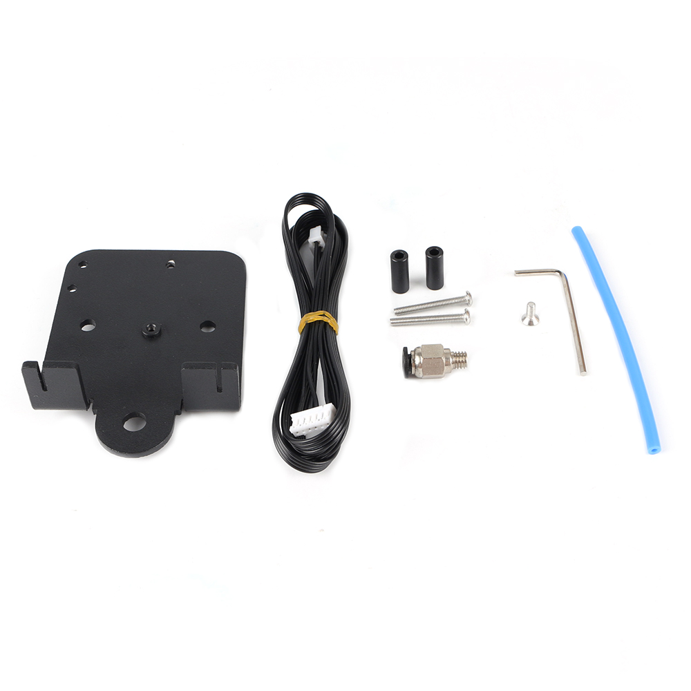

# Ender 3 3D printer Direct Drive Extruder Plate

## Product Introduction

Product name：Ender 3 3D printer Direct Drive Extruder Plate

Material：Aluminum alloy

Weight:71.5g

## Applicable machine：
Ender3、CR10.

## Features

- Provide installation and fixing method for short-range extruder
- Metal material, strong and stable, long service life
- Easy to install and easy to remove.

## Assembly steps

You can watch  [the assembly video](https://www.youtube.com/watch?v=oOn9nLJrsEI ).Or follow the steps to install.

## Attention

Refer to the assembly tutorial to avoid installation errors.

## FAQ

1. Q: How to install to my 3D printer? A: You can watch  [the assembly video](https://www.youtube.com/watch?v=oOn9nLJrsEI 
2. ).
3. Q：Does the installation require additional printed fixtures?  A：Not needed

## Attachments

## Shop

------

-  [Aliexpress](https://es.aliexpress.com/item/4000402226461.html?spm=a2g0o.productlist.0.0.2e7658ccMbqSES&algo_pvid=ebbf4a59-16cd-41bc-91d0-aaee9fc8d29d&algo_expid=ebbf4a59-16cd-41bc-91d0-aaee9fc8d29d-42&btsid=0b01114516005032907512989eafaa&ws_ab_test=searchweb0_0,searchweb201602_,searchweb201603_).
-  [Amazon](https://www.amazon.com/BCZAMD-Directly-Aluminum-Compatible-Extruder/dp/B088H86J9X/ref=sr_1_9?dchild=1&keywords=BCZAMD&qid=1600504002&sr=8-9).

## Tech Support

facebook group：https://www.facebook.com/groups/197476557529090/

Tech Support Email： hunter@fysetc.com 

Forum：https://forum.fysetc.com/