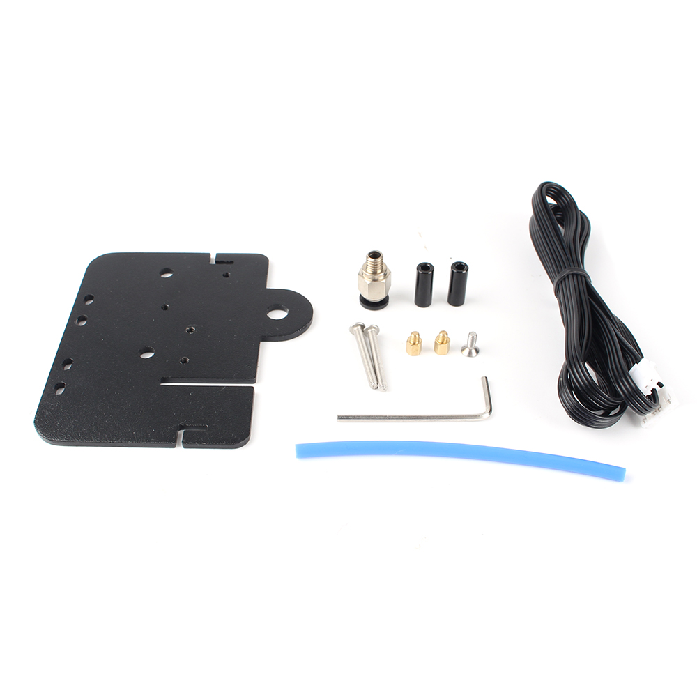

# Ender 5 3D printer Direct Drive Extruder Plate

## Product Introduction

Product name：Ender 5 3D printer Direct Drive Extruder Plate

Material：Aluminum alloy

Weight:83.5g

## Applicable machine：
Ender5.

## Features

- Provide installation and fixing method for short-range extruder
- Metal material, strong and stable, long service life
- Easy to install and easy to remove.

## Assembly steps

You can watch  [the assembly video](https://www.youtube.com/watch?v=2MWDhDHxQvE&t=285s).Or follow the steps to install.

## Attention

Refer to the assembly tutorial to avoid installation errors.

## FAQ

1. Q: How to install to my 3D printer? A: You can watch  [the assembly video](https://www.youtube.com/watch?v=2MWDhDHxQvE&t=285s).
2. Q：Does the installation require additional printed fixtures?  A：Not needed

## Attachments

## Shop

------

-  [Aliexpress](https://es.aliexpress.com/item/4000959198767.html?spm=a2g0o.productlist.0.0.437e3823GImpCL&algo_pvid=04b7f19d-3a47-45d1-8edf-d8b9670b3867&algo_expid=04b7f19d-3a47-45d1-8edf-d8b9670b3867-5&btsid=0b86d80215998140004337372e8dff&ws_ab_test=searchweb0_0,searchweb201602_,searchweb201603_).
-  [Amazon](https://www.amazon.com/BCZAMD-Accessories-Aluminum-Compatible-Extruder/dp/B088BKHVYJ/ref=sr_1_51?dchild=1&keywords=bczamd&qid=1599813822&sr=8-51).

## Tech Support

facebook group：https://www.facebook.com/groups/197476557529090/

Tech Support Email： hunter@fysetc.com 

Forum：https://forum.fysetc.com/