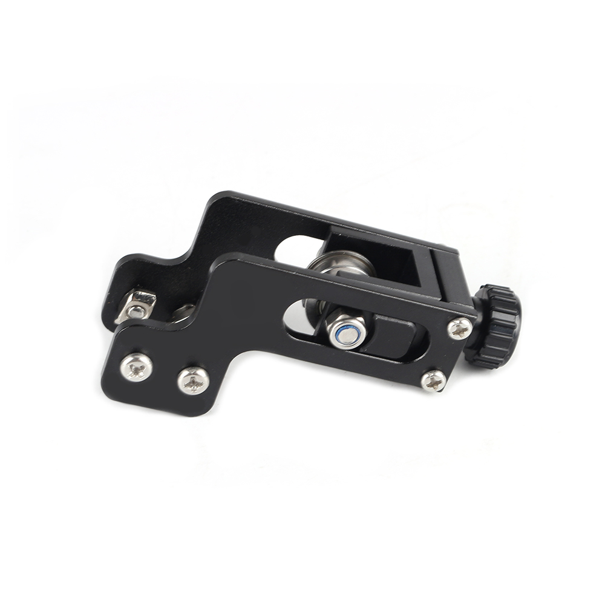

# Ender3 Y-axis Belt Tensioner

## Product Introduction

Product name：Ender3 Y-axis Belt Tensioner

Material：Aluminum alloy

Weight:66g

## Applicable machine：
Ender-3、Other 20V groove profiles.

## Features

- It can adjust the belt tightness, improve movement accuracy, and improve printing quality
- Metal material, strong and stable, long service life
- Easy to install and easy to remove.

## Assembly steps

You can watch  [the assembly video](https://www.youtube.com/watch?v=Cl19nfAA73o).Or follow the steps to install.

## Attention

Refer to the assembly tutorial to avoid installation errors.

## FAQ

1. Q: How to install to my 3D printer? A: You can watch  [the assembly video](https://www.youtube.com/watch?v=Cl19nfAA73o).
2. Q：Does the installation require additional printed fixtures?  A：Not needed

## Attachments

## Shop

------

-  [Aliexpress](https://www.aliexpress.com/item/32995039077.html?spm=a2g0o.productlist.0.0.72e01b49kJZIVV&algo_pvid=ce0f2168-231b-48bf-a480-1a6f9b9ac96d&algo_expid=ce0f2168-231b-48bf-a480-1a6f9b9ac96d-57&btsid=0bb47a1a15961838083517430ed198&ws_ab_test=searchweb0_0,searchweb201602_,searchweb201603_).
-  [Amazon](https://www.amazon.com/FYSETC-Aluminum-Synchronous-Straighten-Tensioner/dp/B07VXT4GDH/ref=sr_1_17?dchild=1&m=A17REXMFA4MBN8&marketplaceID=ATVPDKIKX0DER&qid=1596182691&s=merchant-items&sr=1-17).

## Tech Support

facebook group：https://www.facebook.com/groups/197476557529090/

Tech Support Email： hunter@fysetc.com 

Forum：https://forum.fysetc.com/