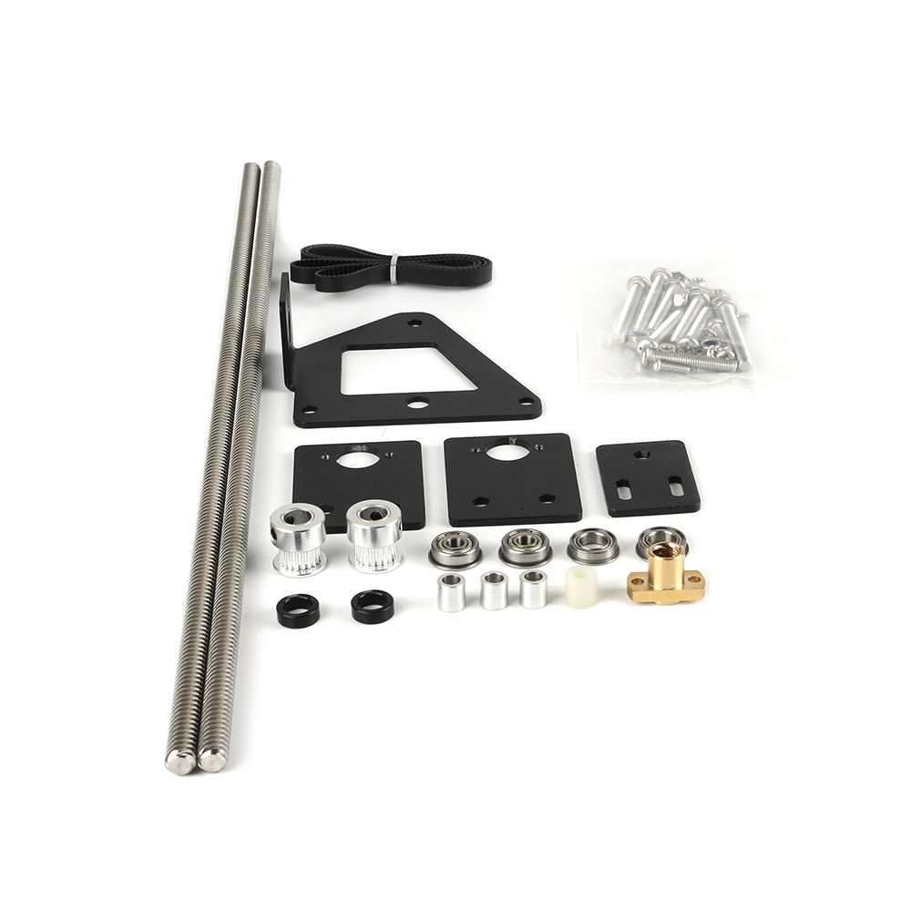

# Ender3 belt double Z upgrade kit

## Product Introduction

Product name：Ender3 belt double Z upgrade kit

Material：Metal、Spcc

Weight:650g

## Applicable machine：
Ender-3、Ender-3S、Ender-3Pro

## Features

- Improve the moment of the movement direction of the Z axis, while ensuring the left and right balance of the X movement axis, thereby improving the movement accuracy and printing quality
- Metal material, strong and stable, long service life
- Easy to install and easy to remove.

## Assembly steps

You can watch  [the assembly video](https://www.youtube.com/watch?v=X-y9qs0zAPE).

## Attention

Refer to the assembly tutorial to avoid installation errors.

## FAQ

1. Q: How to install to my 3D printer? A: You can watch  [the assembly video](https://www.youtube.com/watch?v=X-y9qs0zAPE).
2. Q：Does the installation require additional printed fixtures?  A：Not needed

## Attachments

## Shop

------

-  [Aliexpress](https://www.aliexpress.com/item/32991973834.html?gps-id=8041884&scm=1007.14677.110221.0&scm_id=1007.14677.110221.0&scm-url=1007.14677.110221.0&pvid=598fd7bb-b229-4030-b63d-1d6232a493c6&spm=a2g0o.store_home.promoteRecommendProducts_6534532.2).
-  [Amazon](https://www.amazon.com/BCZAMD-Upgrade-Tension-Pulley-Printer/dp/B086C8LS8N/ref=sr_1_17_sspa?dchild=1&keywords=bczamd&qid=1598695674&sr=8-17-spons&psc=1&spLa=ZW5jcnlwdGVkUXVhbGlmaWVyPUE1NVJDM1JDOExIMDEmZW5jcnlwdGVkSWQ9QTA3MzcyOTNOUUpZSFg3RVNFMkkmZW5jcnlwdGVkQWRJZD1BMDgyNjE3NzJKSkRLMVdRU01VREsmd2lkZ2V0TmFtZT1zcF9tdGYmYWN0aW9uPWNsaWNrUmVkaXJlY3QmZG9Ob3RMb2dDbGljaz10cnVl).

## Tech Support

facebook group：https://www.facebook.com/groups/197476557529090/

Tech Support Email： hunter@fysetc.com 

Forum：https://forum.fysetc.com/