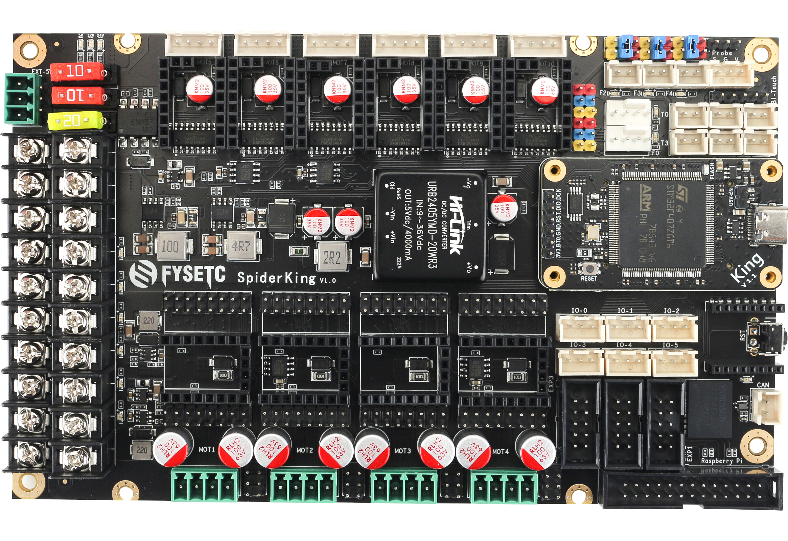
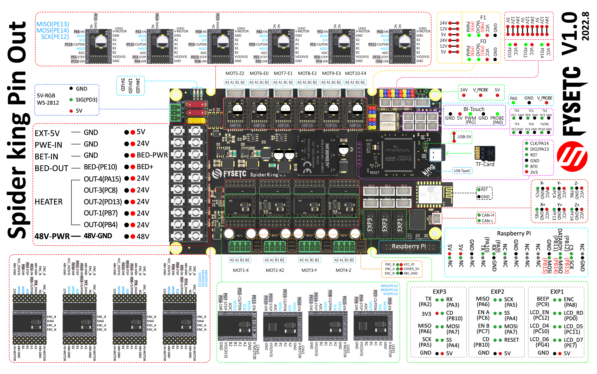
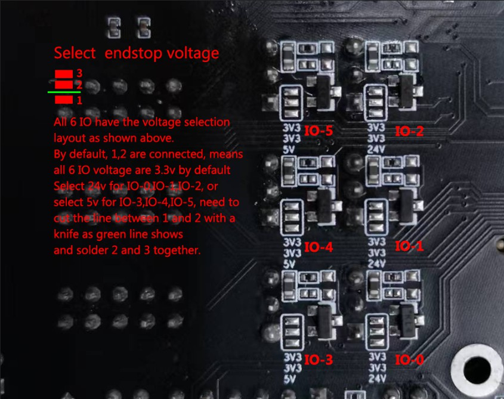
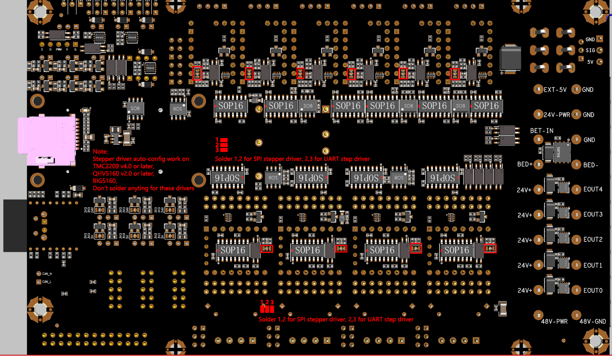
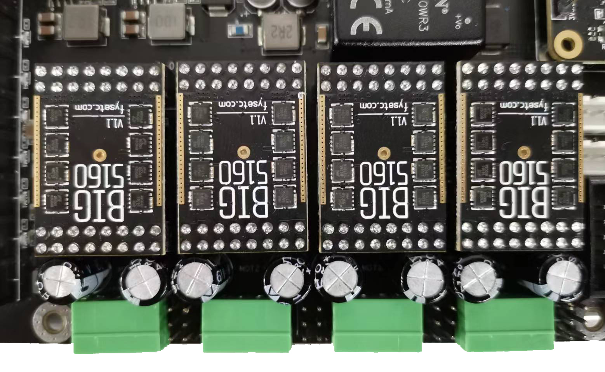
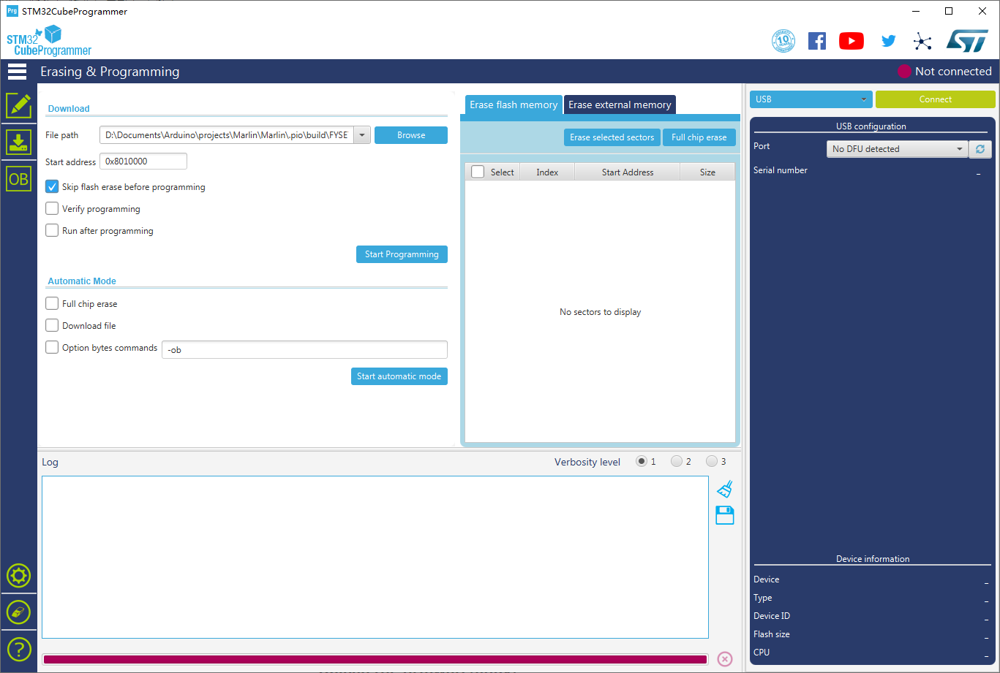

# FYSETC-SPIDER-KING

## 1. Product introduction

10 axis industrial grade 3D printer motherboard



### 1.1 Advantage

1. Replaceable control core:
   It has a replaceable control core(Named 'King' core).You can freely choose between 4xRP2040(King-R) / STM32F446(King-446) / STM32F407(King-407) / STM32H7XX(King-H7xx), and even you can make your own control core(We will open source the interface).

2. Intelligent identification of stepper driver type:
   With an additional MCU, Spider-King can identify the driver type and switch the SPI/UART channel automatically.
   This feature save you time on searching doc of how to set the jumppers, keep you away from borning setting jumppers. No longer has problems with stepper driver setting. (If you want to use this feature, you need our new stepper driver)

3. Multiple firmware support:
   It supports multiple firmwares.You can choose to use Klipper / Marlin 2.0 / Reprap Firmware / GRBL and other firmware according to your preferences and needs.

4. Industrial-grade standard design, 5000V full IO isolation:
   It provides a more secure hardware base: equiped with onboard high-power isolated power supply, and the control core is isolated from all high-voltage peripherals, including stepper motor drive, MOSFET output, high-voltage input signal, CAN bus, etc.

5. 10 way stepper motor drive support:
   Onboard 10 way stepping motor drive socket, 6x 3A max (maximum 35V), 4x 6A max (maximum 55V). Any socket supports SPI / UART / standalone mode.It has a new 6A drive design. It can drive 57 or even 86 step motors without external drive;

6. A variety of communication interfaces support:
   It supports onboard 5000V isolated CAN interface, supports wireless WI-FI interface, supports ESP32 high-speed communication module, supports multiple connection to Raspberry Pi, including UART, SPI and USB.

7. Centralized heat dissipation of heat-generating components:
   We centralized most heating components like 5V power supply, stepper driver in the middle area of the board, this area can be covered with the 12CM fan for cooling. You don't need to rack your brains to design the air duct, you can get better and more stable output performance.

8. Compatible with RRF firmware standard socket design:
   The socket layout is set according to Duet wiring and layout, which is more convenient to use the RRF. And more, we adds two DUET type fan ports which have feedback signal.

9. All Solid Capacitors: Power Section：
   It can provide more stable power supply and higher efficiency.

10. Compact Design:
    It has a very small size of 177mm*108mm, realizes multiple MOSFET outputs, and supports up to 10 stepper drivers.

## 2. Hardware Guide

### 2.1 Pin definition

<table>
   <tr><td>Features</td><td>Spider Pin</td><td>STM32 Pin</td><td>Pin No.</td><td>Comment</td></tr>
   <tr><td rowspan="4">X-MOTOR(1)</td><td>X-Step</td><td>PG7</td><td>92</td><td></td></tr>
   <tr><td>X-DIR</td><td>PG6</td><td>91</td><td></td></tr>
   <tr><td>X-EN</td><td>PE11</td><td>64</td><td></td></tr>
   <tr><td>X-CS/PDN</td><td>PD2</td><td>116</td><td></td></tr>
   <tr><td rowspan="4">X2-MOTOR(2)</td><td>X2-Step</td><td>PD11</td><td>80</td><td></td></tr>
   <tr><td>X2-DIR</td><td>PD10</td><td>79</td><td></td></tr>
   <tr><td>X2-EN</td><td>PG10</td><td>125</td><td></td></tr>
   <tr><td>X2-CS/PDN</td><td>PE15</td><td>68</td><td></td></tr>
   <tr><td rowspan="4">Y-MOTOR(3)</td><td>Y-Step</td><td>PG14</td><td>129</td><td></td></tr>
   <tr><td>Y-DIR</td><td>PG12</td><td>127</td><td></td></tr>
   <tr><td>Y-EN</td><td>PG15</td><td>132</td><td></td></tr>
   <tr><td>Y-CS/PDN</td><td>PD8</td><td>77</td><td></td></tr>
   <tr><td rowspan="4">Z-MOTOR(4)</td><td>Z-Step</td><td>PD4</td><td>118</td><td></td></tr>
   <tr><td>Z-DIR</td><td>PD6</td><td>122</td><td></td></tr>
   <tr><td>Z-EN</td><td>PD5</td><td>119</td><td></td></tr>
   <tr><td>Z-CS/PDN</td><td>PD7</td><td>123</td><td></td></tr>
   <tr><td rowspan="4">Z2-MOTOR(5)</td><td>Z2-Step</td><td>PE5</td><td>4</td><td></td></tr>
   <tr><td>Z2-DIR</td><td>PC13</td><td>7</td><td></td></tr>
   <tr><td>Z2-EN</td><td>PE6</td><td>5</td><td></td></tr>
   <tr><td>Z2-CS/PDN</td><td>PC14</td><td>8</td><td></td></tr>
   <tr><td rowspan="4">E0-MOTOR(6)</td><td>E0-Step</td><td>PE3</td><td>2</td><td></td></tr>
   <tr><td>E0-DIR</td><td>PE4</td><td>3</td><td></td></tr>
   <tr><td>E0-EN</td><td>PE2</td><td>1</td><td></td></tr>
   <tr><td>E0-CS/PDN</td><td>PC15</td><td>9</td><td></td></tr>
   <tr><td rowspan="4">E1-MOTOR(7)</td><td>E1-Step</td><td>PG13</td><td>128</td><td></td></tr>
   <tr><td>E1-DIR</td><td>PG8</td><td>93</td><td></td></tr>
   <tr><td>E1-EN</td><td>PG9</td><td>124</td><td></td></tr>
   <tr><td>E1-CS/PDN</td><td>PG3</td><td>88</td><td></td></tr>
   <tr><td rowspan="4">E2-MOTOR(8)</td><td>E2-Step</td><td>PE1</td><td>142</td><td></td></tr>
   <tr><td>E2-DIR</td><td>PE0</td><td>141</td><td></td></tr>
   <tr><td>E2-EN</td><td>PB2</td><td>48</td><td></td></tr>
   <tr><td>E2-CS/PDN</td><td>PD9</td><td>78</td><td></td></tr>
   <tr><td rowspan="4">E3-MOTOR(9)</td><td>E3-Step</td><td>PF4</td><td>14</td><td></td></tr>
   <tr><td>E3-DIR</td><td>PF3</td><td>13</td><td></td></tr>
   <tr><td>E3-EN</td><td>PF2</td><td>12</td><td></td></tr>
   <tr><td>E3-CS/PDN</td><td>PF5</td><td>15</td><td></td></tr>
   <tr><td rowspan="4">E4-MOTOR(10)</td><td>E4-Step</td><td>PF15</td><td>55</td><td></td></tr>
   <tr><td>E4-DIR</td><td>PG0</td><td>56</td><td></td></tr>
   <tr><td>E4-EN</td><td>PG5</td><td>90</td><td></td></tr>
   <tr><td>E4-CS/PDN</td><td>PG11</td><td>126</td><td></td></tr>
   <tr><td rowspan="3">TMC Driver SPI (SOFT)</td><td>MOSI</td><td>PE14</td><td>67</td><td></td></tr>
   <tr><td>MISO</td><td>PE13</td><td>66</td><td></td></tr>
   <tr><td>SCK</td><td>PE12</td><td>65</td><td></td></tr>
   <tr><td rowspan="7">End-stops</td><td>X-MIN</td><td>PC5</td><td>45</td><td></td></tr>
   <tr><td>X-MAX</td><td>PB5</td><td>135</td><td></td></tr>
   <tr><td>Y-MIN</td><td>PC4</td><td>44</td><td></td></tr>
   <tr><td>Y-MAX</td><td>PF13</td><td>53</td><td></td></tr>
   <tr><td>Z-MIN</td><td>PB6</td><td>136</td><td></td></tr>
   <tr><td>Z-MAX</td><td>PF14</td><td>54</td><td></td></tr>
   <tr><td>Probe</td><td>PA0</td><td>34</td><td></td></tr>
<tr><td rowspan="7">DIAG</td><td>DIAG-1</td><td>PF6</td><td>18</td><td></td></tr>
   <tr><td>DIAG-2</td><td>PF7</td><td>19</td><td></td></tr>
   <tr><td>DIAG-3</td><td>PF8</td><td>20</td><td></td></tr>
   <tr><td>DIAG-4</td><td>PF11</td><td>49</td><td></td></tr>
   <tr><td>DIAG-5</td><td>PF12</td><td>50</td><td></td></tr>
   <tr><td>DIAG-6</td><td>PA14/SWCLK</td><td>109</td><td></td></tr>
   <tr><td>DIAG-7</td><td>PA13/SWDIO</td><td>105</td><td></td></tr>
<tr><td rowspan="9">FAN/RGB<tr><td rowspan="2">FAN0</td><td>PWM-(PE8)</td><td>59</td></tr></td></tr>
   <tr><td>TACHO-(PB1)</td><td>47</td><td></td></tr>
   <tr><td rowspan="2">FAN1</td><td>PWM-(PE9)</td><td>60</td></tr></td></tr>
   <tr><td>TACHO-(PB7)</td><td>137</td><td></td></tr>
   <tr><td>FAN2</td><td>PD15</td><td>86</td><td></td></tr>
   <tr><td>FAN3</td><td>PD12</td><td>81</td><td></td></tr>
   <tr><td>FAN4</td><td>PD14</td><td>85</td><td></td></tr>
   <tr><td>5V-LED(WS2812)</td><td>PD3</td><td>117</td><td>Share with Debug Led</td></tr>
   <tr><td rowspan="6">Heating</td><td>E0-Heater</td><td>PB4</td><td>134</td><td></td></tr>
   <tr><td>E1-Heater</td><td>PB0</td><td>46</td><td></td></tr>
   <tr><td>E2-Heater</td><td>PD13</td><td>82</td><td></td></tr>
   <tr><td>E3-Heater</td><td>PC8</td><td>98</td><td></td></tr>
   <tr><td>E4-Heater</td><td>PA15</td><td>110</td><td></td></tr>
   <tr><td>Heated-Bed</td><td>PE10</td><td>63</td><td></td></tr>
   <tr><td rowspan="6">Temperature</td><td>TE0（THERM0）</td><td>PC1</td><td>27</td><td>A 4.7kOhm 0.1% temperature sensor pull up resistor is used,PT1000 can be connected directly. For PT100, an amplifier board must be used.</td></tr>
   <tr><td>TE1（THERM1）</td><td>PF9</td><td>21</td><td>Same as TE0.</td></tr>
   <tr><td>TE2（THERM2）</td><td>PC3</td><td>29</td><td>Same as TE0.</td></tr>
   <tr><td>TE3（THERM3）</td><td>PC2</td><td>28</td><td>Same as TE0.</td></tr>
   <tr><td>TE4（THERM4）</td><td>PC0</td><td>26</td><td>Same as TE0.</td></tr>
   <tr><td>TB（THERM5）</td><td>PF10</td><td>22</td><td>Same as TE0.</td></tr>
   <tr><td rowspan="2">CAN</td><td>TX</td><td>PB9/SDA1/CAN_TX</td><td>140</td><td></td></tr>
   <tr><td>RX</td><td>PB8/SCL1/CAN_RX</td><td>139</td><td></td></tr>
   <tr><td rowspan="8">EXP1</td><td>LCD_D7</td><td>PE7</td><td>58</td><td></td></tr>
   <tr><td>LCD_D6</td><td>PG4</td><td>81</td><td></td></tr>
   <tr><td>LCD_D5</td><td>PC11/MISO3/RX3/4</td><td>112</td><td></td></tr>
   <tr><td>LCD_D4</td><td>PC10/SCK3/TX3/4</td><td>111</td><td></td></tr>
   <tr><td>LCD_EN</td><td>PC12/MOSI3/TX5/SDA2</td><td>113</td><td></td></tr>
   <tr><td>LCD_RS</td><td>PD0/CAN-RX1</td><td>114</td><td></td></tr>
   <tr><td>ENC_C</td><td>PA8/SCL3</td><td>100</td><td></td></tr>
   <tr><td>BEEP</td><td>PC9/SDA3</td><td>99</td><td></td></tr>
   <tr><td rowspan="8">EXP2</td><td>RESET</td><td>NRST</td><td>25</td><td></td></tr>
   <tr><td>ENC_A</td><td>PC6/TX6</td><td>96</td><td></td></tr>
   <tr><td>ENC_B</td><td>PC7/RX6</td><td>97</td><td></td></tr>
   <tr><td>SD-DET</td><td>PB10/SCL2</td><td>69</td><td></td></tr>
   <tr><td>SD-MISO</td><td>PA6/MISO1</td><td>42</td><td></td></tr>
   <tr><td>SD-MOSI</td><td>PA7/MOSI1</td><td>43</td><td></td></tr>
   <tr><td>SCK</td><td>PA5/SCK1</td><td>41</td><td></td></tr>
   <tr><td>CS</td><td>PA4/CS1</td><td>40</td><td></td></tr>
   <tr><td rowspan="7">EXP3</td><td>SD-DET</td><td>PB10/SCL2</td><td>69</td><td></td></tr>
   <tr><td>SD-MISO</td><td>PA6/MISO1</td><td>42</td><td></td></tr>
   <tr><td>SD-MOSI</td><td>PA7/MOSI1</td><td>43</td><td></td></tr>
   <tr><td>SCK</td><td>PA5/SCK1</td><td>41</td><td></td></tr>
   <tr><td>CS</td><td>PA4/CS1</td><td>40</td><td></td></tr>
   <tr><td>TX</td><td>PA2/TX2</td><td>36</td><td></td></tr>
   <tr><td>RX</td><td>PA3/RX2</td><td>37</td><td></td></tr>
   <tr><td rowspan="2">EEPROM(4K) I2C Pin-Out</td><td>SCL</td><td>PF1/SCL2</td><td>11</td><td>Connect to 24LC32(4K EEPROM)</td></tr>
   <tr><td>SDA</td><td>PF0/SDA2</td><td>10</td><td>Connect to 24LC32(4K EEPROM)</td></tr>
   <tr><td rowspan="7">Raspberry Pi</td><td>TX</td><td>PA10/RX1</td><td>102</td><td></td></tr>
   <tr><td>RX</td><td>PA9/TX1</td><td>101</td><td></td></tr>
   <tr><td>MOSI</td><td>PB15</td><td>76</td><td></td></tr>
   <tr><td>MISO</td><td>PB14</td><td>75</td><td></td></tr>
   <tr><td>SCK</td><td>PB13</td><td>74</td><td></td></tr>
   <tr><td>CS</td><td>PB12</td><td>73</td><td></td></tr>
   <tr><td>DATA_RDY</td><td>PB11</td><td>70</td><td></td></tr>
   <tr><td rowspan="2">SWD Debug</td><td>SWDIO</td><td>PA13</td><td>105</td><td>only used for debugging now and can be used for other purposes.</td></tr>
   <tr><td>SWCLK</td><td>PA14</td><td>109</td><td>only used for debugging now and can be used for other purposes.</td></tr>
</table>

### 2.2 Pinout diagram



If the pic is not clear enough, please check the .pdf and .svg file on our [github](https://github.com/FYSETC/FYSETC-SPIDER-KING/blob/main/Spider_King_V1.0_Pinout.pdf) or  [国内](http://git.t.ecoaas.com/FYSETC/FYSETC-SPIDER-KING/blob/main/Spider_King_V1.0_Pinout.pdf).

### 2.3 Endstop voltage selection



### 2.4 Stepper drivers guide



Check the clear picture on our [GitHub](https://github.com/FYSETC/FYSETC-SPIDER-KING/blob/main/images/StepperDriver-SPI-UART.jpg) or [国内](http://git.t.ecoaas.com/FYSETC/FYSETC-SPIDER-KING/blob/main/images/StepperDriver-SPI-UART.jpg).

#### 2.4.1 Big5160 install



## 3. OS Guide

### 3.1 SAMFi-OS

Check details on [github](https://github.com/FYSETC/FYSETC-SAMFi-OS) or [国内]([FYSETC/FYSETC-SAMFi-OS - FYSETC-SAMFi-OS - Ecoaas Git](http://git.t.ecoaas.com/FYSETC/FYSETC-SAMFi-OS)).

### 3.2 MainsailOS

Check details [here](https://docs.mainsail.xyz/setup/mainsail-os).

### 3.3 Fluidd

Check details [here](https://docs.fluidd.xyz/).

### 3.4 OctoPi

Check details [here](https://octoprint.org/download/).

## 4. Firmware Guide

Spider-King support Marlin firmware, Klipper firmware and RRF firmware. Choose one you need.

### 4.1 Marlin

#### 4.1.1 Download Vscode + platformio

To compile the firmware , you need to install Visual Studio Code and the platformio pulg-in. More Marlin firmware details, please visit Marlin firmware official website [here](https://marlinfw.org/).

#### 4.1.2 Download firmware

The Marlin firmware is in the `firmware/Marlin` folder in git repository [GitHub](https://github.com/FYSETC/FYSETC-SPIDER-KING/tree/main/firmware/Marlin) or [国内](http://git.t.ecoaas.com/FYSETC/FYSETC-SPIDER-KING/tree/main/firmware/Marlin), you can also get the firmware from latest [Marlin bugfix-2.1.x branch](https://github.com/MarlinFirmware/Marlin/tree/bugfix-2.1.x). 

Step 1: you need to enable following define in `configuration.h` file.

```
#define MOTHERBOARD BOARD_FYSETC_SPIDER_KING407
#define SERIAL_PORT -1
```

Step 2: then we need to change `platformio.ini` file

`default_envs = FYSETC_SPIDER_KING407`

#### 4.1.3 Compile the firmware

Open Vscode and open platformio main page and click the "Open Project" button , and direct to the folder where you put your firmware.

If everything goes fine , at the bottom you can see several buttons

The check mark button is for compiling , click it to compile. You can find built `firmware.bin` at `.pio\build\FYSETC_SPIDER_KING407 folder.`

#### 4.1.4 Upload firmware

Follow Firmware Update guide [here](#jump0).

### 4.2 Klipper

We put Klipper related files like `printer.cfg` in `firmware/Klipper` folder in github repo.

If you want to use Klipper. You need to follow the Klipper [installation guide](https://www.klipper3d.org/Installation.html) to install [Klipper](https://github.com/KevinOConnor/klipper) first. When we try to compile it, we need to call `make menuconfig` to choose compile options, please select options for Spider King as below describe.

#### 4.2.1 menuconfig

Please choose these options for Spider King, you need to decide which to choose according to your board and wiring on some options.

- ##### Enable `extra low-level configuration options`

- ##### Micro-controller Architecture

Select `STMicroelectronics STM32`

- ##### Processor model

Select `STM32F407`

- ##### Clock reference

Select `8 MHz crystal`

- ##### Bootloader offset

Choose `32kiB bootloader`. 

*Note: If your bootloader crashed, you need to follow the `5.Bootloader Guide`  character to flash the spider king bootloader.*

- ##### Communication interface

You have two choices here, if you use USB cable to connect RaspeberryPI and Spider King, you need to follow `1. USB (on PA11/PA12)` below. If you use serial to connect RaspberryPI and Spider King, then check `2. Serial (on USART1 PA10/PA9)`.

- ###### 1. USB (on PA11/PA12)

If you want to connect Spider King to RaspberryPI with USB cable. You need to select `USB (on PA11/PA12)`

And in `printer.cfg` file, you need to set the `serial` as below. We provide an example cfg file `printer.cfg` for VORON 2 machine [here](https://github.com/FYSETC/FYSETC-SPIDER-KING/tree/main/firmware/Klipper) or [国内](http://git.t.ecoaas.com/FYSETC/FYSETC-SPIDER-KING/blob/main/firmware/Klipper/printer.cfg).

```
Obtain definition by "ls -l /dev/serial/by-id/" then unplug to verify
##--------------------------------------------------------------------
serial: /dev/serial/by-id/usb-Klipper_stm32f446xx_230032000851363131363530-if00
```

- ###### 2. Serial (on USART1 PA10/PA9)

If you want to connect Spider King UART1(RX1:PA10, TX1:PA9) port to RPI uart0(TX:GPIO14,RX:GPIO15) port, you need to select `Serial (on USART1 PA10/PA9)`

In `printer.cfg` file, you need to uncomment the following line as our example `printer.cfg` file here ([github](https://github.com/FYSETC/FYSETC-SPIDER-KING/tree/main/firmware/Klipper) [国内](http://git.t.ecoaas.com/FYSETC/FYSETC-SPIDER-KING/blob/main/firmware/Klipper/printer.cfg)) do, if your cfg file don't have this line, please add it.

```
serial: /dev/ttyAMA0
```

Besides this make option, you still need to follow the instructions in `Connect RPI uart.md` file, you can find the file [github](https://github.com/FYSETC/FYSETC-SPIDER/blob/main/firmware/Klipper/Connect%20RPI%20uart.md) [国内](http://git.t.ecoaas.com/FYSETC/FYSETC-SPIDER-KING/blob/main/firmware/Klipper/Connect%20RPI%20uart.md).

#### 4.2.2 Compile firmware

```
make
```

#### 4.2.3 Upload firmware

Follow Firmware Update guide [here](#jump0).

### 4.3 RRF

Spider King is originally supported by teamgloomy‘s RRF firmware from version 3.4.2rc2 [Releases · gloomyandy/RepRapFirmware · GitHub](https://github.com/gloomyandy/RepRapFirmware/releases). Check the document [here](https://teamgloomy.github.io/fysetc_spider_king_407_general.html).

### 4.4 Firmware Upload

We provide several methods to upload the firmware including SDCARD, dfu-util, DFU and platformio.

#### 4.4.1 Upload the firmware(SDCARD)

Uploading firmware using SD card is our default way to update the firmware as Spider King already has stock bootloader. 

Steps: 

1. Copy your compiled firmware file `firmware.bin`(If you use klipper firmware, you need to rename `klipper.bin` to `firmware.bin`) file to the SD card

2. Insert it to the SD card slot which is at the right side of the board

3. Then power on the board. 

4. You may need to wait for about 30s to finish uploading.

**Note: If you once upload the firmware to Spider King flash address `0x08000000`, then the stock bootloader will be gone, you need to upload the bootloader yourself, please follow the `5.Bootloader Guide` chacter to upload the bootloader.**

#### 4.4.2 Upload the firmware(dfu-util)

This method works in linux, that means should work in raspberry pi.

##### Step 1. Enter DFU mode first

1. First power off the board

2. Make sure no jumper on 5V and U5V-EN(On KING core board)

3. Place jumper on BT0 to 3V3 pin (On KING core board)

4. Connect USB cable to the KING core board and your computer (If you use raspberry pi to upload firmware, connect USB cable to your raspberry pi)

5. Power on the board with 24v PSU
   
   Now the board is in DFU mode. If not, click the reset button. Also you can power on the board with USB 5v, but you need to set jumper on 5V and U5V-EN on KING core board ,check the silkscreen lable on the KING core board, and remember to remove it after you finish uploading.
   
   ***REMEMBER to remove BT0 jumper if you finish uploading firmware or it will enter DFU mode again.***

##### Step 2. Install dfu-util

Make sure dfu-util is installed, shoot `dfu-util --version` command to check.

Sample output:

```
dfu-util 0.9

Copyright 2005-2009 Weston Schmidt, Harald Welte and OpenMoko Inc.
Copyright 2010-2016 Tormod Volden and Stefan Schmidt
This program is Free Software and has ABSOLUTELY NO WARRANTY
Please report bugs to http://sourceforge.net/p/dfu-util/tickets/
```

If not , you should install it first, use the package manager of your distribution to get the latest version, like

```
sudo apt-get install dfu-util
```

##### Step 3. Use command to upload firmware

Then use the command below to upload the firmware. You should replace `firmware.bin` below with your built firmware bin(or hex) file location like `out/klipper.bin`. 

```
dfu-util -R -a 0 -s 0x08008000:leave -D firmware.bin
```

#### 4.4.3 Upload the firmware(DFU)

This method only works in WINDOWS OS.

##### Step 1. Download stm32cubeprogrammer

You can download it from ST website [STM32CubeProg](https://www.st.com/zh/development-tools/stm32cubeprog.html). Then install and open the STM32CubeProgrammer software.



##### Step 2. Enter DFU mode

- First power off the board

- Make sure no jumper on 5V and U5V-EN(On KING core board)

- Place jumper on BT0 to 3V3 pin (On KING core board)

- Connect USB cable to the KING core board and your computer (If you use raspberry pi to upload firmware, connect USB cable to your raspberry pi)

- Power on the board with 24v PSU
  
  Now the board is in DFU mode. If not, click the reset button. Also you can power on the board with USB 5v, but you need to set jumper on 5V and U5V-EN on KING core board, check the silkscreen lable on the KING core board, and remember to remove it after you finish uploading.
  
  ***REMEMBER to remove BT0 jumper if you finish uploading firmware or it will enter DFU mode again.***

##### Step 3. Upload the firmware

Now you can connect and flash the Spider board with stm32cubeprogrammer with the following operation.

Do as the red number shows in the screen shot.

1. Click the button to find the DFU port.
2. Connect the DFU
3. Choose the "firmware.bin" file. (or .hex file).
4. Fill in the 'Start address' `0x08008000`.
5. Start Programming

#### 4.4.4 Upload the firmware(platformio)

If you compile Marlin yourself with platformio,you can follow the instructions below to upload the firmware.

##### Step 1. Enter DFU mode first

- First power off the board

- Make sure no jumper on 5V and U5V-EN(On KING core board)

- Place jumper on BT0 to 3V3 pin (On KING core board)

- Connect USB cable to the KING core board and your computer (If you use raspberry pi to upload firmware, connect USB cable to your raspberry pi)

- Power on the board with 24v PSU
  
  Now the board is in DFU mode. If not, click the reset button. Also you can power on the board with USB 5v, but you need to set jumper on 5V and U5V-EN on KING core board, check the silkscreen lable on the KING core board, and remember to remove it after you finish uploading.
  
  ***REMEMBER to remove BT0 jumper if you finish uploading firmware or it will enter DFU mode again.***

##### Step 2. Click the upload button to upload firmware

## 5. STLs

We have upload some STLs for some 3D printers, like Voron: [holder](https://github.com/FYSETC/FYSETC-SPIDER-KING/tree/main/STLs).
