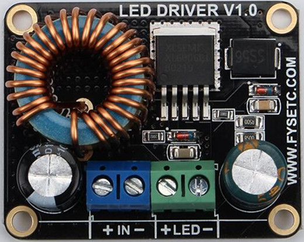
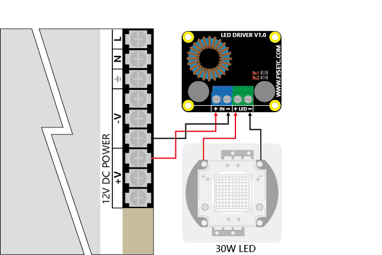
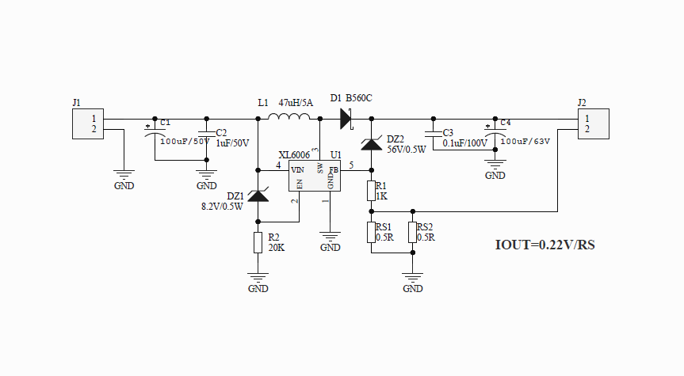
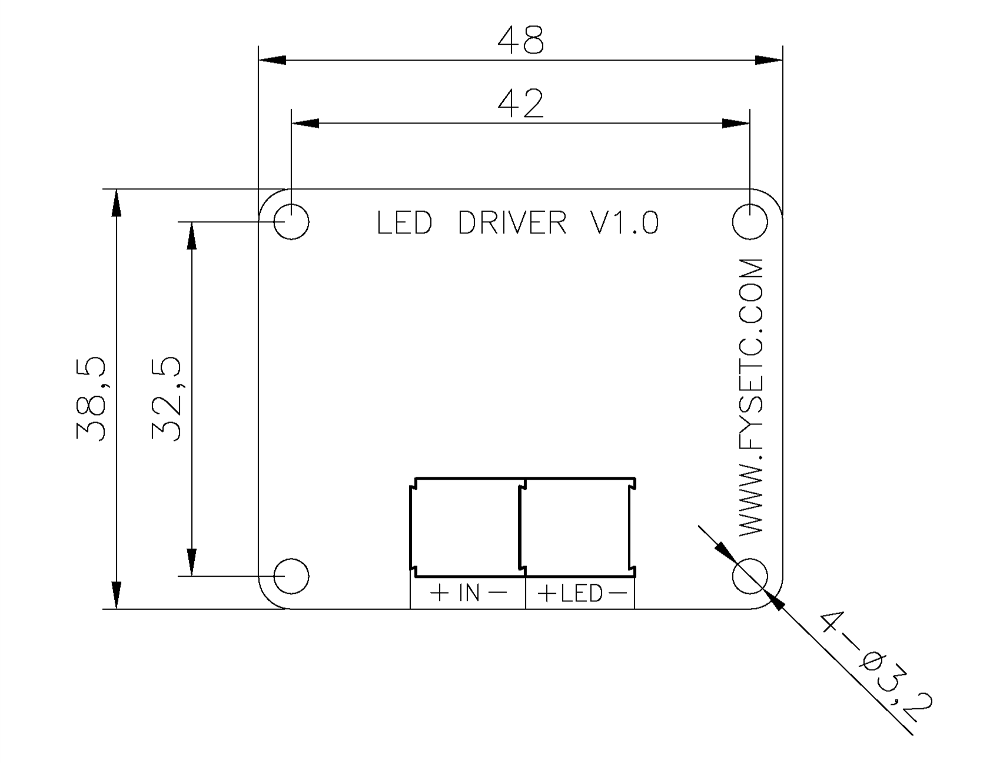

## Product Introduction
---

FYS Boost LED Driver is an economical and easy to use driver with a maximum output of 60V/5A (requires you to replace the Rs resistor). By default, a 900mA ± 5% current output is available for 30W LEDs (10 parallel 3 series) modules.

## Features
---

- Wide 5V to 32V Input Voltage Range
- Maximum Boost Output Up to 60V
- 0.22V FB adjustable LED drive current
- Max. 5A Switching Current Capability
- Up to 93% efficiency
- Excellent line and load regulation
- Thermal Shutdown Function
- Built in Current Limit Function

## Applications
---

- LED Lighting 
- Boost constant current driver
- TFT LED Backlighting

## Typical Application Circuit
---

## Attention
---

- The board will be fever during use (about 60 °C at 900 mA), which is normal and need not be worried;
- Do not connect the positive and negative poles of the board input and output, otherwise it will damage the board;
- If a higher current is required, please follow the part of FAQ. Larger currents will cause the board to heat up, requiring good heat dissipation conditions, such as sticking heatsinks and adding fans.
- The power of the drive is greater than the power required by the LED, and the LED will flash brightly;
- The power of the drive is less than the power required by the LED, and the LED will flash dimly or not;
- The company is not responsible for any damage or loss caused by the private modification of the board.

## FAQ
---

!!! question "How to change to a larger current output manually?"
    If you want to change to other current outputs:
    1. you need to have the soldering tool and the corresponding soldering skills; 
    2. you need 1 or 2 1206 resistors, the resistance can be based on Iout = 0.22/Rs; 
    3. you only need Remove the two resistors labeled Rs on the board and replace them with the resistors you need for the current output.

## Attachments
---

###  Schematic

### Dimensions

## Shop
---
- [FYS Boost LED Driver V1.0](https://www.aliexpress.com/store/product/DLP-Boost-LED-drive-board-60V-5A-30W-Constant-Current-Driver-for-LED-Lighting-TFT-Backlighting/3480083_32905681524.html)

## Tech Support

---
Please submit any technical issue into our [forum](http://forum.fysetc.com/) 