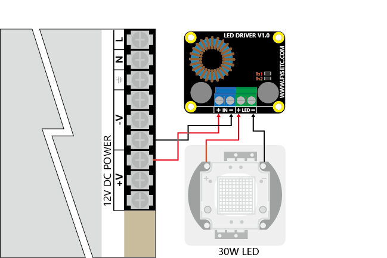
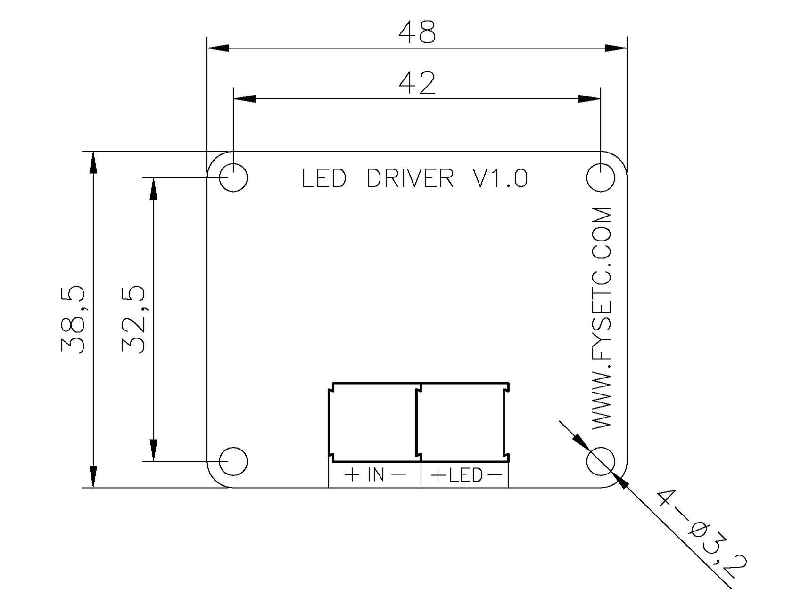

## 产品简介
---

FYS Boost LED Driver 是一款经济且易于使用的驱动器，最高输出可达60V/5A（需要您动手更换Rs电阻）。默认情况下，提供900mA±5%的电流输出，可以用于30W LED（10串3并）模组。

## 主要功能
---

* 输入电压：DC 5V - 32V
* 输出电压：26V - 36V
* 输出电流：900mA ± 5%
* 转换效率：93% max
* 产品尺寸：48mm X 38.5mm X18mm
* 工作温度：-20℃ ~ +80℃
* 其他功能：过温保护，过流保护

## 应用场合
---

* LED照明
* 提升恒流驱动器
* TFT LED背光

## 典型应用接线
---

## 使用注意事项
---

* 板子在使用期间会有发热（900mA时，大约60℃），属于正常现象，无需担心；
* 板子输入和输出正负极请勿接反，否则会损坏板子；
* 如果需要更高的电流，请按照使用说明进行更改，更大的电流会导致板发热，需要好的散热条件，比如粘贴散热片以及增加风扇；
* 驱动的功率大于LED需要的功率，LED会明亮的一闪一闪；
* 驱动的功率小于LED需要的功率，LED会暗淡的一闪一闪或者不亮；
* 任何对板子的私自改装造成的损坏和损失，本公司概不负责。

## FAQ：
---

!!! question "如何手动更改为更大的电流输出?"
    如果你想更改为其他电流输出，首先，你需要有焊接的工具和对应的焊接技能；其次你需要1或者2颗1206电阻，其阻值可以根据Iout = 0.22/Rs 得来；最后你只需要将板子上标记为Rs的两个电阻拆下，换成你所需要的电流输出所对应的电阻即可。

## 附件：
---

### 原理图

### 尺寸图

## 商店
---

- [FYS Boost LED Driver V1.0](https://www.aliexpress.com/store/product/DLP-Boost-LED-drive-board-60V-5A-30W-Constant-Current-Driver-for-LED-Lighting-TFT-Backlighting/3480083_32905681524.html)

## 技术支持
---
请将任何技术问题提交到我们的[论坛](http://forum.fysetc.com/)