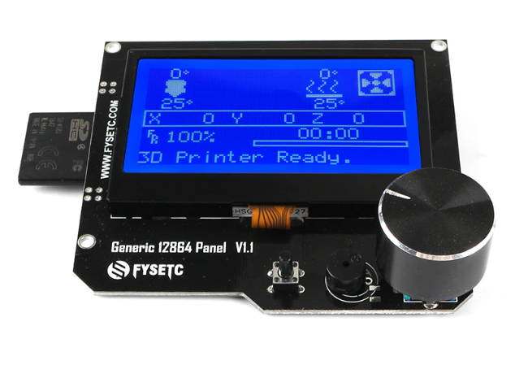
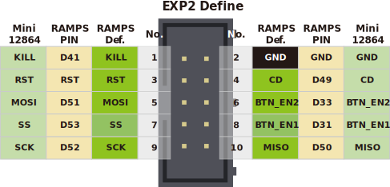

## 1. Product Introduction




This is a opensouce, cheap, with RGB indicator, common to marlin's display, supports offline printing, resolution is 12864, display area is 3.2'', SD card holder can be side or vertical, Dimensional compatible with REPRAP_DISCOUNT_FULL_GRAPHIC_SMART_CONTROLLER, Software compatible with MINIPANEL in marlin firmware.

Available in a single backlight color version, also available in RGB backlight (NEOPIXEL_LED)version.Choose according to your preferences！

## 2. Features

- 3.2" inch high contrast Graphic LCD,Dimensional compatible with REPRAP_DISCOUNT_FULL_GRAPHIC_SMART_CONTROLLER
- Black-gray/black-green/white-black/white-blue/green-black, 5 display styles
- SPI communication to host micro-controller
- Support Vertical or side SD slot with card detect,with a optional  SD module
- Software configurable contrast setting
- 3D printable case and mount STL file 
- Configurable RGB backlight, WS2811 single line control.
- Black background or transparent backgroun.
- The extra EXP3 is 1284P or a motherboard that requires a single display function.

## 3. Application

3D printer，CNC machines ，Other micro controller projects

## 4. Typical  Wiring





## 5. Firmware config

The back light control pin is at EXP1_04.

### 5.1 Marlin

Only need to enable the following define

```
#define FYSETC_GENERIC_12864_1_1 // Larger display with basic ON/OFF backlight.
```

### 5.2 Klipper

-TBD-

## 6. Optional Hardware module:

The SD card of mini12864 can be  set on the side or in the front,  which requires a module to implement. As shown below:


## 7. Attention

-TBD-

## 8. FAQ

-TBD-

## 9. Attachments
### 9.1 Schematic
You can find the schematics for the three versions on [github](https://github.com/FYSETC/Generic-12864-panel).
### 9.2 Dimensions
**For detailed dimensions please check dwg/step file on [github](https://github.com/FYSETC/Generic-12864-panel).**
## Shop
- [Gineric 12864_LCD]( https://www.aliexpress.com/item/33029483516.html )
## Tech Support
Please submit any technical issue into our [forum](http://forum.fysetc.com/) or [facebook](https://www.facebook.com/groups/197476557529090/).

