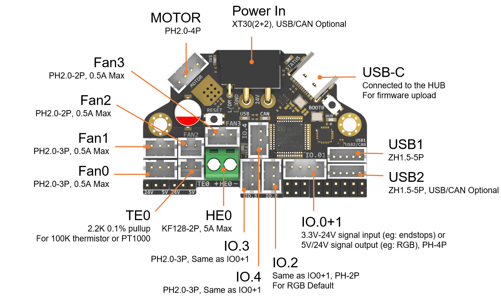
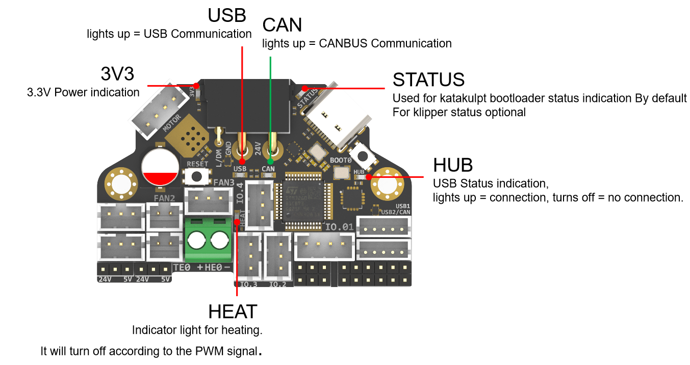
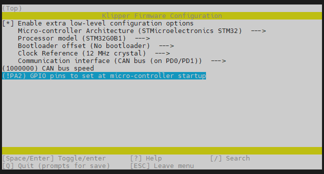
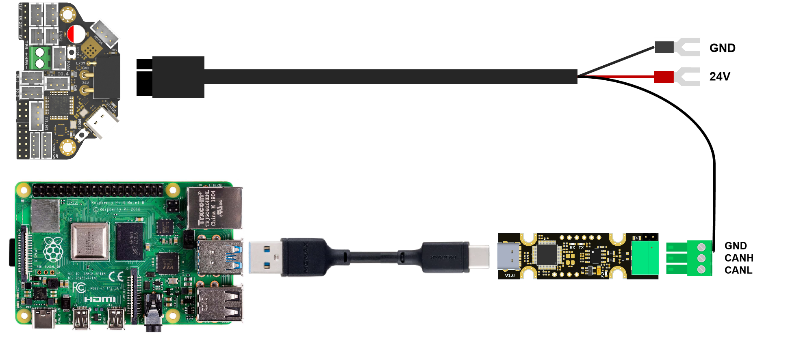
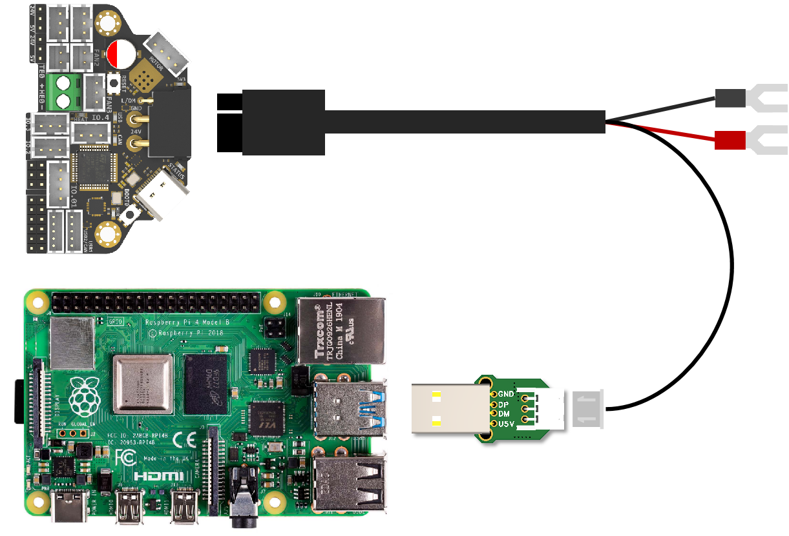
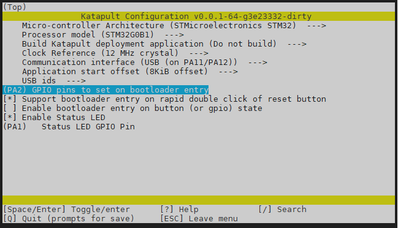
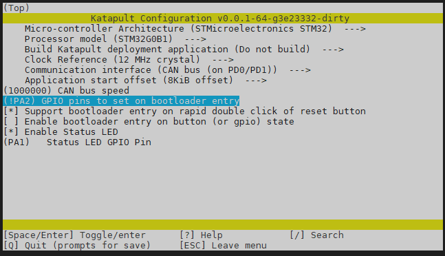
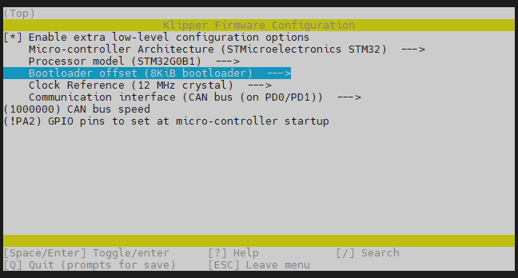
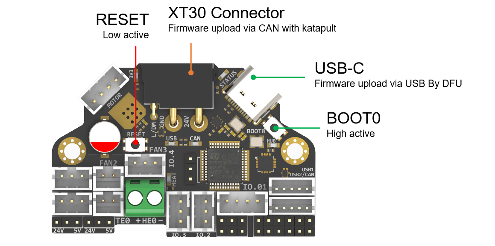

# H36 Combo V1

<p style="text-align:center;"></p>

# Introduction

H36 Combo V1 is a newly designed **high temperature** tool board running Klipper firmware. Based on STMG0B1T3, the maximum operating temperature can reach **125 degrees Celsius (CAN only)**. It also provides two communication methods: CANBUS and USB. The onboard USBHUB has up to two USB interfaces (or one CAN and one USB), which can be used to connect to the IDM Scanner Leveling Sensor camera, etc.

# Featrues

- STM32G0B1T3 MCU, **up to 125 degrees Celsius,** supports Klipper Firmware
- 6-layer PCB design, all solid capacitors and tantalum capacitors, better heat dissipation
- Onboard IO controlled CAN/USB switch,
- Onboard RESET and BOOT0 buttons for easy firmware update
- Fan control/heating both use independent high-power MOS, safer and lower heat generation
- Onboard 5V@3A DC-DC, 5V peak load can reach 15W
- XT30 interface, custom cable comes with the board
- Onboard USB2.0 HUB, 3x USB2.0 interface (one of which is connected to MCU)
- Support CAN / USB2.0 connection
- Onboard TMC2209
- 3x 3pin Fans, 3x IO with level converter, 1x RGB,1x Heat, 1x thermistor,1x status LED
- ADXL345 Accelerometer onboard
- USB-C onboard for Firmware update

# Application

Print Head with NEMA14/36mm Motor

# Hardware specification


| Function                | H36 Combo V1                                    | SB Combo V2                                                | SB TH CAN V1.3     |
| ------------------------- | ------------------------------------------------------------ | -------------------- | ------------------------- |
| Microcontroller         | STM32G0B1T3                                   | STM32F072CBT6                                              | STM32F072CBT6      |
| Accelerometer           | ADXL345                                             | ADXL345                                                    | ADXL345            |
| USB Port                | 2 + 1 (For MCU) , Powered by CH334P | 2 + 1 (For MCU) + 1(on aux board), Powered by CH334P | -                  |
| CANBUS | 1 + 1 (For MCU) | 1 + 1 (For MCU) | - |
| Fan                     | 4 (1x2Pin, 3x3Pin)                | 3+2 (on aux board)                                         | 2                  |
| Heating output          | 1                                                         | 1                                                          | 1                  |
| Temperature measurement | 1 (PH2.0 connector) + 1 (on board thermistor) | 1 (PH2.0 connector) + 1 (on board thermistor)              | 1(PH2.0 connector) |
| Voltage monitoring      | 5V, 24V                                             | 5V, 24V                                                    | -                  |
| Motor drive             | TMC2209                                             | TMC2209                                                    | TMC2209            |
| Signal input and output | 5 (PH2.0) + 7 (pin header)                                | 3                                                          | 3                  |
| RGB light strip control | default 2, up to 5                     | 1 + 1 (on aux board)                                       | 1                  |
| Aux Board support       | No                                                      | Yes                                                        | No                 |
| Onboard mounting nut    | No                                                      | Yes                                                        | No                 |

# Operating limits


| **Stepper drivers**           | Up to 2.0A peak current                     |
| ------------------------------- | --------------------------------------------- |
| **Mosfets Outputs**           | HE0 up to 5A , Fan up to 2.5A each          |
| **Input power voltage**       | 11V to 24V for VIN up to 10A                |
| **Inputs/Outputs**            | Signal 20ma maximum, RGB 1.5A total maximum |
| **5V and 3.3V current limit** | 5V@3A ，3.3V@0.8A                           |

# Physical Connections

## Pin Out


``` python
IO.0: PA15
IO.1: PC7 
IO.2: PA8
IO.3/RGB0: PA10
IO.4/RGB1: PB1

FAN0: PA9
FAN0_TACH: PC6 
FAN1: PB15
FAN1_TACH: PB14
FAN2: PB13
FAN3: PA5
FAN3_TACH: PB0

Heat: PA7
Thermistor (2.2k pull up): PA6

Driver_EN: PB7
Driver_DIR: PB8
Driver_STEP: PB9
Driver_UART: PC14
Driver_DIAG: PC15

ADXL345
spi_bus: spi2
adxl345_cs_pin: PB12
adxl345_spi_software_sclk_pin: PB10
adxl345_spi_software_mosi_pin: PB11
adxl345_spi_software_miso_pin: PB2

CAN_RX: PD0
CAN_TX: PD1

5V_Monitor: PA0
24V_MOnitor: PA4
Thermistor next to TMC2209 (4.7k pull up) : PA3

CAN USB switch: PA2
# logic Low = COM to A PORT  CANBUS 
# Logic High = COM to B PORT  USB

```

## Description of Connections：

IO.0 and IO.1 are located in the same connector and can be used as XY endstops, and IO.2 can be used as a probe. In addition, IO.0 - IO.5 have level conversion (with pull-up resistors) , IO.01, IO.2 have voltage selectors (5V or 24V) pin header, IO.3 IO.4 have voltage selectors (5V or 24V) pads. All the IOs can be used as inputs or outputs,  such as RGB ,Servo, Endstops, and can be configured according to your other needs.




| Connector               | Pin                               | Default function                                                                           | Altermate      |
| ------------------------- | ----------------------------------- | --------------------------------------------------------------------------------------------- | ---------------- |
| Power Input            | USB (PA11,PA12)<br>CANBUS (PD0,PD1) | Power and communication input, USB 2.0 and CANBUS are optional, Determined by the level of PA2. |                |
| Fan0                    | PA9                             | Mosfet Output, Printting Fan, Default voltage = VIN.                                       |                |
| Fan1                    | PB15                            | Mosfet Output, Hotend Fan, Default voltage = VIN.                                          |                |
| Fan2                    | PB13                            | Mosfet Output, SB Combo Cooling Fan, Default voltage = VIN.                               |                |
| Fan3 | PA5 |  | |
| IO.0+1                  | PA15, PB15                     | Digital Input, For X Y endstop, Micro switch or Hall  (Pad voltage selector)         | Digital Output |
| IO.2                    | PA8                              | Digital Input, For Z probe, Proximity switch or Klicky, etc. (Pad voltage selector)       | Digital Output |
| IO.3/RGB0           | PA10                           | 5V Digital Output, For WS2812/SK6812 RGB/Servo (Header voltage selector)                 | Digital Input  |
| IO.4/RGB1 | PB1 | 5V Digital Output, For WS2812/SK6812 RGB/Servo (Header voltage selector) | Digital Input |
| USB1                |                                   | USB2.0                                                                                      | J2 |
| USB2/CAN            |                                   | USB2.0 or CANBUS 2.0, USB 2.0 and CANBUS are optional,Determined by the level of PA2. | J1 |
| TE0                     | PA6                               | ADC input, 2.2K pull-up, head temperature measure                                         |                |
| HE0                     | PA7                            | Mosfet Output, Heating rod control, 5A Max                                                 |                |
| MOTOR                   |                                   | For two-phase stepper motor,                                                                |                |
| USB1, USB-C connector   |                                   | Connected to the CH334PHUB chip, up to 4 USB2.0 devices (MCU/USB1/USB2/USB3)                |                |

## LED indications：




| LED name | Indicate                                                                                                                                                                                                                                                                              | Remark |
| ---------- | --------------------------------------------------------------------------------------------------------------------------------------------------------------------------------------------------------------------------------------------------------------------------------------- | -------- |
| 3V3      | Lights up:  Power supply OK.<br>Turns off : Power supply failure. <br>3.3V is obtained by converting 24V to 5V through DC-DC and then to 3.3V through LDO, so there may be a short circuit/open circuit in 24V/5V/3.3V.                                                                  | Red |
| HUB      | Lights up:  The USB has at least one connection. <br/>Turns off:  The USB has no connection.                                                                                                                                                                                        | Red |
| STATUS   | When using katakulpt``- Blinking: Entering download mode;``<br/>Off/Always on: Not in download mode, the status is generally determined by config;<br/>The LED is controlled by PC13 and lights up at a high level. For customized usage, please refer to julianschill/klipper-led_effect | Red |
| HEAT     | Lights up or flashes according to the heating PWM                                                                                                                                                                                                                                     | Red |
| USB      | USB communication Indicate, use "PA2" at the config menu     | Red |
| CAN | CAN communication Indicate, use "!PA2" at the config menu | Green |

## USB / CAN selection

XT30 and USB2/CAN both use CAN to communicate


XT30 and USB2/CAN both use USB to communicate


## Jumpers：

IO.0+1 , IO.2 , Fan0 , Fan1 can select the power supply voltage through the jumper cap.
As shown in the figure, the two pins on the left are connected together for 24V, and the two pins on the right are connected together for 5V.

!!! note

Please note that if these interfaces are used as outputs, the high-level voltage of the output is consistent with the voltage selected by 	the jumper. Please make sure that your peripherals can withstand the range. Generally speaking, only SSR in the accessories of 3D printers 	can withstand 9-36V control voltage.
## Communication

### Connect to Pi

SB combo V2 can be connected to Pi via USB or CANBUS. Select by PA2, refer to USB / CAN selection.

#### Via CAN



Since the Raspberry Pi does not have a CANBUS interface, it is usually connected only after the CANBUS interface is expanded through an expansion chip. Commonly used ones include the MCP2518 SPI to CAN module (CanHat), USB to CAN module (eg: UCAN), Klipper USB to CAN Bridge Mode, and a Linux host computer with a native CAN interface (eg: CM68).

#### Via USB

When using USB connection, you can use the adapter board we provide to directly connect to the USB interface of PI.




# FIrmware Guide

## Firmware configuration and compilation

### With Katapult Bootloader
If you need to use a bootloader, we recommend using katapult, the following is not configured for reference:
For katapult use,refer to: https://github.com/Arksine/katapult

```shell
cd ~/katapult
make menuconfig
make flash FLASH_DEVICE=0483:df11
```





```shell
cd ~/klipper
make menuconfig
make 
cd ~/katapult/scripts
#when use CAN communiction 
python3 flashtool.py -i can0 -f ~/klipper/out/klipper.bin -u <uuid>
#when use USB communiction
python3 flashtool.py -d <serial device> -b <baud_rate>
```



### Klipper with nobootloader 

H36 uses the bootloader-free mode by default, and the configuration is as follows:


## Firmware upload



Before executing the following commands, you need to enter DFU mode before you can compile and burn the firmware. As shown in the figure above, 

- press and hold BOOT0,

- then press the RESET button for one second, 

- then release RESET, 

- wait for 3 seconds, 

- and release BOOT0.

Use " lsusb" to check if a DFU device appears. If yes, upload firmware. If no, repeat the above steps.

```shell
make flash FLASH_DEVICE=0483:df11
```
under katapult  Klipper uploading, Please refer to:

https://github.com/Arksine/katapult?tab=readme-ov-file#uploading-klipper

# Attachments and others

2D，3D ,  SCH and config template file, please go to our github:

https://github.com/FYSETC/H36_Combo

# How to buy

www.fysetc.com

# Technical Support Channel

support@fysetc.com

https://discord.gg/BX38PHWw
