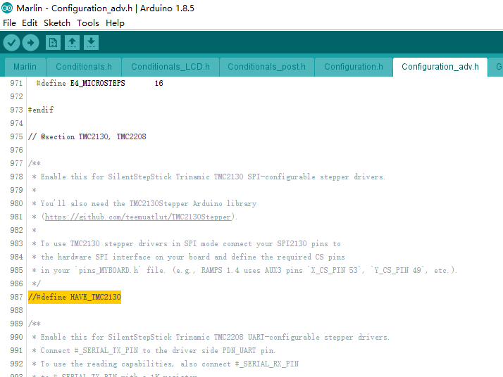
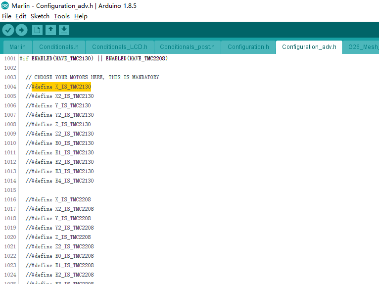
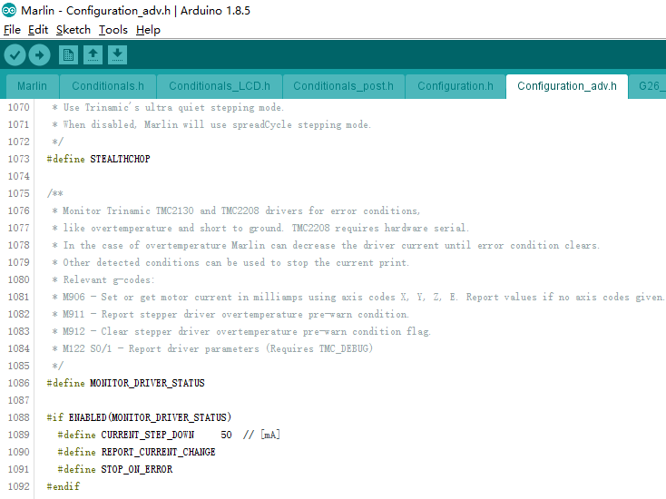

# Configure TMC2130

## Step1
---

If you want to use 2130 as your stepper driver, enable it as below shows in configuration_adv.h



## Step2
---

And then choose the axis that you use the TMC2130 stepper motor

For example, if you only have TMC2130 in x axis, then enable

```cpp
#define X_IS_TMC2130
```

If you have y, then

```cpp
#define X_IS_TMC2130
#define Y_IS_TMC2130
```

and so on.



## Step3
---
If you want to monitor the TMC2130, uncomment MONITOR_DRIVER_STATUS define



## Tech Support

---
Please submit any technical issue into our [forum](http://forum.fysetc.com/) 