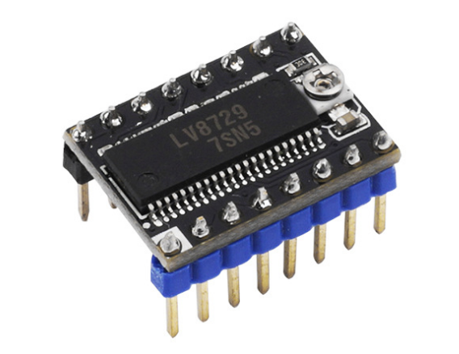
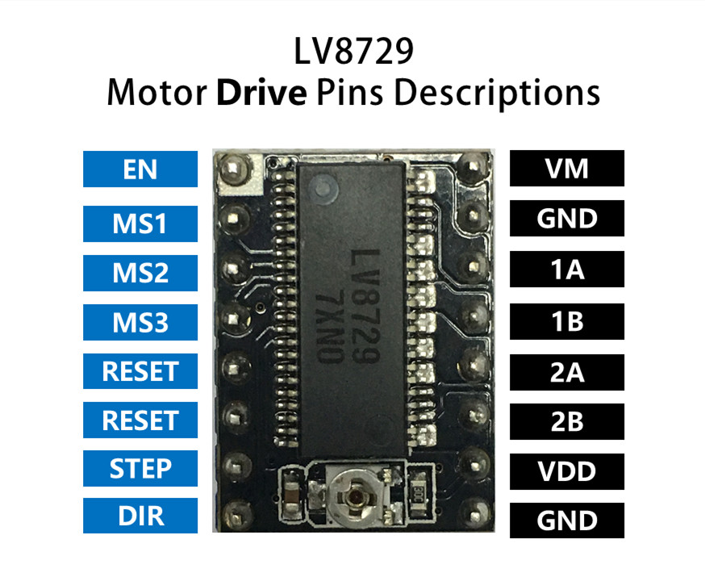
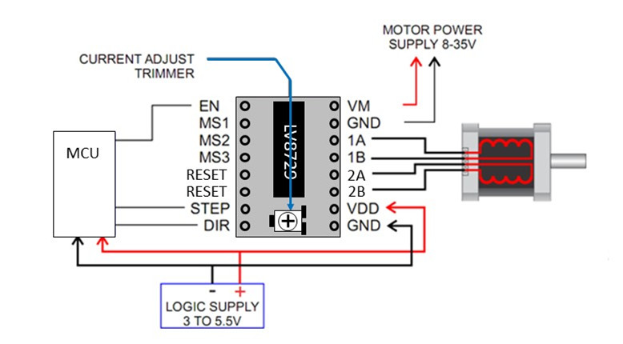
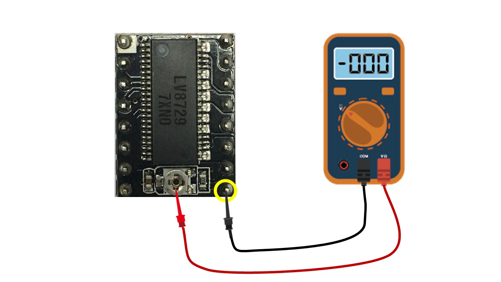

## Product Introduction

LV8729 driver module with 128 subdivisions is a good choice for Nema stepper motor whose current is less than 1.5A, which makes motor steady, quiet and precise.

## Features

## Specifications

Model                                |LV8729
:----:                                     |:----:
Dimensions                       | 1.5mm * 2.0mm (Same with the A4988 and DRV8825)
Maximum Drive Current |1.5A (Default 0.8A)
Operating Voltage            |6V-36V, the proposed voltage is 12V
Support Subdivisions      |1, 1/2, 1/4, 1/8, 1/16, 1/32, 1/64, 1/128
Product Process               |four layer PCB board

## Pin Functions

## Interface Resources

### Wiring Diagram

### Motor Current Setting

Current limits can be adjusted by measuring the VREF and the adjustable resistance (pls check wiring diagram). Connect the voltmeter + to VREF, [-] to the GND and read the value.
LV8729 uses 0.10ohm current sense resistor, so the current limits can be calculated as follows:
[Current Limit = VREF x 2]

!!!warning
​    Please do not exceed the current rating of the motor current, or motor and motor driver will be over-heated, or even damage.

### Micro-stepping

Microstep|MS1|MS2|MS3
:---:|:---:|:---:|:---:
Full Step|Low|Low|Low
1/2 Step|High|Low|Low
1/4 Step|Low|High|Low
1/8 Step|High|High|Low
1/16 Step|Low|Low|High
1/32 Step|High|Low|High
1/64 Step|Low|High|High
1/128 Step|High|High|High

## Attention

## Shop

##Tech Support

Please submit any technical issue into our [forum](http://forum.fysetc.com/) 