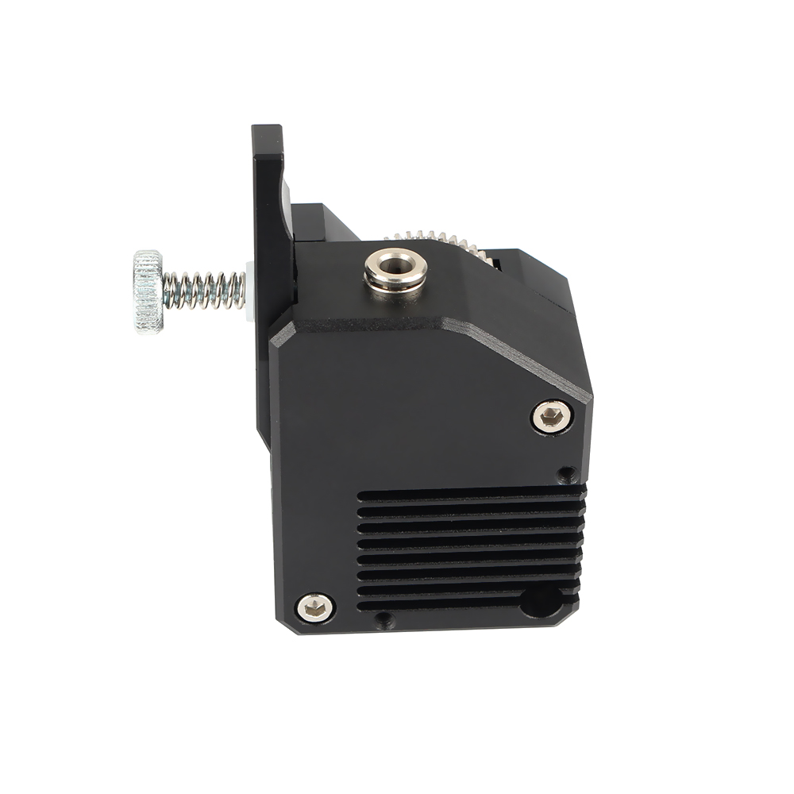

# Metal BMG Left  hand extruder

## Product Introduction

Product name：Metal BMG Left  hand extruder

Material：Aluminum alloy

Weight:189.2

## Applicable machine：
CR10 、Ender3 and other 3D printers .

## Features

- Provide greater torque for the extruder
- Improve the surface quality of printed matter
- Metal material, strong and stable, long service life
- Easy to install and easy to remove.

## Assembly steps

You can watch  [the assembly video](待上传).

## Attention

Refer to the assembly tutorial to avoid installation errors.

## FAQ

1. Q: How to install to my 3D printer? A: You can watch  [the assembly video](待上传).
2. Q：Does the installation require additional printed fixtures?  A：Yes, some models need to be used.

## Attachments

## Shop

------

- [Aliexpress](https://www.aliexpress.com/item/33051147571.html?spm=2114.12010615.8148356.1.63c875fd4i1KEX).

## Tech Support

facebook group：https://www.facebook.com/groups/197476557529090/

Tech Support Email： hunter@fysetc.com 

Forum：https://forum.fysetc.com/