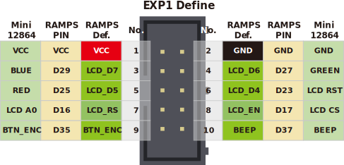

## Product Introduction


This is a opensouce, cheap, with RGB indicator, common to marlin's display, supports offline printing, resolution is 12864, display area is 2.4'', SD card holder can be side or vertical, convenient for different installation occasions Ideal for small 3D printers.

There are three versions：

V1.2 with  two RGB LEDs around the encoder, the back-light is fixed color.

V2.0 with  two RGB LEDs around the encoder，the  back-light is  RGB  and controlled by 3 pwm pins.

V2.1 with  two RGB LEDs around the encoder，the  back-light is  RGB  and controlled by 3 WS2811 chips, same as the NEOPIXEL_LED.

## Features

- 2.4" inch high contrast Graphic LCD
- Black-gray/black-green/white-black/white-blue/green-black, 5 display styles
- SPI communication to host micro-controller
- Support Vertical or side SD slot with card detect,with a optional  SD module
- Rotary Encoder with RGB-Aura
- Configurable RGB LED light
- Software configurable contrast setting
- 3D printable case and mount STL file 
- EXP1 & EXP2  RAMPS Compatible socket


## Application

3D printer，CNC machines ，Other micro controller projects


## Typical  Wiring





## 注意/NOTICE:


​    为了兼容某些主板，如RAMPS1.4，FYSETC mini12864 设置了 RST(R3) 和 KILL(R4) 的可选择电阻。目前，有些主板（S6/Spider）将 KILL 换成 5V，此时，请确认 mini12864 上 R4处于空贴状态，否则按下屏幕上的按钮会致使 5V 与 GND 短路，长时间操作会导致主板损坏。<br/>   In order to be compatible with some motherboards, such as RAMPS1.4, mini12864 is equipped with RST (R3) and KILL (R4) optional resistors. At present, some motherboards (S6/Spider) change the KILL to 5V. At this time, please make sure that R4 on the mini12864 is in the empty state, otherwise pressing the button on the screen will cause a short circuit between 5V and GND, and long-term operation will cause the motherboard to be damaged.

## Firmware config

This screen driver is ST7567 and is compatible with the marlin Mini panel (UC1701,same as ST7567). It has been tested well, and the following configuration is required.

**Before you start, please install the latest version of U8glib.**

### Step1. changes the pins.

On a RAMPS-compatible board, you need to make the following changes in pins_RAMPS.h:
```
 #elif ENABLED(MINIPANEL)
      #define BEEPER_PIN 37
      // Pins for DOGM SPI LCD Support
      #define DOGLCD_A0  16
      #define DOGLCD_CS  17
      #define LCD_BACKLIGHT_PIN -1 // backlight LED on A11/D65
      #define LCD_RESET_PIN  23
      #define SDSS   53

      #define KILL_PIN -1
      #define LCD_CONTRAST 200
      #define BTN_EN1 31
      #define BTN_EN2 33
      #define BTN_ENC 35  //the click switch
    
      #define SD_DETECT_PIN 49
```

### Step2. Config the configuration.h. 

In order to control RGB-LED, you also need to turn on the RGB control in marlin.

For V1.2 and V2.0: 

You need enable the RGB_LED, and config the R/G/B pins.
```
// 1.enable this line for mini12864 V1.2 and 
#define RGB_LED 
//#define RGBW_LED

#if ENABLED(RGB_LED) || ENABLED(RGBW_LED)
//2.change the 3 line for mini12864 V1.2 and V2.0
  #define RGB_LED_R_PIN 25
  #define RGB_LED_G_PIN 27
  #define RGB_LED_B_PIN 29
  #define RGB_LED_W_PIN -1
#endif
```

For V2.1, you only need enable the NEOPIXEL_LED.
```
// Support for Adafruit Neopixel LED driver
// 1. only need enable the NEOPINEL_LED for mini12864 V2.1
#define NEOPIXEL_LED
#if ENABLED(NEOPIXEL_LED)
  #define NEOPIXEL_TYPE   NEO_GRBW // NEO_GRBW / NEO_GRB - four/three channel driver type (defined in Adafruit_NeoPixel.h)
  #define NEOPIXEL_PIN    25        // LED driving pin on motherboard 4 => D4 (EXP2-5 on Printrboard) / 30 => PC7 (EXP3-13 on Rumba)
  #define NEOPIXEL_PIXELS 30       // Number of LEDs in the strip
  #define NEOPIXEL_IS_SEQUENTIAL   // Sequential display for temperature change - LED by LED. Disable to change all LEDs at once.
  #define NEOPIXEL_BRIGHTNESS 127  // Initial brightness (0-255)
  //#define NEOPIXEL_STARTUP_TEST  // Cycle through colors at startup
#endif
```

### Step3. Config the configuration_adv.h.

If you need to change the RGB-color manually,  then you need to enable the LED_CONTROL_MENU in configuration_adv.h. If you don't need it, you can skip this step.
```
/**
 * LED Control Menu
 * Enable this feature to add LED Control to the LCD menu
 */
// 1. enable the LED_CONTROL_MENU RGB manual control
#define LED_CONTROL_MENU
#if ENABLED(LED_CONTROL_MENU)
  #define LED_COLOR_PRESETS                 // Enable the Preset Color menu option
  #if ENABLED(LED_COLOR_PRESETS)
    #define LED_USER_PRESET_RED        255  // User defined RED value
    #define LED_USER_PRESET_GREEN      128  // User defined GREEN value
    #define LED_USER_PRESET_BLUE         0  // User defined BLUE value
    #define LED_USER_PRESET_WHITE      255  // User defined WHITE value
    #define LED_USER_PRESET_BRIGHTNESS 255  // User defined intensity
    //#define LED_USER_PRESET_STARTUP       // Have the printer display the user preset color on startup
  #endif
#endif // LED_CONTROL_MENU
```

### Step4. add the codes in ultralcd_impl_DOGM.h.

You need to add a shorts codes to ultralcd_impl_DOGM.h, otherwise your screen may not have text displayed, or it may not be clear.
Add  "u8g.setContrast(255);" in the "static void lcd_implementation_init()" function:


## Optional Hardware module:

The SD card of mini12864 can be  set on the side or in the front,  which requires a module to implement. As shown below:


## Attention

-TBD-

## FAQ

1. Q: What drive is used for the screen?
   A: Sitronix ST7567,  You can get the specification in our [github](https://github.com/FYSETC/Mini-12864-Panel).

2. Q: What is the difference between the three versions?

   A: Only the backlight is different, the wiki has a detailed description at the beginning.

## Attachments
### 1. Schematic

---------

You can find the schematics for the three versions on [github](https://github.com/FYSETC/Mini-12864-Panel).


### 2. Dimensions

---------


**For detailed dimensions please check dwg/step file on [github](https://github.com/FYSETC/Mini-12864-Panel).**

## Shop
---
- [LCD](  )

## Tech Support
---
Please submit any technical issue into our [forum](http://forum.fysetc.com/) or [facebook](https://www.facebook.com/groups/197476557529090/).

