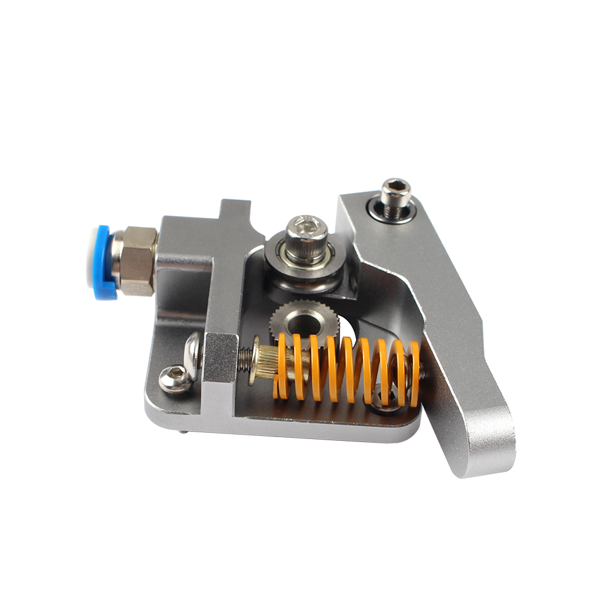

# Mk8 Grey Extruder

## Product Introduction

Product name：Mk8 Grey Extruder

Material：Aluminum alloy

Weight:76.8g

## Applicable machine：
Ender-3、 Ender-3 pro、CR-10、 CR-10S、CR10 pro  and other 3D printers .

## Features

- All metal texture, high-end atmosphere 
- Metal material, strong and stable, long service life
- Easy to install and easy to remove.

## Assembly steps

You can watch  [the assembly video](https://www.youtube.com/watch?v=D95hzhtRqLE&feature=youtu.be ).

## Attention

Refer to the assembly tutorial to avoid installation errors.

## FAQ

1. Q: How to install to my 3D printer? A: You can watch  [the assembly video](https://www.youtube.com/watch?v=D95hzhtRqLE&feature=youtu.be).
2. Q：Does the installation require additional printed fixtures?  A：Depending on the 3D printer you use, most do not.

## Attachments

## Shop

------

-  [Aliexpress](https://www.aliexpress.com/item/4001080562244.html?spm=a2g0o.productlist.0.0.2e3f2a05u2GGSW&algo_pvid=fdfcda7d-fb05-4161-8beb-66955ff38ff2&algo_expid=fdfcda7d-fb05-4161-8beb-66955ff38ff2-9&btsid=0b86d81915967086423915156ea2f9&ws_ab_test=searchweb0_0,searchweb201602_,searchweb201603_).
-  [Amazon](https://www.amazon.de/BCZAMD-Druckerteile-Extruder-Aluminiumlegierung-Filament/dp/B086W4HHXW/ref=sr_1_58?__mk_de_DE=%C3%85M%C3%85%C5%BD%C3%95%C3%91&dchild=1&keywords=bczamd&qid=1596709995&sr=8-58).

## Tech Support

facebook group：https://www.facebook.com/groups/197476557529090/

Tech Support Email： hunter@fysetc.com 

Forum：https://forum.fysetc.com/