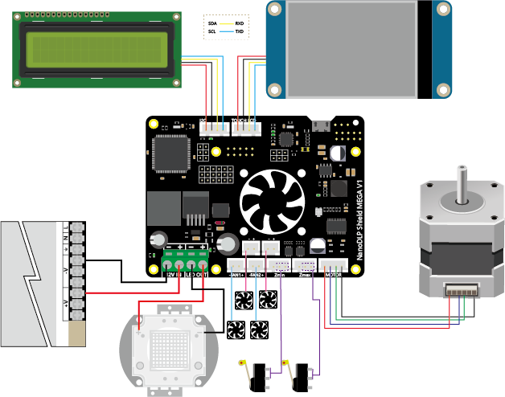

## Product Introduction

## Features

## Application

## Specifications

|   Board Name    | NanoDLP Shield MEGA V1 |
| :-------------: | ---------------------- |
|     License     |                        |
| Latest Version  |                        |
|   Fixed Port    |                        |
| Controlled Port |                        |
|    Endstops     |                        |
|       I2C       |                        |
|   Serial port   |                        |
| Stepper driver  |                        |
|      Input      |                        |
|     Output      |                        |

## Pin Functions

## Interface Resources

### Wiring Diagram

### Micro-stepping

## Schematic

## Tech Support

Please submit any technical issue into our [forum](http://forum.fysetc.com/) 