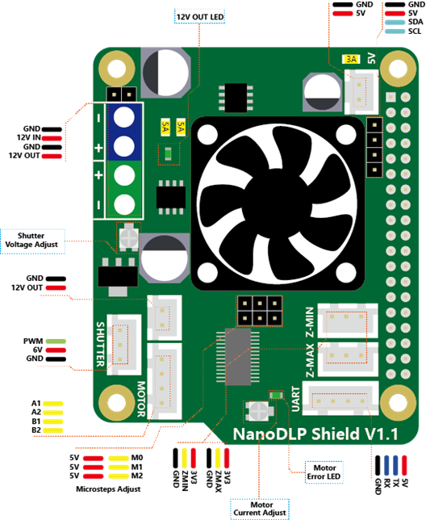

## Product Introduction

---

This expansion board is designed for the Raspberry Pi 3B which is used for SLA/DLP 3D printers  running NanoDLP . The board contains a 9-28V to 5V circuit that provides a maximum of 3A and other interfaces required by NanoDLP. See the instructions below.

## Features

---

- 9V-28V to 5V@3A Buck Converter
- DRV8825 Stepper Driver 
- 12V Fans (cooling the Pi)
- 2X Endstops
- Controled MOS for ext LED driver 
- I2C Connector for LCD1602
- Uart Connector for Touch Screen
- Shutter support
- 5V OUT Connector for ext Board

## Application

---

- For NanoDLP software on Raspberry Pi

## Specifications

---

  Board Name	    |  NanoDLP Shield 
  :--------------------:         | ---------------------
  License	                |   CPL V2
  Latest Version           |   V1.1
  Fixed Port                  |	1X  12V（Same as input） and 5V
  Controlled Port         |	1X 12V（Same as input）
  Endstops                    |	Z-min /Z-max
  I2C                               |   1X PinHeader-4P
  Serial port                  |   1X XH2.54-4P
  Stepper driver           |   1X DRV8825@2.5A max/32 microsteps max
  Input	                         |   9V-28V
  Output                        |   5V@3A max, 9-28V@3A max

## Interface Resources
---

### Interface Layout

### Micro-stepping

Shorted = 1, Open = 0 .

MS2|MS1|MS0|Microsteps
:---:  |:---:  |:---:  |:---:
0| 0| 0|Full step (2-phase excitation) with 71% current
0| 0| 1|1/2 step (1-2 phase excitation)
0| 1| 0|1/4 step (W1-2 phase excitation)
0| 1| 1|8 microsteps/step
1| 0| 0|16 microsteps/step
1| 0| 1|32 microsteps/step
1| 1| 0|32 microsteps/step
1| 1|1 |32 microsteps/step

## Pin Definition

---

## Schematic

---

## Wiring Diagram

---

!!!summary ""
    1. 9-28V Power Input, if you need connect a fan to cooling the UVLED you can connect it here too. 
    2. For UVLED Input, you can ON/OFF the UVLED by Controlling the Output.
    3. HDMI to MIPI Board or other device which need 5V power.
    4. With the I2C Port, you can connet a I2C 1602LCD.
    5. The board support two endstops, TOP and bottom, you can also use the Photoelectric switch with all three pins.

## Shop
---

- [NanoDLP Shield V1.1](https://www.aliexpress.com/store/product/NanoDLP-Shield-V1-1-Expansion-Board-With-DRV8825-Controled-MOS-For-Raspberry-Pi-3B-And-NanoDLP/3480083_32885581951.html)

## Tech Support

---
Please submit any technical issue into our [forum](http://forum.fysetc.com/) 