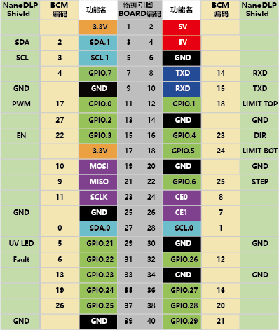
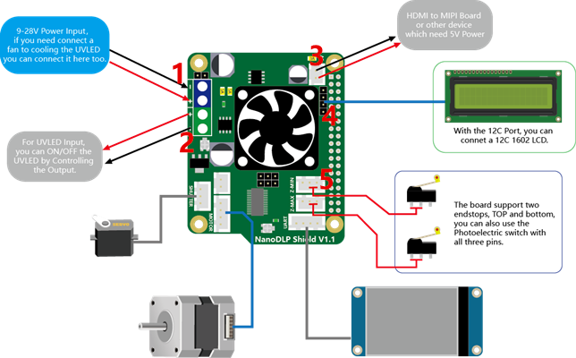

## 产品简介

---

这个扩展板是为树莓派3B设计的，用于运行NanoDLP的光固化3D打印机。板子包含了9-28V转5V电路，最大提供3A电流，以及NanoDLP所需的其他接口，详见下方说明。

## 特点
---

- 9V-28V至5V @ 3A降压转换器
- DRV8825步进驱动器
- 12V风扇（冷却Pi）
- 2X Endstops
- 控制外部LED驱动器的MOS
- 用于LCD1602的I2C连接器
- 用于触摸屏的Uart连接器
- 快门支持
- 用于ext Board的5V OUT连接器

## 应用
---

- 用于Raspberry Pi上的NanoDLP软件

## 硬件资源
---

名称	                    |  NanoDLP Shield 
:------------:|-------------
开源证书	            |   CPL V2
最新版本              |   V1.1
固定端口              |	1X  12V（Same as input） and 5V
可控端口              |	1X 12V（Same as input）
限位开关              |	Z-min /Z-max
I2C                     	|   1X PinHeader-4P
串口                  	|   1X XH2.54-4P
步进电机驱动规格|   1X DRV8825@2.5A max/32 microsteps max
输入	                    |   9V-28V
输出                    	|   5V@3A max, 9-28V@3A max

## 接口资源
---

### 接口布局

### 细分设置

短接 = 1， 空接 = 0 

MS2|MS1|MS0|Microsteps
:---:|:---:|:---:|:---:
0| 0| 0|Full step (2-phase excitation) with 71% current
0| 0| 1|1/2 step (1-2 phase excitation)
0| 1| 0|1/4 step (W1-2 phase excitation)
0| 1| 1|8 microsteps/step
1| 0| 0|16 microsteps/step
1| 0| 1|32 microsteps/step
1| 1| 0|32 microsteps/step
1| 1|1 |32 microsteps/step

## I/O定义
---

## 原理图
---

## 接线图
---

!!!summary ""

    1. 9-28V电源输入，如果您需要连接风扇来冷却UVLED，您也可以在此处连接。
    2. 用于UVLED输入，您可以通过控制输出来打开或关闭UVLED。
    3. HDMI到MIPI板或其他需要5V电源的设备。
    4. 通过I2C端口，您可以连接I2C 1602LCD。
    5. 主板支持两个限位开关，顶部和底部，您也可以通过三个引脚来连接光电开关。

## 商店
---

- [NanoDLP Shield V1.1](https://www.aliexpress.com/store/product/NanoDLP-Shield-V1-1-Expansion-Board-With-DRV8825-Controled-MOS-For-Raspberry-Pi-3B-And-NanoDLP/3480083_32885581951.html)

## 技术支持
---

请将任何技术问题提交到我们的[论坛](http://forum.fysetc.com/)