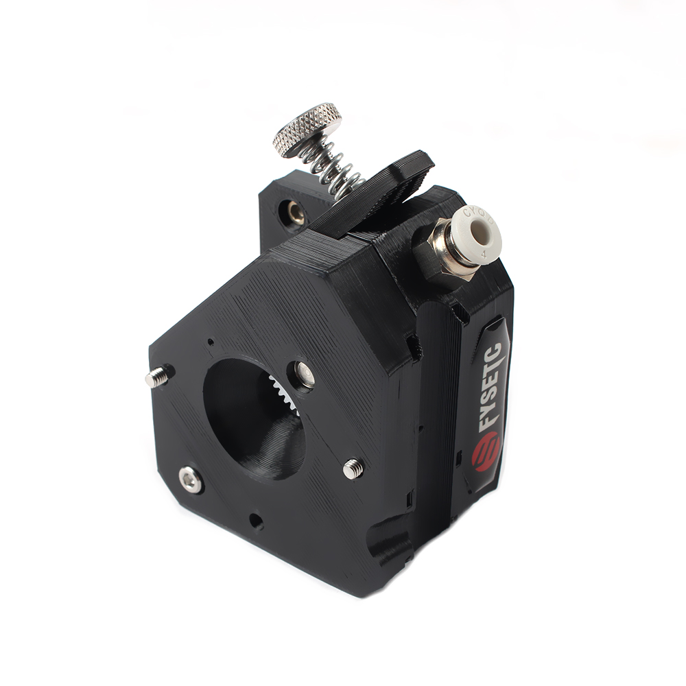

# Prusa mini BMG V1 Extruder

## Product Introduction

Product name：Prusa mini BMG V1 Extruder

Material：printed matter

Weight:85g

## Applicable machine：
Prusa min .

## Features

- Provide greater torque for the extruder
- Improve the surface quality of printed matter
- Easy to install and easy to remove.

## Assembly steps

You can watch  [the assembly video](https://youtu.be/zTW7EC1tIbM ).

## Attention

Refer to the assembly tutorial to avoid installation errors.

## FAQ

1. Q: How to install to my 3D printer? A: You can watch  [the assembly video](https://youtu.be/zTW7EC1tIbM )
2. Q：Does the installation require additional printed fixtures?  A：Mainly printed.

## Attachments

## Shop

------

- [Aliexpress](https://www.aliexpress.com/item/4001228208084.html?spm=a2g0o.productlist.0.0.1c0d1b49JAIEOj&algo_pvid=eb4b0bb4-bb25-4e64-b54a-9fc58c0223d2&algo_expid=eb4b0bb4-bb25-4e64-b54a-9fc58c0223d2-3&btsid=0b86d81615974519783001110e8ace&ws_ab_test=searchweb0_0,searchweb201602_,searchweb201603__).

  

## Tech Support

facebook group：https://www.facebook.com/groups/197476557529090/

Tech Support Email： hunter@fysetc.com 

Forum：https://forum.fysetc.com/