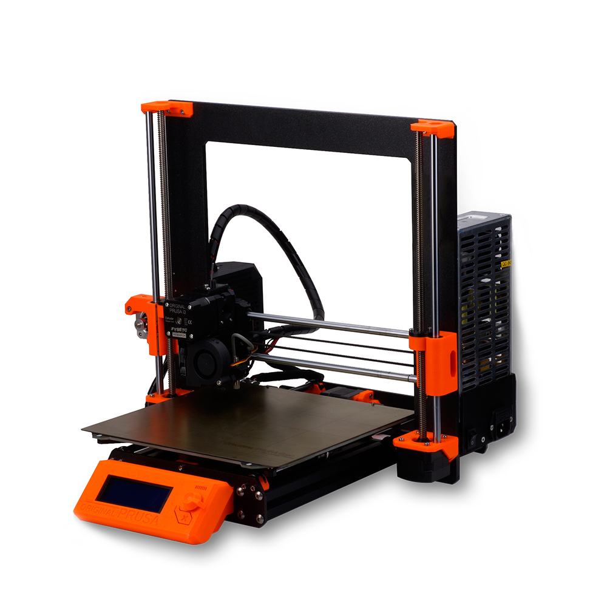

# FYSETC-Prusa-MK3S-clone
FYSETC Prusa MK3S Clone Kit Database

1. Prusa MK3S STL files are available, and were last updated on 2020.7.10

[FYSETC/FYSETC-Prusa-MK3S-clone: FYSETC Prusa MK3S clone Kit Database (github.com)](https://github.com/FYSETC/FYSETC-Prusa-MK3S-clone)

These STL files are needed for our FYSETC MK3S Clone. The two parts extruder-body_R4 and extruder-motor-plate_R4 are different than the official Prusa release. The rest of the parts are the same as the official parts from Prusa. 

2. Prusa MK3S assembly tutorial  
<https://help.prusa3d.com/en/category/original-prusa-i3-mk3s-kit-assembly_280>

3. Prusa MK3S knowledge base  
<https://help.prusa3d.com/en/tag/mk3s/>

4. Prusa MK3S assembly tutorial update 2020.8.3  
The tutorial is very detailed. We also provide a video assembly tutorial. It is more convenient to use the two tutorials together，divided into 5 steps:

https://youtu.be/e2qvbB0Xqfg

https://youtu.be/ntqnIuPzF5k

https://youtu.be/NayX_Eky94o

https://youtu.be/t37JR-865cU

https://youtu.be/UVHUfH4zhIA

5. Purchase link：https://es.aliexpress.com/item/32968736910.html?spm=a219c.12010615.8148356.3.26ed28558FsEev
