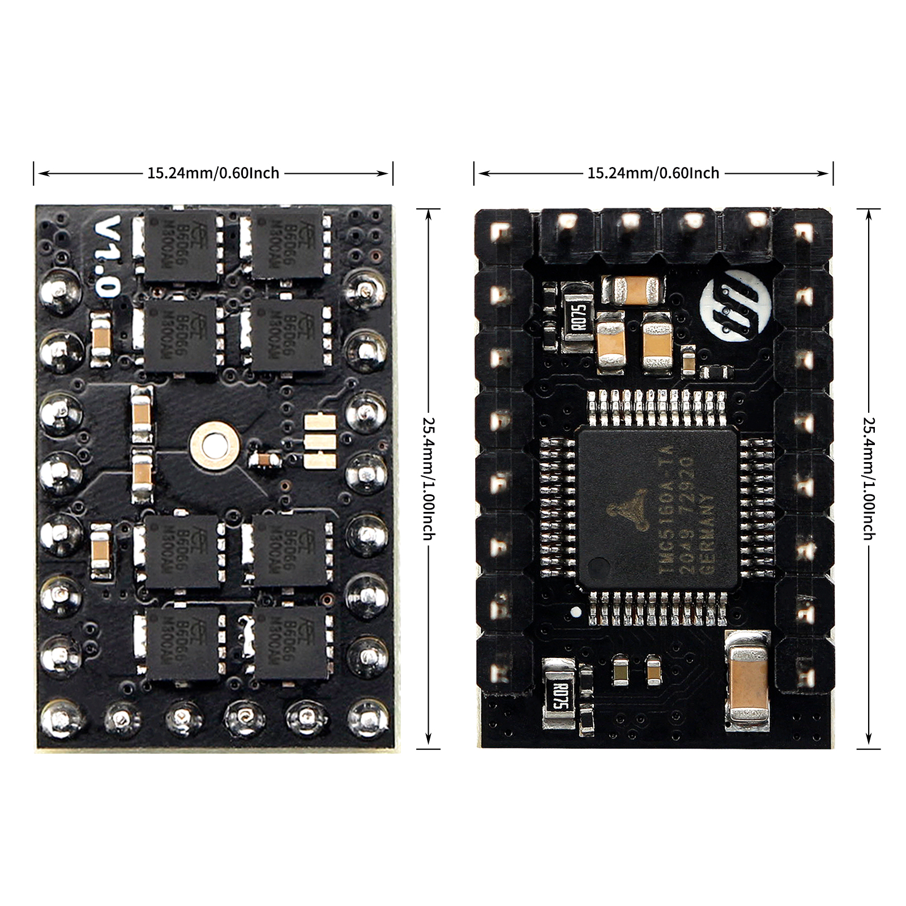
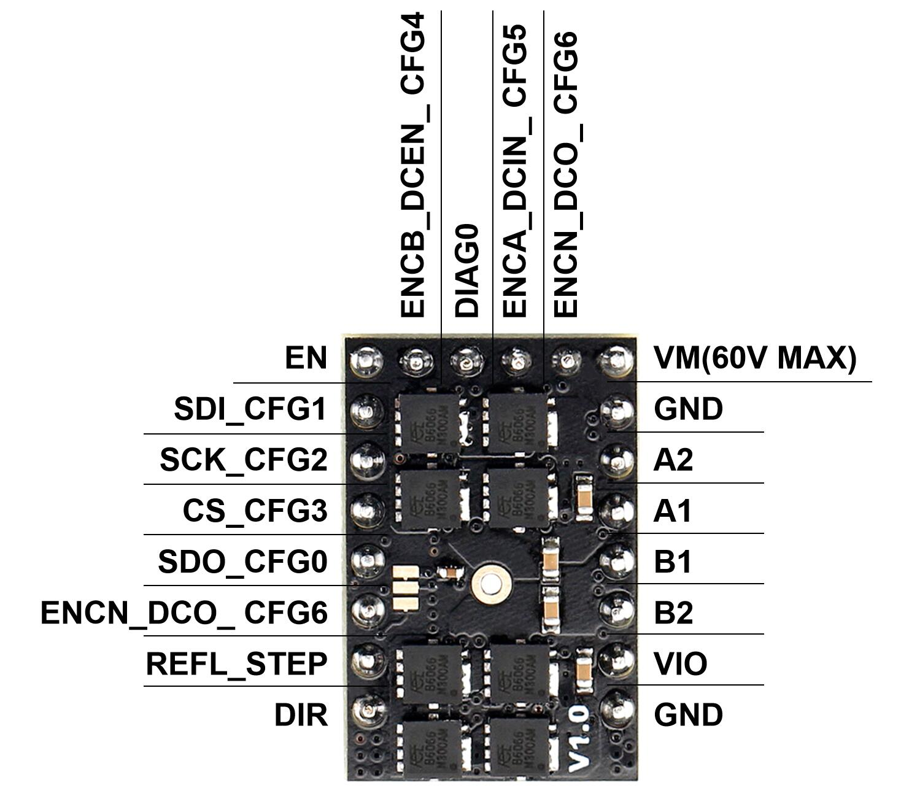
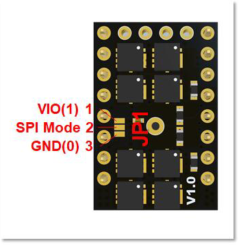
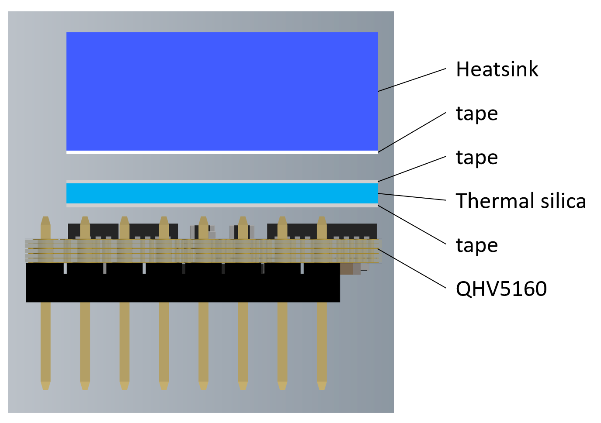

# QHV5160



## 1. Introduction

QHV5160 is a upgrade of HV5160, specially designed for high-voltage drive requirements and can work in the voltage range of 8-60V, such as 48V. The new design uses the QFP package of TMC5160, and selects eight 3x3 low-resistance MOSFETs.  and also uses Samsung Electronics’ 100V X7R ceramic capacitors

## 2. Feature

- 900 x 600mil / 22.3 x 15.24mm
- 6 layer TG155 PCB
- 8-60V 3.0A (rms) / 4.2A (peak)【Be constrained by connectors, not components.】
- 8 x NMOS (4.4 mΩ)
- Step/Dir interface & SPI mode default
- Compatible with Stepstick Pins
- Encoder Interface pinout
- DIAG output for sensorless homing
- With thermally conductive silicone and extra strong aluminum heatsink.

## 3. Application

3D printers, CNCs, engraving machines, or other similar devices with stepper motors.

## 4. Specifications

|                          | TMC5160                                                | HV5160                          | QHV5160                     |
| ------------------------ | ------------------------------------------------------ |:------------------------------- | --------------------------- |
| Motor Voltage (VM)       | 8-40V                                                  | 8-60V                           | 8-60V                       |
| Size                     | 800  x 600mil / 20.32 x 15.24mm                        | 1000  x 600mil / 25.4 x 15.24mm | 900 x 600 mil /22.3 x 15.24 |
| MOSFET                   | 4x  WSD4066 （17mΩ）                                     | 4x  DMT6018 (17  mΩ)            | 8x 4.4mΩ NMOS               |
| Heatsink                 | 238.6  W/(m·K)铝散热片                                     | 393.6  W/(m·K)纯铜散热片             | 238.6  W/(m·K)铝散热片          |
| Motor Phase Current  max | 3.0A  (rms) / 4.2A (peak)                              |                                 |                             |
| Rs                       | 0.075Ω                                                 |                                 |                             |
| Default Mode             | SPI  Mode，Standalone mode selectable via solder option |                                 |                             |
| PCB layer                | 6层，TG155                                               |                                 |                             |
| Pinout                   | DIAG0  & Encoder Interface pinout                      |                                 |                             |
| Native Microsteps        | up to 1/256                                            |                                 |                             |
| microPlyer Microsteps    | 1/256                                                  |                                 |                             |
| Logic Voltage (VIO)      | 3-5V                                                   |                                 |                             |
| Internal V-Regulator     | enabled                                                |                                 |                             |
| stealthChop (quiet)      | yes                                                    |                                 |                             |
| spreadCycle              | yes                                                    |                                 |                             |
| coolStep                 | yes                                                    |                                 |                             |
| stallGuard               | yes                                                    |                                 |                             |
| dcStep                   | yes                                                    |                                 |                             |

## 5. Hardware Guide



### 5.1 Pin Functions

| Pin                       | Function                                                                                                                                                                                                                                                              |
|:-------------------------:| --------------------------------------------------------------------------------------------------------------------------------------------------------------------------------------------------------------------------------------------------------------------- |
|                           | **Power Supply**                                                                                                                                                                                                                                                      |
| GND                       | Ground                                                                                                                                                                                                                                                                |
| VM                        | Motor Supply Voltage, Provide filtering capacity  near  pin  with short loop to  GND plane.  Must be tied to the  positive bridge supply voltage.                                                                                                                     |
| VIO                       | 3.3V to 5V IO supply voltage for all digital pins.                                                                                                                                                                                                                    |
|                           | **Motor Outputs**                                                                                                                                                                                                                                                     |
| B1                        | Motor Coil 1                                                                                                                                                                                                                                                          |
| B2                        | Motor Coil 1                                                                                                                                                                                                                                                          |
| A1                        | Motor Coil 2                                                                                                                                                                                                                                                          |
| A2                        | Motor Coil 2                                                                                                                                                                                                                                                          |
|                           | **Control Inputs**                                                                                                                                                                                                                                                    |
| REFL_STEP                 | STEP input when (SD_MODE=1).<br/>or left reference input (for internal ramp generator)                                                                                                                                                                                |
| REFR_DIR                  | DIR input (SD_MODE=1).<br/>or right reference input (for internal ramp generator)                                                                                                                                                                                     |
|                           | **TMC5160**                                                                                                                                                                                                                                                           |
| EN                        | Enable Motor inputs: GND=on, VIO=off                                                                                                                                                                                                                                  |
| CLK                       | CLK input. Tie to GND using short wire for internal clock or supply external clock. Internal clock-fail over circuit protects against loss of external clock signal.                                                                                                  |
| SDI_CFG1                  | SPI data input (SPI_MODE=1) or  <br/>Configuration input (SPI_MODE=0) or  <br/>Next address input (NAI) for single wire interface.                                                                                                                                    |
| SCK_CFG2                  | SPI serial clock input (SPI_MODE=1) or <br/>Configuration input (SPI_MODE=0)                                                                                                                                                                                          |
| CSN_CFG3                  | SPI chip select input (negative active) (SPI_MODE=1) or <br/>Configuration input (SPI_MODE=0)                                                                                                                                                                         |
| SDO_CFG0                  | SPI data output (tristate) (SPI_MODE=1) or  <br/>Configuration input (SPI_MODE=0) or  <br/>Next address output (NAO) for single wire interface.                                                                                                                       |
| DIAG0                     | Diagnostics output DIAG0.  <br/>Interrupt  or  STEP  output  for  motion  controller  (SD_MODE=0, SPI_MODE=1). <br/>Use  external  pullup  resistor  with  47k  or  less  in  open  drain mode.  <br/>Single wire I/O (negative) (only with SD_MODE=0 and SPI_MODE=0) |
| ENC-B<br/>ENCB_DCEN_ CFG4 | Encoder B-channel input (when using internal ramp generator) or <br/>dcStep  enable  input  (SD_MODE=1,  SPI_MODE=1)  –  leave  open or <br/>tie to GND for normal operation in this mode (no dcStep).  <br/>Configuration input (SPI_MODE=0)                         |
| ENC-A<br/>ENCA_DCIN_ CFG5 | Encoder A-channel input (when using internal ramp generator) or <br/>dcStep  gating  input  for  axis  synchronization  (SD_MODE=1, SPI_MODE=1) or <br/>Configuration input (SPI_MODE=0)                                                                              |
| ENC-N<br/>ENCN_DCO_ CFG6  | Encoder N-channel input (SD_MODE=0) or  <br/>dcStep ready output (SD_MODE=1). <br/>With SD_MODE=0, pull to GND or VCC_IO, if the pin is not used <br/>for an encoder.                                                                                                 |

### 5.2 Configuration Instructions

!!!warning
    If you use 48V to power the VMOT of the module and 24V step-down to power the VIO, please make sure that 48V and 24V are turned on at the same time (that is, VMOT and VIO arrive at the same time). Otherwise, the drive module may burn out.

#### 5.2.1 Solder Jumper

QHV5160 working mode selection is base on the voltage present on Pin21 and Pin22(Integrated pull down resistor). Pin21 is fix to 3.3v(use `1` to represent 3.3v), so working mode is decided by Pin22 only. Pin22 is on the middle pad2 on JP1 below, by default it is connected to pad1, so according to the chart below, the default working mode is `SPI Mode`. If you want change to `Standalone Mode`, you need a knife to cut the line(you can't see it, it is under solder mask layer) between pad1 and pad2, and connect pad2 and pad3(solder it).



| Pin22 | Pin21 | Mode                                                                                                                                                                                                        |
| ----- | ----- | ----------------------------------------------------------------------------------------------------------------------------------------------------------------------------------------------------------- |
| 0     | 1     | **Standalone Mode，Step-DIR Interface，CFG pins config：**Default Mode，SPI Mode，Step-DIR Interface：The  STEP/DIR inputs control the driver  the  chip is in standalone mode and pins have their CFG functions. |
| 1     | 1     | **（Default）SPI Mode，Step-DIR Interface：**The STEP/DIR inputs control the driver  the SPI interface is enabled.  Integrated pull down resistor.                                                              |

#### 5.2.2 USE SPI mode on FYSETC Boards


#### 5.2.3 Heatsink install



## 6. Firmware Guide

After you set the working mode according hardware guide section 5.2, you need to do firmware configuration. Follow the instruction below for different firmware Marlin and klipper configuration.

### 6.1 Marlin firmware

SPI Mode

```
#define *_DRIVER_TYPE  TMC5160
```

Standalone Mode

```
#define *_DRIVER_TYPE  TMC5160_STANDALONE
```

### 6.2 Klipper firmware

I take Spider2.x for example, add the content on your config file `printer.cfg`.

SPI mode

```
##  Make sure to update below for your relevant driver (5160)
[tmc5160 stepper_x] 
cs_pin: PE7
# Soft SPI
spi_software_mosi_pin: PE14
spi_software_miso_pin: PE13
spi_software_sclk_pin: PE12
interpolate: True
#diag1_pin: PB14 
run_current: 0.8 
hold_current: 0.5
#stealthchop_threshold: 0

##  Make sure to update below for your relevant driver (5160)
#[tmc5160 stepper_y] 
cs_pin: PE15
# Soft SPI
spi_software_mosi_pin: PE14
spi_software_miso_pin: PE13
spi_software_sclk_pin: PE12
#diag1_pin: PB13
interpolate: True 
run_current: 0.8
hold_current: 0.5
#stealthchop_threshold: 0
```

Standalone mode

Just delete the content you added for SPI mode.

## 7. Part List

- QHV5160 x1
- Aluminum Heatsink x1
- Thermally conductive silicone pad x1

## 8. Documentations

[TMC5160 Chip Datasheet](https://www.trinamic.com/fileadmin/assets/Products/ICs_Documents/TMC5160A_Datasheet_Rev1.15.pdf) 
[Schematic]() 
[3D mode]() 

## 9. Where to buy

<a href="https://www.aliexpress.com/item/3256803888258629.html"></a> <a href="https://item.taobao.com/item.htm?id=673881536790"></a> <a href="https://www.fysetc.com/products/fysetc-tmc5160-hv-stepper-step-stick-spi-silent-motor-driver-high-power-maximum-voltage-60v-upgraded-3d-printer-parts?variant=41654892691631"></a> 

## 10. Tech Support

Please submit any technical issue into our [forum](http://forum.fysetc.com/) ，github，facebook。
