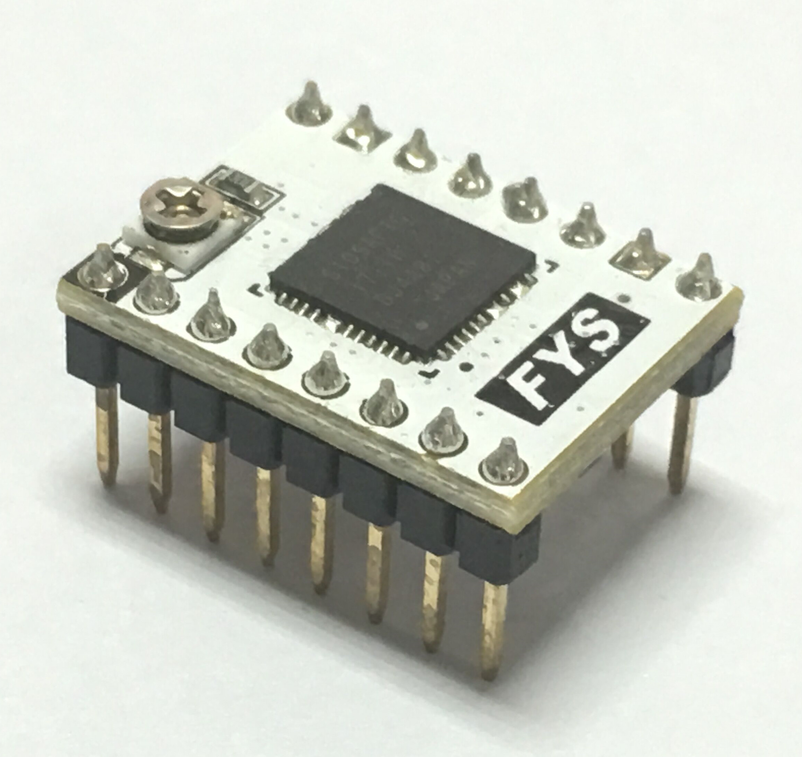
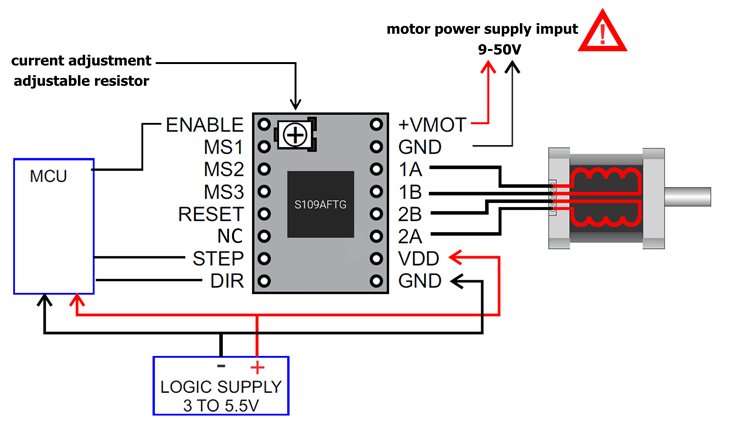

## Product Introduction
---

S109 driver is based on the Toshiba TB67S109 stepper motor driver chip design. It employs four layers of thick copper precipitation PCB with automatic patch processing. This driver uses indexer (DIR / STEP) control interface. Its maximum driver current can reach 4A. It can drive the 57 stepper motor, compatible with the Pololu pin definition.It can be used as a substitute for the A4988 module.

## Features
---

- use four layers of thick copper deposited gold PCB.
- allow full step, half step, 1/4, 1/8, 1/16, 1/32 step.
- maximum input voltage: 50V; maximum output current: 4A (at good heat dissipation condition).
- equipped with large heatsink for better cooling effect.
- high efficiency motor current control (as to advanced dynamic hybrid attenuation ADMD, ADMD Technology, its input current can be tracked more closely than the traditional mixed attenuation mode, so it can realize high-speed motor control under high speed conditions.)
- chip built-in error detection circuit: thermal shutdown (TSD), over current shutdown (ISD), and power on reset (POR).

## Interface Resources
---

###  Wiring Diagram

### Motor Current Setting

Current limits can be adjusted by measuring the VREF and the adjustable resistance (pls check wiring diagram). Connect the voltmeter + to VREF, [-] to the GND and read the value.
S109 uses 0.10ohm current sense resistor, so the current limits can be calculated as follows:
[Current Limit = VREF x 2]

!!!warning
    Please do not exceed the current rating of the motor current, or motor and motor driver will be over-heated, or even damage.

### Micro-stepping

The following table shows the microsteps setting for the S109A module
L = Jumper disconnected (without jumper cap)     H = Jumper closed (plugged in jumper cap)

Microsteps|Standby mode |1| 1/2(A)| 1/4 |1/2(B)| 1/8| 1/16| 1/32
:----:|:----:|:----:|:----:|:----:|:----:|:----:|:----:|:----:
MS1 | L | L | L | L | H | H | Ｈ | Ｈ
MS2 | L | L | H | H | L | L | Ｈ | Ｈ
MS3 | L | H | L | H | L | Ｈ | Ｌ | Ｈ

## Attention
---

- The driver is static sensitive, please be careful during using. It’s better to remove package when you use it. 
- Please insntall it on the motherboard at correct direction to avoid damage to driver and motherboard.
- Please turn off the power supply when you plug/unplug the driver.
- Driver will be very hot at work. Pls keep it away to avoid any burn.
- Ensure that the heatsink is not in contact with the driver pin or any other conductive position.

!!!Warning
    Please be sure to install the heatsink and air cooling. Do not run it without cooling for long time use.

## Shop

---
- [s109](https://www.aliexpress.com/store/product/5pcs-lot-TB67S109-Driver-Compatible-with-57-Stepper-Motor-Pololu-Pin-Definition-3D-Printer-Stepstick-S109/3480083_32849870589.html)

##Tech Support

---
Please submit any technical issue into our [forum](http://forum.fysetc.com/) 