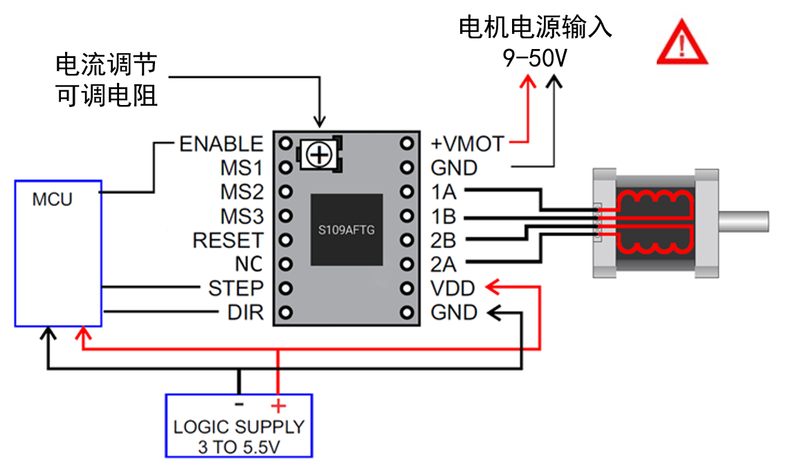

## 产品简介
---

S109A驱动模块是基于东芝TB67S109步进电机驱动芯片设计制作，采用四层厚铜沉金PCB，全自动贴片加工。模块采用indexer（DIR / STEP）控制接口，最大可提供4A驱动电流，可驱动57步进电机，并兼容Pololu引脚定义，可直接作为A4988模块的替代品。

## 特点
---

- 采用四层厚铜沉金PCB
- 允许全步，1/2，1/4，1/8，1/16，1/32 步运行
- 最大输入电压：50V；最大输出电流：4A（需要良好散热条件）
- 配备超大散热片，可使模块获得更好的散热效果
- 高效率电机电流控制（高级动态混合衰减ADMD， ADMD 技术比传统的混合衰减模式更能紧密地跟踪输入电流，从而实现了高转速条件下的高效电机控制），详见TB67S109 芯片数据表
- 芯片内置错误检测电路(热关断(TSD)，过电流关断 (ISD) ，以及上电复位(POR))

## 接口资源
---

### 接线图示

### 电机电流设置

电流限制可以通过测量VREF 和转动可调电阻来调节（见图1）。 连接电压表的+到VREF，[ - ]到GND 并读取该值。 S109A 使用0.10 欧姆的电流检测电阻，因此电流限制可以计算如下：
[Current Limit = VREF x 2]

!!!Warning "注意"
    电流请不要超过您电机的额定电流，否则电机与电机驱动都会严重发热，甚至损坏！

### 细分设置

下表为S109A 模块的细分设置说明
L=跳线断开（不插跳线帽） H=跳线闭合（插上跳线帽）

Microsteps|Standby mode |1| 1/2(A)| 1/4 |1/2(B)| 1/8| 1/16| 1/32
:----:|:----:|:----:|:----:|:----:|:----:|:----:|:----:|:----:
MS1 | L | L | L | L | H | H | Ｈ | Ｈ
MS2 | L | L | H | H | L | L | Ｈ | Ｈ
MS3 | L | H | L | H | L | Ｈ | Ｌ | Ｈ

## 注意事项
---

- 产品对静电敏感，使用时请小心处理，最好在使用时再移除包装。
- 模块插入主板前请仔细确认安装方向，插入不当时可能会直接损坏，甚至可能损坏主板。
- 插入/拔下模块时请关闭电源，主板上电时请不要插入驱动模块。
- 模块在工作时会非常热，避免在工作时触碰，以免灼伤。
- 安装散热片时请确保散热片不与模块引脚或任何其他导电位置接触。

!!!warning "注意"
    使用时请务必正确安装散热片并风冷，请勿不带散热长期运行！

## 商店
---
- [s109](https://www.aliexpress.com/store/product/5pcs-lot-TB67S109-Driver-Compatible-with-57-Stepper-Motor-Pololu-Pin-Definition-3D-Printer-Stepstick-S109/3480083_32849870589.html)

## 技术支持
---
请将任何技术问题提交到我们的[论坛](http://forum.fysetc.com/)
