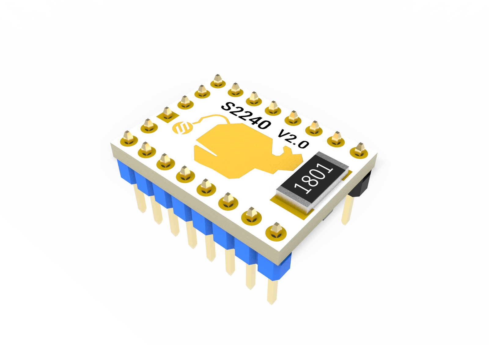
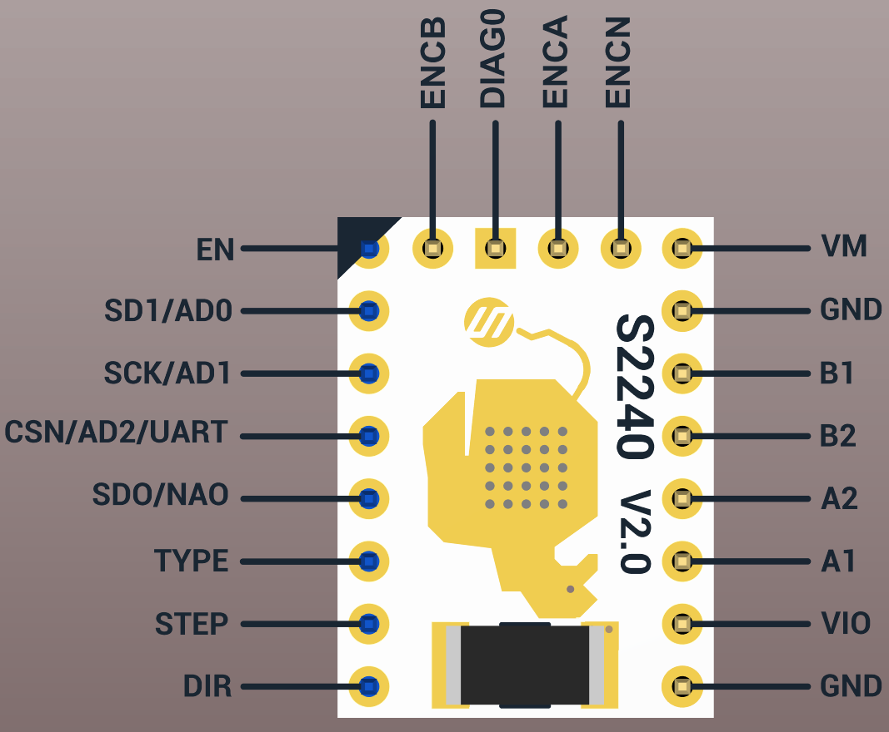
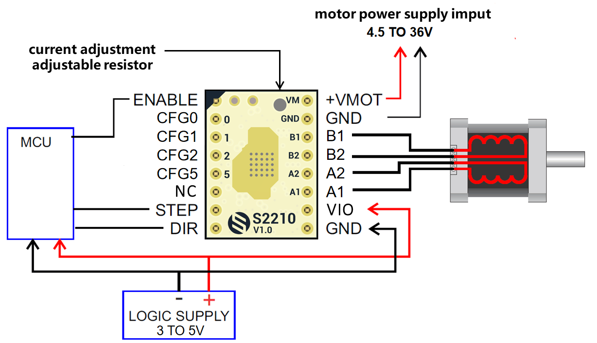

# 1.Product Introduction

The S2210 driver module is designed based on Trinamic's new generation chip TMC2210. Thanks to the brand-new architecture and process, its peak current can reach 3.0A, its continuous current can reach 2.1A, and it can withstand an input voltage up to 36V. TMC2100. All its functions only need to configure the IO hardware, no software programming is required.


# 2.Features

- Hardware compatible with StepStick and Pololu A4988 Stepper Driver
- Components on bottom PCB side for better heat emission
- Automatic standby current reduction
- StealthChop2™ silent PWM mode- for quiet operation and smooth motion
- SpreadCycle - highly dynamic motor control chopper
- Drive capability up to 2.1A (RMS) & 3.0A(PEAK)  coil current
- Step/Dir interface with microstep interpolation (up to 256 microsteps)
- Input microsteps 1-64 optional 
- Configuration via CFG pins
- Supply voltage 4.5-36V

# 3. Specifications Comparison

Model                               |TMC2209|TMC2210|TMC2240
:----:                                     |------                                     |------                                     |------                                     
Interface	                    | Step/Dir | Step/Dir | 4.5-36V 
Configuration	|UART	|CFG Pins	|UART/SPI	
Native Microsteps|up to 1 ⁄ 32|up to 1 ⁄ 64|-
microPlyer Microsteps| 1 ⁄ 256 | 1 ⁄ 256 | 1 ⁄ 256 
Logic Supply Voltage (VIO)| 3 - 5.25V | 2.2 - 5V | 2.2 - 5V 
Motor Supply Voltage (VM)|	4.75 - 28V	|	4.5 - 36V	|	4.5 - 36V	
Motor Phase Current max|	2A RMS, 2.8A Peak	|	2.1A RMS, 3.0A Peak	|	2.1A RMS, 3.0A Peak	
Internal V-  Regulator| enabled | enabled | enabled 
RDSon (typ. at 25°C)|170mΩ|230mΩ|230mΩ
Rsence|0.11Ω|chip built-in|chip built-in
stealthChop (quiet)| yes | yes | yes 
spreadCycle| yes | yes | yes 
coolStep | yes | no | yes 
stallGuard2 | yes | no | yes 
dcStep | yes | no | yes 
StallGuard4 | no | no | yes 
passive braking | no | no | yes 
Single Wire UART | yes | no | yes 
a/b/n incremental | no | no | yes 
SPI | no | no | yes 
temperature sensor | no | no | yes 
Direct Phase Control | no | no | yes 

# 4. Pin Functions




Pin|Function
:----:|----
 &nbsp;|**Power Supply**
 GND|	Ground
VM|	Motor Supply Voltage
VIO	|Logic Supply Voltage
 &nbsp;|**Motor Outputs**
B1|	Motor Coil 1
B2	|Motor Coil 1
A2|	Motor Coil 2
A1	|Motor Coil 2
 &nbsp;|**Control Inputs**
STEP	|Step-Signal Input
DIR	|Direction-Signal Input
EN	|Enable Motor Outputs: GND=on, VIO=off, OPEN=Auto-Power-Down
 &nbsp;|**Other Pins**
SDI/AD0	|
SCK/AD1	|
CSN/AD2/UART	|
SDO/NAO	|
TYPE	|
ENA	|
ENB	|
ENC	|
DIAG0	|
&nbsp;| **Onboard Jumper**
CFG3	|Onboard pulled down，CONFIGURATION OF RUN CURRENT IRUN (ALONG WITH IREF RESISTOR), DO NOT CHANGE DURING OPERATION
CFG4	|Onboard pulled down，DIGITAL CURRENT SCALE (MAY BE CHANGED DURING OPERATION)
CFG6	|Onboard pulled up，CONFIGURATION OF HOLD CURRENT REDUCTION
CFG7	|Onboard pulled down，CONFIGURATION OF HOLD CURRENT REDUCTION

# 5. Interface Resources


##  Wiring Diagram





## 5.1 Motor Current Setting

The current setting method of TMC2210 is slightly different, which is determined by CFG2 and CFG3 and the resistance value connected to IREF. Before we start, we need to clarify several relationships:

- IRUN: The current when the motor rotates, set by CFG2 and CFG3 and the resistance value connected to IREF.
- IHOLD: The current at which the motor is held still, set by CFG6 and CFG7.
- IPEAK: Also known as Imax or Full Scale Current, the driver chip provides peak current (the peak value of the sine wave)
- IRMS: The effective value of the current provided by the driver chip (the effective value of the sine wave, usually is about the peak value/1.41)

### 5.1.1. Setting the Full Scale Current Range
The full scale current IFS is a peak current setting. It is selected with an external reference resistor and the two configuration pins CFG2 and CFG3 

Three different full-scale current ranges can be configured through the pins with the same reference resistor to adapt to different motor sizes and applications. This is needed to benefit from the best possible current control resolution. 

Connect a reference resistor RREF from IREF to GND. Together with pins CFG3 and CFG2, the full scale current range IFS is set based on the external resistor . 

The equation below shows the full-scale current IFS as a function of the RREF shunt resistor connected to pin IREF and the configuration pin setting. The proportionality constant KIFS is defined by the CFG2 and CFG3 setting. The external resistor RREF can range between 12kΩ and 60kΩ.

$$
I_{FS}=K_{IFS}(KV)/R_{REF}(kΩ)
$$

Table 9. IFS Full Scale Current Range Settings (Example for RREF = 12KΩ)

| PIN CONFIG IN STANDALONE MODE | PIN CONFIG IN STANDALONE MODE | KIFS (A x kΩ) | MAX FS SETTING | TYPICAL RDS(ON) (HS + LS) | NOTES                                                        |
| ----------------------------- | ----------------------------- | ------------- | -------------- | ------------------------- | ------------------------------------------------------------ |
| 1                             | 1                             | 36            | 3A             | 0.23Ω                     | Optimized efficiency for motors and applications rated up to 2.1A rms |
| 1                             | 0                             | 36            | 3A             | 0.23Ω                     | Optimized efficiency for motors and applications rated up to 2.1A rms |
| *0*                           | *1*                           | *24*          | *2A*           | *0.27Ω*                   | *Optimized efficiency for motors and applications rated up to 1.4A rms* |
| 0                             | 0                             | 11.75         | 1A             | 0.40Ω                     | Optimized efficiency for motors and applications rated up to 0.7A rms |


### 5.1.2. Setting the Rref

IFS Full Scale RMS Current in Ampere (A RMS) based on CFG2/CFG3 Pin Settings and different RREF
| RREF(kΩ) | KIFS = 24 |
| -------- | --------- |
| 12       | 1.41      |
| 15       | 1.13      |
| 18       | 0.94      |
| 22       | 0.77      |
| 27       | 0.63      |
| 33       | 0.51      |
| 39       | 0.44      |
| 47       | 0.36      |
| 56       | 0.30      |

**According to the circuit of the module, we perform this demonstration calculation:**
Rref: The resistor connected to the IREF pin, which consists of a 12K resistor and a maximum 50K adjustable resistor. The factory value of the adjustable resistor is generally located in the center, which is 25K, and all default Rref=37K.
CFG3 is pulled down by default, which is equivalent to the GND level, and CFG2 is high when no external level is connected, so the default KIFS=24KV. 

$$
I_{FS}=K_{IFS}(KV)/R_{REF}(kΩ)=24(KV)/37(KΩ)=0.65A
$$

### 5.1.3 Hold Current (IHOLD) Reduction Configuration

<font color="red">CFG7（**Onboard pulled down**）/CFG6（**Onboard pulled up**）</font>: CONFIGURATION OF HOLD CURRENT REDUCTION

CFG7| CFG6 |HOLD CURRENT REDUCTION
:----:|:----:|:----:
GND |GND |No hold current reduction. IHOLD = IRUN
GND |VCC_IO| Reduction to 50%. IHOLD = 1/2 IRUN
VCC_IO |GND| Reduction to 25%. IHOLD = 1/4 IRUN
VCC_IO |VCC_IO| Reduction to 12.5%. IHOLD = 1/8 IRUN

### 5.1.4 Digital Current Scale Configuration

<font color="red">CFG4（**Onboard pulled down** ）</font>: DIGITAL CURRENT SCALE (MAY BE CHANGED DURING OPERATION)

CFG4 |CURRENT SCALE
:----:|:----:
GND| I = 75% of full scale current IRUN
VCC_IO| I = 100% of full scale current IRUN

## 5.3 Microsteps Setting

Microsteps Resolution Configuration for the Step Input，<font color="red">CFG1（**Onboard pulled down** ）CFG0（**Onboard pulled down** ）</font>，So the default is 8 microsteps.

CFG1|CFG0| microsteps |Interpolation|Mode
:----:|:----:|:----:|:----:|:----:
GND	|GND	|8| 256 | StealthChop2 
GND	|VIO| 16 | 256 | StealthChop2 
VIO|	GND| 32 | 256 | StealthChop2 
VIO	|VIO	|  64   | 256 | StealthChop2 


# 6. Other Configs 

## 6.1 Chopper Mode Selection
<font color="red">CFG5 **（Chip internal pull-up）**</font>: SELECTION OF CHOPPER MODE

CFG5 | CHOPPER MODE
:----:|:----:
GND | SpreadCycle operation
VCC_IO |StealthChop2 operation


# 7. How to config the code in klipper/marlin

S2210 only needs to configure the corresponding STEP, DIR, EN pins on the software, no additional configuration is required.
It is worth noting that the subdivision parameters on the software need to be consistent with the jumpers on the hardware.

For example, the X-axis configuration in klipper is as follows:

```c++
[stepper_x]
##	Connected to X-MOT (B Motor)
step_pin: PE11
dir_pin: PE10
enable_pin: !PE9
rotation_distance: 40
microsteps: 8
full_steps_per_rotation:200  #set to 400 for 0.9 degree stepper
endstop_pin: ^PB14
position_min: 0

##--------------------------------------------------------------------
position_endstop: 300
position_max: 300
##--------------------------------------------------------------------
homing_speed: 25   #Max 100
homing_retract_dist: 5
homing_positive_dir: true
```

Any configuration such as [tmc2209 stepper_x] is no longer needed.


## NOTE：


1. <font color="red">**Pay attention to the direction.**</font>
2. The heat sink is directly attached to the PCB.
3. The motor direction is the opposite of 4988 and 8825. If you want to replace the 4988 directly, please adjust the firmware or adjust the motor connection.


# Documents

SCH: https://github.com/FYSETC/S2210/blob/main/TMC2210%20V10.pdf

Datasheet: https://www.trinamic.com/fileadmin/assets/Products/ICs_Documents/TMC2210_datasheet_rev1.pdf


## Shop


## Tech Support


Please submit any technical issue into our [forum](http://forum.fysetc.com/) 
