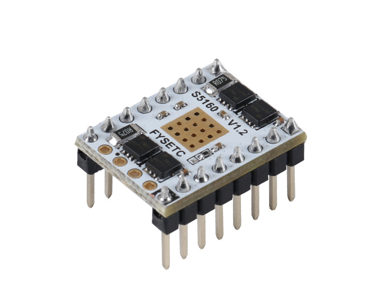
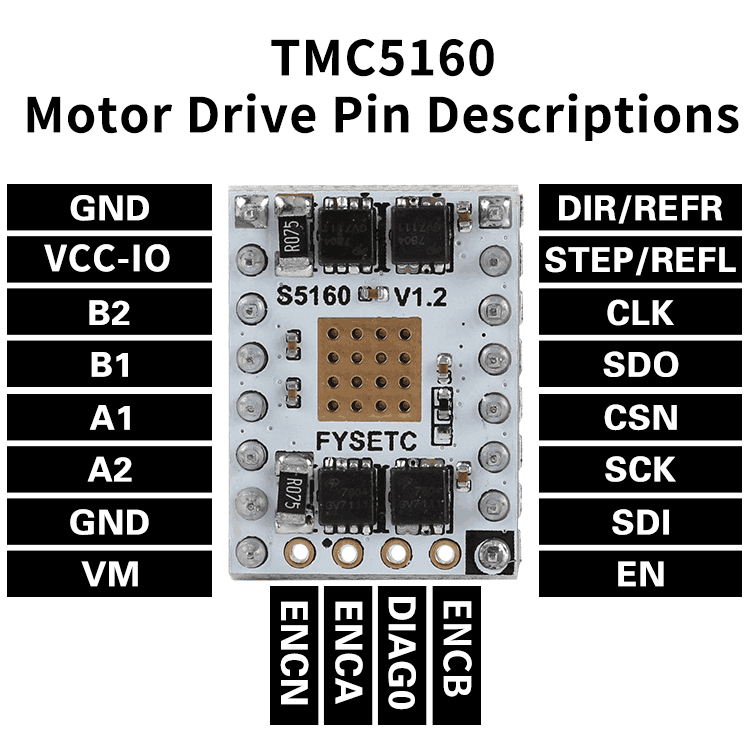
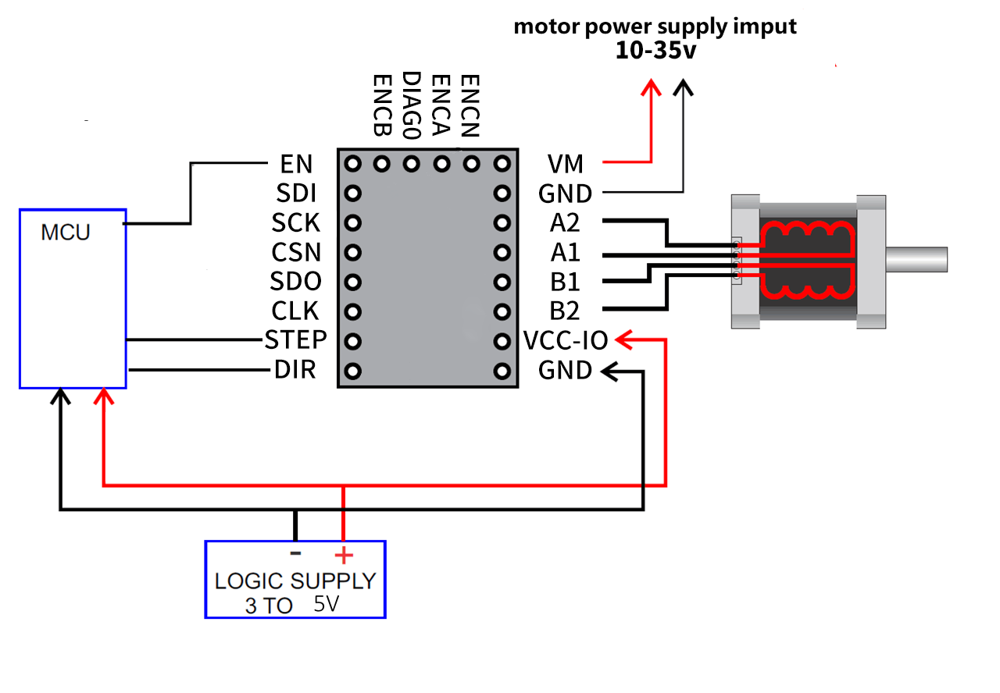
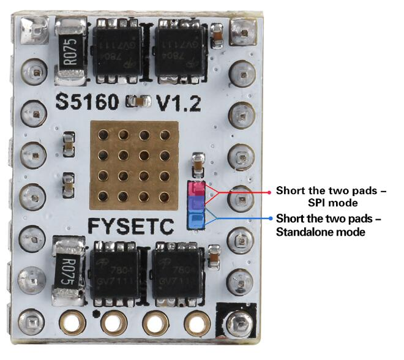
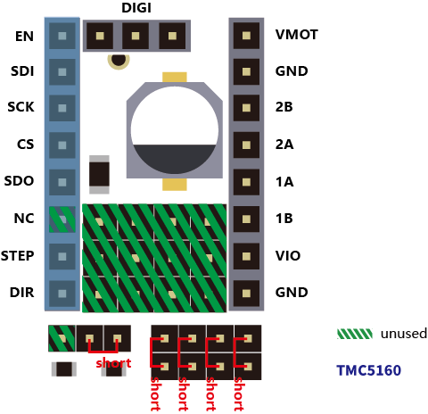

## Product Introduction
---

The TMC5160 is a high power stepper motor controller and driver IC with serial communication interfaces. It combines a flexible ramp generator for automatic target positioning with industries’ most advanced stepper motor driver. Using external transistors, highly dynamic, high torque drives can be realized. Based on Trinamic's sophisticated SpreadCycle™ and StealthChop™ choppers, the driver ensures absolutely noiseless operation combined with maximum efficiency and best motor torque. High integration, high energy efficiency and a small form factor enable miniaturized and scalable systems for cost effective solutions. The complete solution reduces learning curve to a minimum while giving best performance in class. TMC5160-WA uses a wettable flank package to allow optical inspection of the soldering joints. 

## Features
---

- 2-phase stepper motors up to 20A coil current (external MOSFETs) e
- Motion Controller with SixPoint™ramp 
- Step/Dir Interface with microstep interpolation MicroPlyer™  
- Voltage Range 8 … 60V DC 
- SPI & Single Wire UART  
- Encoder Interface and 2x Ref.-Switch Input 
- Highest Resolution 256 microsteps per full step 
- StealthChop2™ for quiet operation and smooth motion 
- Resonance Dampening for mid-range resonances 
- SpreadCycle™ highly dynamic motor control chopper 
- DcStep™ load dependent speed control 
- StallGuard2™ high precision sensorless motor load detection 
- CoolStep™ current control for energy savings up to 75% 
- Passive Braking and freewheeling mode 
- Full Protection & Diagnostics 

## Technical Specifications

Model                                    | TMC5160 
:---:|:---:
Interface                                | Step/Dir or SPI 
Configuration                       | SPI 
Native Microsteps               |   up to 1/256
microPlyer Microsteps          |    1/256
Logic Voltage (VIO)                 |    3-5V
Motor Voltage (VM)                | 10 - 35V 
Motor Phase Current  max        | 3.0A 
Internal V-  Regulator         |    enabled
RDSon                                    |0.1 Ohm
stealthChop (quiet)               | yes
spreadCycle                           |      yes
coolStep                                | yes 
stallGuard                              | yes 
dcStep                                    | yes 

## Pin Functions
---

Pin|Function
:---:|---
 |**Power Supply**
 GND|	Ground
VM|	Motor Supply Voltage
VCC-IO	|3.3V to 5V IO supply voltage for all digital pins.
|**Motor Outputs**
B1|	Motor Coil 1
B2	|Motor Coil 1
A1|	Motor Coil 2
A2	|Motor Coil 2
|**Control Inputs**
REFL_STEP	|STEP input
REFR_DIR	|DIR input
|**TMC5160**
 EN|	Enable Motor Outputs: GND=on, VIO=off
 CLK| CLK input.Tie to GND using short wire for internal clock or supply external clock.Internal clock-fail over circuit protects against loss of external clock signal.
SDI| SPI data input 
SCK	|SPI serial clock input
CSN	|SPI chip select input (negative active)
SDO	|SPI data output (tristate)
DIAG	|Diagnostics output DIAG0.
ENCB	|DcStep enable input (SD_MODE=1,SPI_MODE=1)–leave open
ENCA	|DcStep gating input for axis synchronization
ENCN	|DcStep ready output(SD_MODE=1)

## Interface Resources
---

###  Wiring Diagram

###  Mode selection

​    The FYSETC S5160 V1.2 defaults to SPI mode. If you need to change to Standalone mode, you need to change the jumper as shown.

### F6 jumper for TMC5160 SPI mode

If you are using the TMC5160 SPI mode on the F6, you do not need extra wiring, just plug in the jumper cap on the F6 as shown. 

## Shop

---
- [TMC5160](https://www.aliexpress.com/item/33011704134.html)

## Tech Support

---
Please submit any technical issue into our [forum](http://forum.fysetc.com/) 