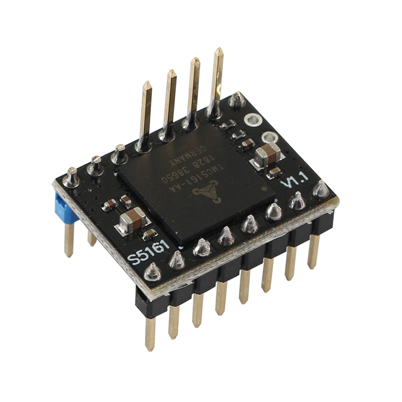
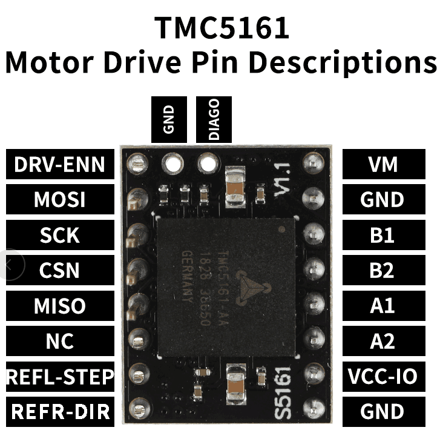
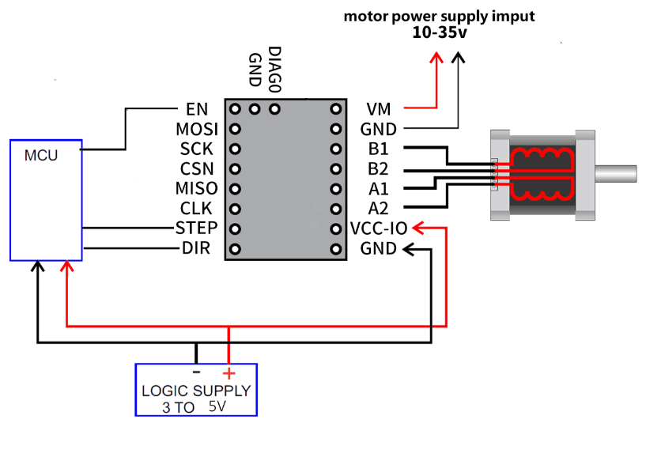
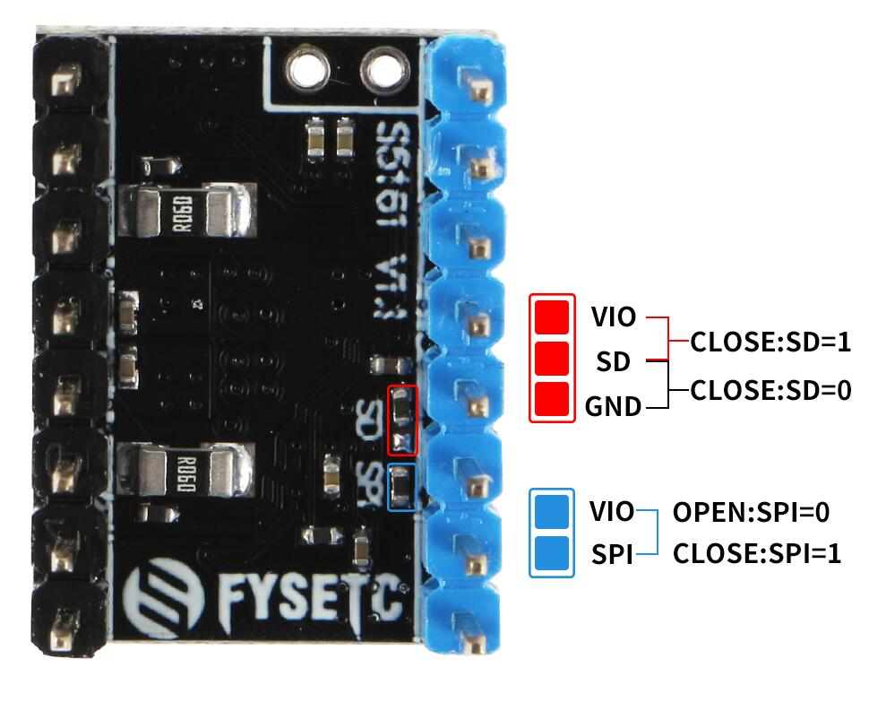

## Product Introduction
---

The TMC5161 is a highly compact stepper motor controller and driver IC. Its power stage is optimized for lowest power dissipation and highest dynamics with Nema 17 and Nema 23 motors. It combines a flexible ramp generator for automatic target positioning with industries’ most advanced stepper motor driver. Based on TRINAMICs sophisticated SpreadCycle and StealthChop choppers, it ensures absolutely noiseless operation combined with maximum efficiency and best motor torque. High integration, high energy efficiency and a small form factor enable miniaturized and scalable systems for cost effective solutions. The complete solution reduces learning curve to a minimum while giving best performance in class. Interface compatible to TMC5160.

## Features
---

- 2-phase stepper motors up to 3.5A RMS coil current
- Step/Dir Interface with 3D optimized interpolation MicroPlyer™
- Motion Controller with SixPoint™ramp as intelligent peripheral  
- Voltage Range 8 … 40V DC (55V peak) 
- Low RDSon integrated 45mΩ MOSFETs 
- SPI & Single Wire UART 
- Encoder Interface and 2x Ref.-Switch Input 
- Highest Resolution 256 microsteps per full step 
- StealthChop2™ for quiet operation and smooth motion 
- Resonance Dampening for mid-range resonances 
- SpreadCycle™ highly dynamic motor control chopper 
- DcStep™ load dependent speed control 
- StallGuard2™ high precision sensorless motor load detection 
- CoolStep™ current control for energy savings up to 75% 
- Passive Braking and freewheeling mode 
- Full Protection & Diagnostics 

## Technical Specifications

Model                                    | TMC5161 
:---:|:---:
Interface                                | Step/Dir or SPI 
Configuration                       | CFG Pins or SPI 
Native Microsteps               |   up to 1/256
microPlyer Microsteps          |    1/256
Logic Voltage (VIO)                 |    3-5V
Motor Voltage (VM)                | 10 - 35V 
Motor Phase Current  max        | 3.5A 
Internal V-  Regulator         |    enabled
RDSon                                    |0.5Ohm
stealthChop (quiet)               | yes
spreadCycle                           |      yes
coolStep                                | yes 
stallGuard                              | yes 
dcStep                                    | yes 

## Pin Functions
---

Pin|Function
:---:|---
 |**Power Supply**
 GND|	Ground
VM|	Motor Supply Voltage
VCC-IO	|3.3V to 5V IO supply voltage for all digital pins.
|**Motor Outputs**
B1|	Motor Coil 1
B2	|Motor Coil 1
A1|	Motor Coil 2
A2	|Motor Coil 2
|**Control Inputs**
REFL_STEP	|STEP input
REFR_DIR	|DIR input
|**TMC5161**
 EN|	Enable Motor Outputs: GND=on, VIO=off
MOSI| SPI data input 
SCK	|SPI serial clock input
CSN	|SPI chip select input (negative active)
MISO	|SPI data output (tristate)
DIAG0	|Diagnostics output DIAG0.

## Interface Resources
---
###  .Wiring Diagram

### Mode selection

| PIN/MODE | SPI Mode | SPI Moed | UART Mode | Standalone Mode |
| -------- | -------- | -------- | --------- | --------------- |
| SPI      | 1        | 1        | 0         | 0               |
| SD       | 1        | 0        | 0         | 1               |

The FYSETC S5160 V1.1 version now defaults to SPI mode (SD=1 and SPI=1). If you want to use another mode, you need to change the jumper yourself according to the instructions above.

## Shop

---
- [TMC5161](https://www.aliexpress.com/item/33052654667.html)

## Tech Support

---
Please submit any technical issue into our [forum](http://forum.fysetc.com/) 