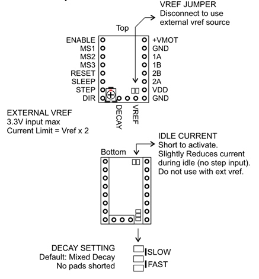

## Product Introduction

---

The SureStepr SD6128 is a stepper driver board based on the THB6128 chip. It is simple to use and operate using an indexer (DIR/STEP) interface to move the stepper motors. The SD6128 is a drop-in replacement for Pololu style footprint drivers including the SD8825, A4988, A4983 and Stepsticks. One distinct feature of the SD6128 is that heat pad is located at the top of the chip. This makes heat sinking a lot easier and does not rely on the already small PCB area for heat dissipation. 

## Features
---

- Made with 4 Layer RoHS PCB 
- 1, 1/2 , 1/4, 1/8, 1/16, 1/32, 1/64 and 1/128 Microstepping
- Up to 2.2A peak drive current 
- Top mounted heat pad
- Larger heat sink mounting area 
- Easy to use DIR/Step interface
- Output pins for Decay and external Vref
- Driver Chip:THB6128 with over current and over temp protection
- Current Motor Supply : 2.2A max
- Motor Voltage: 35V max

## Pin Functions

---

## Interface Resources
---

### Wiring Diagram

### Motor Current Setting

The current limit can be adjusted by measuring VREF and turning the trimmer (see FIG.1). Connect the + of the voltmeter to VREF and the [-] lead to GND and read the value. The SD6128 uses a 0.10 ohm current sense resistor so current limit can be computed as follows: 
Current Limit = VREF x 2

!!!warning
    DO NOT EXCEED YOUR MOTOR’S CURRENT RATING. 

### Micro-stepping

Table shows jumper settings for micro stepping.
OFF = No Jumper （0）
ON = Jumpered （1）

&nbsp;| 1| 1/2|	1/4|	1/8|	1/16|1/32 |1/64 |1/128
:---:|:---:|:---:|:---:|:---:|:---:|:---:|:---:|:---:
MS1(M0) | OFF |	ON | OFF | ON | OFF | ON |OFF | ON 
MS2(M1) | OFF |	OFF | ON | ON | OFF | OFF | ON | ON 
MS3(M2) | OFF |	OFF | OFF | OFF | ON | ON | ON | ON 

## Attention
---

!!!Warning
    This module is sensitive device, do not use without heat sink!!!

- Static sensitive - Handle with care, remove from packaging only when ready to mount. 
- Check munting orientation before inserting. Drivers will be damaged when improperly inserted, can potentially damage host controller too. 
- Turn off power when connecting/disconnecting motors, Do not insert driver when main board is powered.
- Chip, heat pad and heat sink can get really hot, avoid touching while in operation. 
- Install heatsink with adhesive thermal pad, ensure that it does not come in contact with pins or any other conductive part of the board.

## Shop

---
- [s6128]

##Tech Support

---
Please submit any technical issue into our [forum](http://forum.fysetc.com/) 
