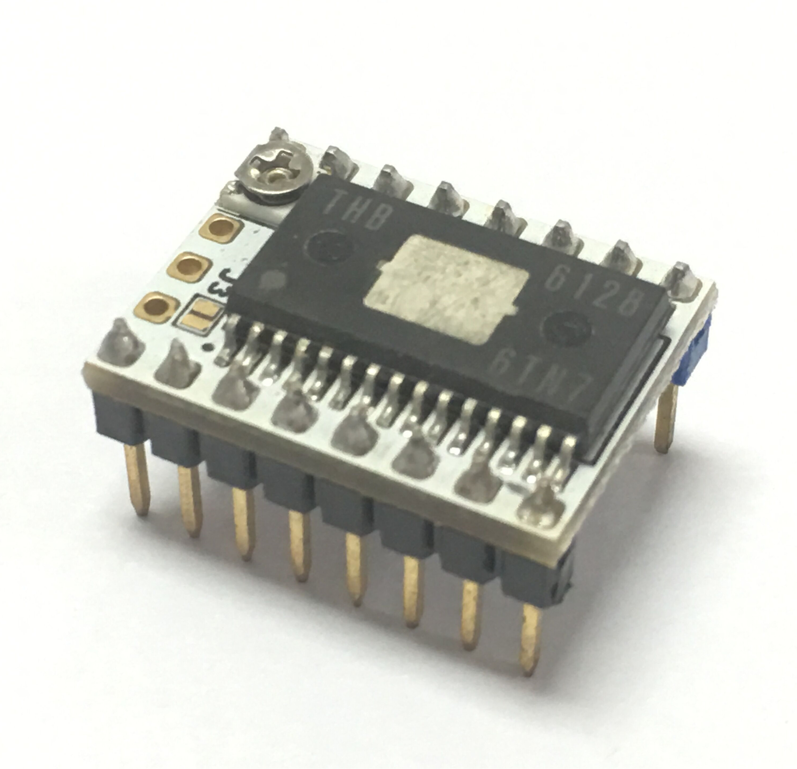
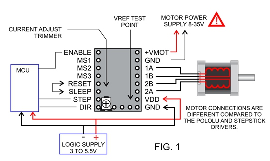

## 产品简介
---

SureStepr SD6128是基于THB6128芯片的步进驱动器板。 使用索引器（DIR / STEP）接口来移动步进电机，使用和操作非常简单。 SD6128是一款可以替代Pololu型封装驱动器的产品，包括SD8825，A4988，A4983和Stepsticks。 SD6128的一个显着特点是散热垫位于芯片的顶部。 这使得散热更容易，并且不依赖已经很小的PCB区域进行散热。

## 特点
---

- 四层PCB制作
- 支持1,1/2 , 1/4, 1/8, 1/16, 1/32, 1/64 和1/128 细分
- 最大2.2A（峰值）驱动电流
- 芯片顶部散热PAD
- 超大散热片
- 简单易用的DIR/Step接口
- Decay和外部Verf引脚引出
- 驱动芯片：THB6128，带过流保护和过温保护
- 电机最大电流：2.2A
- 电机电压：最大35V 

## 引脚说明
---

## 接口资源
---

### 接线图示

### 电机电流设置

电流限制可通过测量VREF和转动可调电阻（图1）进行调整。将万用表调到20V档位，连接电压表的“+”到VREF，连接“-”到GND，即可读出VREF的值。本6128驱动模块使用0.10欧姆电流检测电阻，所以限流大小可如下计算：
电流限制= VREF×2

!!!warning "注意"
    电流限制切勿超出电机的额定电流。

### 细分设置

下表所示为细分设置
OFF = No Jumper (0), ON = Jumpered (1)

&nbsp;| 1| 1/2|	1/4|	1/8|	1/16|1/32 |1/64 |1/128
:---:|:---:|:---:|:---:|:---:|:---:|:---:|:---:|:---:
MS1(M0) | OFF |	ON | OFF | ON | OFF | ON |OFF | ON 
MS2(M1) | OFF |	OFF | ON | ON | OFF | OFF | ON | ON 
MS3(M2) | OFF |	OFF | OFF | OFF | ON | ON | ON | ON 

## 注意事项
---

!!!Warning "注意"
    此模块为敏感器件，请勿不带散热片使用！

- 静电敏感 – 用手拿的时候请小心，最好安装时再从包装内取出；
- 插入前请注意检查安装方向，插入不当时驱动会损坏，甚至还有可能会损坏主板控制芯片。
- 连接或者拔掉电机时，请关掉电源，插拔驱动模块时，主板需先断电。
- 驱动工作时，芯片，散热PAD和散热片都会变得非常热，不要用手直接触碰，避免灼伤。
- 用粘合剂粘贴散热片时，请确保散热片与任何pin或者任何导电部分没有任何接触。

## 商店

---
- [s6128]

## 技术支持

---
请将任何技术问题提交到我们的[论坛](http://forum.fysetc.com/)