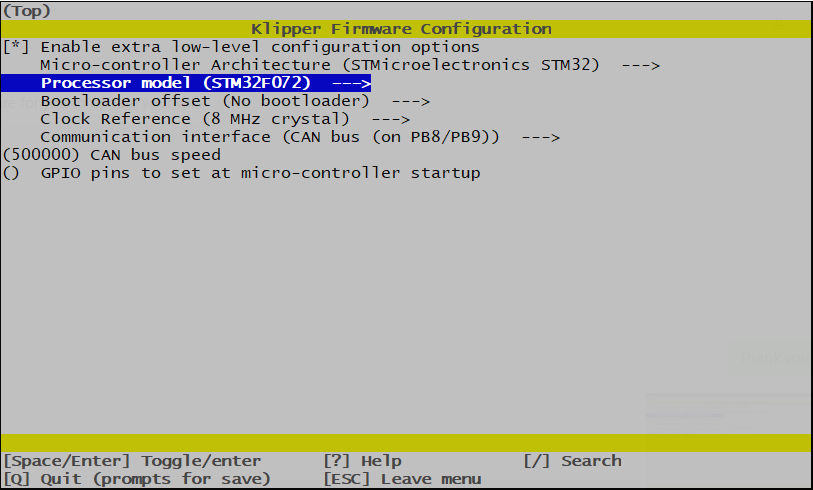
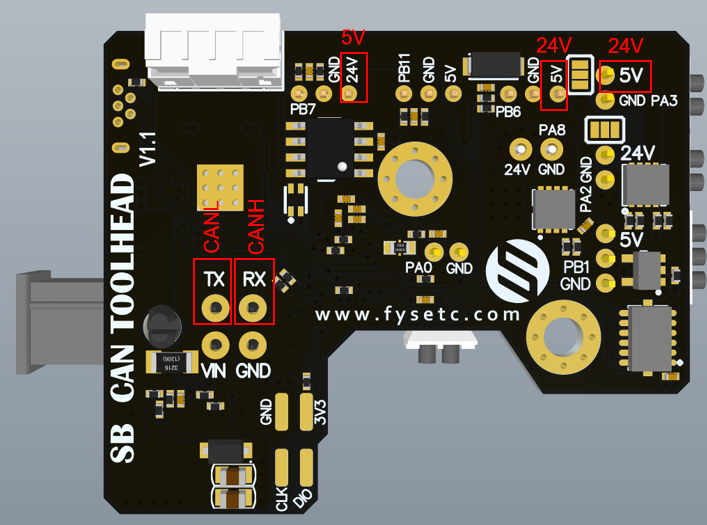

## 1. Introduction

The SB CAN Tool Board is a highly integrated printhead control board. Based on STM32F072, running Klipper firmware. Onboard TMC2209 stepper motor driver, AXL345 acceleration sensor, and other necessary interfaces. And comes with a 2.5m 4-core cable for easy out-of-the-box use.

### 1.1 Feature

- Based on STM32F072

- Onboard 1M CAN transceiver

- Onboard TMC2209

- 2x 0.5A MAX PWM interface for controllable fan (default VIN power supply, 5V optional)

- 1x signal input interface (VIN power supply, with level conversion)

- 2x signal input and output interface (5V power supply, with pull-up resistor)

- 1X 5V single wire RGB interface (1A MAX)

- 1x 4A MAX PWM output for heating rod

- 1x ADC interface for heating rod temperature acquisition

- MX3.0 2X2 interface for power and CAN signal access

- 1x Micro USB for firmware uploading

- Comes with 2.5m 4-core cable, 2x16AWG+2x24AWG

- Comes with terminal housing and wire crimping tabs

## 2. Hardware Guide

### 2.1 Install

Before you install the board, you need printed parts [here](https://github.com/FYSETC/FYSETC_SB_CAN_TOOLHEAD/tree/main/STLs). Then follow the 5 steps below.

1. You Stealburner should have to holes with heat inserts on.
2. 3D Print the [pcb_spacer.STL](https://github.com/FYSETC/FYSETC_SB_CAN_TOOLHEAD/blob/main/STLs/pcb_spacer.STL "pcb_spacer.STL") 
3. Place the PCB on the position
4. Screw it to printed head and pcb_spacer.STL
5. Follow the chapter `2.2 wiring` to connect the peripherals and cover the lid.

### 2.2 Connectors

| Connector name | Type       | Details                                                                                                                                                   |
| -------------- | ---------- | --------------------------------------------------------------------------------------------------------------------------------------------------------- |
| IO.2           | PH2.0-3P   | PB7，for input and output, hardware pull-up 10k resistor to 3.3v with 1k series resistor.  Example:  endstops                                           |
| IO.1           | PH2.0-3P   | PB11，for input and output, hardware pull-up 10k resistor to 3.3v with 1k series resistor.  Example:  endstops                                          |
| IN.0           | PH2.0-3P   | PB6，default 24v with level translator, pull-up to 3.3v                                                                                                    |
| MOTOR          | PH2.0-4P   | TMC2209 EN : PB4 DIR : PA5 STEP : PA7 SPREAD : PA15 DIAG : PB5 INDEX : PB3 RX : PA10 TX : PA9                                     |
| INPUT          | MX3.0 2X2P | Max 24v 5A input（16AWG）/CANL，CANH （24AWG）                                                                                                                 |
| TE0            | PH2.0-2P   | PA0，ADC，4.7K pull-up to 3.3V                                                                                                                              |
| HE0            | XH2.54-2P  | PA8，MAX 4A，PWM output，max power recommended: 60W                                                                                                          |
| FAN0           | PH2.0-2P   | PA2，0.5A MAX PWM，for fan control (default VIN，5V selectable)                                                                                              |
| FAN1           | PH2.0-2P   | PA3，0.5A MAX PWM，for fan control ( defalt VIN，5V selectable )                                                                                             |
| RGB            | PH2.0-3P   | PB1，1A MAX sigal line RGB port, 5V，for NeoPixel, WS2812                                                                                                   |
| Micro-USB      |            | For firmware update and USB communication. Firmware update: Plug in USB first then power on.   USB communication: Power on first then plug in USB port |

### 2.3 Wiring

 

### 2.4 SCH DXF STEP

Get SCH, DXF, STEP files on github:

[GitHub - FYSETC/FYSETC_SB_CAN_TOOLHEAD: StealthBurner toolhead CAN bus module for VORON](https://github.com/FYSETC/FYSETC_SB_CAN_TOOLHEAD)

## 3. Firmware Guide

This is only Klipper firmware support. If you are Klipper beginner please check the Klipper firmware build here:  [Installation - Klipper documentation](https://www.klipper3d.org/Installation.html#installation)

### 3.1 menuconfig

### 3.2 Firmware Upload

There is Micro-USB port on the board for firmware upload. Follow the sequence below.

1. Power on your machine and wait for raspberrypi (Or other SBC) ready.

2. Power down SB-CAN-TH board for at least 5s

3. Connect SB-CAN-TH Micro-USB to RaspberryPi USB-A port with USB cable

4. Plug in SB-CAN-TH board 24v socket to power on it( Get the power from machine PSU)

5. Shoot `lsusb` command in Raspberry to check if it shows DFU port, if not go back to step 1

6. Shoot command `dfu-util -R -a 0 -s 0x08000000:leave -D out/klipper.bin`

7. Remove Micro-USB cable and SB-CAN-TH socket for 5s, then plug in SB-CAN-TH socket again.

8. Finished

### 3.3 Configuration

Obtain the Klipper configuration file [here](https://github.com/FYSETC/FYSETC_SB_CAN_TOOLHEAD/blob/main/sb_can_th.cfg) , you need to get the CAN ID following [CANBUS - Klipper documentation](https://www.klipper3d.org/CANBUS.html): 

## 4. Log and known issues

### 4.1 v1.1

Note: v1.1 have some silk print errors below, the red letters are the right silk print.

## Buy

[Taobao](https://item.taobao.com/item.htm?spm=a1z10.3-c.w4002-23828897339.22.229c1613tHAtLW&id=690431280049)

[Aliexpress](https://www.aliexpress.com/item/1005004880078163.html)

[Official website](https://www.fysetc.com/products/fysetc-sb-can-tool-board-based-on-stm32f072-support-klipper-with-tmc2209-axl345-acceleration-sensor-for-3d-printer-parts?variant=42187842519215)

## Contacts

QQ：1041794121

Facebook小组：https://www.facebook.com/groups/197476557529090

Discord频道：https://discord.gg/Fb6FdND4

邮箱：support@fysetc.com
