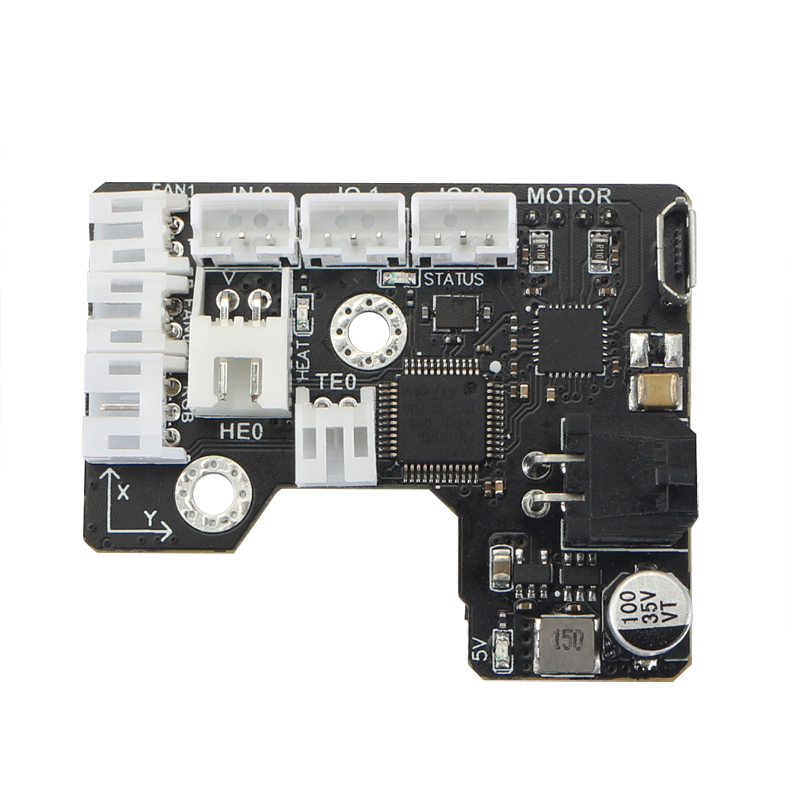
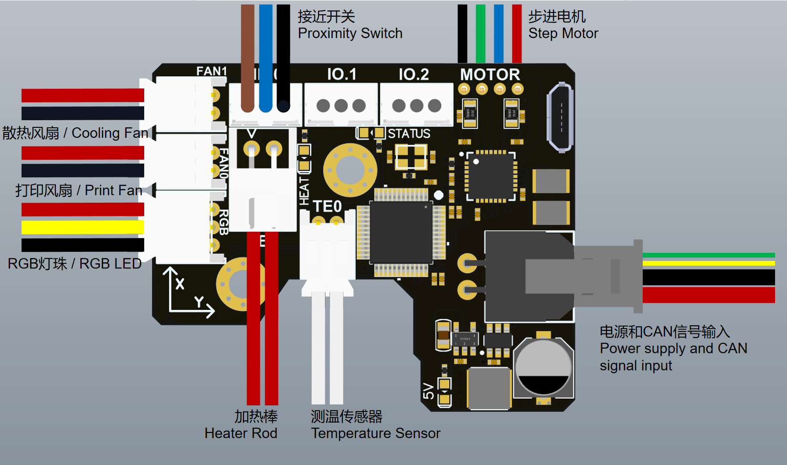
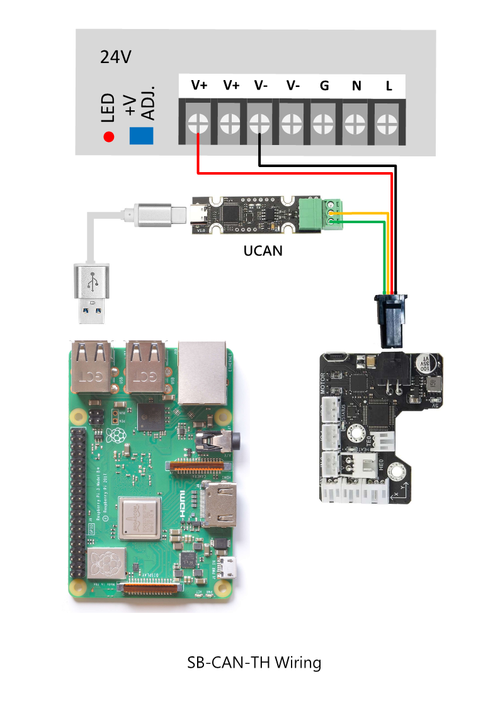
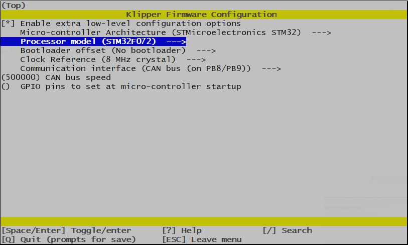
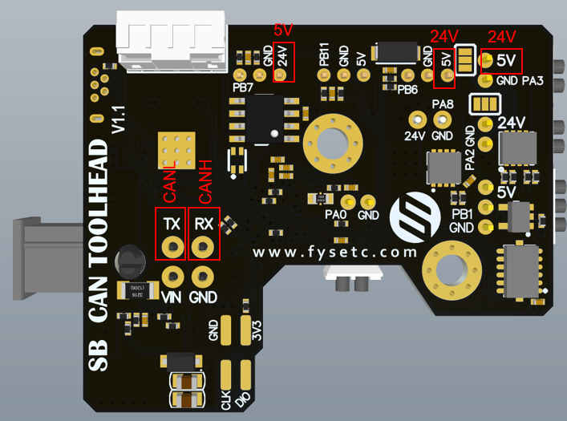

## 1. 简介

SB CAN 工具板是一个高度集成的打印头控制板。基于STM32F072，运行Klipper固件。板载TMC2209步进电机驱动，AXL345加速度传感器，以及其他必要的接口。并附带2.5米4芯连接线，便于开箱即用。

### 1.1 特性

- 基于STM32F072

- 板载1M CAN收发器

- 板载TMC2209

- 2x 0.5A MAX PWM接口，用于可控风扇（默认VIN供电，5V可选）

- 1x 信号输入接口（VIN供电，带电平转换）

- 2x 信号输入输出接口 （5V供电，带上拉电阻）

- 1X 5V 单线RGB接口 （1A MAX）

- 1x 4A MAX PWM输出，用于加热棒

- 1x ADC接口，用于加热棒温度采集

- MX3.0 2X2接口，用于电源和CAN信号接入

- 1x Micro USB，用于固件更新

- 附带2.5米4芯连接线，2x16AWG+2x24AWG

- 附带端子外壳和压线金属片

## 2. 硬件指南

### 2.1 安装

STLs 可以在国内 git 站点找到：[FYSETC/FYSETC-SB-TH-CAN - FYSETC-SB-TH-CAN - FYSETC Git](http://git.fysetc.com.cn/FYSETC/FYSETC-SB-TH-CAN)，需要把替换 SB 原装的三个打印件以及增加一个小安装件。配件是为VORON Stealthburner 头结构设计的单板解决方案，其安装如下图所示，5个步骤完成：

1. 你的Stealthburner应该拥有两个安装孔，并已经嵌入了螺母；
2. 打印一个隔离柱用于安装PCB；
3. 将板子对准孔位放置；
4. 安装附赠的薄头M3螺丝（普通的螺丝可能会导致加热棒端子不易插拔）；
5. 按照接线指南连接好外设，盖上Stealthburner的盖子即可。

### 2.2 接口说明

| 端子名称      | 端子型号       | 说明                                                                                                                    |
| --------- | ---------- | --------------------------------------------------------------------------------------------------------------------- |
| IO.2      | PH2.0-3P   | PB7，可以用做输入/输出，硬件上拉10K到3.3V，串联1K电阻。 如：限位开关                                                                          |
| IO.1      | PH2.0-3P   | PB11，可以用做输入/输出，硬件上拉10K到3.3V，串联1K电阻。 如：限位开关                                                                        |
| IN.0      | PH2.0-3P   | PB6，默认24V供电，带电平转换，默认3.3V上拉                                                                                            |
| MOTOR     | PH2.0-4P   | TMC2209 EN : PB4 DIR : PA5 STEP : PA7 SPREAD : PA15 DIAG : PB5 INDEX : PB3 RX : PA10 TX : PA9 |
| INPUT     | MX3.0 2X2P | 输入24V，最大5A（16AWG）/CANL，CANH （24AWG）                                                                                   |
| TE0       | PH2.0-2P   | PA0，ADC，4.7K电阻上拉到3.3V，用作喷头测温                                                                                          |
| HE0       | XH2.54-2P  | PA8，最大4A，PWM控制输出，用作加热棒，建议不超过60W                                                                                       |
| FAN0      | PH2.0-2P   | PA2，0.5A MAX PWM接口，用于可控风扇（默认VIN供电，5V可选）                                                                               |
| FAN1      | PH2.0-2P   | PA3，0.5A MAX PWM接口，用于可控风扇（默认VIN供电，5V可选）                                                                               |
| RGB       | PH2.0-3P   | PB1，1A MAX 单线RGB接口 5V电平，如NeoPixel，WS2812等                                                                             |
| Micro-USB |            | 用于固件烧录/更新：先插上USB（带电），再接24V电源，电脑即可识别出DFU端口。  用于 USB 通信：先接 24V 电源，后接 USB                                             |

### 2.3 接线

### 2.4 SCH DXF STEP 文件

请查看国内 git 网站 http://git.fysetc.com.cn/

## 3. 固件指南

此 CAN 板目前只支持 Klipper 固件，如果你是初学者可以先查看 安装 Klipper 文档 :  [Installation - Klipper documentation](https://www.klipper3d.org/Installation.html#installation) 

### 3.1 menuconfig

### 3.2 固件上传

板子设置了一个垂直于板面的Micro-USB接口，用于固件烧录和更新。使用时按照以下步骤操作：

1. 给机器上电，等待树莓派（或者其他安装klipper的主机）完全启动；
2. 断开SB CAN TH板的24V电源输入，等待5秒以上，确保完全断电；
3. 将Micro-USB线的两端分别接在SB TH CAN板的Micro-USB口和树莓派的USB-A口；
4. 连接SB CAN TH板的24V电源输入，确保5V电源指示灯亮起；
5. 检查树莓派是否识别到对应的端口；
6. 执行编译和烧录命令：`dfu-util -R -a 0 -s 0x08000000:leave -D out/klipper.bin`
7. 完成后拔下Micro-USB线，并拔下SB CAN TH板电源输入，等待5秒以上，重新插入，给板重新上电；
8. 固件烧录/更新完成。 

### 3.3 Klipper 配置文件

在国内 git 站 [FYSETC/FYSETC-SB-TH-CAN - FYSETC-SB-TH-CAN - FYSETC Git](http://git.fysetc.com.cn/FYSETC/FYSETC-SB-TH-CAN) 获取配置文件 , 然后根据说明获取 CAN 口 ID:  [CANBUS - Klipper documentation](https://www.klipper3d.org/CANBUS.html): 

## 4. 版本说明

### 4.1 v1.1 丝印错误

注意：V1.1版本存在几处丝印错误，框内为错误丝印，红色字体是正确的标识：

## 购买

[Taobao](https://item.taobao.com/item.htm?spm=a1z10.3-c.w4002-23828897339.22.229c1613tHAtLW&id=690431280049)

[Aliexpress](https://www.aliexpress.com/item/1005004880078163.html)

[Official website](https://www.fysetc.com/products/fysetc-sb-can-tool-board-based-on-stm32f072-support-klipper-with-tmc2209-axl345-acceleration-sensor-for-3d-printer-parts?variant=42187842519215)

## 联系我们

QQ群：1041794121

Facebook小组：https://www.facebook.com/groups/197476557529090

Discord频道：https://discord.gg/Fb6FdND4

邮箱：support@fysetc.com
