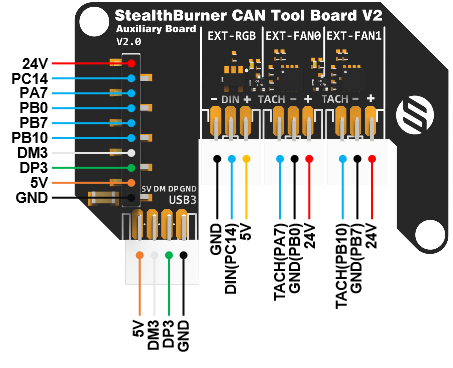

# SB Combo V2

!!! danger

    - Do not use SB1.3 cable directly with V2, their positive and negative positions are reversed.
    - Using SB1.3 cable directly with V2 will 100% damage the V2 board.
    - We strongly recommend replacing with a new cable.
    - If you do not want to replace the cable, please connect the black of the original 1.3 cable to the + pole and the red to the - pole.
    - The CANH and CANL of V2 are also opposite to those of 1.3.


# Introduction

SB CAN V2 is a newly designed SB tool board running Klipper firmware. Based on STM32F072, it provides two communication modes: CANBUS and USB. The onboard USBHUB has up to three USB interfaces, which can be used to connect to the scanning leveling sensor (Scanner Leveling Sensor,such as IDM or Cartographer )and AI camera, etc. It can also be connected vertically with an optional board for easy use.

# Featrues

- STM32F072 MCU, supports Klipper Firmware
- **6-layer PCB design, all solid capacitors and tantalum capacitors**
- Onboard 2 M3 3.5mm isolation columns, no need for printed parts, easy to install
- Onboard CAN/USB switch
- Onboard RESET and BOOT0 buttons for easy firmware update
- Fan control/heating both use independent high-power MOS, safer and lower heat
- **Onboard 5V@3A DC-DC, 5V peak load can reach 15W**
- XT30 interface, customized connection cable comes with the board
- **Onboard USB2.0 HUB, 3x USB2.0 interface (one of which is located on the auxiliary board)**
- **Support CAN / USB2.0 connection**
- Supports auxiliary board connection For front cover quick install & remove Support
- Auxiliary board connection for quick installation and removal of the front cover. You can add 1x USB, 2x 3-wire fans, 1x RGB by the auxiliary board
- Onboard TMC2209
- 3x Fans, 3x IO with level converter, 1x RGB,1x Heat, 1x thermistor,1x status LED
- ADXL345 Accelerometer onboard
- USB-C onboard for Firmware update

# Application

Voron StealthBurner  Head

# Hardware specification

| Function                | SB Combo V2                                                | SB TH CAN V1.3     |
| ----------------------- | ---------------------------------------------------------- | ------------------ |
| Microcontroller         | STM32F072CBT6                                              | STM32F072CBT6      |
| Accelerometer           | ADXL345                                                    | ADXL345            |
| USB Port                | 2 + 1 (For STM32F072) + 1(on aux board), Powered by CH334P | -                  |
| Fan                     | 3+2 (on aux board)                                         | 2                  |
| Heating output          | 1                                                          | 1                  |
| Temperature measurement | 1 (PH2.0 connector) + 1 (on board thermistor)              | 1(PH2.0 connector) |
| Voltage monitoring      | 5V, 24V                                                    | -                  |
| Motor drive             | TMC2209                                                    | TMC2209            |
| Signal input and output | 3                                                          | 3                  |
| RGB light strip control | 1 + 1 (on aux board)                                       | 1                  |
| Aux Board support       | Yes                                                        | No                 |
| Onboard mounting nut    | Yes                                                        | No                 |

# Operating limits

| **Stepper drivers**           | Up to 2.0A peak current                     |
| ----------------------------------- | ------------------------------------------- |
| **Mosfets Outputs**           | HE0 up to 5A , Fan up to 2.5A each          |
| **Input power voltage**       | 11V to 24V for VIN up to 10A                |
| **Inputs/Outputs**            | Signal 20ma maximum, RGB 2.5A total maximum |
| **5V and 3.3V current limit** | 5V@3A ，3.3V@0.8A                           |

# Physical Connections

## Pin Out

### On the SB_Combo Board


IO.0 and IO.1 are located in the same connector and can be used as XY endstops, and IO.2 can be used as a probe. In addition, IO.0, IO.1, and IO.2 have level conversion (with pull-up resistors) and voltage selectors (5V or 24V), which can be compatible with a variety of sensors. The three IOs and RGB can be used as inputs or outputs, and can be configured according to your needs.

```
IO.0: PA2
IO.1: PA3 
IO.2: PA0
RGB: PB11

FAN0: PB6
FAN1: PB5
FAN2: PA4

Heat: PC15
Thermistor: PA6

Driver_EN: PA15
Driver_DIR: PA8
Driver_STEP: PB3
Driver_UART: PA10
Driver_TX: PA9
Driver_DIAG: PB4

spi_bus: spi2
adxl345_cs_pin: PB12
adxl345_spi_software_sclk_pin: PB13
adxl345_spi_software_mosi_pin: PB15
adxl345_spi_software_miso_pin: PB14

CAN_RX: PB8
CAN_TX: PB9

5V_Monitor: PA1
24V_MOnitor: PA5
TMC_Thermistor: PB1
```

### On the AUX Board



```
ext_IO.6: PA7
ext_fan0: PB0
ext_IO.5: PB10
ext_fan1: PB7
RGB: PC14
```

## Description of Connections：


| Connector               | Pin                                 | Default function                                                                           | Altermate      |
| ----------------------- | ----------------------------------- | ------------------------------------------------------------------------------------------- | -------------- |
| P1, Input               | USB (PA11,PA12)`CANBUS (PB8,PB9)` | Power and communication input, USB 2.0 and CANBUS are optional, selected by K2 DIP switch. |                |
| Fan0                    | PB6                                 | Mosfet Output, Printting Fan, Default voltage = VIN.                                       |                |
| Fan1                    | PB5                                 | Mosfet Output, Hotend Fan, Default voltage = VIN.                                          |                |
| Fan2                    | PA4                                 | Mosfet Output, SB Combo Cooling Fan, Default voltage = VIN.                               |                |
| IO.0+1                  | PA2, PA3                            | Digital Input, For X Y endstop, Micro switch or Hall                                       | Digital Output |
| IO.2                    | PA0                                 | Digital Input, For Z probe, Proximity switch or Klicky, etc.                               | Digital Output |
| IO.3, RGB               | PB11                                | Digital Output, For WS2812/SK6812 RGB                                                       | Digital Input  |
| J2, USB1                |                                     | USB2.0                                                                                      |                |
| J1, USB2                |                                     | USB2.0 or CANBUS 2.0, USB 2.0 and CANBUS are optional, selected by K4 DIP switch.           |                |
| TE0                     | PA6                                 | ADC input, 4.7K pull-up, head temperature measure                                           |                |
| HE0                     | PC15                                | Mosfet Output, Heating rod control, 5A Max                                                 |                |
| P2, AUX Board Interface |                                     | For connecting AUX board                                                                    | Other Purposes |
| MOTOR                   |                                     | For two-phase stepper motor,                                                                |                |
| USB1, USB-C connector   |                                     | Connected to the CH334PHUB chip, up to 4 USB2.0 devices (MCU/USB1/USB2/USB3)                |                |

## LED indications：


| LED name | Indicate                                                                                                                                                                                                                                                                               | Remark |
| -------- | -------------------------------------------------------------------------------------------------------------------------------------------------------------------------------------------------------------------------------------------------------------------------------------- | ------ |
| 3V3      | Lights up:  Power supply OK.``Turns off : Power supply failure. 3.3V is obtained by converting 24V to 5V through DC-DC and then to 3.3V through LDO, so there may be a short circuit/open circuit in 24V/5V/3.3V.``                                                                    |        |
| HUB      | Lights up:  The USB has at least one connection.``Turns off: The USB has no connection.                                                                                                                                                                                                |        |
| STATUS   | When using katakulpt ``- Blinking: Entering download mode;``- Off/Always on: Not in download mode, the status is generally determined by config;``- The LED is controlled by PC13 and lights up at a high level. For customized usage, please refer to julianschill/klipper-led_effect |        |
| HEAT     | Lights up or flashes according to the heating PWM                                                                                                                                                                                                                                      |        |

## CAN / USB Switcher


- As shown in the figure, the green-marked toggle switch is responsible for the input CAN/USB switching, which is located on the XT30 connector; the orange-marked toggle
- switch is responsible for the CAN/USB switching at the connector marked as USB2 (MX1.25-4P).

## Jumpers：

IO.0+1 and IO.2 can select the power supply voltage through the jumper cap.
As shown in the figure, the two pins on the left are connected together for 5V, and the two pins on the right are connected together for 24V.

!!! note

    Please note that if these interfaces are used as outputs, the high-level voltage of the output is consistent with the voltage selected by 	the jumper. Please make sure that your peripherals can withstand the range. Generally speaking, only SSR in the accessories of 3D printers 	can withstand 9-36V control voltage.

## Communication

### Connect to Pi

SB combo V2 can be connected to Pi via USB or CANBUS. Select by K2, refer to CAN / USB Switcher.

#### Via CAN

Since the Raspberry Pi does not have a CANBUS interface, it is usually connected only after the CANBUS interface is expanded through an expansion chip. Commonly used ones include the MCP2518 SPI to CAN module (CanHat), USB to CAN module (eg: UCAN), Klipper USB to CAN Bridge Mode, and a Linux host computer with a native CAN interface (eg: CM68).

##### Via UCAN


##### Via MCP2518 CanHat

##### Via MainBoard

##### Native CAN of CM68

#### Via USB

## Connections

Fans

Temperature Sensor

Thermistor

PT1000

### Motor

### Endstops

### Others

RGB

Proximity switches

Klicky

TAP

# FIrmware Guide

### Firmware configuration and compilation

### Katapult Bootloader

> cd katapult
> make menuconfig
> make flash FLASH_DEVICE=0483:df11


### Klipper


## Firmware upload

make flash FLASH_DEVICE=0483:df11

# FAQ

# Attachments and others

- [尺寸：2D，3D ](https://github.com/FYSETC/SB_Combo_V2/blob/main/3D/SB_Combo_V2.step)
- 安装示例：支架（STL）
- 散热：推荐的通风方式
- 温度：MCU，驱动，电源

# How to buy

淘宝，速卖通，亚马逊，官网

# Technical Support Channel

FB / Discord / Forum
