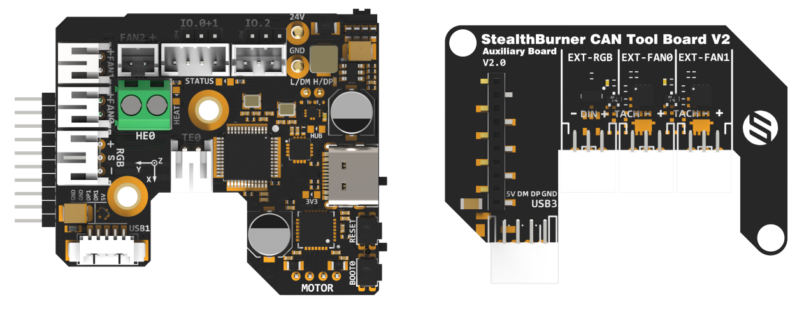
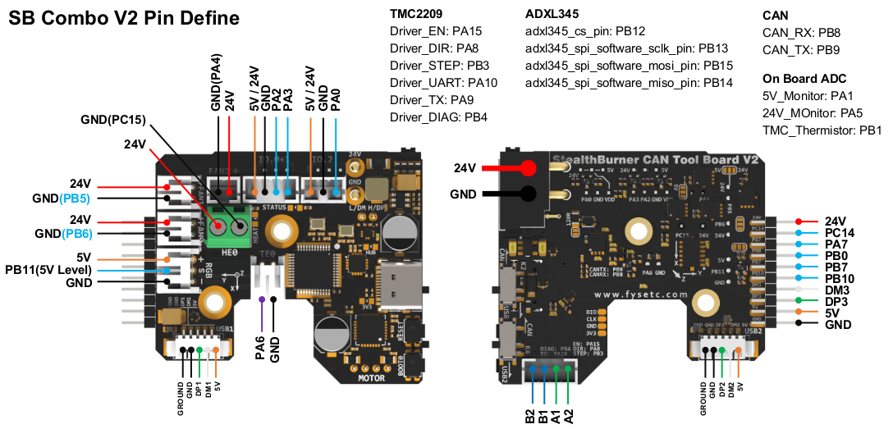

# SB Combo V2

!!! danger

    Lorem Do not use SB1.3 cable directly with V2, their positive and negative positions are reversed.
    Using SB1.3 cable directly with V2 will 100% damage the V2 board.
    We strongly recommend replacing with a new cable.
    If you do not want to replace the cable, please connect the black of the original 1.3 cable to the + pole and the red to the - pole.





# Introduction

SB CAN V2 is a newly designed SB tool board running Klipper firmware. Based on STM32F072, it provides two communication modes: CANBUS and USB. The onboard USBHUB has up to three USB interfaces, which can be used to connect to the scanning leveling sensor (Scanner Leveling Sensor,such as IDM or Cartographer )and AI camera, etc. It can also be connected vertically with an optional board for easy use.

# Featrues

- STM32F072 MCU, supports Klipper Firmware
- **6-layer PCB design, all solid capacitors and tantalum capacitors**
- Onboard 2 M3 3.5mm isolation columns, no need for printed parts, easy to install
- Onboard CAN/USB switch
- Onboard RESET and BOOT0 buttons for easy firmware update
- Fan control/heating both use independent high-power MOS, safer and lower heat
- **Onboard 5V@3A DC-DC, 5V peak load can reach 15W**
- XT30 interface, customized connection cable comes with the board
- **Onboard USB2.0 HUB, 3x USB2.0 interface (one of which is located on the auxiliary board)**
- **Support CAN / USB2.0 connection**
- Supports auxiliary board connection For front cover quick install & remove Support
- Auxiliary board connection for quick installation and removal of the front cover. You can add 1x USB, 2x 3-wire fans, 1x RGB by the auxiliary board
- Onboard TMC2209
- 3x Fans, 3x IO with level converter, 1x RGB,1x Heat, 1x thermistor,1x status LED
- ADXL345 Accelerometer onboard
- USB-C onboard for Firmware update

# Application

Voron StealthBurner  Head

# Hardware specification

| Function                | SB Combo V2                                                | SB TH CAN V1.3     |
| ----------------------- | ---------------------------------------------------------- | ------------------ |
| Microcontroller         | STM32F072CBT6                                              | STM32F072CBT6      |
| Accelerometer           | ADXL345                                                    | ADXL345            |
| USB Port                | 2 + 1 (For STM32F072) + 1(on aux board), Powered by CH334P | -                  |
| Fan                     | 3+2 (on aux board)                                         | 2                  |
| Heating output          | 1                                                          | 1                  |
| Temperature measurement | 1 (PH2.0 connector) + 1 (on board thermistor)              | 1(PH2.0 connector) |
| Voltage monitoring      | 5V, 24V                                                    | -                  |
| Motor drive             | TMC2209                                                    | TMC2209            |
| Signal input and output | 3                                                          | 3                  |
| RGB light strip control | 1 + 1 (on aux board)                                       | 1                  |
| Aux Board support       | Yes                                                        | No                 |
| Onboard mounting nut    | Yes                                                        | No                 |

# Operating limits

| **Stepper drivers**           | Up to 2.0A peak current                     |
| ----------------------------- | ------------------------------------------- |
| **Mosfets Outputs**           | HE0 up to 5A , Fan up to 2.5A each          |
| **Input power voltage**       | 11V to 24V for VIN up to 10A                |
| **Inputs/Outputs**            | Signal 20ma maximum, RGB 2.5A total maximum |
| **5V and 3.3V current limit** | 5V@3A ，3.3V@0.8A                           |

# Physical Connections

## Pin Out



### On the SB_Combo Board

IO.0 and IO.1 are located in the same connector and can be used as XY endstops, and IO.2 can be used as a probe. In addition, IO.0, IO.1, and IO.2 have level conversion (with pull-up resistors) and voltage selectors (5V or 24V), which can be compatible with a variety of sensors. The three IOs and RGB can be used as inputs or outputs, and can be configured according to your needs.
```
IO.0: PA2
IO.1: PA3 
IO.2: PA0
RGB: PB11

FAN0: PB6
FAN1: PB5
FAN2: PA4

Heat: PC15
Thermistor: PA6

Driver_EN: PA15
Driver_DIR: PA8
Driver_STEP: PB3
Driver_UART: PA10
Driver_TX: PA9
Driver_DIAG: PB4

spi_bus: spi2
adxl345_cs_pin: PB12
adxl345_spi_software_sclk_pin: PB13
adxl345_spi_software_mosi_pin: PB15
adxl345_spi_software_miso_pin: PB14

CAN_RX: PB8
CAN_TX: PB9

5V_Monitor: PA1
24V_MOnitor: PA5
TMC_Thermistor: PB1
```
### On the AUX Board

```
ext_IO.6: PA7
ext_fan0: PB0
ext_IO.5: PB10
ext_fan1: PB7
RGB: PC14
```
## Description of Connections：


## LED indications：


| LED name | Indicate                                                     | Remark |
| -------- | ------------------------------------------------------------ | ------ |
| 3V3      | Lights up:  Power supply OK.<br/>Turns off : Power supply failure. 3.3V is obtained by converting 24V to 5V through DC-DC and then to 3.3V through LDO, so there may be a short circuit/open circuit in 24V/5V/3.3V.<br/> |        |
| HUB      | Lights up:  The USB has at least one connection.<br/>Turns off: The USB has no connection. |        |
| STATUS   | When using katakulpt<br/>- Blinking: Entering download mode;<br/>- Off/Always on: Not in download mode, the status is generally determined by config;<br/>- The LED is controlled by PC13 and lights up at a high level. For customized usage, please refer to julianschill/klipper-led_effect |        |
| HEAT     | Lights up or flashes according to the heating PWM            |        |

| LED name | Indicate                                                     | Remark |
| -------- | ------------------------------------------------------------ | ------ |
| 3V3      | 亮：电源正常。 <br/>灭：电源故障。3.3V是由24V经过DC-DC转5V再经过LDO转3.3V得来的，所以可能24V/5V/3.3V出现了短路/断路之类的不良。 |        |
| HUB      | 亮：USB至少有一个连接。<br/>灭：USB没有任何连接。            |        |
| STATUS   | 在使用 katakulpt时<br>闪烁：进入下载模式；<br>灭/常亮：非下载模式，此时状态一般是由config所决定；<br>该LED由PC13控制，高电平点亮，自定义用法可参考[julianschill/klipper-led_effect](https://github.com/julianschill/klipper-led_effect) |        |
| HEAT     | 根据加热的PWM亮灭或者闪烁                                    |        |

## CAN / USB Switcher 


- 如图所示，绿色标记拨动开关负责输入CAN / USB切换，处于XT30连接器上；
- 橙色标记拨动开关负责标记为USB2的连接器（MX1.25-4P）处 CAN / USB切换。
- As shown in the figure, the green-marked toggle switch is responsible for the input CAN/USB switching, which is located on the XT30 connector; the orange-marked toggle - switch is responsible for the CAN/USB switching at the connector marked as USB2 (MX1.25-4P).

## Jumpers：
IO.0+1和IO.2可以通过跳线帽进行供电电压选择，如图所示，左侧两个Pin连接在一起为5V，右侧两个Pin连接在一起为24V。

IO.0+1 and IO.2 can select the power supply voltage through the jumper cap. As shown in the figure, the two pins on the left are connected together for 5V, and the two pins on the right are connected together for 24V.

## Input/Output：

描述各个预留IO的输入输出能力，ADC / PWM / SCL / SPI等通信

## Power distribution：

- VIN
- 24V
- 12V
- 5V
- 3.3V
> [!Note]

## Communication

### Connect to Pi

#### Via CAN

##### Via UCAN

##### Via MainBoard

##### Native CAN of CM68

#### Via USB

## Connections

FAN风扇/3线/4线

### 连接温度传感器

热敏电阻

 PT1000 

### 连接电机

### 限位开关
### 其他连接
RGB

接近开关 

Klicky

TAP

# FIrmware Guide

## 固件配置和编译

### Katapult Bootloader

>cd katapult
>make menuconfig
>make flash FLASH_DEVICE=0483:df11


### Klipper

  

  

  

  

## 固件上传

make flash FLASH_DEVICE=0483:df11


# FAQ

# 附件及其他

  - [尺寸：2D，3D ](https://github.com/FYSETC/SB_Combo_V2/blob/main/3D/SB_Combo_V2.step)
  - 安装示例：支架（STL）
  - 散热：推荐的通风方式
  - 温度：MCU，驱动，电源

# 如何购买

淘宝，速卖通，亚马逊，官网

# 技术支持通道

FB / Discord / Forum
