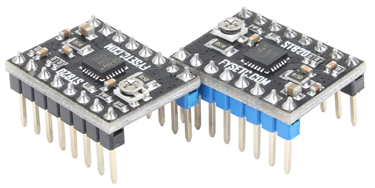
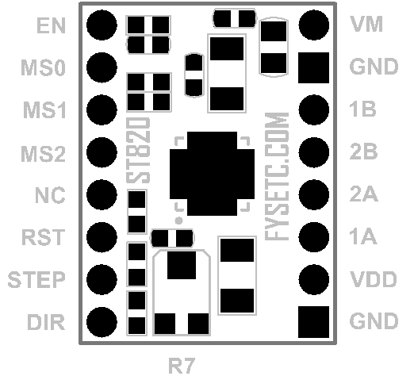
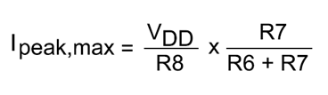
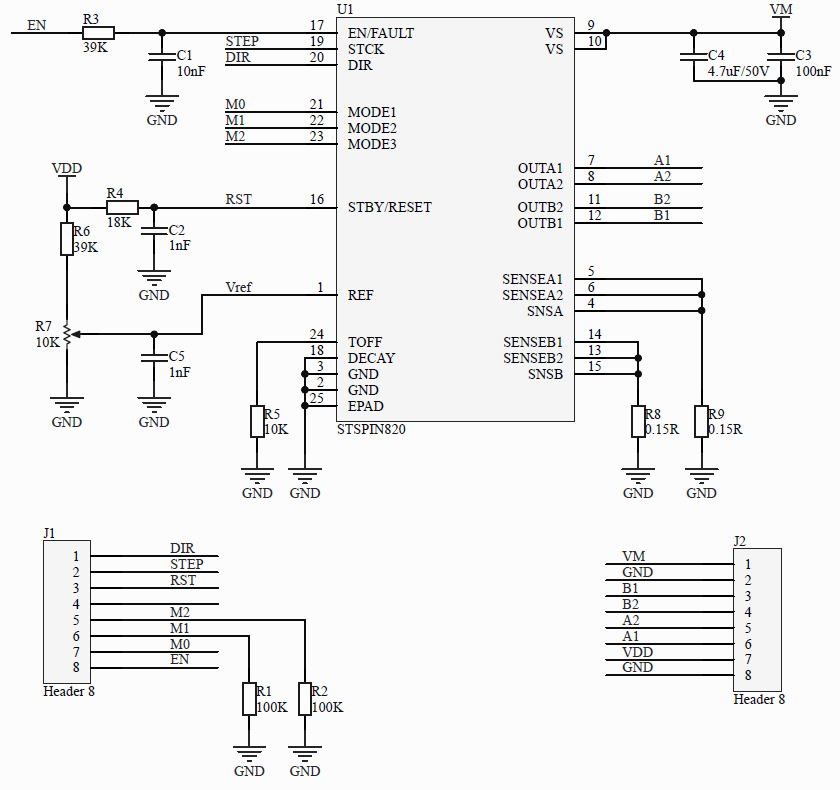

## Introduction
---

The ST820 is an easy to use Driver board for the 3D printer,Router and so on. providing a compact solution to  the stepper motor driver with minimal external equipment and without the need for extra components.

The hardware is fully compatible with RepRap Arduino Mega Poloulo Shield (RAMPS) or other similar Fused Filament Fabrication (FFF) 3D Printing platforms, representing a very fast drop-in replacement of similar solutions. Contrary to most other competitor solutions, the ST820 helps customers to really exploit the benefits of working at high microsteppingresolution.

## Board overview
---

The main characteristics of the board are:
• Supply voltage from 7 V to 45 V
• Output current up to 1.5 A rms for each motor phase
• Peak current regulation through trimmer
• Form factor and connectivity compatible with RAMPS (RepRap Arduino Mega Pololu Shield) or similar
boards
• Based on STSPIN820 driver featuring:
      – Stepper motor driving with a microstepping resolution up to 1/256th of step
      – Overcurrent, short-circuit and overtemperature protections

| J1   | Signal                          | J2   | Signal                     |
| ---- | ------------------------------- | ---- | -------------------------- |
| 8    | Enable (EN)                     | 1    | Motor supply voltage (VM)  |
| 7    | Step mode selection input (MS0) | 2    | Ground                     |
| 6    | Step mode selection input (MS1) | 3    | Phase B out 1 (OUTB1)      |
| 5    | Step mode selection input (MS2) | 4    | Phase B out 2 (OUTB2)      |
| 4    | NC                              | 5    | Phase A out 2 (OUTA2)      |
| 3    | Active low standby (nSTBY)      | 6    | Phase A out 1 (OUTA1)      |
| 2    | Step-clock input (STEP)         | 7    | Logic supply voltage (VDD) |
| 1    | Direction input (DIR)           | 8    | Ground                     |

## Setting the step mode
---

The inputs MS0, MS1 and MS2 sets the step mode of the STSPIN820 driver as listed in the table below.

| MS2  | MS1  | MS0  | Step Mode  |
| ---- | ---- | ---- | ---------- |
| 0    | 0    | 0    | Full-step  |
| 0    | 0    | 1    | 1/2 step   |
| 0    | 1    | 0    | 1/4 step   |
| 0    | 1    | 1    | 1/8 step   |
| 1    | 0    | 0    | 1/16 step  |
| 1    | 0    | 1    | 1/32 step  |
| 1    | 1    | 0    | 1/128 step |
| 1    | 1    | 1    | 1/256 step |

## Adjusting motor peak current
---

The R7 trimmer adjusts the reference voltage of the STSPIN820 PWM current controller setting the peak current input to the motor phases.

The R7 trimmer controls the current level. Rotating clockwise increases and rotating counter clockwise decrease the current level.

The range depends on the VDD logic supply voltage (pin 6 of J2) as listed in the table below.

| VDD  | Minimum                         | Maximum                              |
| ---- | ------------------------------- | ------------------------------------ |
| 3.3V | VREF   = 0 V   Ipeak   = 0 A(1) | VREF   = 0.67 V   Ipeak   = 4.5 A(2) |
| 5V   | VREF   = 0 V   Ipeak   = 0 A(1) | VREF   = 1 V   Ipeak   = 6.8 A(2)    |

(1) Minimum current could be present due to the PWM current control operation

(2) The overcurrent protection of the STSPIN820 could limit the actual peak current

## Modify the peak current range
---

The trimmer can be adjusted by modifying some board components.

In particular the components contributing to the definition of the peak current are:

• Both the sensing resistors

• Pull-up resistor (R6 = 39K)

• Sensing resistor (R8 and R9 = 0.15R)

The detailed formula is the following:

-

Changing the sensing resistors requires particular attention:

• Bust the sensing resistors must have the same value

• Power dissipation on the resistors is equal to Ipeak2 × Rsense. The power rating must be selected accordingly.

!!!Note
    **Warning!** Some of the components mounted on the board could reach hazardous temperatures during operation.
    
    While using the board, please adhere to the following precautions:
    
    - Do not touch the components
    
    - Do not cover the board
    
    - Do not put the board in contact with flammable materials of with materials releasing smoke when heated
    
    After operation, allow the board to cool down before touching it.

## Schematic

---

## Shop
---
[ST820](https://www.aliexpress.com/store/product/5pcs-Stepping-Motor-Driver-Stepstick-ST820-Smallest-45V-Microstepping-Peak-Current-2-5A-RMS-Current-1/3480083_32900392512.html)

##Tech Support

---
Please submit any technical issue into our [forum](http://forum.fysetc.com/) 