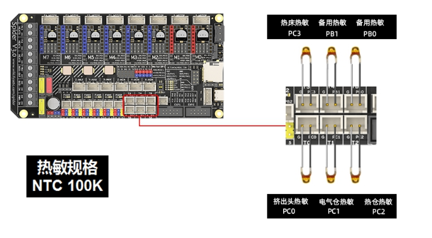

####  蜘 蛛 宝 典

用蜘蛛3.0主板玩转Voron2.4

本教程基于大树代笔的葵花宝典第一版更新修改版权所有，未经许可，切勿用作商业用途，违者必究！ 

####  前言

大家好，当你看到这篇文章，我想你一定是对一台叫做Voron的3D打印机产生了兴趣，或者你正在组装一台属于你自己的Voron2.4打印机。的确，Voron是非常棒的全球开源3D打印机项目。无论从外观设计、功能先进性到最终优秀的打印效果，都是创客手中不可多得的必备工具。Voron官方为每一个机型都准备了机械安装手册，但是很多爱好者都卡壳在电控方面的安装和调试。为了能让大家少走弯路，我决定整理一份关于Voron2.4的电控教程，帮大家避避坑。能力有限，还望大家多多提出宝贵意见。

大家也可以访问VoronDesign的官方网站www.vorondesign.com或中文网站www.cnvoron.com获取更多有关开源Voron打印机的相关信息。

 

# 安全

重要的事当然是放在最前面说啦。在Voron2.4电子线路布线时，你会用到交流220V市电。在接触任何带电的电线或端子之前，请务必拔掉打印机的插头，且等待1-2分钟，确保电源中的所有电容已放电。很多机友家中的三脚插座可能没有按规范接线，火线零线接反，还有些插座内没有接地线，或者全屋接地悬空。如果对自己家的插座不放心，可以买个简易测试仪（如下图）测试一下。为了确保人身安全，请确保打印机的框架可靠接地，并使用带有漏电保护功能的插座、接线板。

 

 打印机通电时，切勿插拔任何设备（无论是高电压或低电压）除了存在安全隐患外，还很可能会损坏电子元件。特别值得注意的是步进驱动器，在通电时插拔步进电机的线束，很容易造成驱动器的永久损坏，切记！切记！切记！

#  1、硬件篇

## 1.1 蜘蛛是个啥 

这里说的蜘蛛可不是八脚恐怖爬虫，而是Spider主板，是深圳富源盛电子科技有限公司FYSETC全新打造的一款可以支持8路步进电机的3D打印机控制主板。

 

## 1.2 蜘蛛主板的参数和特性

- 外观尺寸： 155.3mm x 76.5mm

- 基于 STM32F446 180Mhz 主控设计，所有 IO 都能承受 5V 电压

- 支持8 路 TMC 电机驱动，支持 UART及SPI 协议

- V2.2：增加两个最大 60V 电压支持的电机驱动插座，改进TMC驱动跳线设置，更简单、更容易

- V2.2: 最大 28V 输入，集成 12V@3A DC-DC，5V@5A DC-DC (用于树莓派)，5V@3A DC-DC ( 用于MCU 和 RGB ) , 两路 [3.3V@0.8A](mailto:3.3V@0.8A) LDO ( 用于MCU 和电机 )

- 配置两路汽车保险丝为主电源输入和热床输入提供保护

- 限位开关 24V/5V/3.3V 三级电压可选，同时支持更多的位置检测设备，如接近开关，BL-Touch 等

- XH2.54 接插件

- 10路 PWM 功率场效应管输出（1路热床，3路热端，3路风扇，3路 RGB 灯带）

- V2.2: 支持最多 6 路温度传感器

- 最多 8 路 PWM 风扇输出（在只有1个挤出头和无 RGB的情况下），支持2路 RGB 灯（12V & 24V 电压可选），1 路 5V RGB 灯（NEO-PIXEL / WS2812）

- 板载 RepRapDiscount SmartController 屏幕兼容接线插座

- 提供 2X5 树莓派串口及供电（5V@8A）接线端子

- 提供用于SD 卡外接模块的 2X4 接线端子

- 板载 micro-SD 卡座

- Type-C 和 Type-B USB 接口可选

- EXP1 & EXP2 提供更多复用功能，如 USART, I2C, CAN

- 支持 SD card & USB 固件上传

- 板载温度传感器端口 4.7k 0.1% 上拉电阻，可直接接 PT1000，PT100 也可通过运放模块接入。

- V2.2: 增加更多保护电路 （每路电机驱动增加 TVS 管，限流电阻，增加 VMOT 保险丝）

## 1.3 蜘蛛主板的接线---电源输入、输出

很多新手会很迷茫，在拿到主板以后就迫不及待的把主板安装到机器上。其实一块新的主板还需要做很多的准备工作，确认可以正常工作了，再装到机器上接线，这样可以避免很多不必要的麻烦，先来看看怎么给蜘蛛主板供电吧。

**Power In**：蜘蛛主板推荐使用24V供电，根据外设的数量，选用200-300W的优质开关电源供电（例如：明纬电源、普德新星电源）。使用AWG18# - AWG14#线从开关电源的DC输出端子接至主板Power In端子 。使用足够粗的供电线缆可以减小电压降，保障主板的稳定。

**Power Out**：可输出两路12V和两路24V电压，用于给其他外部设备供电，请注意总电流不要超过主板最大输出范围。

新增48V输出接口：为M1、M2驱动位输出电压提供更多选择。

选择48v / 24v 供电，电压输入端子接线如下图展示，驱动 24v 接线方式——短接24v-PIN与48v-PIN，驱动外接48v电源接线——短接48V-PIN和GND-PIN。

 

**MCU Power**：MCU供电选择跳线，可以由USB供电或由内部DC-DC电源供电，在烧录固件及调试主板时可以使用USB供电（EXP1和EXP2没有连接在USB供电上，所以仅由USB供电的时候连接在此处的设备不会工作，比如屏幕不会亮起），平常使用请选择内部DC-DC电源供电。

### 1.4 步进电机的接线

#### 1.4.1 步进驱动器的跳线设置

常见的步进驱动模块无外乎3种：一种是STEP/DIR模式。主要通过硬件跳线来设置细分，通过调电位器来改变电流大小，比如最常见最经典的A4988驱动。如果使用这类传统步进驱动，需要查询所使用的步进驱动厂家提供的细分配置表，然后用跳线帽来进行细分设置。 **注意：高电平在上，低电平在下。**

第二种是UART模式。最具代表性是德国Trinamic公司的TMC2208 TMC2209 TMC2225 TMC2226等，这类芯片可与主控IC进行Uart异步串行通信，所以细分设置、电流大小、静音功能等，都可以通过软件进行调节。UART模式时，需要按下图方式进行跳线设置。

 

第三种是SPI模式。最具代表性是德国Trinamic公司的TMC2230 TMC5160 TMC5161 TMC2240等，这类芯片可与主控IC进行SPI通步串行通信，通信速率更快，且这类芯片都具备一些高级功能，都需要通过SPI总线进行配置，例如堵转检测，电流动态控制，防抖动功能，静音驱动，斜坡发生器，力矩动态调节等等。**SPI模式时，需要按下图方式进行跳线设置。**

 

 

**如果你使用的是其他厂家的步进驱动，引脚可能有所不同。请根据所购模块厂家提供的资料进行跳线、使用。**

### 1.4.2 步进驱动器的安装

将驱动器附赠的散热片贴在**步进驱动器铜箔的顶部**，有条件的话，建议使用风扇对驱动器进行辅助散热，否则你可能会打印件错层等其他问题。这一点对于TMC 2208s尤为重要，因为它们具有更高的RDSon，在相同的电流下会产生更多的热量。

**注意！！！**

安装驱动模块时一定要确保方向正确。如果你把驱动器插反了，可能你会看见“昂贵的烟花”。步进驱动器的两排杜邦插座使用了不同的颜色，一排是黑色的，一排是蓝色的，请将驱动模块按颜色与插座的一一对应插入。

### 1.4.3 步进电机的接线

3D打印机一般使用的都是两相步进电机，其内部是由两组线圈绕制而成，原理图如下。使用万用表蜂鸣档测量步进电机的4根线，同相线圈的两根线会发出声音，不同相不会有声音。插座上1/2为一相，3/4为另外一相，交换两相的位置可以变换电机转动方向。

将XY电机、挤出机电机和4Z的电机（共7个电机）插入对应的插座（除X、Y电机有48V输出需求外，电机插座顺序和位置皆没有特别要求，但是配置的时候需要正确设置每个电机驱动的对应Pin脚）。

余出的1个驱动插座为预留的第二挤出机的电机驱动使用，如果不使用，可以不插驱动器。

 

## 1.5 热床、喷头加热块接线

Voron2.4是一款可以封箱打印高温材料的打印机，所以需要一款大功率的交流热床，才能在打印过程中保障床身温度的稳定及仓温的稳定。一般的打印机主板不能直接控制交流热床，需要借助交流固态继电器（SSR）来进行控制，具体的接线见下图。

**加热棒**的接线不区分正负极，请将加热棒接至主板**E0 OUT**接口。

**注意！！！**为确保用电安全，请将金属机架进行可靠接地。

 

 

## 1.6 温度传感器的接线

蜘蛛主板可以接入6路温度传感器，可以满足Voron2.4的测温需要。常规的NTC100K热敏电阻可按照下图接线方式直接连接：

 

## 1.7 散热风扇的接线

 

## 1.8 限位传感器的接线

限位开关有常开（NO）和常闭（NC）之分。在Voron2.4的机型上，我建议大家使用常闭（NC）的方式（如下图），这样在线缆开路或者开关触点接触不良时，软件会有报错提示，可以避免因复位开关失灵而导致的撞头。

 

## 1.9 Probe调平传感器

Voron2.4官方建议使用的是PL08N传感器来进行热床调平，由于PL08N是使用24V供电，它的输出引脚在高电平状态下为24V，这大大超出了MCU 引脚的耐受范围。蜘蛛主板的Z+端口，内置了BAT85二极管用作高低电平隔离，所以可以直接将PL08N传感器直接插入Z+端口，而不需另外去外接二极管。另外Z+端口的供电是可以通过跳线帽去选择的，在使用PL08N传感器时，请将跳线帽按下图位置插入。

由于市面上很少能买到PL08N的正品，所以很多网友想改用BL-Touch传感器来进行热床调平。BL-Touch需要3根线为舵机供电，2根线用作信号的输出，使用时按上图所示进行连接，请仔细确认连线是否正确

**注意：BL-Touch是5V供电的器件，必须要按上图将Z+的供电跳线插入5V端。错误的电压设置可能会永久性损坏主板及传感器，切记切记切记！！！**

##  

## 1.10 Mini12864接线

Voron2.4官方推荐是字符型的Mini12864显示屏，需要使用2根16pin的排线将Mini12864与蜘蛛相连接，排线和插座有防呆设计，直接将排线插头的凸起点对准插座的缺口插入即可。

**注意：在连接排线的时候，Spider需要按照下图的提示，Exp1对exp1，Exp2对exp2，否则可能无法正常点亮显示屏，切记切记切记！！！**
由于各个厂家的引脚定义不同，如需连接其他厂家的Mini2864，可以至[FYSETC-SPIDER说明文档](#32-fysetc-mini-12864-v21-接线)查看相关信息。

## 1.11 RGB灯带接线

为了让机器机箱内更漂亮更炫，可以在机箱内使用RGB全彩灯带来作为氛围灯，并且可以编辑一些自定义的宏，让灯带自动的变换颜色。这里给大家介绍的是采用内置WS2812驱动的灯带，它主需要一组5V供电和1根信号线，便可以控制灯带的色彩、亮度的变换。蜘蛛主板提供了专用的接口，接线方式如下图。

**注意：主板5V最大输出8A（当输出电流大于6A时，DCDC电路需要加散热片）。如果你的蜘蛛主板同时也在给树莓派供电，那么建议RGB灯带不要超过50个灯珠，以免主板电压不稳定，影响到打印。**

## 1.12 树莓派接线

蜘蛛主板提供了2种通讯方式与树莓派连接，一种是使用USB端口，一种是Uart端口，并且蜘蛛主板可以直接为树莓派供电，这样可以省去单独的5V开关电源。下面我来介绍下两种方式。

### 1.12.1 蜘蛛主板与树莓派的连接--Uart

可以使用蜘蛛主板包装内附送的线束，按下图所示方式将蜘蛛主板与树莓派进行连接，在主板接通24V电源的同时，树莓派也将得电启动。

由于树莓派3、3B、4等型号，板载的蓝牙串口占用资源，需要通过下列操作，将串口功能重新映射到GPIO14和GPIO15后才可正常工作。

**第一步**

输入以下命令配置树莓派串口

sudo raspi-config

=> Interfacing Option=> Serial Port=> NO=> YES=> OK=> Finsh

 

**第二步**

输入以下命令编辑/boot/config.txt

sudo nano /boot/config.txt

=> 在文件最底部添加如下字段 :

dtoverlay=pi3-disable-bt

保存退出，输入一下命令重启

sudo reboot

 

**第三步**

sudo nano /boot/cmdline.txt

=>删除以下字段 ： "console=serial0,115200"或者 "console=ttyAMA0,115200"

sudo reboot

### 1.12.2 蜘蛛主板与树莓派的连接--USB

使用USB Type C线缆连接蜘蛛主板与树莓派，此时树莓派供电可以使用上述Uart线束，或者使用其他5V电源给树莓派供电也可。

使用USB方式连接，不需要进行特别的软件设置。

以上介绍了基本硬件的连接及注意事项，机友们在接线过程中一定要仔细看清楚，通电前再次的仔细检查，特别是供电的线束正确的连接，避免烧毁硬件，影响装机的心情。
