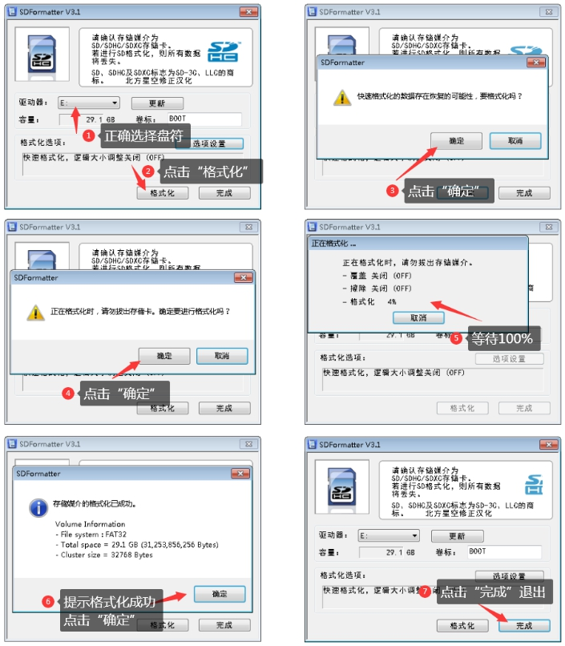

# 2、软件篇

## 2.1 Klipper简介

介绍完硬件了，下面来介绍一下软件。接触过3D打印机的朋友对固件一词应该不陌生，很多人都自己编译过marlin固件。但是Voron2.4官方推荐使用的固件是一款基于树莓派的3D打印机固件--klipper。

有关Klipper的相关知识，可以访问klipper的官方网站(http://www.klipper3d.org/)


目前Klipper的可视化操作界面主要有以下3种:

Octoprint 官方主页： https://octoprint.org/

Mainsail 官方主页： https://docs.mainsail.xyz/

Fluidd 官方主页： https://docs.fluidd.xyz/

它们之间的关系可以见下图：

 

本文主要以目前较为活跃的轻量级系统--Fluidd来介绍Klipper的安装及使用。以上所说的Fluidd、klipper等等一系列软件并不是直接在打印机主板上用的，而是需要安装在树莓派里的，这就需要有一定linux操作知识。如果一点也不懂的也没关系，跟着我给的步骤一步步操作，相信你也能自己把系统安装好。


## 2.2 安装Fluidd系统镜像

Fluidd官网提供了树莓派系统的专用镜像--FluiddPI，这个镜像已经预安装了Fluidd、Klipper、Moonraker及一些必须的系统依赖。使用这个镜像可以省略不少麻烦，当然如果有一定操作能力的网友也可以参照Fluidd官网说明，在其他linux系统里去手动安装Fluidd，这里我就不再展开介绍。

### 2.2.1 硬件准备：

- 树莓派3B、3B+或者4B

- 一张不小于16G的TF存储卡

- 一个TF读卡器

- 一台安装有windows操作系统的PC。

### 2.2.2 软件准备：

- SDformatter v4.0及以上版本

- balenaEtcher v1.5及以上版本 下载地址：https://www.balena.io/etcher/

- Notepad++ 最新版本 下载地址：https://notepad-plus.en.softonic.com/

- Xshell6Portable 下载地址：https://www.netsarang.com/zh/free-for-home-school/

- WinSCP 最新版本 下载地址：https://winscp.net/eng/docs/lang:chs

- FluiddPI最新镜像 下载地址： https://docs.fluidd.xyz/installation/fluiddpi

Fluidd镜像下载如下图

 

### 2.2.3 烧录镜像：

1、将TF卡插入读卡器，将读卡器插入电脑USB接口，使用SDformatter对TF卡进行格式化。

注意：此操作会删除TF卡上所有的数据，请做好数据备份

具体操作见下图：

2、烧录镜像


按下图顺序进行操作：


 


## 2.3 设置树莓派连入无线网络


1、安全弹出读卡器，并重新插入读卡器。系统将识别到一个256M大小的分区，打开该分区找到“fluiddpi-wpa-supplicant.txt“。使用Notepad++打开该文件找到下列字段。


2、使用Notepad++打开该文件找到下列字段。


3、删除相关设置的注释符“#”，设置路由器热点名称及连接密码，保存退出。

4、将TF卡插入树莓派接通电源，树莓派将自动启动。启动期间，绿色的指示灯将无规律闪烁。约1分钟左右，启动完成。


5、打开路由器管理界面，查看新连入网络的设备，并记录IP地址。

## 2.4 第一次打开Fluidd的Web界面


在浏览器地址栏输入上述IP地址，可以打开Fluidd的Web页面。第一次打开，由于还没有正确的配置klipper，状态栏会有报错信息，当我们正确配置了klipper后，这些报错信息将会消失。


## 2.5 编译主板的Klipper固件

前面我们介绍了上位机程序的安装方法，现在我们要利用klipper来生成一个主板的固件，主板刷入了这个固件之后，才能接受klipper的指令，控制相应的电机、热床，反馈传感器信息等。

### 2.5.1 建立SSH连接

树莓派的linux的系统连入网络后，可以通过SSH进行远程设置。它不像我们传统的windows操作系统，有图形界面，所有的操作都要通过键盘输入文本或者命令来执行，所以接下来先给大家介绍如何远程连接到树莓派。

打开XShell软件 ，建立新的连接：

名称：可任意输入

协议：选择“SSH”

主机：在路由器里查询到的树莓派IP地址

端口号：22

 

 

接受并保存安全密钥，输入用户名：pi，密码：raspberry

注意：为了安全起见，建议使用 sudo raspiconfig命令进入树莓派配置界面，通过System

Options>--Password选项更改密码。

 


 

在通过以上的验证后，将会看到下图的界面，这个就是linux操作系统的用户界面，称之为shell。

 

### 2.5.2 树莓派换国内源

树莓派系统里安装软件，就像我们的苹果手机一样，有一个专门的软件仓库。默认的仓库地址是国外的服务器，所以在进行一些软件安装的时候会非常的慢，我们可以通过下面的操作把仓库的地址设置为国内镜像服务器的地址。

在shell中输入sudo nano /etc/apt/sources.list

 

修改树莓派应用软件源

进入文档编辑界面，将原国外服务器地址前加#进行注释，换行输入国内镜像服务器地址：

deb http://mirrors.ustc.edu.cn/raspbian/raspbian/ buster main contrib non-free rpi

修改完“Ctrl+X”保存退出。如下图

 

修改树莓派系统源

在shell输入 sudo nano /etc/apt/sources.list.d/raspi.list

进入文档编辑界面，将原国外服务器地址前加#进行注释，换行输入国内镜像服务器地址：

deb http://mirrors.ustc.edu.cn/archive.raspberrypi.org/debian/ buster main


修改完“Ctrl+X”保存退出。

### 2.5.3 升级树莓派系统及软件

更换好国内源，就可以对树莓派的系统和软件进行升级，新的系统和软件会修复一些已知的bug，建议升级。（此步骤不是必须的，也可跳过）

在shell中输入 sudo apt-get update && sudo apt-get upgrade -y

约5-10分钟左右升级完毕


输入sudo reboot 重启树莓派。

### 2.5.4 升级klipper

klipper不是linux自带的软件，所以还是需要手动升级。新的版本会支持一些新的功能，建议及时升级。升级方法如下：

重新连接SSH

在shell中输入 cd ~/klipper && git pull

约1-2分钟左右会自动执行完升级。升级成功后会有如下显示


有些时候，由于服务器连接速度等原因，可能会升级不成功，可重复执行命令进行升级。

### 2.5.5 配置固件参数、生成固件

主控板需要刷入Klipper的固件才可以被树莓派上的Klipper调用控制，生成固件前，需要根据不同的主板进行参数的配置，具体操作如下

1、在shell中输入 cd ~/klipper && make menuconfig 进入固件配置界面

Spider蜘蛛主板采用USB电缆与树莓派链接，可以采用如下配置方式，配置完毕后按“Q”键退出，再按“Y”键保存。

蜘蛛主板默认自带32k bootloader,如果在烧录过程中丢失，请按照如下方式选择：

 


2、在shell中输入 make clean ，清除前一次的编译所产生的object文件及可执行文件。


3、在shell中输入 make ，系统开始编译固件，直至完成。编译完成，会显示当前klipper的版本号，生成的固件名称为klipper.bin，存放在~/klipper/out目录下。

4、使用WinSCP复制klipper.bin文件到你的桌面，并将其重命名为firmware.bin。

 

## 2.6 蜘蛛主板烧录固件

### 2.6.1 使用TF卡烧录固件

- 准备一张容量不大于32G的TF卡，使用SDformater工具，将其格式化为Fat32格式，将前面生成的firmware.bin拷入卡中。

 

- **确保蜘蛛主板没有通电，将TF卡插入蜘蛛主板。**

- 给主板通电，等待20S左右后，断开电源，取出TF卡插回电脑，如果固件已被重命名，说明固件已烧录成功。


### 2.6.2 使用DFU方式烧录固件（线刷）

- 正常的情况加建议大家用卡刷的方式来烧录固件，如果主板的Bootloader被破坏，没有办法进行卡刷，可以用以下方式来恢复主板的Bootloader。

- 什么是Bootloader，其实它是一段特殊的程序，他会在主板上电的时候检测TF卡槽内是否插入了卡片，如果已经插入了TF卡，它会去卡片内检索是否有firmware.bin文件存在，如果有这个文件存在，便开始更新主板MCU Flash存储器内部的程序，更新完成后会将firmware.bin重命名为old.bin。如果主板上电启动的时候，没有发现TF卡，或者TF卡里没有firmware.bin文件，Bootloader将会自动跳转到Bootloader offset设定的地址，运行我们烧录进去的程序。所以一旦Bootloader offset设置错误以后，固件虽然烧录进去了，但是主板往往是不会正常工作的。

- 下载并安装烧录软件[stm32cubeprogrammer](https://www.st.com/zh/development-tools/stm32cubeprog.html)

- 下-载蜘蛛主板的[bootloader固件](https://gitee.com/fysetc-mirrors/FYSETC-SPIDER/tree/main/bootloader)

 

 - 按下图对主板跳线U5V，再按下Bt0 3.3V 复位键，使用TypeC数据线将主控板与PC连接（无需24V供电）


- 打开stm32cubeprogrammer，选择USB连接后，刷新端口，会自动检测到主控板的端口，如果没有检测到，可以尝试按一下主板上的reset按键，或者检查线缆连接是否正确，主板跳线是否正确。


- 点击“connect”，连接主控板

 


- 点击左侧“下载”选项卡，选择Bootloader的固件，并点击“Start Programming”开始烧录

约3-4S，烧录完成并提示成功。

 


- 主控板断开USB线缆，并将跳线恢复至下图所示：


- 以上方式为STM32系列MCU通用烧录方式，不限于Bootloader固件，其他的固件烧录也可使用，烧录时注意设置正确的偏移地址。

## 2.7 主板ID的读取

主板的ID是主板的唯一识别码，klipper可以通过识别ID来同时控制多块主板协同工作，这个ID也是klipper配置文件里必不可少的参数，下面就来看下如何读取ID。

将树莓派通过USB TypeC电缆与树莓派相连（连接方法见1.12.2），并接通树莓派与主控板的电源

在shell中输入 ls /dev/serial/by-id/*

如果主板的固件烧录正确，将会有如下显示

其中蓝色字符部分 /dev/serial/by-id/usb-Klipper_stm32f446xx_0C001C00115053424E363620-if00即为主板的ID，将其复制保存到文本文件中备用。

## 2.8 printer.cfg文件修改

printer.cfg是klipper重要的配置文件，关于打印机的所有参数，都是需要在这份文件里进行配置。

蜘蛛主板提供了针对Voron2.4打印机的配置文件（见附录1），或者参考 FYSETC 的配置文件

github: [FYSETC-SPIDER/printer.cfg at main · FYSETC/FYSETC-SPIDER (github.com)](https://github.com/FYSETC/FYSETC-SPIDER/blob/main/firmware/Klipper/printer.cfg)

gitee: [firmware/Klipper/printer.cfg · FYSETC/FYSETC-SPIDER - 码云 - 开源中国 (gitee.com)](https://gitee.com/fysetc/FYSETC-SPIDER/blob/main/firmware/Klipper/printer.cfg)

在“配置”选项卡里找到“+”，点击添加文件（如下图）


输入文件名“printer.cfg”，点击保存。

 

单击新添加的文件“printer.cfg”，选择“编辑”。

 

进入编辑界面，将本文最后附录内的SPIDER主板的配置信息复制粘贴到此文件内，并根据配置文件的中文注释，修改相关内容。最后点击保存并重启。

 

如各项参数全部正确，Klipper会自动连接打印机，工具栏等会自动显示，按钮可以操作。

 

## 2.9 Klipper常见错误

TMC UART Error:TMC驱动程序和Spider主板之间的通讯失效时，就会出现这种情况。引起上述故障可能没有给Spider主板提供24V的电源（TMC驱动器没有启动），或者TMC步进驱动模块没有插入正确的位置，或者驱动器的跳线设置错误，请重新检查以上问题点。

 

***\**ADC Error:\**\*** ADC是 "模数转换器 "的缩写，用于将热敏电阻读数转换为挤出头和热床的温度。作为一 种安全预防措施，一旦Klipper检测到温度超过最大或最小阀值（热敏电阻可能开路或者短路），系统将进入关闭保护模式。请仔细检查，确保热敏电阻被插入到正确的插座上。

 

Currently Throttled： 树莓派供电不足或电压不稳时，将会有如下报错，需更换更粗的电源线或者更换

更大功率的电源。

 

## 2.10 Klipper故障排除

可以通过下载和分析“KLIPPER.LOG”日志文件，协助查找引起故障的原因。


## 2.11 Klipper 配置检查

期待已久的时刻——您的打印机终于能工作了！ Klipper有一个非常有用的配置检查指南，它将有

助于确保打印机各个部件工作正常。 请按照以下网址中详细说明的步骤操作：

https://github.com/KevinOConnor/klipper/blob/master/docs/Config_checks.md

### 2.11.1 X Y Z轴限位开关检查

确保X、Y和Z轴的限位开关都没有被按下，然后通过终端控制台发送命令：

```
QUERY_ENDSTOPS
```

终端窗口应有如下返回值 ，如果其中某一个轴的返回值是“triggered”（触发）而不是“open”（打开），请检查限位开关是否被按下。

```
Send:QUERY_ENDSTOPS
Recv: x:open y:open z:open
```

接下来，手动按住X轴限位开关，再次发送QUERY_ENDSTOPS命令，应显示如下返回值。并且继续用相同的方法测试Y轴和Z轴的限位开关。

```
Send: QUERY_ENDSTOPS
Recv: x:triggered y:open z:open
```

如果在上述的测试中，某一个限位开关的状态是反的（按下时显示 "open"，不按时显示 "triggered"），请进入打印机的配置文件，找到对应轴的配置，在endstop_pin: 的设置值前添加或删除“！”，来达到状态取反的目的。 例如：

**[stepper_y]**

**step_pin: PD8**

**endstop_pin: PB12 #修改前**

**endstop_pin: !PB12 #修改后**

……

### 2.11.2 步进电机检查

要验证每个步进电机是否正确运行，请分别发送以下命令，并观察相应的电机是否以微小的幅度正反转动。


```
STEPPER_BUZZ STEPPER=stepper_x #测试 X 轴电机，电机应左右微转

STEPPER_BUZZ STEPPER=stepper_y #测试 Y 轴电机，电机应左右微转

STEPPER_BUZZ STEPPER=stepper_z #测试 Z0 轴电机，该轴龙门架应先升后降往复运动

STEPPER_BUZZ STEPPER=stepper_z1 #测试 Z1 轴电机，该轴龙门架应先升后降往复运动

STEPPER_BUZZ STEPPER=stepper_z2 #测试 Z2 轴电机，该轴龙门架应先升后降往复运动

STEPPER_BUZZ STEPPER=stepper_z3 #测试 Z3 轴电机，该轴龙门架应先升后降往复运动
```

注意：测试中，X Y轴电机的方向没有要求，测试 Z轴时，对应电机带动的龙门架应该先升后降，否则请修改电机方向参数。 如果步进电机不转动，请检查接线是否有错误或有松动。

如需改变电机的运转方向，找到对应轴的配置，在dir_pin: 的设置值前添加或删除“！”，来达到反向的目的。 例如：

**[stepper_y]**

**step_pin: PD8**

**dir_pin: !PB12#修改前**

**dir_pin: PB12# 修改后**

...

电机的位置如图：


### 2.11.3 XY归位检查


电机都能正常工作后，就可以开始测试X和Y的归位了! 在测试过程中，为防止因电机方向错误导致的碰撞，可能需要使用急停功能。以下几种方式可以使打印机急停，一种方法是使用Mini12864显示屏旋钮下方的E-stop按钮，按下按钮，所有的电机将停止动作，喉管的散热风扇会自动开启，Octoprint的web界面仍然会运行，但与Klipper的连接会断开。按Klipper左上角的 "Connect "键，然后在Octoprint终端窗口中发送一个FIRMWARE_RESTART命令，可以让你的打印机恢复待机状态。另一种方法是让你的笔记本电脑紧挨着打印机，在Octoprint的界面上，按下E-STOP按钮。最后一种硬核的方法，是在出现问题时关闭整个打印机的电源。一般不要选择个方法，因为这样做可能会损坏SD卡上的文件，导致您必须从头开始重新安装所有内容。当你开始测试打印机归位功能时，如果它走错了方向，采用以上的合适的方法来立即停止打印机当前的动作。

在终端窗口发送发送X Y轴的归位命令：

```

G28 X Y	

```

正视打印机，打印头应该先向右移动，直到触发了X轴限位传感器后精确归位，然后向打印机后方移动，直到触发Y轴限位传感器后精确归位。Voron2.4使用的是CoreXY结构，因此打印头在做横向或纵向移动时，每个电机都必须转动，如果打印头的移动方向不正确，请参考下表以确定如何纠正。如果您需要将其中一个马达反转，请将方向针脚反转（在pin脚前加上 !，可参见2.11.2）。

[stepper x] => Motor B

[stepper y] => Motor A

### 2.11.4 定义（0,0）点

使用G28 X Y命令归位 X Y ，然后手动点动将喷嘴移到热床的左前角。

1、如果X Y的坐标都已经为0，但喷嘴还没能移动到热床的左前角，就需要调整热床及热床底部的型材的位置，使喷嘴能够在热床左上角的正上方。如果调整了热床的位置，同时要调整Z限位开关，确保喷嘴能够正常触发Z限位开关。

2、如果X Y的坐标还没有为0，但喷嘴已经在热床左上角的上方，就发送M114命令。如果X和Y不是~0-5mm，更新[stepper_x]和[position_endstop]的 "position_max "和 "position_endstop"。

[steple_y]:

For X: New = Current – Get Position X Result

For Y: New = Current – Get Position Y Result

如果您更新了配置文件中的任何内容，请保存配置文件，然后使用FIRMWARE_RESTART重新启动Klipper。

 

 

### 2.11.5 Z轴复位传感器位置定义

执行一次G28 X Y，然后利用控制台点动移动喷嘴的X或Y位置，直到喷嘴位于Z轴限位开关的正上方。发送M114命令并记录X轴和Y轴的坐标值。打开printer.cfg文件，更新回原点宏例程（[homing_override]）如下图，然后保存文件并重启klipper。
```
[homing_override]

axes: z

set_position_z: 0

gcode:

G90

G0 Z10 F600

G28 X Y

##XY Location of the Z Endstop Switch

##Update X0 and Y0 to your values (such as X157, Y305) after going through

##Z Endstop Pin Location Definition step.

G0 X232 Y338 F3600 #更新此处X Y坐标

G28 Z

G0 Z10 F1800

G0 X175 Y175 Z20.05 F3600
```


如果您是使用[safe_z_home]，那么可采用上述方法进行参数的更新替换。

修改完毕后，可尝试使用G28命令完成完整的复位动作。如果在G28结束时，您的喷嘴没有超过热床的平面，请调整Z抬升高度。

### 2.11.6 调平传感器Probe的检查

首次使用热床自动调平功能之前，请确认Probe传感器工作是否正常工作。

可以通过发送命令： QUERY_PROBE 来测试传感器，以下以PL08传感器为例：

PL08为非接触式磁性金属传感器，当喷嘴组件下降，PL08检测面与PEI弹簧钢板的距离小于8mm时，

PL08应被触发，并且PL08自身的触发状态灯应被点亮，此时发送QUERY_PROBE 应返回 triggered 触

发。

当喷嘴组件远离弹簧钢板，PL08自身的触发状态灯应熄灭，此时发送QUERY_PROBE 应返回 open 断

开。

如果信号反转，请在probe传感器引脚定义前增加或删除"！"

```
[probe]

pin: PA3

pin: ！PA3 #或者
```


请注意PL08传感器的安装高度，其检测端面不应低于喷嘴，否则在打印过程中会擦碰打印件。单也不可过高，应确保每次运行QUERY_PROBE 时，喷嘴没有接触到热床表面。

### 2.11.7 probe传感器精度

首次测试probe传感器，不需要加热喷头和热床，G28复位后将打印头移到热床的中心，然后发送命令：

```
PROBE_ACCURACY
```

此时喷头会自动下降直至probe传感器被触发后反向抬升，如此r连续探测热床10次，并在最后输出一个标准偏差值，标准偏差应小于0.003mm。如果每次的探测值不稳定或者是呈趋势性的变化，需要检查Z轴皮带的松紧度。劣质的传感器也会影响重复探测的精度。

PROBE_ACCURACY不稳定的例子如下（预热期间呈下降趋势）。

Send: PROBE_ACCURACY
Recv: // PROBE_ACCURACY at X:125.000 Y:125.000 Z:7.173 (samples=10 retract=2.000
speed=2.0
Send: M105
Recv: // probe at 125.000,125.000 is z=4.975000
Recv: // probe at 125.000,125.000 is z=4.960000
Recv: // probe at 125.000,125.000 is z=4.955000
Recv: // probe at 125.000,125.000 is z=4.952500
Recv: // probe at 125.000,125.000 is z=4.950000
Recv: // probe at 125.000,125.000 is z=4.947500
Recv: // probe at 125.000,125.000 is z=4.942500
Recv: // probe at 125.000,125.000 is z=4.937500
Recv: // probe at 125.000,125.000 is z=4.937500
Recv: // probe at 125.000,125.000 is z=4.932500
Recv: // probe accuracy results: maximum 4.975000, minimum 4.932500, range
0.042500, average 4.949000, median 4.948750,
standard deviation 0.011948

### 2.11.8 四轴龙门调平（或Z倾斜）

在进行4Z调平操作之前，先打开printer.cfg配置文件，找到4Z调平的宏[quad_gantry_level]，根据热床大小调整4个探测点的坐标位置，确保探测点都在热床打印区域以内。
```
[quad_gantry_level]
gantry_corners:
-60,-10
360,370
points:
25,25 #左下角
25,275 #左上角
275,275 #右上角
275,25 #右下角
speed: 100
horizontal_move_z: 10
retries: 5
retry_tolerance: 0.0075
max_adjust: 10
```


第一次运行4Z调平前，请先用手将龙门的4个角高度调至差不多一致，先运行一次G28 归位，然后发送命令：

Quad_Gantry_Level 或 Z_Tilt (Voron2.2或Voron1.8)

打印机开始执行4Z自动调平动作，喷头从左下角开始采集高度数据，并按逆时针依次探测完4个点。每次探测完，系统会自动计算出一个平均的公差值，并自动调整4个角的高度。重复探测2-3次，直至公差值小于retry_tolerance: 的设定值，即完成了4Z调平的动作。

注意：果偏差越来越大，请检查是电机的顺序是否正确。如果探测次数超过5圈仍未达到预设公差，系统将会报错。Z轴皮带的松紧程度以及劣质的传感器都会影响重复探测的精度。

### 2.11.9 热床的PID校正

G28归位后，将喷嘴移至热床中心，高出床面约5-10mm，然后发送命令

PID_CALIBRATE HEATER=heater_bed TARGET=100

它将执行一个PID校准程序，将持续约10分钟。完成后发送保存命令

SAVE_CONFIG

将自动把参数保存到配置文件中。

### 2.11.10 挤出头的PID校正

先将模型冷却风扇设置为25%的转速（ M106 S64 ），然后发送命令

PID_CALIBRATE HEATER=extruder TARGET=245

它将执行一个PID校准程序，将持续约5分钟。一旦完成，完成后发送保存命令

SAVE_CONFIG

### 2.11.11 在热仓中运行四轴龙门调平

运行G28命令将打印机归位

第一次在高室温下运行四龙门调平，为验证Probe传感器能稳定工作，

1、先将热床和挤出头预热，热床预热温度100C和挤出头预热温度240C；

2、预热约15-20分钟后，将喷头移动至热床中心，试运行PROBE_ACCURACY 。如果10次探测数值呈上升或下降趋势，或标准偏差大于0.003mm，请再等5分钟后再试。需要在读数稳定后，方可运行QUAD_GANTRY_LEVEL 进行4Z调平动作。

重要：因为热床铝板在加热过程中会存在热变形，每次开始打印时记住这一点--从冷机到开始打印通常需要预热10-20分钟，以确保温度稳定下来，热床加热变形稳定后，再执行打印工作。

### 2.11.12 Z复位偏移调整

对Z复位偏移的调整，其实就是是调整Z轴在高度为0时，喷嘴距热床的高度，他关系到打印时，首层的高度是否正确，料丝是否能良好的粘附在热床上。在做此项操作前，请将挤出机设置为240℃，热床加热至100℃，预热15分钟后开始以下操作。

1、先执行一次G32 。

2、然后将打印头移至热床中心，运行命令

Z_ENDSTOP_CALIBRATE

然后使用 命令 TESTZ Z=-1 缓慢地将喷头移向热床表面，直到喷头离热床表面约1mm时，在热床与喷嘴之间垫一张A4白纸，然后使用微调指令 TESTZ Z=-0.1 使喷嘴慢慢接近热床表面，直至喷嘴接接触到A4纸，用手抽拉白纸有轻微阻力，此时可执行确认命令 ACCEPT ，然后执行保存命令 SAVE_CONFIG ，将自动把参数保存到配置文件中。 。

在上述调试过程中，如果喷头下降的太多，导致A4纸抽拉不动，可使用正数 TESTZ Z=0.1 ，使喷嘴抬高。

**重要：**在保存完参数后，马上执行 G28 复位，使喷头离开热床表面，以免烫坏PEI膜。

如果在执行过程中出现报错(越界)，一般是由于Z限位传感器的的轴太长，可能会在打印过程中卡住打印头。最好切割轴，使其与 PEI 的表面平齐。

### 2.11.13 挤出机校准

在第一次打印之前，需要确保挤出机能挤出正确长度的材料。根据打印材料所需的温度，加热挤出头，从挤出机进料口的铁氟龙管口处量120mm料丝，并在120mm处用美工刀做一个标记。在Fluidd中，手动操作挤出50mm2次，共100mm（Klipper的单次挤出量不允许超过50mm）。待挤出机停止后，测量从挤出机进料口到标记处的长度x。如果挤出量正确的时候，x应该为20mm（120mm - 100mm =20mm）。但实际是会有偏差的，找到配置文件中的现有挤出值，并使用以下方法更新它。
```
[extruder]
...
rotation_distance: 25.12 #值越大，挤出的料越少
...
```


新收缩值=旧收缩值*（实际挤出量/目标挤出量）

将新值替换配置文件中，保存并重启klipper。然后按上述方法重新再验证一遍，如果挤出量在目标值的±0.5%范围内（即，目标值为99.5-100.5mm，目标挤出长度为100mm），挤出机就校准好了。

### 2.11.14 动态微调Z轴高度
打印过程中，可以使用工具面板上的Z偏移微调按钮来动态调整喷嘴的高度


如果希望系统一直使用当前高度，可以将当前的偏移值累加到原有的偏移值上。在配置文件最底部找到Z复位偏移值
```
\#*# <---------------------- SAVE_CONFIG ---------------------->

\#*# DO NOT EDIT THIS BLOCK OR BELOW. The contents are auto-generated.

\#*#

\#*# [stepper_z]

\#*# position_endstop
```

New Position = Old Position - Z偏移（上图中）

请注意，position_endstop值越大，喷嘴将更接近热床。

举例：

New Position = Old Position（7.25）-Z偏移 (-0.005) = 7.25 + 0.005=7.255

### 2.11.15 切片设置和首次打印

建议使用Ultimaker Cura软件进行模型切片，在下载安装完成后要先不要运行。在[slicer_profiles/cura](https://github.com/VoronDesign/Voron-2/tree/Voron2.4/slicer_profiles/cura/Voron_Cura)下载最新的Voron Cura设置文件，然后将rar文件夹解压到C:\Program Files\Ultimaker CuraX.X\resources中。然后打开Ultimaker Cura，在 "非网络打印机 "下选择Voron标签，并选择打印机的大小。

如果你对切片软件的参数不是很了解，可以先试用默认的参数。

首次打印

从Voron Github页面下载[voron_design_cube_v7.stl](https://github.com/VoronDesign/Voron-2/tree/Voron2.4/STLs/TEST_PRINTS)，打开Ultimaker Cura，使用默认的切片设置对模型进行切片，同时要确保挤出头温度和热床温度与使用的耗材相对应。

一般推荐：

ABS：热床100C，挤出头250C

PLA：热床60C，挤出头195C

打印质量的好坏，与切片的参数及机器的调试密不可分，需要一定的耐心来慢慢完善。
