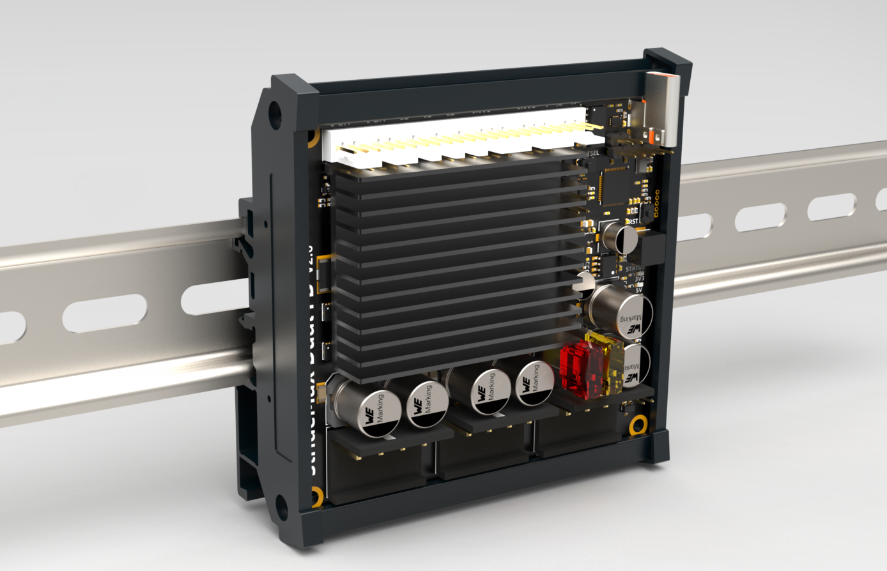
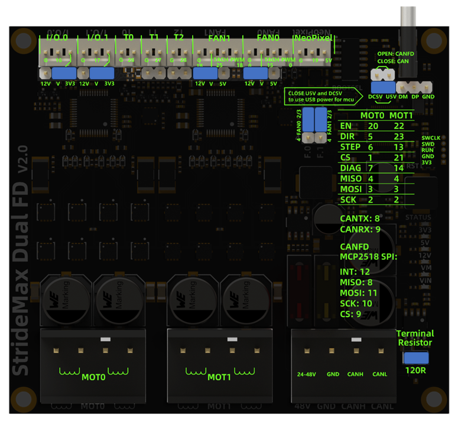

# Introduction

StrideMax Dual FD is a RP2040-based control board with dual TMC5160 drivers that can run RRF firmware or Klipper firmware. Each 5160 driver group has 8 high-power MOSFETs and is covered by a heat sink. It also provides two fan positions for expansion, so that the drive current of each channel can reach 10A, and it can easily drive an 86mm stepper motor. Two TMC5160s have a separate 12V power supply, which can greatly reduce power consumption and heat generation under high-voltage working conditions. StrideMax supports USB/CAN/CANFD multiple communication interfaces, and can be flexibly configured and used with RRF and Klipper firmware. It is very suitable for high-speed 3D printing and high-torque CNC driving needs.

# Features

- Dual TMC5160 up to 10A
- Raspberry Pi RP2040 MCU，Klipper & **RRF Firmware Support**
- Extra small size: 80x90
- 19-60V wide voltage support
- Dual car Fuse 
- CAN / **CANFD** & USB interface
- DIN mount case ready
- Onboard heatsink
- Onboard Additional temperature sensor for each MOSFET Array
- 2 x **2-4Pin controlled Fans**
- 3 x temperature sensor
- 2 x I/O
- 1 x Neopixel RGB support

# Application

- High-speed 3D Printers

- AWD of VzBoT Printer project 

# Specification

| Specs                  | To drive two phase stepper motor                             |
| ---------------------- | ------------------------------------------------------------ |
| Input voltage          | 19-60VDC（Peak）                                             |
| Input current (fuse)   | 15A Max (Limited by the Connector), 5A Max                   |
| Max current            | 6.6A Peak(default)，15A Peak(By changing connector and sensor resistor) |
| Max STEP frequency     | 9MHz                                                         |
| Standby current decays | 50%                                                          |
| Connectors             | 5.08mm 4P socket(15A MAX) + KF2510 socket(3A MAX)            |
| Interface              | TMC 5160 work at SPI mode,  StrideMax work at USB/CAN/CANFD  |
| Ambient temperature    | 0-40°C (32-104°F)                                            |
| Ambient humidity       | 90% MAX，Non condensing                                      |
| Leds                   | 1 status led，5 power leds                                   |
| Protections            | over-voltage protection, under-voltage protection,over-temperature protection, over-current protection |
| Microsteps             | Hardware 8~64 microsteps adjustable, software 8~256 microsteps |
| Trinamic Tech          | MicroPlyer™ Highest Resolution 256 microsteps per full step StealthChop2™ for quiet operation and smooth motion SpreadCycle™ highly dynamic motor control chopper DcStep™ load dependent speed control StallGuard2™ high precision sensorless motor load detection CoolStep™ current control for energy savings up to 75%  |

# Installation

## Power Supply

For the drive to work properly, the following prerequisites are required:

- It is recommended to use a 19-55V regulated power supply, which is determined according to the motor. 

- Appropriate control signal source, such as control board, PLC, etc.;

- A matching stepper motor.

!!! Warning

    The limit voltage of the driver is 60V, which does not mean that the 60V power  supply can be directly used for work, because the voltage may rise instantaneously when the power is turned on or the motor is working, which will damage the driver

!!! Note

    - If you want to ensure high efficiency and low noise at the same time, the driver power supply voltage should be at least 5 times the rated phase voltage of the motor (i.e. the rated phase voltage of the motor)
    Flow × phase resistance).
    - If better high-speed performance of the motor is required, the drive supply voltage needs to be increased.
    - If a regulated power supply is used, the supply voltage must not exceed 50V.
    - If using an unregulated power supply, the required voltage should not exceed 34V. Because the rated current of the unregulated power supply is the full load current; when the load is very light, such as when the motor is not rotating, the actual voltage is as high as 1.4 times the rated voltage of the power supply.

## Connect The Motor

**Direct connection:** connect B1/B2 to one phase of the motor, and A1/A2 to the other phase of the motor;

!!! Note

    **Parallel connection method:** generally used in occasions where the rotational speed is required to be fast and the torque is not required to be high;
    
    **Series connection method:** generally used in occasions where the torque is large and the rotation speed is not required. However, during the use of the series connection method, the current passing through is relatively large, so the heat generation will be larger than that of the general parallel connection motor. (Generally, it is normal for the heating temperature of the stepper motor to reach 90 degrees)

## Pin and jumper config

# Firmware Configuration
We have made an example of the klipper configuration, which you can find at the following address. RRF firmware and configuration are also provided for reference.
## Klipper

https://github.com/FYSETC/Stridemax_Dual_FD/tree/main/klipper

##  ReprapFirmware

For RRF firmware usage， Please refer to https://teamgloomy.github.io/stridemax_v2_general.html
         For RRF firmware Download, See here: https://github.com/gloomyandy/RepRapFirmware/releases

# Source Files

StrideMax's RRF firmware is developed and maintained by teamgloomy (jay_s_uk and Andy), and we sincerely thank them for their hard work and dedication.

SCH&PCB：https://github.com/FYSETC/Stridemax_Dual_FD/tree/main/SCH%26PCB

STEP File：https://github.com/FYSETC/Stridemax_Dual_FD/blob/main/3D%262D/StrideMax%20Dual%20FD%20V2.0.step

# Where to Buy

[Taobao]()

[Aliexpress](https://www.aliexpress.com/item/3256806165718828.html)

[Official website]()

# Contact Us

QQ Group：1041794121

Facebook Group：https://www.facebook.com/groups/197476557529090

Discord：https://discord.gg/Fb6FdND4

Email：support@fysetc.com
