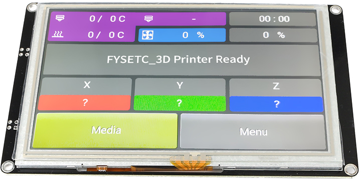
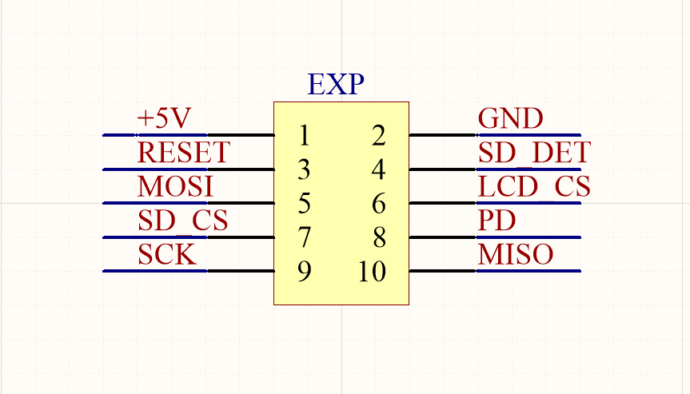
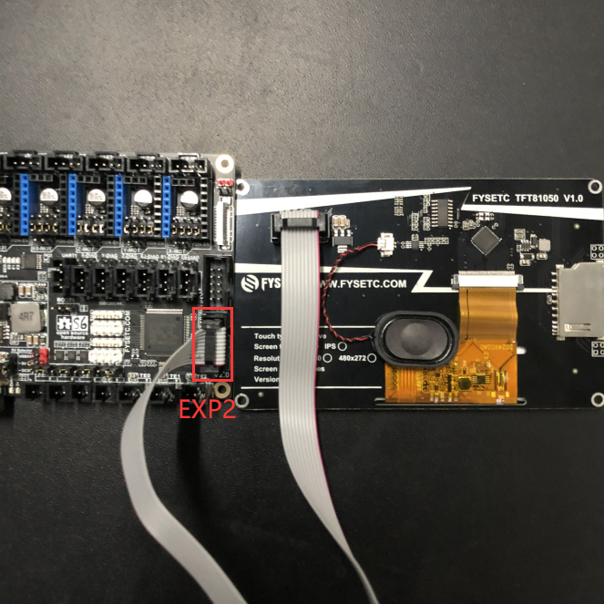
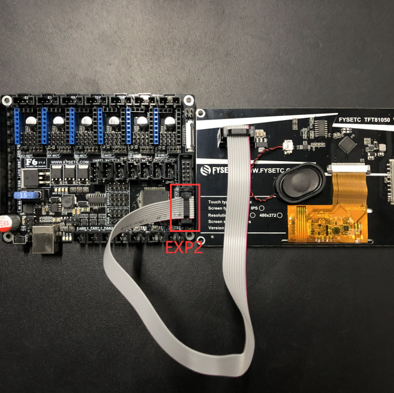
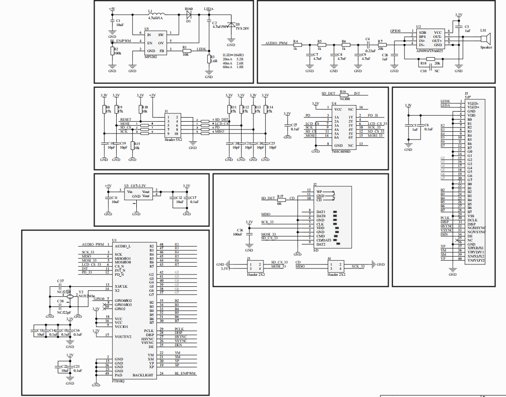
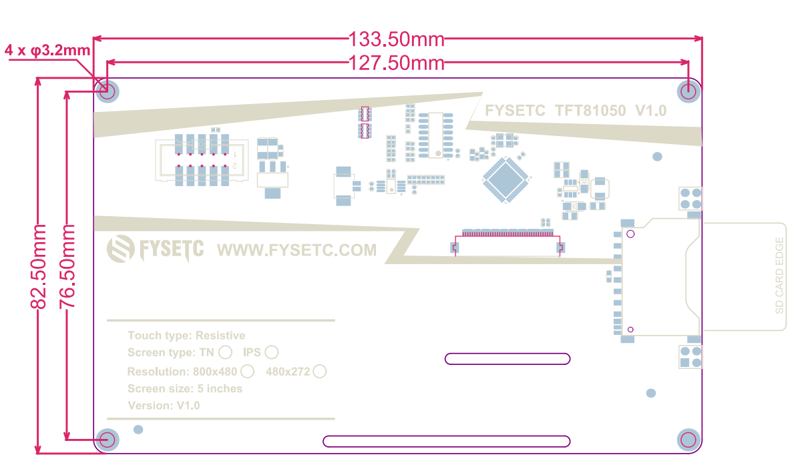

## Product Introduction




TFT81050 Smart Controller Display 5 inch Touch Screen Support Marlin 2.0 Compatible With Luzbot CLCD , supported in FYSETC S6 board and FYSETC F6 board.

## Features

- Based on FT810 FTDI/BridgetekEVE Chip.
- Compatible with Luzbot CLCD. - Supported by Marlin 2.0. 
- On-board SD card socket (supports vertical SD module). 
- 5 inch 800 * 480 resolution resistive touch screen.
- On-board 1W speaker. - 1 socket （EXP2） for the screen and SD.

## Pin description


## Firmware

This screen only supported with Marlin 2.0 firmware now. We recommend this firmware [branch](https://github.com/MarlinFirmware/Marlin/tree/bugfix-2.0.x). If you run into issue you can use this firmware [branch](https://github.com/MarlinFirmware/Marlin/tree/2.0.x).

### FYSETC S6

Enable the following setting in ``configuration.h`` file

```
#define TOUCH_UI_FTDI_EVE
```

Enable the following two settings in ``configuration_adv.h`` file

```
#define LCD_FYSETC_TFT81050

#define S6_TFT_PINMAP
```

Then compile the firmware and upload, if you don't know how to , follow our S6 wiki [here](https://wiki.fysetc.com/FYSETC_S6/). Check the compile part. 

#### wiring



### FYSETC F6

Enable the following setting in ``configuration.h`` file

```
#define TOUCH_UI_FTDI_EVE
```

Enable the following two settings in ``configuration_adv.h`` file

```
#define LCD_FYSETC_TFT81050

#define F6_TFT_PINMAP
```

Then compile the firmware and upload, if you don't know how to , follow our F6 wiki [here](https://wiki.fysetc.com/F6_V1.3/). Check the compile part. 

#### wiring


## Attention

-TBD-

## FAQ

-TBD-

## Attachments
### 1. Schematic

---------

You can download the schematics on our [github](https://github.com/FYSETC/TFT81050).

### 2. Dimensions

---------



**For detailed dimensions please check dwg/step file on [github](https://github.com/FYSETC/TFT81050).**

## Shop
- [TFT81050](https://www.aliexpress.com/item/4000627651757.html)

## Tech Support
---
Please submit any technical issue into our [forum](http://forum.fysetc.com/) or [facebook](https://www.facebook.com/groups/197476557529090/).


