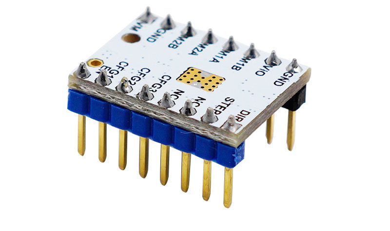
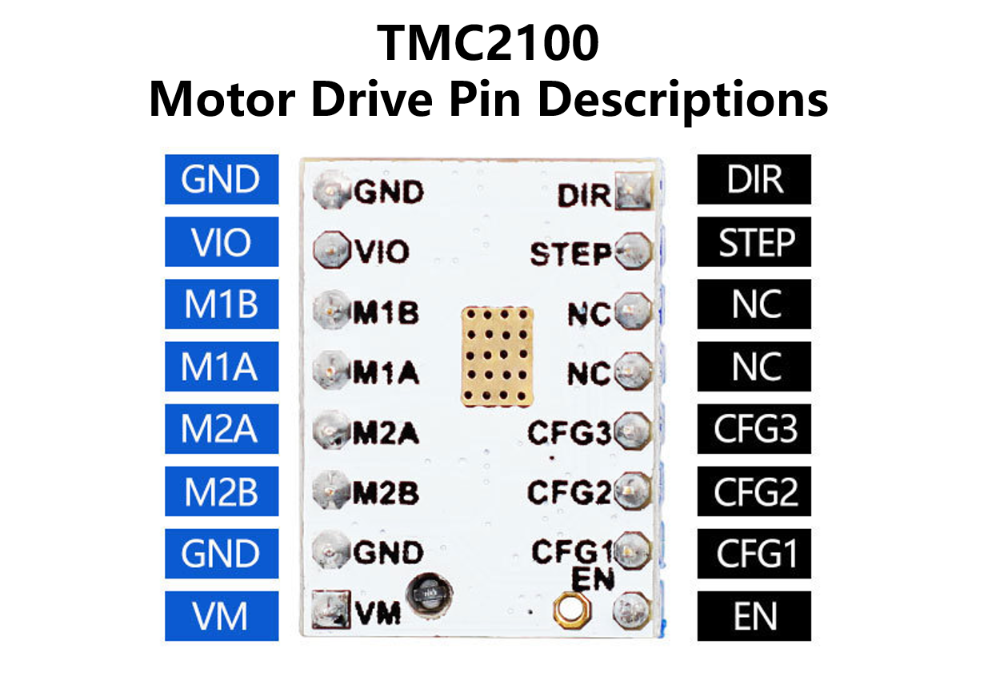
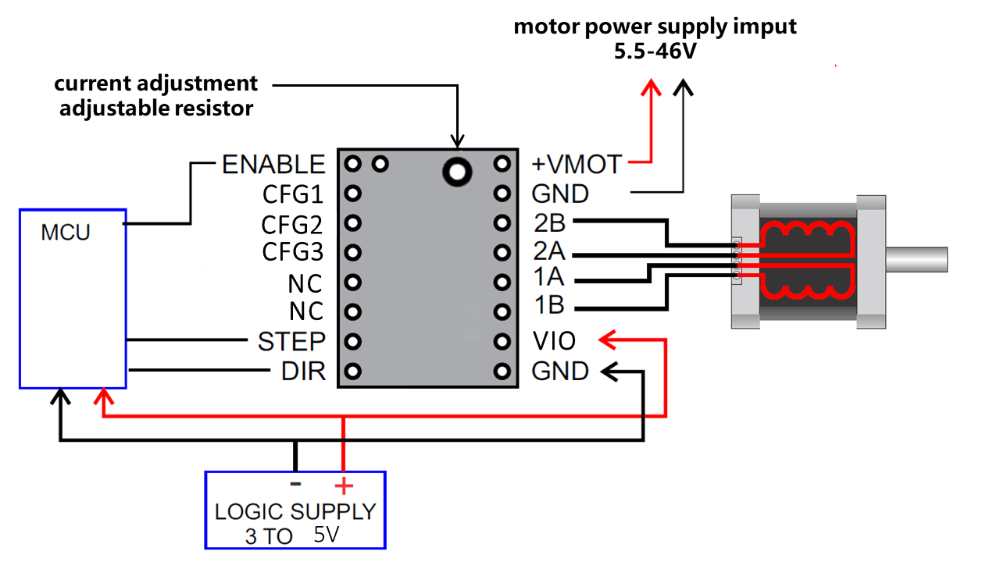
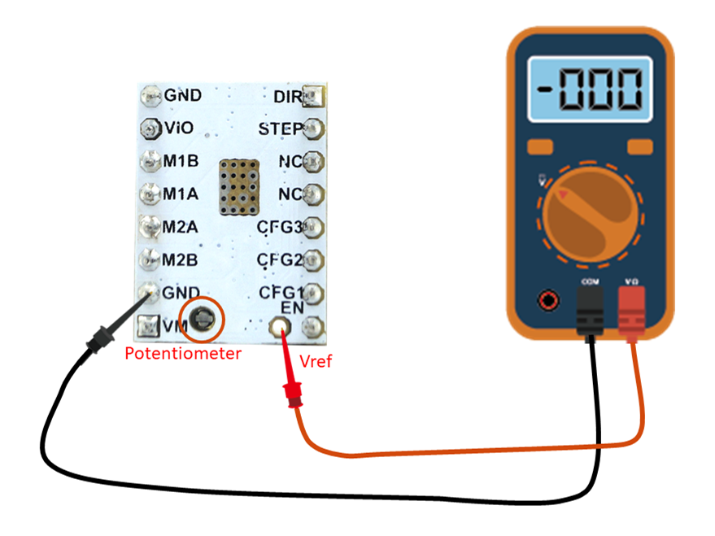
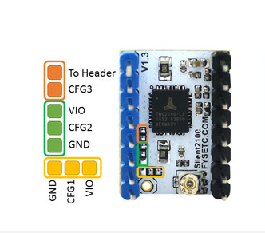

## Product Introduction
---

The TMC2100 provides an integrated motor driver solution for 3D-Printing, Cameras, Scanners and other automated equipment applications. The device has an integrated microstepping indexer, the completely noiseless current control mode StealthChop™ and is intended to drive a bipolar stepper motor. The output driver block consists of low RDSon N-Channel power MOSFETs configured as full H-bridges to drive the motor windings. The TMC2100 is capable of driving up to 2.5A of current from each output (with proper heatsinking). TMC2100 is designed for a supply voltage of 5~46V. The device has a step and direction interface and can be configured with digital pins. 

## Features
---

- Hardware compatible with StepStick and Pololu A4988 Stepper Driver
- Components on bottom PCB side for better heat emission
- Automatic standby current reduction
- stealthChop - for quiet operation and smooth motion
- spreadCycle - highly dynamic motor control chopper
- Drive capability up to 1.2A (RMS) continuous coil current
- Step/Dir interface with microstep interpolation (up to 256 microsteps)
- Configuration via CFG pins

## Specifications
---

Model                               |TMC2100
:----:                                     |:----:
Interface	                    |	Step/Dir
Configuration	|CFG Pins	
Native Microsteps|up to 1 ⁄ 16
microPlyer Microsteps| 1 ⁄ 256 
Logic Supply Voltage (VIO)|	3 - 5V
Motor Supply Voltage (VM)|	5.5 - 46V	
Motor Phase Current max|	1.2A RMS, 2.5A Peak	
Internal V-  Regulator|	enabled
RDSon|>=0.5 Ohm
stealthChop (quiet)|	yes
spreadCycle|	yes
coolStep | no
stallGuard | no
dcStep | no

## Pin Functions
---

Pin|Function
:----:|----
 &nbsp;|**Power Supply**
 GND|	Ground
VM|	Motor Supply Voltage
VIO	|Logic Supply Voltage
 &nbsp;|**Motor Outputs**
M1A|	Motor Coil 1
M1B	|Motor Coil 1
M2A|	Motor Coil 2
M2B	|Motor Coil 2
 &nbsp;|**Control Inputs**
STEP	|Step-Signal Input
DIR	|Direction-Signal Input
 &nbsp;|**TMC2100**
EN	|Enable Motor Outputs: GND=on, VIO=off, OPEN=Auto-Power-Down
CFG0	|Chopper Off Time TOFF: GND=140tclk, VIO=236tclk, OPEN=332tclk
CFG1	|Step-Configuration
CFG2	|Step-Configuration
CFG3	|Current Setting: GND=int, VIO=int, OPEN=ext
CFG4	|Chopper Hysteresis HEND: GND=5, VIO=9, OPEN=13
CFG5	|Chopper Blank Time TBL: GND=16, VIO=24, OPEN=36
DIAG0	|Diagnostics Output 0
DIAG1	|Diagnostics Output 1
VREF	|Analog Reference Voltage

## Interface Resources
---

###  Wiring Diagram

### Motor Current Setting

The best way to set the motor current is by measuring the voltage on the Vref pin (0…2.5V) and adjusting the voltage with the potentiometer. The maximum settable motor current is 1.77A RMS (0.11Ohm sense resistors), but the SilentStepSticks can only be used up to 1.2A RMS.

Irms = (Vref * 1.77A) / 2.5V = Vref * 0.71

Vref = (Irms * 2.5V) / 1.77A = Irms * 1.41 = Imax

Vref -> Voltage on Vref pin

Irms -> RMS (Root Mean Square) current per phase (Irms = Imax / 1.41)

Imax -> Maximum current per phase (Imax = Irms * 1.41)

!!!Note
​    1. Vref measures Gnd and the voltage at the middle of the potentiometer.  
​    2. Do not connect the motor when measuring the voltage, otherwise it is easy to burn the driver.  
​    3. Power should be connected when measuring voltage, do not just connect USB power supply.    

### Calculator

<form name="data">
RMS Current (A): <input type="text" name="i"  value="0.6" style="width:60px;" size="5">
Reference Voltage (V): <input readonly type="text" name="v" value="" style="width:60px;" size="5">
<input type="button" name="go" value="calculate" onclick="var i=document.forms['data'].i.value; i=i.replace(',','.'); var v=new Number(i); v=v*1.41; v=v.toFixed(2); document.forms['data'].v.value=v; return false;">
</form>

### Micro-stepping

CFG2|CFG1|	Steps|Interpolation|Mode
:----:|:----:|:----:|:----:|:----:
GND	|GND	|1|	-|	spreadCycle
GND	|VIO|	1⁄2|	-|	spreadCycle
GND	|OPEN|	1⁄2|	1⁄256|	spreadCycle
VIO|	GND|	1⁄4|	-|	spreadCycle
VIO	|VIO	|1⁄16|	-|	spreadCycle
VIO|	OPEN|	1⁄4|	1⁄256|	spreadCycle
OPEN	|GND|	1⁄16|	1⁄256|	spreadCycle
OPEN|	VIO|	1⁄4|	1⁄256|	stealthChop
OPEN	|OPEN|	1⁄16|	1⁄256|	stealthChop

## Instructions for Use
---

1. When using on Ramps1.4 or MKS Gen, please remove the three jumper caps under the socket.
2. **Pay attention to the direction.**
3. The heat sink is directly attached to the PCB.
4. The motor direction is the opposite of 4988 and 8825. If you want to replace the 4988 directly, please adjust the firmware or adjust the motor connection.

## Shop

---
- [TMC2100](https://www.aliexpress.com/store/product/5pcs-StepStick-MKS-TMC2100-Stepper-Motor-Driver-Ultra-silent-Excellent-Stability-Protection-Superior-Performance-3D-Printer/3480083_32848561393.html)

## Tech Support

---
Please submit any technical issue into our [forum](http://forum.fysetc.com/) 