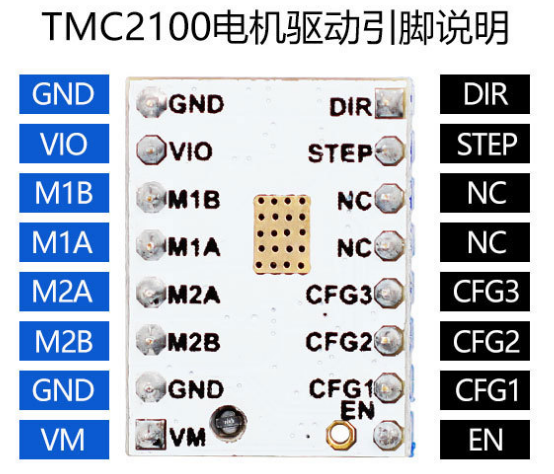
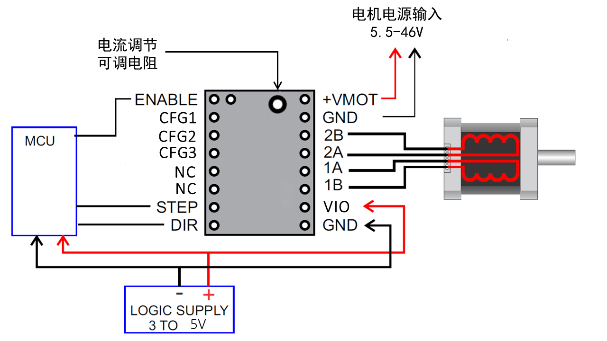
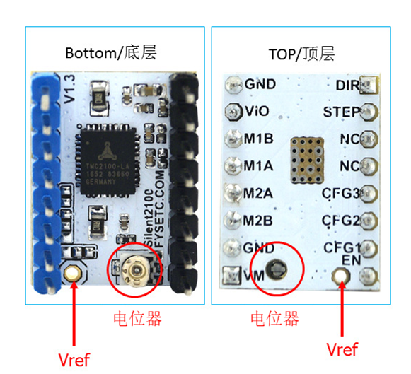
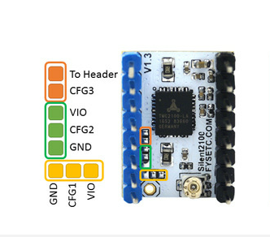

## 产品简介

---

TMC2100为3D打印、相机、扫描仪和其他自动化设备应用提供集成电机驱动解决方案。 该模块具有集成微步进分度器，完全无噪声电流控制模式StealthChop™，旨在驱动双极性步进电机。输出驱动器模块由低RDSon N沟道功率MOSFET组成，配置为全H桥，以驱动电机绕组。TMC2100能够从每个输出驱动高达2.5A的电流（具有适当的散热）。TMC2100的供电电压为5~46V。该模块具有步进和方向接口，可配置数字引脚。

## 主要特点
---

- 硬件兼容StepStick和Pololu A4988步进驱动器
- 底部PCB一侧的元件可以获得更好的散热效果
- 自动待机电流减少
- stealthChop - 安静的操作和平稳的运动
- spreadCycle - 高度动态的电机控制斩波器
- 驱动能力高达1.2A（RMS）连续线圈电流
- 带微步插补的Step / Dir接口（最多256个微步）
- 通过CFG引脚进行配置

## 规格
---

驱动名称	|TMC2100
:---:|:---:
Interface	|	Step/Dir
Configuration	|CFG Pins	
Native Microsteps|up to 1⁄16
microPlyer Microsteps|	1⁄256
Logic Supply Voltage (VIO)|	3 - 5V
Motor Supply Voltage (VM)|	5.5 - 46V	
Motor Phase Current max|	1.2A RMS, 2.5A Peak	
Internal V-Regulator|	enabled
RDSon|>=0.5 Ohm
stealthChop (quiet)|	yes
spreadCycle|	yes
coolStep | no
stallGuard | no
dcStep | no

##引脚说明
---

Pin|功能
:---:|---
 &nbsp;|**Power Supply**
 GND|	Ground
VM|	Motor Supply Voltage
VIO	|Logic Supply Voltage
 &nbsp;|**Motor Outputs**
M1A|	Motor Coil 1
M1B	|Motor Coil 1
M2A|	Motor Coil 2
M2B	|Motor Coil 2
 &nbsp;|**Control Inputs**
STEP	|Step-Signal Input
DIR	|Direction-Signal Input
 &nbsp;|**TMC2100**
EN	|Enable Motor Outputs: GND=on, VIO=off, OPEN=Auto-Power-Down
CFG0	|Chopper Off Time TOFF: GND=140tclk, VIO=236tclk, OPEN=332tclk
CFG1	|Step-Configuration
CFG2	|Step-Configuration
CFG3	|Current Setting: GND=int, VIO=int, OPEN=ext
CFG4	|Chopper Hysteresis HEND: GND=5, VIO=9, OPEN=13
CFG5	|Chopper Blank Time TBL: GND=16, VIO=24, OPEN=36
DIAG0	|Diagnostics Output 0
DIAG1	|Diagnostics Output 1
VREF	|Analog Reference Voltage

## 接口资源
---

### 接线图示

### 电机电流设置

设置电机电流的最佳方法是测量Vref引脚上的电压（0-2.5V）并使用电位计调节电压。 最大可设置的电机电流为1.77A RMS（0.11Ohm检测电阻），但SilentStepSticks只能使用高达1.2A RMS。
Irms =（Vref * 1.77A）/2.5V=Vref * 0.71
Vref =（Irms * 2.5V）/ 1.77A = Irms * 1.41 = Imax
Vref 引脚上的电压
Irms - > RMS（均方根）每相电流（Irms = Imax / 1.41）
Imax - >每相最大电流（Imax = Irms * 1.41）

!!!note "注"
    1. Vref测量Gnd 以及电位器中间端的电压。
    2. 测量电压时务必不要连接电机，否则容易烧毁驱动。
    3. 测量电压时应接通电源，不要仅仅连接USB供电。

### 细分设置

CFG2(-)|CFG1(-)|	细分(-)|插值(-)|模式(-)
:---:|:---:|:---:|:---:|:---:
GND	|GND	|1|	-|	spreadCycle
GND	|VIO|	1⁄2|	-|	spreadCycle
GND	|OPEN|	1⁄2|	1⁄256|	spreadCycle
VIO|	GND|	1⁄4|	-|	spreadCycle
VIO|	OPEN|	1⁄4|	1⁄256|	spreadCycle
OPEN|	VIO|	1⁄4|	1⁄256|	stealthChop
VIO	|VIO	|1⁄16|	-|	spreadCycle
OPEN	|GND|	1⁄16|	1⁄256|	spreadCycle
OPEN	|OPEN|	1⁄16|	1⁄256|	stealthChop

## 使用说明
---

1. 在Ramps1.4或者 MKS Gen上使用时，请去掉插口下的3个跳线帽。
2. **注意方向**
3. 散热片直接贴在PCB上。
4. 电机方向和4988及8825正好相反，如果想直接更换4988，请调节固件或者调整电机连线。

## 商店
---

- [TMC2100](https://www.aliexpress.com/store/product/5pcs-StepStick-MKS-TMC2100-Stepper-Motor-Driver-Ultra-silent-Excellent-Stability-Protection-Superior-Performance-3D-Printer/3480083_32848561393.html)

## 技术支持
---

请将任何技术问题提交到我们的[论坛](http://forum.fysetc.com/)

