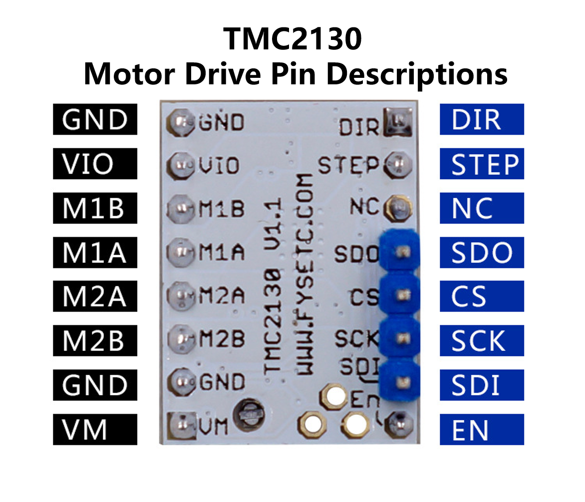
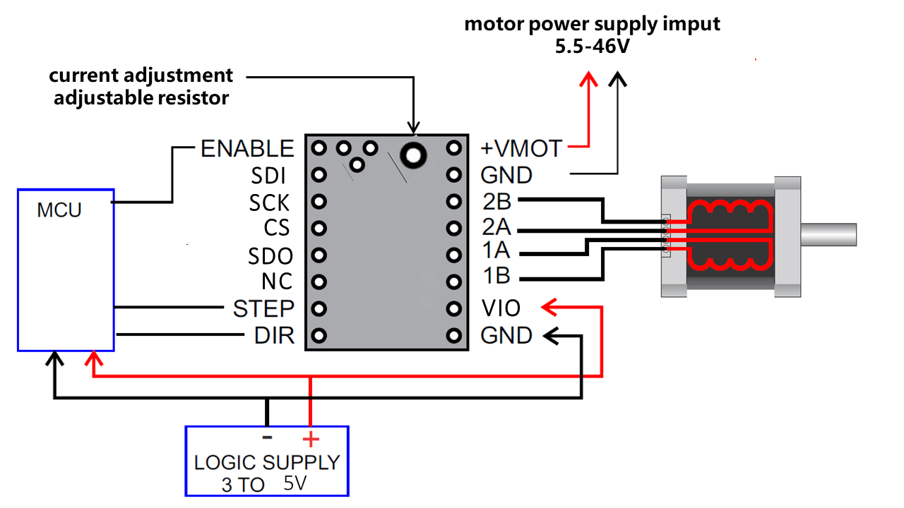
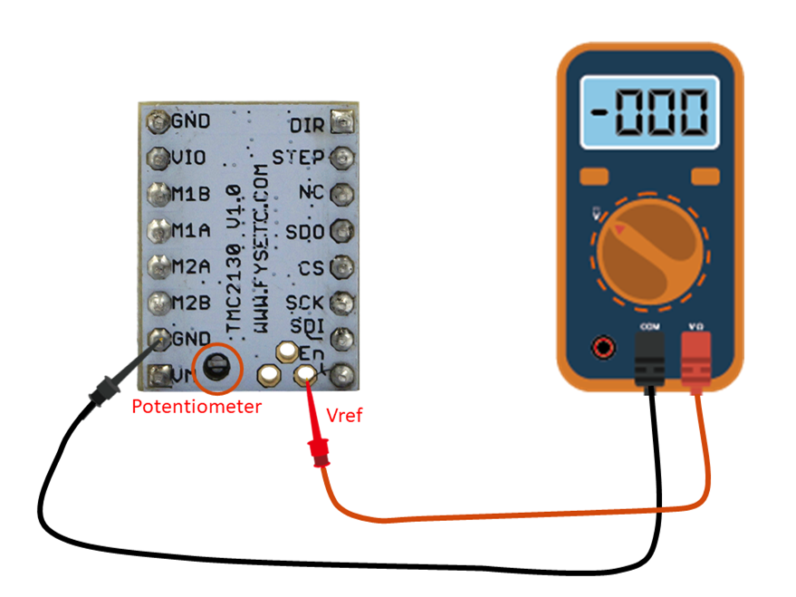

## Product Introduction
---

The TMC2130 provides an integrated motor driver solution for 3D-Printing, Cameras, Scanners and other automated equipment applications. The device has an integrated microstepping indexer, the sensorless stall detection technology StallGuard2™, the sensorless load dependent current control CoolStep™ and the completely noiseless current control mode StealthChop™ and is intended to drive a bipolar stepper motor. 

## Features
---

- SPI configuration interface (up to 4MHz)
- Up to 256 native microsteps (without interpolation)
- Reduce energy consumption by 75%
- High accuracy sensorless motor load detection
- High load driver will not lost step
- Automatic stealthChop and spreadCycle switchover depending on velocity
- Hardware compatible with StepStick and Pololu A4988 Stepper Driver
- Components on bottom PCB side for better heat emission
- Automatic standby current reduction
- stealthChop - for quiet operation and smooth motion
- spreadCycle - highly dynamic motor control chopper

## Technical Specifications
---

Model                                    |   TMC2130
:--------------------------:|:------------------------:
Interface                                |   Step/Dir or SPI
Configuration                       |   CFG Pins or SPI
Native Microsteps               |   up to 1/256
microPlyer Microsteps          |    1/256
Logic Voltage (VIO)                 |    3-5V
Motor Voltage (VM)                 |     5.5-46V
Motor Phase Current  max          |   1.2A RMS, 2.5A Peak
Internal V-  Regulator         |    enabled
RDSon                                    |>=0.5 Ohm
stealthChop (quiet)               | yes
spreadCycle                           |      yes
coolStep                                |        yes
stallGuard                              |      yes
dcStep                                    |     yes

## Pin Functions
---

Pin|Function
:---:|---
  |**Power Supply**
 GND|	Ground
VM|	Motor Supply Voltage
VIO	|Logic Supply Voltage
|Motor Outputs
M1A|	Motor Coil 1
M1B	|Motor Coil 1
M2A|	Motor Coil 2
M2B	|Motor Coil 2
|**Control Inputs**
STEP	|Step-Signal Input
DIR	|Direction-Signal Input
|**TMC2130 (SPI_MODE=1)**
EN	|Enable Motor Outputs: GND=on, VIO=off, OPEN=Auto-Power-Down
SDO/CFG0|	Serial Data Output (SPI)
SDI/CFG1	|Serial Data Input (SPI)
SCK/CFG2|	Serial Clock Input (SPI)
CS/CFG3	|Chip Select Input (SPI)
DCEN/CFG4|	dcStep Enable Input (GND=off)
DCIN/CFG5	|dcStep Gating Input
DIAG0	|Diagnostics Output 0
DIAG1	|Diagnostics Output 1

## Interface Resources
---

### Wiring Diagram

### Motor Current Setting

The best way to set the motor current is by measuring the voltage on the Vref pin (0…2.5V) and adjusting the voltage with the potentiometer. The maximum settable motor current is 1.77A RMS (0.11Ohm sense resistors), but the SilentStepSticks can only be used up to 1.2A RMS.       
Irms = (Vref * 1.77A) / 2.5V = Vref * 0.71  
Vref = (Irms * 2.5V) / 1.77A = Irms * 1.41 = Imax  
Vref -> Voltage on Vref pin  
Irms -> RMS (Root Mean Square) current per phase (Irms = Imax / 1.41)  
Imax -> Maximum current per phase (Imax = Irms * 1.41)  

!!!note
​    1.Vref measures G nd and the voltage at the middle of the potentiometer.  
​    2.Do not connect the motor when measuring the voltage, otherwise it is easy to burn the driver.  
​    3.Power should be connected when measuring voltage, do not just connect USB power supply.  
​    4.**Please pay special attention to directions!**  

### Calculator

<form name="data">
RMS Current (A): <input type="text" name="i"  value="0.6" style="width:60px;" size="5">
Reference Voltage (V): <input readonly type="text" name="v" value="" style="width:60px;" size="5">
<input type="button" name="go" value="calculate" onclick="var i=document.forms['data'].i.value; i=i.replace(',','.'); var v=new Number(i); v=v*1.41; v=v.toFixed(2); document.forms['data'].v.value=v; return false;">
</form>

## Versions Difference
---

Versions|difference
:---:          |---
V1.0        |The default is standalone mode，If you need SPI mode，you must config by yourself.
V1.1        |SPI mode, SPI pin out（top），you must connect wires to your board，and config the firmware for it，otherwise the stepper can't run.
V1.2        |SPI mode,  SPI&DIAG pin out（bottom）, it’s used for F6.

## Shop

---
- [TMC2130](https://www.aliexpress.com/store/product/5X-MKS-TMC2130-V1-1-For-SPI-Function-Stepstick-Stepper-Motor-Driver-with-Heat-Sink-Ultra/3480083_32851819955.html)

## Tech Support

---
Please submit any technical issue into our [forum](http://forum.fysetc.com/) 
