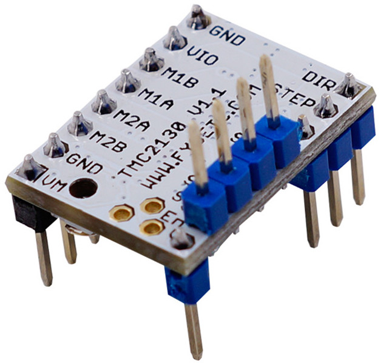
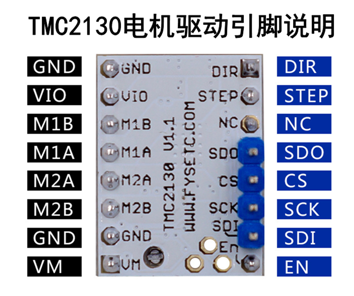
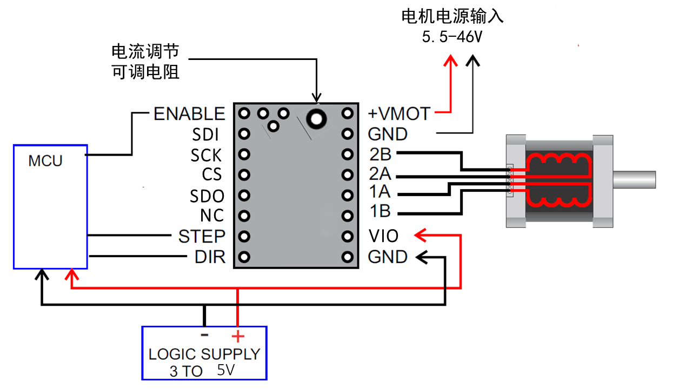
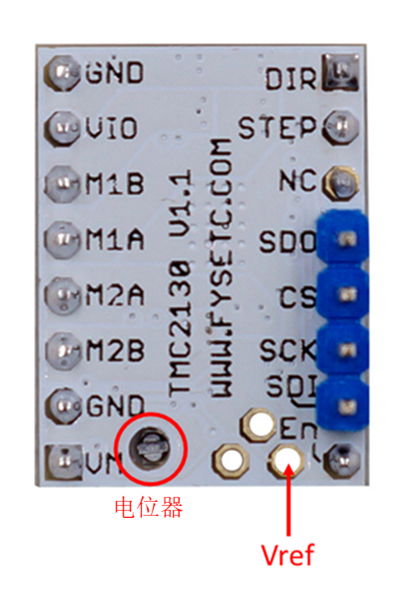

## 产品介绍
---

TMC2130为3D打印、相机、扫描仪和其他自动化设备应用提供了集成电机驱动解决方案。 该模块具有集成的微步进分度器，无传感器失速检测技术StallGuard2™，无传感器负载依赖电流控制CoolStep™和完全无噪声电流控制模式StealthChop™，旨在驱动双极性步进电机。 

## 主要特点
---

- SPI配置接口（高达4MHz）
- 多达256个本地微步（无插值）
- 减少75%的能源消耗
- 高精度无传感器电机负载检测
- 高负载驱动没有失步
- 根据速度自动进行stealthChop和spreadCycle切换
- 硬件兼容StepStick和Pololu A4988步进驱动器
- 底部PCB一侧的元件可以获得更好的散热效果
- 自动待机电流减少
- 安静的操作和平稳的运动
- 高度动态的电机控制斩波器

## 规格
---

Model                                    |   TMC2130 
:---:|:---:
Interface                                |   Step/Dir or SPI
Configuration                       |   CFG Pins or SPI
Native Microsteps               |   up to 1/256
microPlyer Microsteps          |    1/256
Logic Voltage (VIO)                 |    3-5V
Motor Voltage (VM)                |     5.5-46V
Motor Phase Current  max          |   1.2A RMS, 2.5A Peak
Internal V- Regulator         |    enabled
RDSon                                    |>=0.5 Ohm
stealthChop (quiet)               | yes
spreadCycle                           |      yes
coolStep                                |        yes
stallGuard                              |      yes
dcStep                                    |     yes

## 引脚说明
---

Pin|功能
:---:|---
 &nbsp;|**Power Supply**
 GND|	Ground
VM|	Motor Supply Voltage
VIO	|Logic Supply Voltage
 &nbsp;|**Motor Outputs**
M1A|	Motor Coil 1
M1B	|Motor Coil 1
M2A|	Motor Coil 2
M2B	|Motor Coil 2
 &nbsp;|**Control Inputs**
STEP	|Step-Signal Input
DIR	|Direction-Signal Input
 &nbsp;|**TMC2130 (SPI_MODE=1)**
EN	|Enable Motor Outputs: GND=on, VIO=off, OPEN=Auto-Power-Down
SDO/CFG0|	Serial Data Output (SPI)
SDI/CFG1	|Serial Data Input (SPI)
SCK/CFG2|	Serial Clock Input (SPI)
CS/CFG3	|Chip Select Input (SPI)
DCEN/CFG4|	dcStep Enable Input (GND=off)
DCIN/CFG5	|dcStep Gating Input
DIAG0	|Diagnostics Output 0
DIAG1	|Diagnostics Output 1

## 接口资源
---

### 接线图示

### 电机电流设置

设置电机电流的最佳方法是测量Vref引脚上的电压（0-2.5V）并使用电位计调节电压。 最大可设置的电机电流为1.77A RMS（0.11Ohm检测电阻），但SilentStepSticks只能使用高达1.2A RMS。
Irms =（Vref * 1.77A）/2.5V=Vref * 0.71
Vref =（Irms * 2.5V）/ 1.77A = Irms * 1.41 = Imax
Vref 引脚上的电压
Irms - > RMS（均方根）每相电流（Irms = Imax / 1.41）
Imax - >每相最大电流（Imax = Irms * 1.41）
!!!note "注"
    1. Vref测量Gnd 以及电位器中间端的电压。
    2. 测量电压时务必不要连接电机，否则容易烧毁驱动。
    3. 测量电压时应接通电源，不要仅仅连接USB供电。
    4. **请特别注意方向，切勿插反！**

## 商店

---
- [TMC2130](https://www.aliexpress.com/store/product/5X-MKS-TMC2130-V1-1-For-SPI-Function-Stepstick-Stepper-Motor-Driver-with-Heat-Sink-Ultra/3480083_32851819955.html)

## 技术支持

---
请将任何技术问题提交到我们的[论坛](http://forum.fysetc.com/)