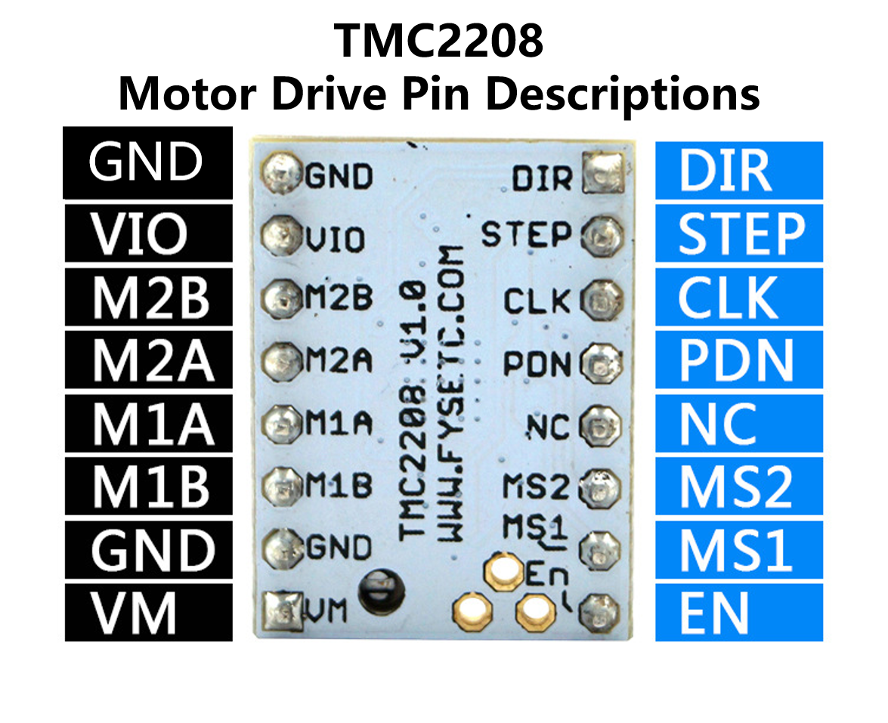
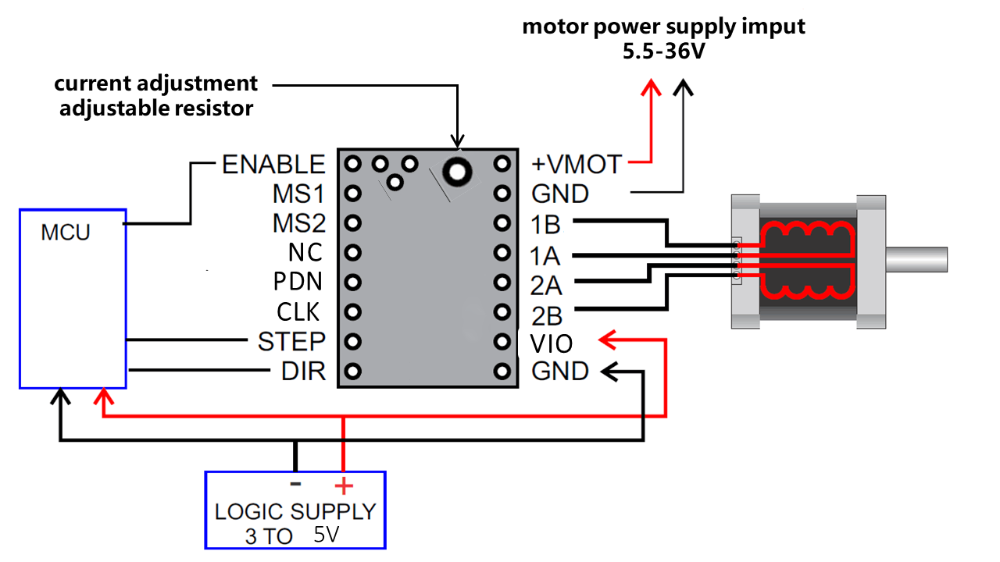
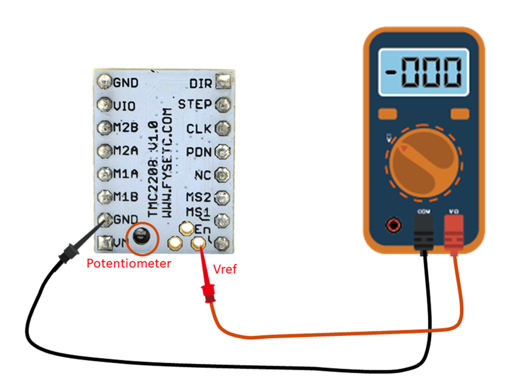

## Product Introduction
---

TMC2208 is an ultra-quiet two-phase stepper motor drive chip, continuous drive current 1.4A, peak current 2A, voltage range 4.75V-36V, 256 subdivision. The flexible microPlyer interpolation unit provides up to 256 subdivisions, allowing perfect sinusoidal control even in systems with limited pulse frequencies; these are also designed because stealthChop2 ultra-quiet technology is widely used in 3D printing. Compatible with existing 3D printer electronics, eliminating the expensive costs of redesign. With a standard step/dir interface, it is easy to use. It can replace the original TMC2100, lower heat, especially for 3D printing market.

## Features
---

- UART configuration interface (9600-500k Baud)
-  Power tube built-in drive current 1.4A ,peak current 2A, voltage range 4.75V-36V
- Up to 256 native microsteps (without interpolation)
- CoolStep ™ current dynamic adjustment technology, can save 70% of the energy
- stealthChop2 - faster motor acceleration/deceleration than stealthChop
-  dcStep ™, stallGuard2 ™ stall detection technology
- Automatic stealthChop and spreadCycle switchover depending on velocity
- Hardware compatible with StepStick and Pololu A4988 Stepper Driver
- Components on bottom PCB side for better heat emission
- Automatic standby current reduction
- SteaClthhop mute technology
- spreadCycle - highly dynamic motor control chopper

## Technical Specifications

Model                                    |   TMC2208
:---:|:---:
Interface                                |   Step/Dir 
Configuration                       |   CFG Pins or UART
Native Microsteps               |   up to 1/256
microPlyer Microsteps          |    1/256
Logic Voltage (VIO)                 |    3-5V
Motor Voltage (VM)                |     5.5-36V
Motor Phase Current  max        |   1.2A RMS, 2.0A Peak
Internal V-  Regulator         |    enabled
RDSon                                    |<=0.3 Ohm
stealthChop (quiet)               | yes
spreadCycle                           |      yes
coolStep                                |       no
stallGuard                              |     no
dcStep                                    |   no

## Pin Functions
---

Pin|Function
:---:|---
 |**Power Supply**
 GND|	Ground
VM|	Motor Supply Voltage
VIO	|Logic Supply Voltage
|**Motor Outputs**
M1A|	Motor Coil 1
M1B	|Motor Coil 1
M2A|	Motor Coil 2
M2B	|Motor Coil 2
|**Control Inputs**
STEP	|Step-Signal Input
DIR	|Direction-Signal Input
|**TMC2208**
 EN|	Enable Motor Outputs: GND=on, VIO=off
MS1|	Step-Configuration
MS2	|Step-Configuration
PDN	|UART and Auto Power Down Control: GND=on, VIO=off
CLK	|Clock Input
DIAG	|Diagnostics Output
INDEX	|Index Output
VREF|	Analog Reference Voltage

## Interface Resources
---
###  Wiring Diagram

!!!Tip
​    The TMC2208 outputs continuous motor current up to 1.4A and peak current up to 2A. Therefore, the reference voltage of the driver module should not exceed 1V. At the same time, the driver module must be dissipated, otherwise it will affect the life of the driver module.

### Motor Current Setting

The best way to set the motor current is by measuring the voltage on the Vref pin (0…2.5V) and adjusting the voltage with the potentiometer. The maximum settable motor current is 1.77A RMS (0.11Ohm sense resistors), but the SilentStepSticks can only be used up to 1.2A RMS.  
Irms = (Vref * 1.77A) / 2.5V = Vref * 0.71  
Vref = (Irms * 2.5V) / 1.77A = Irms * 1.41 = Imax   
Vref -> Voltage on Vref pin  
Irms -> RMS (Root Mean Square) current per phase (Irms = Imax / 1.41)  
Imax -> Maximum current per phase (Imax = Irms * 1.41)   

!!!Note
​    1. Vref measures Gnd and the voltage at the middle of the potentiometer.  
​    2. Do not connect the motor when measuring the voltage, otherwise it is easy to burn the driver.  
​    3. Power should be connected when measuring voltage, do not just connect USB power supply.  
​    4. **Please pay special attention to directions!**

### Calculator

<form name="data">
RMS Current (A): <input type="text" name="i"  value="0.6" style="width:60px;" size="5">
Reference Voltage (V): <input readonly type="text" name="v" value="" style="width:60px;" size="5">
<input type="button" name="go" value="calculate" onclick="var i=document.forms['data'].i.value; i=i.replace(',','.'); var v=new Number(i); v=v*1.41; v=v.toFixed(2); document.forms['data'].v.value=v; return false;">
</form>

### Micro-stepping

MS2(-)	|MS1(-)|	Steps(-)|	Interpolation(-)|	Mode(-)
:---:|:---:|:---:|:---:|:---:
GND |	VIO | 1⁄2 | 1⁄256 | stealthChop2
VIO	| GND | 1⁄4 | 1⁄256 | stealthChop2
GND | GND | 1⁄8 | 1⁄256 | stealthChop2
VIO	| VIO | 1⁄16 | 1⁄256 | stealthChop2

## Setting Method
---

With the TMC2208 Configurator you can change the settings and program the OTP (One-Time-Programmable) memory of a Trinamic TMC2208 via the UART interface.

###  To run the program:
1. Install ScriptCommunicator
2. Download TMC2208.scez
3. Start the TMC2208.scez file with the ScriptCommunicator: ScriptCommunicator TMC2208.scez
4. Choose the right serial port and click Connect
5. Modifications in the Configurator are directly transmitted

!!!Tip
​    The OTP bits can be programmed only one time.
​    If you enable spreadCycle then TOFF cannot be 0 (null).

### Hardware Connection

You can use every RS232 serial adapter with 0-5V logic levels (e.g. FTDI-Breakout) and the SilentStepStick Tester/Programmer can be used as connection adapter.

!!!Tip
​    The jumper next to the PDN_UART pin has to be closed on the TMC2208 SilentStepStick to enable the pin access via the pin header.

## Versions Difference
---

Versions|difference
:---:          |---
V1.0        |The default is standalone mode，If you need UART mode，you must config by yourself.
V1.2        |UART mode,   it’s used for F6.

## Shop

---
- [TMC2208](https://www.aliexpress.com/store/product/4pcs-TMC2208-Stepping-Motor-Mute-Driver-Stepstick-Power-Tube-Built-in-Driver-Current-1-4A-Peak/3480083_32848573038.html)

## Tech Support

---
Please submit any technical issue into our [forum](http://forum.fysetc.com/) 