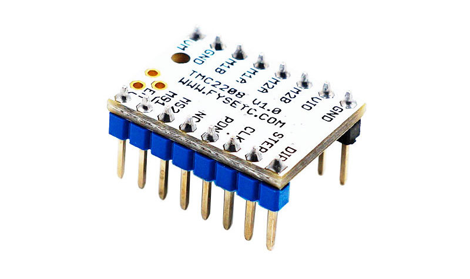

## 产品介绍
---

TMC2208是一款超静音的两相步进电机驱动芯片，持续驱动电流1.4A，峰值电流2A，电压范围4.75V-36V，256细分；灵活的microPlyer插值单元，可提供高达256的细分，即使是在脉冲频率有限的系统中仍可完美地实现正弦控制；由于stealthChop2超静音技术在3D打印中被广泛应用，因此这些组件的设计也与现有3D打印机电子设备兼容，省去了重新设计所产生的昂贵费用。具有标准的step/dir接口，使用起来简单方便。可以替代原有的TMC2100，更低的发热量，特别适合3D打印市场。

## 主要特点
---

- UART配置接口（9600-500k波特）
- 功率管内置驱动电流1.4A峰值电流2A，电压范围4.75V-36V
- 多达256个本地微步（无插值）
- CoolStep™电流动态调节技术，可节省70％的能源
- stealthChop2 - 比stealthChop更快的电机加速/减速
- dcStep™，stallGuard2™失速检测技术
- 根据速度自动进行stealthChop和spreadCycle切换
- 硬件兼容StepStick和Pololu A4988步进驱动器
- 底部PCB一侧的元件可以获得更好的散热效果
- 自动待机电流减少
- StealthChop静音技术
- 高度动态的电机控制斩波器
  
##  规格
---

Model                                    |   TMC2208
:---:|:---:
Interface                                |   Step/Dir 
Configuration                       |   CFG Pins or UART
Native Microsteps               |   up to 1/256
microPlyer Microsteps          |    1/256
Logic Voltage (VIO)                 |    3-5V
Motor Voltage (VM )               |     5.5-36V
Motor Phase Current  max        |   1.2A RMS, 2.0A Peak
Internal V- Regulator         |    enabled
RDSon                                    |<=0.3 Ohm
stealthChop (quiet)               | yes
spreadCycle                           |      yes
coolStep                                |       no
stallGuard                              |     no
dcStep                                    |   no

## 引脚说明
---

Pin|功能
:---:|---
|**Power Supply**
 GND|	Ground
VM|	Motor Supply Voltage
VIO	|Logic Supply Voltage
 |**Motor Outputs**
M1A|	Motor Coil 1
M1B	|Motor Coil 1
M2A|	Motor Coil 2
M2B	|Motor Coil 2
 |**Control Inputs**
STEP	|Step-Signal Input
DIR	|Direction-Signal Input
|**TMC2208**
 EN|	Enable Motor Outputs: GND=on, VIO=off
MS1|	Step-Configuration
MS2	|Step-Configuration
PDN	|UART and Auto Power Down Control: GND=on, VIO=off
CLK	|Clock Input
DIAG	|Diagnostics Output
INDEX	|Index Output
VREF|	Analog Reference Voltage

## 接口资源
---

### 接线图示

!!!Tip
    TMC2208输出给电机的持续工作电流最高为1.4A，峰值电流最高为2A。所以驱动模块参考电压最好不要超过1V，同时要对驱动模块做好散热，否则将会影响驱动模块的寿命。

###  电机电流设置

设置电机电流的最佳方法是测量Vref引脚上的电压（0-2.5V）并使用电位计调节电压。 最大可设置的电机电流为1.77A RMS（0.11Ohm检测电阻），但SilentStepSticks只能使用高达1.2A RMS。
Irms =（Vref * 1.77A）/2.5V=Vref * 0.71
Vref =（Irms * 2.5V）/ 1.77A = Irms * 1.41 = Imax
Vref 引脚上的电压
Irms - > RMS（均方根）每相电流（Irms = Imax / 1.41）
Imax - >每相最大电流（Imax = Irms * 1.41）
!!!Note
    1. Vref测量Gnd 以及电位器中间端的电压。
    2. 测量电压时务必不要连接电机，否则容易烧毁驱动。
    3. 测量电压时应接通电源，不要仅仅连接USB供电。
    4. **请特别注意方向，切勿插反！**

### 细分设置

MS2（-）	|MS1（-）|	细分（-）|	插值（-）|	模式（-）
:---:|:---:|:---:|:---:|:---:
低  	|  高  |	 1⁄2  |	 1⁄256  |	 stealthChop2
高 	|  低	 |  1⁄4	 |  1⁄256  |  	stealthChop2
低    |   低   |	 1⁄8	 |  1⁄256  |	  stealthChop2
高  	|   高  	|  1⁄16  |	1⁄256  |  	stealthChop2

## 设置方法
---

使用TMC2208配置器，您可以更改设置并通过UART接口编程Trinamic TMC2208的OTP（一次性可编程）存储器。

### 运行程序

1. 安装ScriptCommunicator
2. 下载TMC2208.scez
3. 使用ScriptCommunicator启动TMC2208.scez文件：ScriptCommunicator TMC2208.scez
4. 选择正确的串行端口并单击连接
5. 直接传输配置器中的修改

!!!Tip
    OTP位只能编程一次。
    如果启用spreadCycle，则TOFF不能为0（空）。

### 硬件连接

您可以使用每个RS232 0-5V逻辑电平的串行适配器（例如FTDI-Breakout），并且可以使用SilentStepStick测试仪/编程器作为连接适配器。

!!!Tip
    必须在TMC2208 SilentStepStick上关闭PDN_UART引脚旁边的跳线，以通过引脚头使能引脚访问。

## 商店

---
- [TMC2208](https://www.aliexpress.com/store/product/4pcs-TMC2208-Stepping-Motor-Mute-Driver-Stepstick-Power-Tube-Built-in-Driver-Current-1-4A-Peak/3480083_32848573038.html)

## 技术支持

---
请将任何技术问题提交到我们的[论坛](http://forum.fysetc.com/)