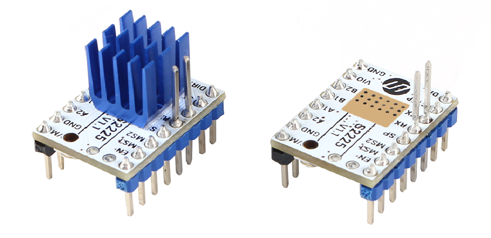
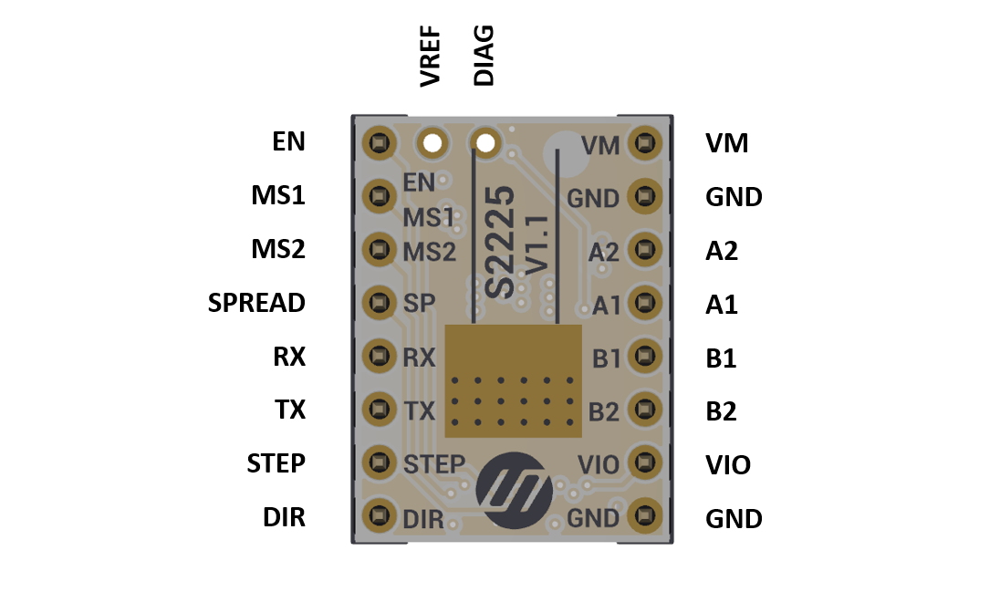
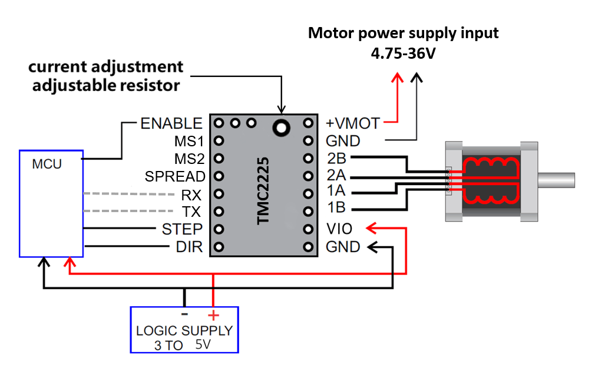
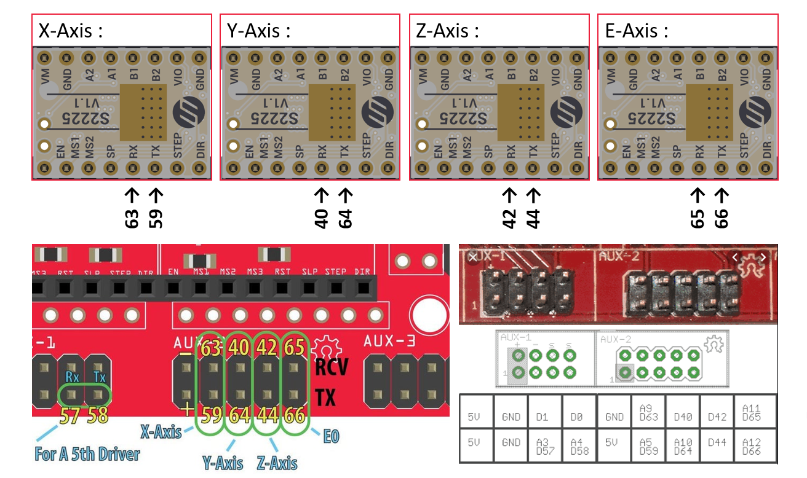

## Product Introduction
---



TMC2225 is Similar to TMC2208,with TSSOP-28 package, it is an ultra-quiet two-phase stepper motor driver, continuous drive current 1.4A, peak current 2A, voltage range 4.75V-36V, 256 subdivision. The flexible microPlyer interpolation unit provides up to 256 subdivisions, allowing perfect sinusoidal control even in systems with limited pulse frequencies;  Compatible with existing 3D printer electronics, eliminating the expensive costs of redesign. With a standard step/dir interface, it is easy to use. It can replace the original A4988, lower heat, especially for 3D printing market.

## Features
---

- UART configuration interface (9600-500k Baud)
-  Power tube built-in drive current 1.4A ,peak current 2A, voltage range 4.75V-36V
- Up to 256 native microsteps (without interpolation)
- CoolStep ™ current dynamic adjustment technology, can save 70% of the energy
- stealthChop2 - faster motor acceleration/deceleration than stealthChop
-  dcStep ™, stallGuard2 ™ stall detection technology
- Automatic stealthChop and spreadCycle switchover depending on velocity
- Hardware compatible with StepStick and Pololu A4988 Stepper Driver
- Components on bottom PCB side for better heat emission
- Automatic standby current reduction
- SteaClthhop mute technology
- spreadCycle - highly dynamic motor control chopper

## Technical Specifications

|          Model           |              TMC2225               |
| :----------------------: | :--------------------------------: |
|        Interface         |              Step/Dir              |
|      Configuration       |          CFG Pins or UART          |
|    Native Microsteps     |            up to 1/256             |
|  microPlyer Microsteps   |               1/256                |
|   Logic Voltage (VIO)    |                3-5V                |
|    Motor Voltage (VM)    |              4.75-36V              |
| Motor Phase Current  max |        1.4A RMS, 2.0A Peak         |
|  Internal V-  Regulator  |              enabled               |
|          RDSon           | LS 280mΩ & HS 290mΩ (typ. at 25°C) |
|   stealthChop2 (quiet)   |                yes                 |
|       spreadCycle        |                yes                 |
|         coolStep         |                 no                 |
|        stallGuard        |                 no                 |
|          dcStep          |                 no                 |

## Pin Functions
---



|  Pin   | Function                                                     |
| :----: | ------------------------------------------------------------ |
|        | **Power Supply**                                             |
|  GND   | Ground                                                       |
|   VM   | Motor Supply Voltage                                         |
|  VIO   | Logic Supply Voltage                                         |
|        | **Motor Outputs**                                            |
|   A2   | Motor Coil 1                                                 |
|   A1   | Motor Coil 1                                                 |
|   B1   | Motor Coil 2                                                 |
|   B2   | Motor Coil 2                                                 |
|        | **Control Inputs**                                           |
|  STEP  | STEP input (internal pull-down resistor)                     |
|  DIR   | DIR input (internal pull-down resistor)                      |
|        | **TMC2225**                                                  |
|   EN   | Enable Motor Outputs: GND=on, VIO=off                        |
|  MS1   | Microsteps resolution configuration (internal pull-down resistors)    MS2, MS1:   00: 1/4,   01: 1/8,   10: 1/16,   11: 1/32 |
|  MS2   | -                                                            |
|   RX   | UART RX,   Directly connected to the PDN                     |
|   TX   | UART TX,   Connected to the PDN via a 1K resistor on board   |
|  DIAG  | Diagnostic output. Hi level upon driver error. Reset by ENN=high. |
| SPREAD | Chopper mode selection: Low=StealthChop, High=SpreadCycle    |
|  VREF  | Analog Reference Voltage                                     |

## Interface Resources
---
###  Wiring Diagram



!!!Tip
    The TMC2225 outputs continuous motor current up to 1.4A and peak current up to 2A. Therefore, the reference voltage of the driver module should not exceed 1V. At the same time, the driver module must be heat dissipated, otherwise it will affect the life of the driver module.

### Motor Current Setting  (Same As TMC2208)


The best way to set the motor current is by measuring the voltage on the Vref pin (0…2.5V) and adjusting the voltage with the potentiometer. The maximum settable motor current is 1.77A RMS (0.11Ohm sense resistors), but the SilentStepSticks can only be used up to 1.2A RMS.  
Irms = (Vref * 1.77A) / 2.5V = Vref * 0.71  
Vref = (Irms * 2.5V) / 1.77A = Irms * 1.41 = Imax   
Vref -> Voltage on Vref pin  
Irms -> RMS (Root Mean Square) current per phase (Irms = Imax / 1.41)  
Imax -> Maximum current per phase (Imax = Irms * 1.41)   

!!!Note
​    1. Vref measures Gnd and the voltage at the middle of the potentiometer.  
​    2. Do not connect the motor when measuring the voltage, otherwise it is easy to burn the driver.  
​    3. Power should be connected when measuring voltage, do not just connect USB power supply.  
​    4. <font color="red">**Please pay special attention to directions!**</font>

### Calculator

<form name="data">
RMS Current (A): <input type="text" name="i"  value="0.6" style="width:60px;" size="5">
Reference Voltage (V): <input readonly type="text" name="v" value="" style="width:60px;" size="5">
<input type="button" name="go" value="calculate" onclick="var i=document.forms['data'].i.value; i=i.replace(',','.'); var v=new Number(i); v=v*1.41; v=v.toFixed(2); document.forms['data'].v.value=v; return false;">
</form>

### Micro-stepping

MS2(-)	|MS1(-)|	Steps(-)|	Interpolation(-)|	Mode(-)
:---:|:---:|:---:|:---:|:---:
GND |	GND | 1⁄4 | 1⁄256 | stealthChop2
GND	| VIO | 1⁄8 | 1⁄256 | stealthChop2
VIO | GND | 1⁄16 | 1⁄256 | stealthChop2
VIO	| VIO | 1⁄32 | 1⁄256 | stealthChop2

## OTP Setting (Refer to TMC2208)
---

With the TMC2208 Configurator you can change the settings and program the OTP (One-Time-Programmable) memory of a Trinamic TMC2208 via the UART interface.

###  To run the program:
1. Install ScriptCommunicator
2. Download TMC2208.scez
3. Start the TMC2208.scez file with the ScriptCommunicator: ScriptCommunicator TMC2208.scez
4. Choose the right serial port and click Connect
5. Modifications in the Configurator are directly transmitted

!!!Tip
​    The OTP bits can be programmed only one time.
​    If you enable spreadCycle then TOFF cannot be 0 (null).

### Hardware Connection


You can use every RS232 serial adapter with 0-5V logic levels (e.g. FTDI-Breakout) and the SilentStepStick Tester/Programmer can be used as connection adapter.

!!!Tip
​    The jumper next to the PDN_UART pin has to be closed on the TMC2208 SilentStepStick to enable the pin access via the pin header.


## Firmware Setting (Same As TMC2208)
---

You don't need to set the firmware, just need to set the microstep to the firmware through MS2, MS1, usually it is 16 microsteps.

If you want use UART mode, Please confirm that your wiring is correct.

And then，you can perform some column configuration on the driver through firmware.
The setup steps are as follows:

##### 1. Wiring

For your convenience, we have made adjustments to all the new TMC drivers in the new version. We have added pin headers that extend the board for the position where you may need wiring (SPI or UART).

For the UART, we added a 1K resistor to the board, providing RX and TX directly, and you don't need to solder.

For F6 or similar boards, please forget the above two points and cut off the extended pin headers, They are of no use to you.   Just install it directly on the board,  and following the instructions of the board.

For the board that needs wiring, please refer to the picture below:



##### 2. Configration.h

   Remove the "//" in front of the axis you need to use the TMC2225 driver，and change the stepper driver type，I assume you need the XY axis.

   ```c++
   /**
    * Stepper Drivers
    *
    * These settings allow Marlin to tune stepper driver timing and enable advanced options for
    * stepper drivers that support them. You may also override timing options in Configuration_adv.h.
    *
    * A4988 is assumed for unspecified drivers.
    *
    * Options: A4988, DRV8825, LV8729, L6470, TB6560, TB6600, TMC2100,
    *          TMC2130, TMC2130_STANDALONE, TMC2208, TMC2208_STANDALONE,
    *          TMC26X,  TMC26X_STANDALONE,  TMC2660, TMC2660_STANDALONE,
    *          TMC5130, TMC5130_STANDALONE
    * :['A4988', 'DRV8825', 'LV8729', 'L6470', 'TB6560', 'TB6600', 'TMC2100', 'TMC2130', 'TMC2130_STANDALONE', 'TMC2208', 'TMC2208_STANDALONE', 'TMC26X', 'TMC26X_STANDALONE', 'TMC2660', 'TMC2660_STANDALONE', 'TMC5130', 'TMC5130_STANDALONE']
    */
   #define X_DRIVER_TYPE  TMC2208
   #define Y_DRIVER_TYPE  TMC2208
   //#define Z_DRIVER_TYPE  A4988
   //#define X2_DRIVER_TYPE A4988
   //#define Y2_DRIVER_TYPE A4988
   //#define Z2_DRIVER_TYPE A4988
   //#define E0_DRIVER_TYPE A4988
   //#define E1_DRIVER_TYPE A4988
   //#define E2_DRIVER_TYPE A4988
   //#define E3_DRIVER_TYPE A4988
   //#define E4_DRIVER_TYPE A4988
   ```

   ##### 3.Configration_adv.h

   Here, I usually recommend using the default value. But if you need to configure the current and subdivision, you can do it in Configure_adv.h. If you want to configure other options, please read the TMC2225 datasheet to make sure you know the result of your own operation.

   ```c++
   // @section tmc_smart
   
   /**
    * To use TMC2130 stepper drivers in SPI mode connect your SPI pins to
    * the hardware SPI interface on your board and define the required CS pins
    * in your `pins_MYBOARD.h` file. (e.g., RAMPS 1.4 uses AUX3 pins `X_CS_PIN 53`, `Y_CS_PIN 49`, etc.).
    * You may also use software SPI if you wish to use general purpose IO pins.
    *
    * You'll also need the TMC2130Stepper Arduino library
    * (https://github.com/teemuatlut/TMC2130Stepper).
    *
    * To use TMC2208 stepper UART-configurable stepper drivers
    * connect #_SERIAL_TX_PIN to the driver side PDN_UART pin with a 1K resistor.
    * To use the reading capabilities, also connect #_SERIAL_RX_PIN
    * to PDN_UART without a resistor.
    * The drivers can also be used with hardware serial.
    *
    * You'll also need the TMC2208Stepper Arduino library
    * (https://github.com/teemuatlut/TMC2208Stepper).
    */
   #if HAS_TRINAMIC
   
     #define R_SENSE           0.11  // R_sense resistor for SilentStepStick2130
     #define HOLD_MULTIPLIER    0.5  // Scales down the holding current from run current
     #define INTERPOLATE       true  // Interpolate X/Y/Z_MICROSTEPS to 256
   
     #define X_CURRENT          800  // rms current in mA. Multiply by 1.41 for peak current.
     #define X_MICROSTEPS        16  // 0..256
   
     #define Y_CURRENT          800
     #define Y_MICROSTEPS        16
   
     #define Z_CURRENT          800
     #define Z_MICROSTEPS        16
   
     #define X2_CURRENT         800
     #define X2_MICROSTEPS       16
   
     #define Y2_CURRENT         800
     #define Y2_MICROSTEPS       16
   
     #define Z2_CURRENT         800
     #define Z2_MICROSTEPS       16
   
     #define E0_CURRENT         800
     #define E0_MICROSTEPS       16
   
     #define E1_CURRENT         800
     #define E1_MICROSTEPS       16
   
     #define E2_CURRENT         800
     #define E2_MICROSTEPS       16
   
     #define E3_CURRENT         800
     #define E3_MICROSTEPS       16
   
     #define E4_CURRENT         800
     #define E4_MICROSTEPS       16
   
     /**
      * Use software SPI for TMC2130.
      * The default SW SPI pins are defined the respective pins files,
      * but you can override or define them here.
      */
     //#define TMC_USE_SW_SPI
     //#define TMC_SW_MOSI       -1
     //#define TMC_SW_MISO       -1
     //#define TMC_SW_SCK        -1
   
     /**
      * Use Trinamic's ultra quiet stepping mode.
      * When disabled, Marlin will use spreadCycle stepping mode.
      */
     #define STEALTHCHOP
   
     /**
      * Monitor Trinamic TMC2130 and TMC2208 drivers for error conditions,
      * like overtemperature and short to ground. TMC2208 requires hardware serial.
      * In the case of overtemperature Marlin can decrease the driver current until error condition clears.
      * Other detected conditions can be used to stop the current print.
      * Relevant g-codes:
      * M906 - Set or get motor current in milliamps using axis codes X, Y, Z, E. Report values if no axis codes given.
      * M911 - Report stepper driver overtemperature pre-warn condition.
      * M912 - Clear stepper driver overtemperature pre-warn condition flag.
      * M122 S0/1 - Report driver parameters (Requires TMC_DEBUG)
      */
     //#define MONITOR_DRIVER_STATUS
   
     #if ENABLED(MONITOR_DRIVER_STATUS)
       #define CURRENT_STEP_DOWN     50  // [mA]
       #define REPORT_CURRENT_CHANGE
       #define STOP_ON_ERROR
     #endif
   
     /**
      * The driver will switch to spreadCycle when stepper speed is over HYBRID_THRESHOLD.
      * This mode allows for faster movements at the expense of higher noise levels.
      * STEALTHCHOP needs to be enabled.
      * M913 X/Y/Z/E to live tune the setting
      */
     //#define HYBRID_THRESHOLD
   
     #define X_HYBRID_THRESHOLD     100  // [mm/s]
     #define X2_HYBRID_THRESHOLD    100
     #define Y_HYBRID_THRESHOLD     100
     #define Y2_HYBRID_THRESHOLD    100
     #define Z_HYBRID_THRESHOLD       3
     #define Z2_HYBRID_THRESHOLD      3
     #define E0_HYBRID_THRESHOLD     30
     #define E1_HYBRID_THRESHOLD     30
     #define E2_HYBRID_THRESHOLD     30
     #define E3_HYBRID_THRESHOLD     30
     #define E4_HYBRID_THRESHOLD     30
   ```

   

---

## Versions 
---

Versions|difference
:---:          |---
V1.1        |**initial version**

## Shop

---
- [TMC2225](https://www.aliexpress.com/item/4000274454719.html)

## Tech Support

---
Please submit any technical issue into our [forum](http://forum.fysetc.com/) 