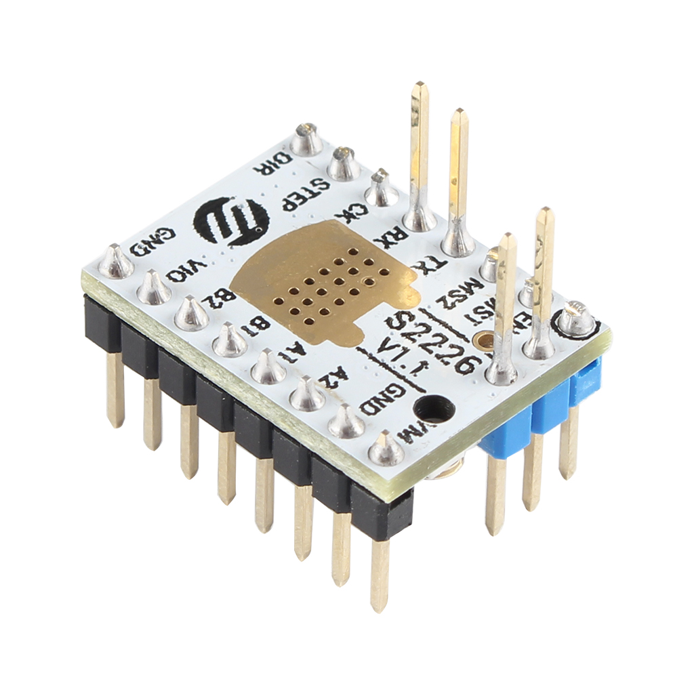
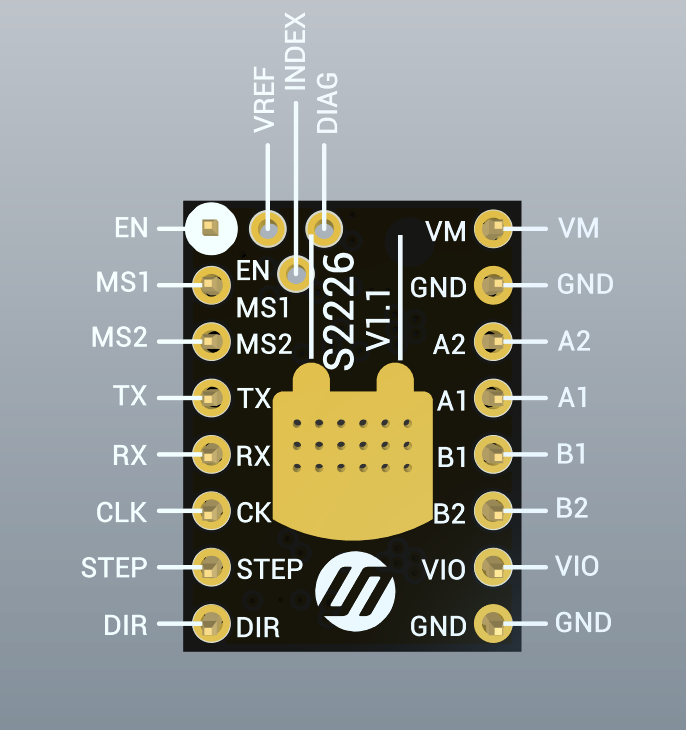
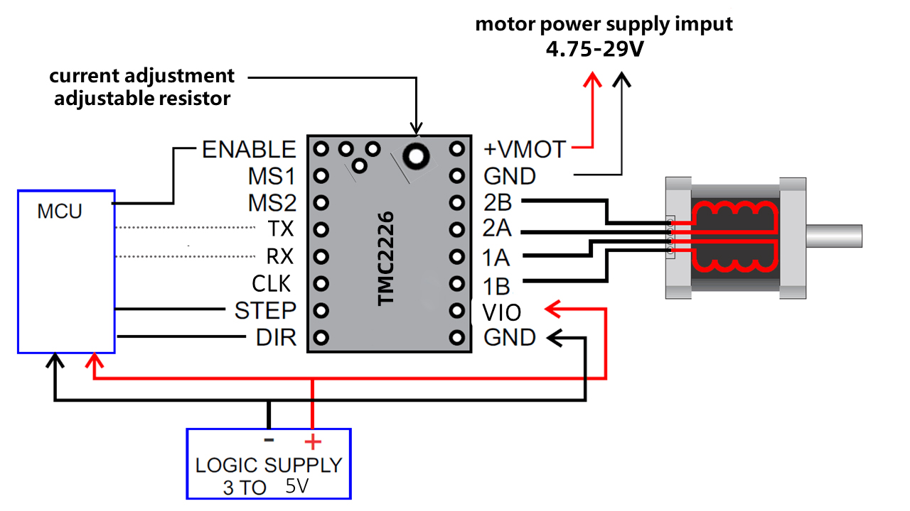
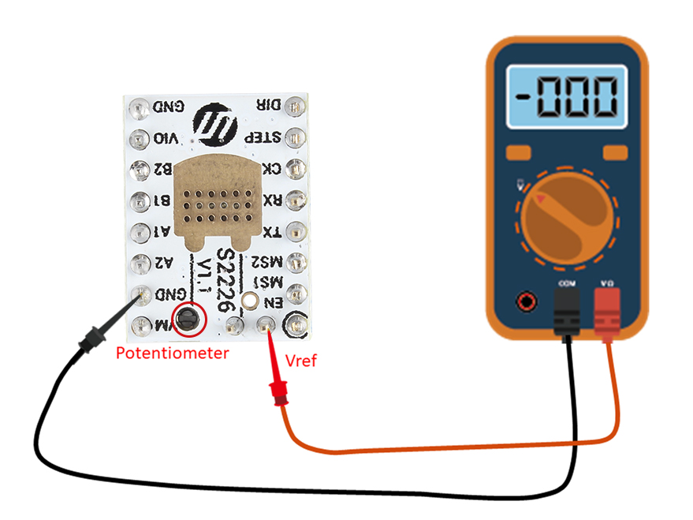
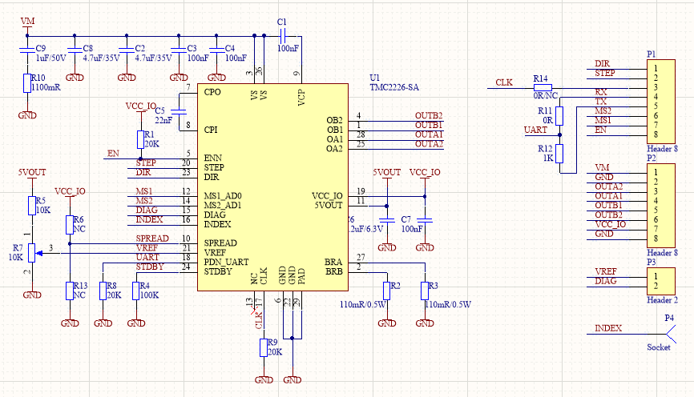

## Product Introduction
---

The TMC2226 is an ultra-silent motor driver IC for two phase stepper motors. TRINAMICs sophisticated StealthChop2 chopper ensures noiseless operation, maximum efficiency and best motor torque. Its fast current regulation and optional combination with SpreadCycle allow highly dynamic motion while adding. StallGuard for sensorless homing. The integrated power MOSFETs handle motor currents up to 2A RMS with protection and diagnostic features for robust and reliable operation. A simple to use UART interface opens up tuning and control options. Store application tuning to OTP memory. Industries’ most advanced STEP/DIR stepper motor driver family upgrades designs to noiseless and most precise operation for cost-effective and highly competitive solutions.

## FEATURES AND BENEFITS 

---

- 2-phase stepper motors up to 2.8A coil current (peak), 2A RMS 
- STEP/DIR Interface with 8, 16, 32 or 64 microstep pin setting
- Smooth Running 256 microsteps by MicroPlyer™ interpolation 
- StealthChop2™ silent motor operation 
- SpreadCycle™ highly dynamic motor control chopper 
- StallGuard4™ load and stall detection for StealthChop
- CoolStep™ current control for energy savings up to 75%
- Low RDSon, Low Heat-Up LS 170mΩ & HS 170mΩ (typ. at 25°C) 
- Voltage Range 4.75… 29V DC 
- Low Power Standby to fit standby energy regulations 
- Internal Sense Resistor option (no sense resistors required) 
- Passive Braking, Freewheeling, and automatic power down 
- Single Wire UART & OTP for advanced configuration options
- Integrated Pulse Generator for standalone motion

## Technical Specifications

Model                                    | TMC2226 
:---:|:---:
Interface                                |   Step/Dir 
Configuration                       |   CFG Pins or UART
Native Microsteps               |   up to 1/256
microPlyer Microsteps          |    1/256
Logic Voltage (VIO)                 |    3-5V
Motor Voltage (VM)                | 4..75-29V 
Motor Phase Current  max        | 2A RMS, 2.8A Peak 
Internal V-  Regulator         |    enabled
RDSon                                    |<=0.17 Ohm
stealthChop (quiet)               | yes
spreadCycle                           |      yes
coolStep                                | yes 
stallGuard                              | yes 
dcStep                                    |   no

## Pin Functions
---

Pin|Function
:---:|---
 |**Power Supply**
 GND|	Ground
VM|	Motor Supply Voltage
VIO	|Logic Supply Voltage
|**Motor Outputs**
A1|	Motor Coil 1
A2	|Motor Coil 1
B1|	Motor Coil 2
B2	|Motor Coil 2
|**Control Inputs**
STEP	|Step-Signal Input
DIR	|Direction-Signal Input
|**TMC2226**
 EN|	Enable Motor Outputs: GND=on, VIO=off
MS1|	Step-Configuration
MS2	|Step-Configuration
RX/TX	|Optional UART Input/Output.
CLK	|CLK input. Tie to GND using short wire for internal clock or supply external clock.
DIAG	|Diagnostics Output
INDEX	|Index Output
VREF|	Analog Reference Voltage

## Interface Resources
---
###  Wiring Diagram

!!!Tip
​    The TMC2208 outputs continuous motor current up to 1.4A and peak current up to 2A. Therefore, the reference voltage of the driver module should not exceed 1V. At the same time, the driver module must be dissipated, otherwise it will affect the life of the driver module.

### Motor Current Setting

The best way to set the motor current is by measuring the voltage on the Vref pin (0…2.5V) and adjusting the voltage with the potentiometer. The maximum settable motor current is 1.77A RMS (0.11Ohm sense resistors).
Irms = (Vref * 1.77A) / 2.5V = Vref * 0.71  
Vref = (Irms * 2.5V) / 1.77A = Irms * 1.41 = Imax   
Vref -> Voltage on Vref pin  
Irms -> RMS (Root Mean Square) current per phase (Irms = Imax / 1.41)  
Imax -> Maximum current per phase (Imax = Irms * 1.41)   

!!!Note
​    1. Vref measures Gnd and the voltage at the middle of the potentiometer.  
​    2. Do not connect the motor when measuring the voltage, otherwise it is easy to burn the driver.  
​    3. Power should be connected when measuring voltage, do not just connect USB power supply.  
​    4. **Please pay special attention to directions!**

### Calculator

<form name="data">
RMS Current (A): <input type="text" name="i"  value="0.6" style="width:60px;" size="5">
Reference Voltage (V): <input readonly type="text" name="v" value="" style="width:60px;" size="5">
<input type="button" name="go" value="calculate" onclick="var i=document.forms['data'].i.value; i=i.replace(',','.'); var v=new Number(i); v=v*1.41; v=v.toFixed(2); document.forms['data'].v.value=v; return false;">
</form>

### Micro-stepping

MS2(-)	|MS1(-)|	Steps(-)|	Interpolation(-)|	Mode(-)
:---:|:---:|:---:|:---:|:---:
GND |	VIO | 1⁄2 | 1⁄256 | stealthChop2
VIO	| GND | 1⁄4 | 1⁄256 | stealthChop2
GND | GND | 1⁄8 | 1⁄256 | stealthChop2
VIO	| VIO | 1⁄16 | 1⁄256 | stealthChop2

## Setting Method
---

With the TMC2208 Configurator you can change the settings and program the OTP (One-Time-Programmable) memory of a Trinamic TMC2226 via the UART interface.

###  To run the program:
1. Install ScriptCommunicator
2. Download TMC2208.scez
3. Start the TMC2208.scez file with the ScriptCommunicator: ScriptCommunicator TMC2208.scez
4. Choose the right serial port and click Connect
5. Modifications in the Configurator are directly transmitted

!!!Tip
​    The OTP bits can be programmed only one time.
​    If you enable spreadCycle then TOFF cannot be 0 (null).

### Schematic diagram

## Tech Support

---
Please submit any technical issue into our [forum](http://forum.fysetc.com/) 